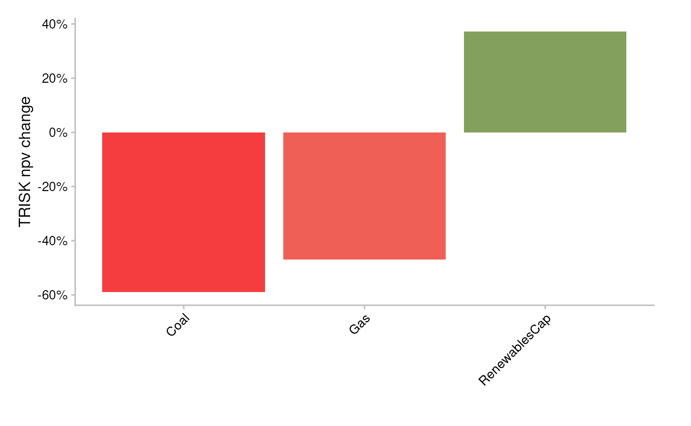
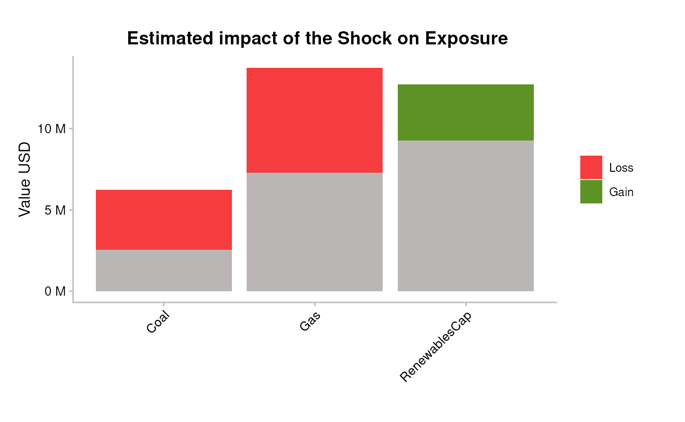
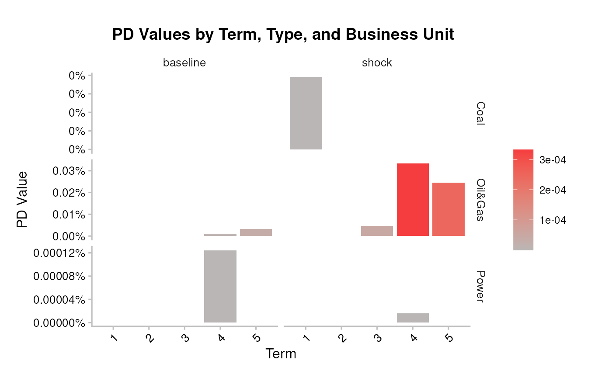
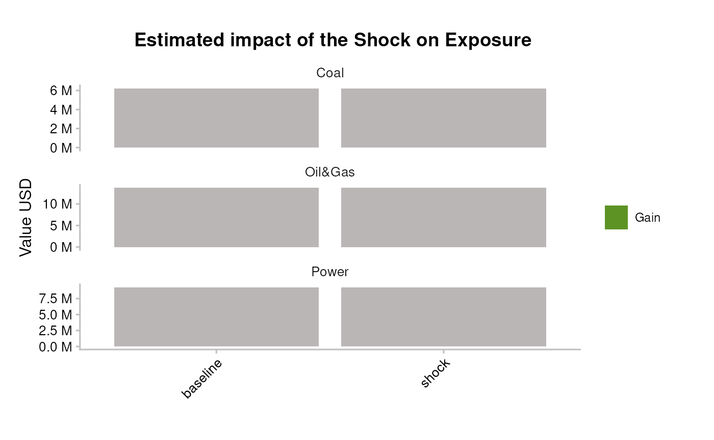

# Bank workflow 2: Simple portfolio analysis

``` r

library(trisk.analysis)
library(dplyr)
#> 
#> Attaching package: 'dplyr'
#> The following objects are masked from 'package:stats':
#> 
#>     filter, lag
#> The following objects are masked from 'package:base':
#> 
#>     intersect, setdiff, setequal, union
library(magrittr)
```

## Overview

This vignette walks through running TRISK on a bank loan book with
[`run_trisk_on_simple_portfolio()`](../reference/run_trisk_on_simple_portfolio.md)
— the bank entry point. You bring company exposures, terms, and
loss-given-default (no `country_iso2` column needed), and TRISK runs and
allocates each loan’s exposure across the company’s technologies for
you. The per-technology results feed the equity- (NPV, exposure) and
credit-risk (PD, expected-loss) plots directly.

## Inputs

> **Input data — where your data goes.** TRISK needs **five inputs**:
> four that describe the world — **assets**, **scenarios**, **NGFS
> carbon price** and **financial features** — plus your **portfolio**.
> The main portfolio file is **`portfolio_ids`** (matched by
> `company_id`); `portfolio_names` and `portfolio_countries` are
> options. **The CSVs loaded below are placeholders** (bundled samples)
> — replace them with your own files. See [Inputs and
> outputs](bank_1_inputs-and-outputs.md) for
> [`setup_trisk_inputs()`](../reference/setup_trisk_inputs.md) and the
> `trisk_inputs/` folder convention.

The simple runner needs the four TRISK model inputs, shipped as test
data in the `trisk.model` package:

``` r

assets_testdata <- read.csv(system.file("testdata", "assets_testdata.csv", package = "trisk.model", mustWork = TRUE))
scenarios_testdata <- read.csv(system.file("testdata", "scenarios_testdata.csv", package = "trisk.model", mustWork = TRUE))
financial_features_testdata <- read.csv(system.file("testdata", "financial_features_testdata.csv", package = "trisk.model", mustWork = TRUE))
ngfs_carbon_price_testdata <- read.csv(system.file("testdata", "ngfs_carbon_price_testdata.csv", package = "trisk.model", mustWork = TRUE))
```

They also share the same scenario settings — a baseline and a target
scenario, plus the geography to evaluate:

``` r

baseline_scenario <- "NGFS2023GCAM_CP"
target_scenario <- "NGFS2023GCAM_NZ2050"
scenario_geography <- "Global"
```

The portfolio schema is covered in the example below.

## Minimal example

[`run_trisk_on_simple_portfolio()`](../reference/run_trisk_on_simple_portfolio.md)
expects a portfolio with just five columns:

- `company_id`
- `company_name`
- `exposure_value_usd`
- `term`
- `loss_given_default`

No `country_iso2` is required. Load the bundled simple portfolio:

``` r

simple_portfolio <- read.csv(
  system.file("testdata", "simple_portfolio.csv", package = "trisk.analysis", mustWork = TRUE)
)
simple_portfolio
#>   company_id company_name exposure_value_usd term loss_given_default
#> 1        101         <NA>            2222222    2                0.7
#> 2        101         <NA>            3333333    3                0.7
#> 3        101         <NA>            4444444    4                0.7
#> 4        102     Company1            6227364    1                0.7
#> 5        103     Company2            3728364    5                0.5
#> 6        104     Company3            9263702    4                0.4
```

Run the model:

``` r

simple_results <- run_trisk_on_simple_portfolio(
  assets_data = assets_testdata,
  scenarios_data = scenarios_testdata,
  financial_data = financial_features_testdata,
  carbon_data = ngfs_carbon_price_testdata,
  portfolio_data = simple_portfolio,
  baseline_scenario = baseline_scenario,
  target_scenario = target_scenario,
  scenario_geography = scenario_geography
)
#> -- Start Trisk-- Retyping Dataframes. 
#> -- Processing Assets and Scenarios. 
#> -- Transforming to Trisk model input. 
#> -- Calculating baseline, target, and shock trajectories. 
#> -- Applying zero-trajectory logic to production trajectories. 
#> -- Calculating net profits.
#> Joining with `by = join_by(asset_id, company_id, sector, technology)`
#> -- Calculating market risk. 
#> -- Calculating credit risk.

portfolio_results_tech_detail <- simple_results$portfolio_results_tech_detail
portfolio_results <- simple_results$portfolio_results
```

### NPV-based exposure allocation

The simple runner adds a column the full runner does not:
`exposure_value_usd_share`. A single loan exposure has to be spread
across the company’s technologies before technology-level risk can be
attributed to it. TRISK allocates exposure from baseline NPV shares at
company/sector/technology level:

1.  compute baseline NPV share per run;
2.  allocate exposure with that share;
3.  average after dropping `run_id`;
4.  re-scale so exposure totals match the original portfolio exposure.

``` r

portfolio_results_tech_detail |>
  dplyr::select(
    company_id, term, sector, technology,
    exposure_value_usd_share,
    net_present_value_baseline
  ) |>
  utils::head(10)
#>   company_id term  sector    technology exposure_value_usd_share
#> 1        101    2 Oil&Gas           Gas                  2222222
#> 2        101    3 Oil&Gas           Gas                  3333333
#> 3        101    4 Oil&Gas           Gas                  4444444
#> 4        102    1    Coal          Coal                  6227364
#> 5        103    5 Oil&Gas           Gas                  3728364
#> 6        104    4   Power RenewablesCap                  9263702
#>   net_present_value_baseline
#> 1                   31278.13
#> 2                   31278.13
#> 3                   31278.13
#> 4                 8453239.83
#> 5                16458526.57
#> 6                83135863.75
```

Because `exposure_value_usd_share` is computed after dropping `run_id`,
it is constant across runs for a given
`(company_id, term, sector, technology)`.

``` r

exposure_share_check <- portfolio_results_tech_detail |>
  dplyr::distinct(
    company_id, term, sector, technology,
    exposure_value_usd_share
  ) |>
  dplyr::group_by(company_id, term) |>
  dplyr::summarise(allocated_exposure = sum(exposure_value_usd_share, na.rm = TRUE), .groups = "drop") |>
  dplyr::left_join(
    portfolio_results |>
      dplyr::group_by(company_id, term) |>
      dplyr::summarise(original_exposure = sum(exposure_value_usd, na.rm = TRUE), .groups = "drop"),
    by = c("company_id", "term")
  ) |>
  dplyr::mutate(gap = allocated_exposure - original_exposure)

exposure_share_check
#> # A tibble: 6 × 5
#>   company_id  term allocated_exposure original_exposure   gap
#>   <chr>      <int>              <dbl>             <int> <dbl>
#> 1 101            2            2222222           2222222     0
#> 2 101            3            3333333           3333333     0
#> 3 101            4            4444444           4444444     0
#> 4 102            1            6227364           6227364     0
#> 5 103            5            3728364           3728364     0
#> 6 104            4            9263702           9263702     0
```

The `gap` column should be close to zero (floating-point tolerance) —
confirming allocated exposure reconciles back to the original loan
amounts.

## Plotting the per-technology results

The simple runner’s `portfolio_results_tech_detail` carries
per-technology NPV, PD, and expected-loss columns — exactly what the
package plotting helpers need. Expose the NPV-share-allocated exposure
(`exposure_at_default`) as `exposure_value_usd` so the plots can
aggregate it, then pass the frame in:

``` r

npv_analysis <- portfolio_results_tech_detail |>
  dplyr::mutate(exposure_value_usd = exposure_at_default)
```

**Equity risk** — average percentage NPV change per technology:

``` r

pipeline_trisk_npv_change_plot(npv_analysis)
#> Joining with `by = join_by(sector, technology)`
```



Resulting portfolio exposure change:

``` r

pipeline_trisk_exposure_change_plot(npv_analysis)
#> Joining with `by = join_by(sector, technology)`
```



**Bonds & loans risk** — average PDs at baseline and shock:

``` r

pipeline_trisk_pd_term_plot(npv_analysis)
#> Joining with `by = join_by(sector, term)`
```



Resulting portfolio expected loss:

``` r

pipeline_trisk_expected_loss_plot(npv_analysis)
#> Joining with `by = join_by(sector)`
```



## Interpretation

- The **simple runner** is the fastest way to attribute climate
  transition risk to a known book. Its `exposure_value_usd_share` lets
  you see how each loan’s exposure spreads across a company’s
  technologies, so you can spot which technology mix drives a
  counterparty’s risk.
- A negative NPV change and a rising shock PD on the same technology
  flag where the transition both erodes asset value and lifts default
  probability — the positions to scrutinise first.

## Caveats

- Exposure allocation in the simple runner is NPV-share based and
  reconciles to the original totals only up to floating-point tolerance
  — confirm the `gap` before relying on allocated figures.
- The scenarios, geography, and bundled test data here are illustrative.
  Swap in your own asset, scenario, financial, and carbon-price inputs
  for production analysis.

## See also

- `getting-started` — install and run a first TRISK analysis.
- `inputs-and-outputs` — the input schemas and output tables in detail.
- `pd-el-integration` — turning TRISK output into PD and expected-loss
  measures.
- `sensitivity-analysis` — varying scenarios and parameters across runs.
