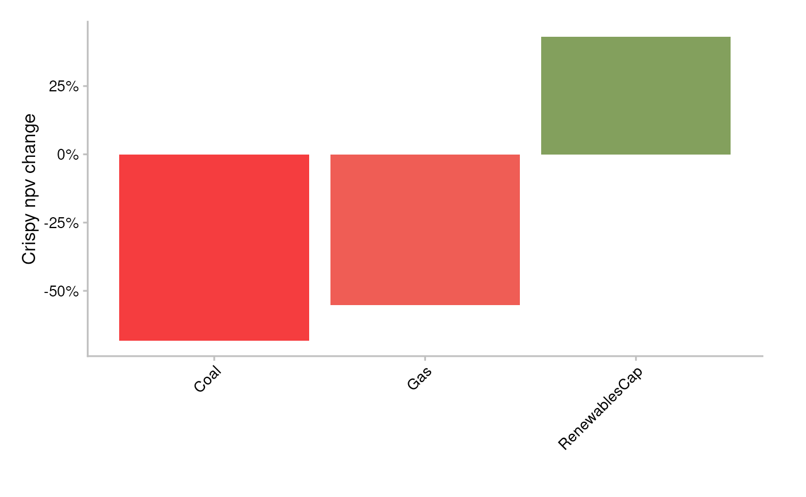
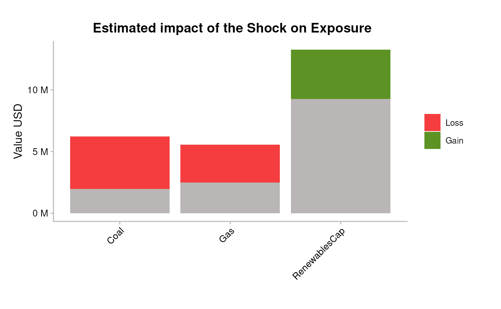
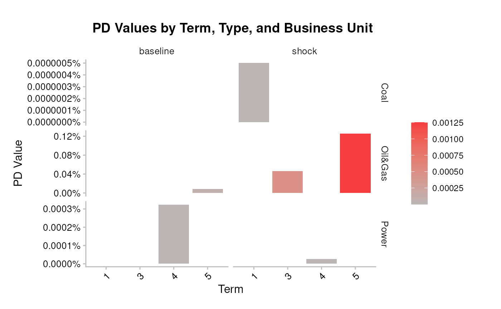
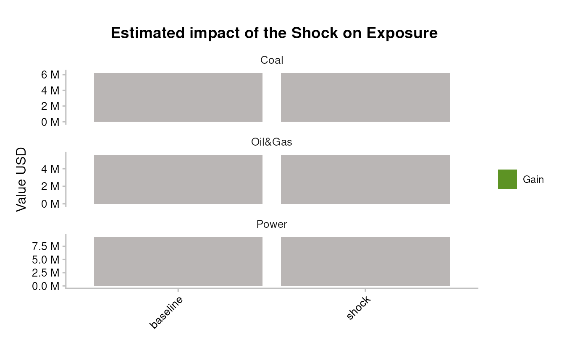

# Bank workflow 3: Run on a portfolio

``` r

library(trisk.analysis)
library(dplyr)
#> 
#> Attaching package: 'dplyr'
#> The following objects are masked from 'package:stats':
#> 
#>     filter, lag
#> The following objects are masked from 'package:base':
#> 
#>     intersect, setdiff, setequal, union
library(magrittr)
```

## Overview

This vignette walks through running TRISK on a bank loan book. The
package exposes two entry points, and the right one depends on how much
company metadata your portfolio carries:

- [`run_trisk_on_simple_portfolio()`](../reference/run_trisk_on_simple_portfolio.md)
  — the **minimal path**. You bring company exposures, terms, and
  loss-given-default; no `country_iso2` column is needed. TRISK runs and
  allocates exposure across each company’s technologies for you.
- [`run_trisk_on_portfolio()`](../reference/run_trisk_on_portfolio.md) —
  the **fuller path**. You match your portfolio to TRISK assets by
  country and company (by ID, name, or country aggregate), then run the
  model on the filtered asset universe.

As a rule of thumb: use the simple runner for a quick,
single-company-resolution risk read where you already know which
counterparties you hold. Use the full runner when you need country-level
matching, fuzzy name matching, or the built-in equity- and credit-risk
plots.

## Inputs

> **Input data — where your data goes.** TRISK needs **five inputs**:
> four that describe the world — **assets**, **scenarios**, **NGFS
> carbon price** and **financial features** — plus your **portfolio**.
> The main portfolio file is **`portfolio_ids`** (matched by
> `company_id`); `portfolio_names` and `portfolio_countries` are
> options. **The CSVs loaded below are placeholders** (bundled samples)
> — replace them with your own files. See [Bank credit risk
> analysis](bank_1_credit-risk-analysis.md) for
> [`setup_trisk_inputs()`](../reference/setup_trisk_inputs.md) and the
> `trisk_inputs/` folder convention.

Both runners need the same four TRISK model inputs, shipped as test data
in the `trisk.model` package:

``` r

assets_testdata <- read.csv(system.file("testdata", "assets_testdata.csv", package = "trisk.model", mustWork = TRUE))
scenarios_testdata <- read.csv(system.file("testdata", "scenarios_testdata.csv", package = "trisk.model", mustWork = TRUE))
financial_features_testdata <- read.csv(system.file("testdata", "financial_features_testdata.csv", package = "trisk.model", mustWork = TRUE))
ngfs_carbon_price_testdata <- read.csv(system.file("testdata", "ngfs_carbon_price_testdata.csv", package = "trisk.model", mustWork = TRUE))
```

They also share the same scenario settings — a baseline and a target
scenario, plus the geography to evaluate:

``` r

baseline_scenario <- "NGFS2023GCAM_CP"
target_scenario <- "NGFS2023GCAM_NZ2050"
scenario_geography <- "Global"
```

The two runners differ only in the **portfolio schema** they expect,
covered in each example below.

## Minimal example

[`run_trisk_on_simple_portfolio()`](../reference/run_trisk_on_simple_portfolio.md)
expects a portfolio with just five columns:

- `company_id`
- `company_name`
- `exposure_value_usd`
- `term`
- `loss_given_default`

No `country_iso2` is required. Load the bundled simple portfolio:

``` r

simple_portfolio <- read.csv(
  system.file("testdata", "simple_portfolio.csv", package = "trisk.analysis", mustWork = TRUE)
)
simple_portfolio
#>   company_id company_name exposure_value_usd term loss_given_default
#> 1        101         <NA>            2222222    2                0.7
#> 2        101         <NA>            3333333    3                0.7
#> 3        101         <NA>            4444444    4                0.7
#> 4        102     Company1            6227364    1                0.7
#> 5        103     Company2            3728364    5                0.5
#> 6        104     Company3            9263702    4                0.4
```

Run the model:

``` r

simple_results <- run_trisk_on_simple_portfolio(
  assets_data = assets_testdata,
  scenarios_data = scenarios_testdata,
  financial_data = financial_features_testdata,
  carbon_data = ngfs_carbon_price_testdata,
  portfolio_data = simple_portfolio,
  baseline_scenario = baseline_scenario,
  target_scenario = target_scenario,
  scenario_geography = scenario_geography
)
#> -- Start Trisk-- Retyping Dataframes. 
#> -- Processing Assets and Scenarios. 
#> -- Transforming to Trisk model input. 
#> -- Calculating baseline, target, and shock trajectories. 
#> -- Applying zero-trajectory logic to production trajectories. 
#> -- Calculating net profits.
#> Joining with `by = join_by(asset_id, company_id, sector, technology)`
#> -- Calculating market risk. 
#> -- Calculating credit risk.

portfolio_results_tech_detail <- simple_results$portfolio_results_tech_detail
portfolio_results <- simple_results$portfolio_results
```

### NPV-based exposure allocation

The simple runner adds a column the full runner does not:
`exposure_value_usd_share`. A single loan exposure has to be spread
across the company’s technologies before technology-level risk can be
attributed to it. TRISK allocates exposure from baseline NPV shares at
company/sector/technology level:

1.  compute baseline NPV share per run;
2.  allocate exposure with that share;
3.  average after dropping `run_id`;
4.  re-scale so exposure totals match the original portfolio exposure.

``` r

portfolio_results_tech_detail |>
  dplyr::select(
    company_id, term, sector, technology,
    exposure_value_usd_share,
    net_present_value_baseline
  ) |>
  utils::head(10)
#>   company_id term  sector    technology exposure_value_usd_share
#> 1        101    2 Oil&Gas           Gas                  2222222
#> 2        101    3 Oil&Gas           Gas                  3333333
#> 3        101    4 Oil&Gas           Gas                  4444444
#> 4        102    1    Coal          Coal                  6227364
#> 5        103    5 Oil&Gas           Gas                  3728364
#> 6        104    4   Power RenewablesCap                  9263702
#>   net_present_value_baseline
#> 1                   51951.82
#> 2                   51951.82
#> 3                   51951.82
#> 4                13648160.57
#> 5                27724344.25
#> 6               141635910.26
```

Because `exposure_value_usd_share` is computed after dropping `run_id`,
it is constant across runs for a given
`(company_id, term, sector, technology)`.

``` r

exposure_share_check <- portfolio_results_tech_detail |>
  dplyr::distinct(
    company_id, term, sector, technology,
    exposure_value_usd_share
  ) |>
  dplyr::group_by(company_id, term) |>
  dplyr::summarise(allocated_exposure = sum(exposure_value_usd_share, na.rm = TRUE), .groups = "drop") |>
  dplyr::left_join(
    portfolio_results |>
      dplyr::group_by(company_id, term) |>
      dplyr::summarise(original_exposure = sum(exposure_value_usd, na.rm = TRUE), .groups = "drop"),
    by = c("company_id", "term")
  ) |>
  dplyr::mutate(gap = allocated_exposure - original_exposure)

exposure_share_check
#> # A tibble: 6 × 5
#>   company_id  term allocated_exposure original_exposure   gap
#>   <chr>      <int>              <dbl>             <int> <dbl>
#> 1 101            2            2222222           2222222     0
#> 2 101            3            3333333           3333333     0
#> 3 101            4            4444444           4444444     0
#> 4 102            1            6227364           6227364     0
#> 5 103            5            3728364           3728364     0
#> 6 104            4            9263702           9263702     0
```

The `gap` column should be close to zero (floating-point tolerance) —
confirming allocated exposure reconciles back to the original loan
amounts.

## Full portfolio with country matching

When your portfolio carries country information,
[`run_trisk_on_portfolio()`](../reference/run_trisk_on_portfolio.md)
filters TRISK assets to your holdings before running, and gives you
matching flexibility. There are three valid portfolio input structures:

``` r

portfolio_countries_testdata <- read.csv(system.file("testdata", "portfolio_countries_testdata.csv", package = "trisk.analysis"))
portfolio_ids_testdata <- read.csv(system.file("testdata", "portfolio_ids_testdata.csv", package = "trisk.analysis"))
portfolio_names_testdata <- read.csv(system.file("testdata", "portfolio_names_testdata.csv", package = "trisk.analysis"))
```

Leaving `company_id` and `company_name` empty aggregates TRISK results
per country and technology, matched on those columns:

| company_id | company_name | sector | technology | country_iso2 | exposure_value_usd | term | loss_given_default |
|:---|:---|:---|:---|:---|---:|---:|---:|
| NA | NA | Oil&Gas | Gas | DE | 1839267 | 3 | 0.7 |
| NA | NA | Coal | Coal | DE | 6227364 | 1 | 0.7 |
| NA | NA | Oil&Gas | Gas | DE | 3728364 | 5 | 0.5 |
| NA | NA | Power | RenewablesCap | DE | 9263702 | 4 | 0.4 |

Filling in `company_name` triggers fuzzy string matching between company
names:

| company_id | company_name | sector | technology | country_iso2 | exposure_value_usd | term | loss_given_default |
|:---|:---|:---|:---|:---|---:|---:|---:|
| NA | Company 1 | Oil&Gas | Gas | DE | 1839267 | 3 | 0.7 |
| NA | Comany 2 | Coal | Coal | DE | 6227364 | 1 | 0.7 |
| NA | Corony 3 | Oil&Gas | Gas | DE | 3728364 | 5 | 0.5 |
| NA | Compan 4 | Power | RenewablesCap | DE | 9263702 | 4 | 0.4 |

Filling in `company_id` triggers an exact match between companies:

| company_id | company_name | sector | technology | country_iso2 | exposure_value_usd | term | loss_given_default |
|---:|:---|:---|:---|:---|---:|---:|---:|
| 101 | NA | Oil&Gas | Gas | DE | 1839267 | 3 | 0.7 |
| 102 | NA | Coal | Coal | DE | 6227364 | 1 | 0.7 |
| 103 | NA | Oil&Gas | Gas | DE | 3728364 | 5 | 0.5 |
| 104 | NA | Power | RenewablesCap | DE | 9263702 | 4 | 0.4 |

Using company IDs is the recommended match. In the asset data, a unique
asset is defined by a unique combination of `company_id`, `sector`,
`technology`, and `country`. Those columns drive the join between the
portfolio and TRISK outputs:

``` r

portfolio_testdata <- portfolio_ids_testdata
```

[`run_trisk_on_portfolio()`](../reference/run_trisk_on_portfolio.md)
handles the filtering on portfolio and then runs TRISK:

``` r

analysis_data <- run_trisk_on_portfolio(
  assets_data = assets_testdata,
  scenarios_data = scenarios_testdata,
  financial_data = financial_features_testdata,
  carbon_data = ngfs_carbon_price_testdata,
  portfolio_data = portfolio_testdata,
  baseline_scenario = baseline_scenario,
  target_scenario = target_scenario,
  scenario_geography = scenario_geography
)
#> -- Start Trisk-- Retyping Dataframes. 
#> -- Processing Assets and Scenarios. 
#> -- Transforming to Trisk model input. 
#> -- Calculating baseline, target, and shock trajectories. 
#> -- Applying zero-trajectory logic to production trajectories. 
#> -- Calculating net profits.
#> Joining with `by = join_by(asset_id, company_id, sector, technology)`
#> -- Calculating market risk. 
#> -- Calculating credit risk.
```

Result data frame:

| company_id | company_name | sector | technology | country_iso2 | exposure_value_usd | term | loss_given_default | run_id | asset_id | asset_name | net_present_value_baseline | net_present_value_shock | net_present_value_difference | net_present_value_change | pd_baseline | pd_shock |
|:---|:---|:---|:---|:---|---:|---:|---:|:---|:---|:---|---:|---:|---:|---:|---:|---:|
| 101 | NA | Oil&Gas | Gas | DE | 1839267 | 3 | 0.7 | 765fae95-9428-4804-b2e4-3c37fbd61624 | 101 | Company 1 | 51951.82 | 13549.28 | -38402.54 | -0.7391952 | 1.10e-06 | 0.0004647 |
| 102 | NA | Coal | Coal | DE | 6227364 | 1 | 0.7 | 765fae95-9428-4804-b2e4-3c37fbd61624 | 102 | Company 2 | 13648160.57 | 4317747.56 | -9330413.02 | -0.6836389 | 0.00e+00 | 0.0000000 |
| 103 | NA | Oil&Gas | Gas | DE | 3728364 | 5 | 0.5 | 765fae95-9428-4804-b2e4-3c37fbd61624 | 103 | Company 3 | 27724344.25 | 12420187.12 | -15304157.13 | -0.5520115 | 8.09e-05 | 0.0012524 |
| 104 | NA | Power | RenewablesCap | DE | 9263702 | 4 | 0.4 | 765fae95-9428-4804-b2e4-3c37fbd61624 | 104 | Company 4 | 141635910\.26 | 202554984\.40 | 60919074.14 | 0.4301104 | 3.20e-06 | 0.0000003 |

### Plotting the results

The full runner’s output plugs directly into the package plotting
helpers.

**Equity risk** — average percentage NPV change per technology:

``` r

pipeline_crispy_npv_change_plot(analysis_data)
#> Joining with `by = join_by(sector, technology)`
```



Resulting portfolio exposure change:

``` r

pipeline_crispy_exposure_change_plot(analysis_data)
#> Joining with `by = join_by(sector, technology)`
```



**Bonds & loans risk** — average PDs at baseline and shock:

``` r

pipeline_crispy_pd_term_plot(analysis_data)
#> Joining with `by = join_by(sector, term)`
```



Resulting portfolio expected loss:

``` r

pipeline_crispy_expected_loss_plot(analysis_data)
#> Joining with `by = join_by(sector)`
```



## Interpretation

- The **simple runner** is the fastest way to attribute climate
  transition risk to a known book. Its `exposure_value_usd_share` lets
  you see how each loan’s exposure spreads across a company’s
  technologies, so you can spot which technology mix drives a
  counterparty’s risk.
- The **full runner** is the right tool when matching is non-trivial —
  you only have country-level exposures, or you need to reconcile messy
  company names — and when you want the equity (NPV change, exposure
  change) and credit (PD term, expected loss) views straight out of the
  box.
- A negative NPV change and a rising shock PD on the same technology
  flag where the transition both erodes asset value and lifts default
  probability — the positions to scrutinise first.

## Caveats

- The country-aggregate and fuzzy-name matching modes trade precision
  for coverage. Prefer `company_id` exact matching whenever IDs are
  available; fall back to name or country matching only when they are
  not.
- Exposure allocation in the simple runner is NPV-share based and
  reconciles to the original totals only up to floating-point tolerance
  — confirm the `gap` before relying on allocated figures.
- The scenarios, geography, and bundled test data here are illustrative.
  Swap in your own asset, scenario, financial, and carbon-price inputs
  for production analysis.

## See also

- `getting-started` — install and run a first TRISK analysis.
- `inputs-and-outputs` — the input schemas and output tables in detail.
- `pd-el-integration` — turning TRISK output into PD and expected-loss
  measures.
- `sensitivity-analysis` — varying scenarios and parameters across runs.
