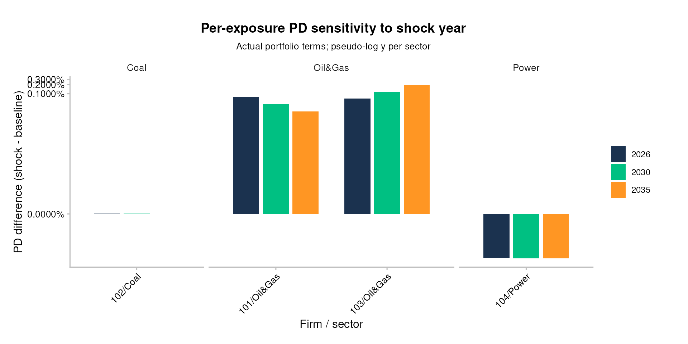
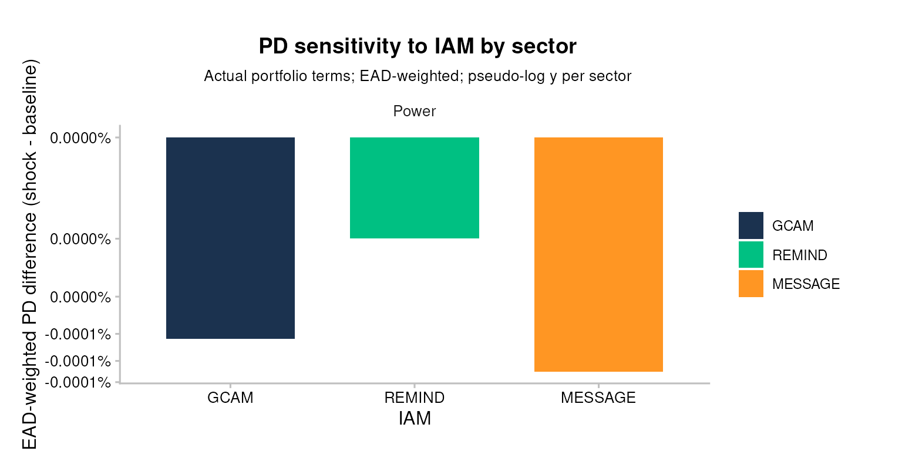
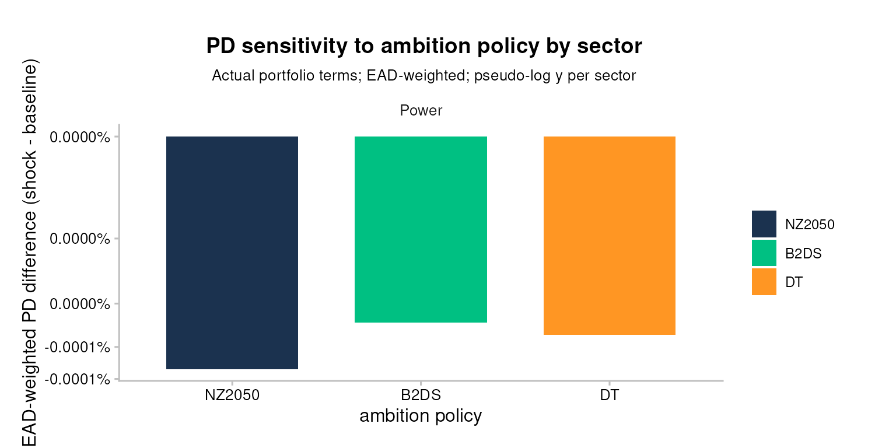
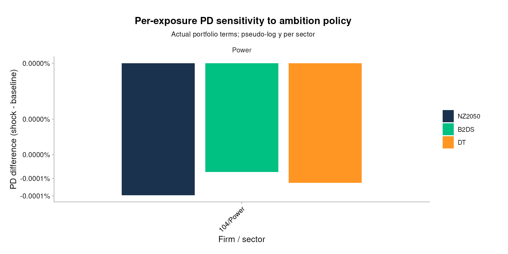

# Bank workflow 3: Sensitivity analysis (bank-impact view)

``` r

library(trisk.analysis)
library(magrittr)
```

## Setup

This vignette uses the bundled testdata to demonstrate sensitivity
analysis in three dimensions (shock year, IAM, ambition policy), each
read through a bank-impact lens: actual portfolio terms and EAD-weighted
sector aggregation.

> **Input data — where your data goes.** TRISK needs **five inputs**:
> four that describe the world — **assets**, **scenarios**, **NGFS
> carbon price** and **financial features** — plus your **portfolio**.
> The main portfolio file is **`portfolio_ids`** (matched by
> `company_id`); `portfolio_names` and `portfolio_countries` are
> options. **The CSVs loaded below are placeholders** (bundled samples)
> — replace them with your own files. See [Inputs and
> outputs](bank_1_inputs-and-outputs.md) for
> [`setup_trisk_inputs()`](../reference/setup_trisk_inputs.md) and the
> `trisk_inputs/` folder convention.

**Where your portfolio enters the sensitivity analysis.** The sweep
itself varies *scenario parameters*, but it is anchored to **your
portfolio**: the `portfolio_ids` file is read below and reduced to
`portfolio_terms` (`company_id`, `term`, `exposure_value_usd`). Those
loan terms and exposures are what turn each parameter run into a
bank-specific, EAD-weighted result — so swapping in your own
`portfolio_ids` is what makes every chart below reflect *your* book. (No
`internal_pd` is needed here; the expected-loss translation lives in
[`pd-el-integration`](bank_4_pd-el-integration.md).)

``` r

assets_testdata             <- read.csv(system.file("testdata", "assets_testdata.csv",             package = "trisk.model"))
scenarios_testdata          <- read.csv(system.file("testdata", "scenarios_testdata.csv",          package = "trisk.model"))
financial_features_testdata <- read.csv(system.file("testdata", "financial_features_testdata.csv", package = "trisk.model"))
ngfs_carbon_price_testdata  <- read.csv(system.file("testdata", "ngfs_carbon_price_testdata.csv",  package = "trisk.model"))
portfolio_ids               <- read.csv(system.file("testdata", "portfolio_ids_testdata.csv",
                                                    package = "trisk.analysis"))

# TRISK echoes company_id back as a character key; read.csv infers integers for
# the bundled portfolio file. Coerce once here so every downstream join on
# `company_id` matches on type.
portfolio_ids$company_id <- as.character(portfolio_ids$company_id)

portfolio_terms <- portfolio_ids[, c("company_id", "term", "exposure_value_usd")]
```

## Why sensitivity

Climate stress-testing carries three layers of uncertainty a bank reader
cares about: **when** the shock arrives (`shock_year`), **whose model**
of the transition you trust (the IAM), and **how ambitious** the target
scenario is. This vignette sweeps each one and reads the result as a
change in the bank’s portfolio risk picture, not as an abstract model
output. These three are the focus here because they are scenario
choices, but the same machinery sweeps **any** model parameter —
including the financial assumptions such as the discount rate (see
*Sweeping any model parameter* below).

## Base run

``` r

run_params_base <- list(
  list(
    scenario_geography = "Global",
    baseline_scenario  = "NGFS2023GCAM_CP",
    target_scenario    = "NGFS2023GCAM_NZ2050",
    shock_year         = 2030
  )
)

sa_base <- run_trisk_sa(
  assets_data    = assets_testdata,
  scenarios_data = scenarios_testdata,
  financial_data = financial_features_testdata,
  carbon_data    = ngfs_carbon_price_testdata,
  run_params     = run_params_base
)
#> [1] "Starting the execution of 1 total runs"
#> -- Retyping Dataframes. 
#> -- Processing Assets and Scenarios. 
#> -- Transforming to Trisk model input. 
#> -- Calculating baseline, target, and shock trajectories. 
#> -- Applying zero-trajectory logic to production trajectories. 
#> -- Calculating net profits.
#> Joining with `by = join_by(asset_id, company_id, sector, technology)`
#> -- Calculating market risk. 
#> -- Calculating credit risk. 
#> [1] "Done 1 / 1 total runs"
#> [1] "All runs completed."

knitr::kable(head(sa_base$pd[, c("run_id", "company_id", "sector", "term",
                                 "pd_baseline", "pd_shock")]))
```

| run_id | company_id | sector | term | pd_baseline | pd_shock |
|:---|:---|:---|---:|---:|---:|
| 653982e1-5a9f-4cb1-9156-7cbdf3f7be25 | 101 | Oil&Gas | 1 | 0.0000000 | 0.0000000 |
| 653982e1-5a9f-4cb1-9156-7cbdf3f7be25 | 101 | Oil&Gas | 2 | 0.0000000 | 0.0000214 |
| 653982e1-5a9f-4cb1-9156-7cbdf3f7be25 | 101 | Oil&Gas | 3 | 0.0000011 | 0.0004647 |
| 653982e1-5a9f-4cb1-9156-7cbdf3f7be25 | 101 | Oil&Gas | 4 | 0.0000237 | 0.0022474 |
| 653982e1-5a9f-4cb1-9156-7cbdf3f7be25 | 101 | Oil&Gas | 5 | 0.0001502 | 0.0059057 |
| 653982e1-5a9f-4cb1-9156-7cbdf3f7be25 | 101 | Oil&Gas | 6 | 0.0005218 | 0.0113956 |

## Sweeping any model parameter

The dimensions swept below (`shock_year`, IAM, ambition) are scenario
choices, but [`run_trisk_sa()`](../reference/run_trisk_sa.md) is not
limited to them. Each entry in `run_params` is passed straight to
[`trisk.model::run_trisk_model()`](https://rdrr.io/pkg/trisk.model/man/run_trisk_model.html),
so you can vary **any** of its arguments and read the sensitivity the
same way. Beyond the scenario fields, that includes the financial and
valuation assumptions:

- `discount_rate` — DCF discount rate on dividends
- `risk_free_rate` — risk-free rate in the Merton PD model
- `growth_rate` — terminal growth rate of profits
- `div_netprofit_prop_coef` — dividend pass-through coefficient
- `carbon_price_model` and `market_passthrough` — carbon-tax pathway and
  the share of the tax the firm passes to customers

Define a fixed scenario once, then vary a single parameter. Only the two
lines under “vary ONE parameter” change to sweep something else: set
`param` to any [`run_trisk_model()`](../reference/run_trisk_model.md)
argument and `values` to the grid you want.

``` r

# Hold one scenario fixed...
base_run <- list(
  scenario_geography = "Global",
  baseline_scenario  = "NGFS2023GCAM_CP",
  target_scenario    = "NGFS2023GCAM_NZ2050",
  shock_year         = 2030
)

# ...then vary ONE parameter (swap these two lines for risk_free_rate,
# growth_rate, carbon_price_model, ... and their values):
param  <- "discount_rate"
values <- c(0.07, 0.09, 0.11)

run_params <- lapply(values, function(v) modifyList(base_run, setNames(list(v), param)))

sa_param <- run_trisk_sa(
  assets_data    = assets_testdata,
  scenarios_data = scenarios_testdata,
  financial_data = financial_features_testdata,
  carbon_data    = ngfs_carbon_price_testdata,
  run_params     = run_params
)
#> [1] "Starting the execution of 3 total runs"
#> -- Retyping Dataframes. 
#> -- Processing Assets and Scenarios. 
#> -- Transforming to Trisk model input. 
#> -- Calculating baseline, target, and shock trajectories. 
#> -- Applying zero-trajectory logic to production trajectories. 
#> -- Calculating net profits.
#> Joining with `by = join_by(asset_id, company_id, sector, technology)`
#> -- Calculating market risk. 
#> -- Calculating credit risk. 
#> [1] "Done 1 / 3 total runs"
#> -- Retyping Dataframes. 
#> -- Processing Assets and Scenarios. 
#> -- Transforming to Trisk model input. 
#> -- Calculating baseline, target, and shock trajectories. 
#> -- Applying zero-trajectory logic to production trajectories. 
#> -- Calculating net profits.
#> Joining with `by = join_by(asset_id, company_id, sector, technology)`
#> -- Calculating market risk. 
#> -- Calculating credit risk. 
#> [1] "Done 2 / 3 total runs"
#> -- Retyping Dataframes. 
#> -- Processing Assets and Scenarios. 
#> -- Transforming to Trisk model input. 
#> -- Calculating baseline, target, and shock trajectories. 
#> -- Applying zero-trajectory logic to production trajectories. 
#> -- Calculating net profits.
#> Joining with `by = join_by(asset_id, company_id, sector, technology)`
#> -- Calculating market risk. 
#> -- Calculating credit risk. 
#> [1] "Done 3 / 3 total runs"
#> [1] "All runs completed."

# each run_id records the swept value
knitr::kable(sa_param$params[, c("run_id", param, "baseline_scenario", "target_scenario")])
```

| run_id | discount_rate | baseline_scenario | target_scenario |
|:---|---:|:---|:---|
| 93c47288-c0c7-4012-8708-927ed301ae36 | 0.07 | NGFS2023GCAM_CP | NGFS2023GCAM_NZ2050 |
| a612993e-a784-44c3-9f0a-9d78acc6b50b | 0.09 | NGFS2023GCAM_CP | NGFS2023GCAM_NZ2050 |
| 076acd7a-3f64-42d6-b980-f117499c774d | 0.11 | NGFS2023GCAM_CP | NGFS2023GCAM_NZ2050 |

A higher discount rate shrinks the present value of distant cash flows,
so it lowers both the baseline and the shock NPV. Because the transition
shock is a *difference* of two DCFs, much of that level effect cancels
and the shock magnitude moves less than the absolute NPVs — sweeping the
rate is how you confirm that for your own book. To sweep a different
parameter, change `param` and `values` — nothing else moves. The rest of
this vignette focuses on the three scenario dimensions.

## Convention: actual portfolio terms, EAD-weighted

Every plot below evaluates PD at each firm’s contractual loan term (from
`portfolio_terms`) and aggregates sector-level numbers as EAD-weighted
means. This matches the convention used by the integration pipeline
(`pipeline_trisk_pd_integration_bars` and siblings) and means the PDs
and EL deltas read here are directly comparable to those in
[`pd-el-integration`](bank_4_pd-el-integration.md) — no per-section
translation needed.

> **Caveat.** If a portfolio row has a contractual term beyond TRISK’s
> Merton grid (sized to the analysis horizon since the ADO 1943
> term-grid fix in `trisk.model`), the term join silently drops it. The
> helper below emits a warning naming the dropped `(company_id, term)`
> pairs so the omission is visible.

## Plot helpers

These three functions are defined inline in the vignette (not exported
from the package). Each one takes the long-format PD output of
[`run_trisk_sa()`](../reference/run_trisk_sa.md), attaches the bank’s
contractual portfolio terms, and produces a comparison plot of PD
difference (`pd_shock - pd_baseline`) per variant.

``` r

attach_portfolio_term <- function(sa_pd, portfolio_terms) {
  joined <- sa_pd %>%
    dplyr::inner_join(portfolio_terms, by = c("company_id", "term"))
  present <- dplyr::distinct(joined[, c("company_id", "term")])
  n_dropped <- nrow(portfolio_terms) - nrow(present)
  if (n_dropped > 0) {
    dropped <- dplyr::anti_join(portfolio_terms, present, by = c("company_id", "term"))
    warning("Dropped ", n_dropped, " portfolio row(s) whose term is outside the Merton grid: ",
            paste(dropped$company_id, dropped$term, sep = "/term=", collapse = ", "),
            call. = FALSE)
  }
  joined
}

label_by_variant <- function(sa_result, label_fn) {
  sa_result$pd %>%
    dplyr::left_join(sa_result$params, by = "run_id") %>%
    dplyr::mutate(variant = label_fn(.))
}

draw_pd_by_sector <- function(labelled_pd, portfolio_terms, variant_name,
                              palette_values = NULL) {
  agg <- labelled_pd %>%
    attach_portfolio_term(portfolio_terms) %>%
    dplyr::mutate(pd_difference = .data$pd_shock - .data$pd_baseline) %>%
    dplyr::group_by(.data$sector, .data$variant) %>%
    dplyr::summarise(
      pd_difference = stats::weighted.mean(.data$pd_difference,
                                           w = .data$exposure_value_usd,
                                           na.rm = TRUE),
      .groups = "drop"
    )
  p <- ggplot2::ggplot(agg, ggplot2::aes(x = .data$variant,
                                         y = .data$pd_difference,
                                         fill = .data$variant)) +
    ggplot2::geom_col(width = 0.7) +
    ggplot2::facet_grid(. ~ sector, scales = "free_y") +
    ggplot2::scale_y_continuous(
      trans  = scales::pseudo_log_trans(sigma = 1e-7),
      labels = scales::percent_format(accuracy = 0.0001)
    ) +
    TRISK_PLOT_THEME_FUNC() +
    ggplot2::labs(x = variant_name, y = "EAD-weighted PD difference (shock - baseline)",
                  fill = variant_name,
                  title = paste("PD sensitivity to", variant_name, "by sector"),
                  subtitle = "Actual portfolio terms; EAD-weighted; pseudo-log y per sector")
  if (!is.null(palette_values)) p <- p + ggplot2::scale_fill_manual(values = palette_values)
  p
}

draw_pd_by_exposure <- function(labelled_pd, portfolio_terms, variant_name,
                                palette_values = NULL) {
  agg <- labelled_pd %>%
    attach_portfolio_term(portfolio_terms) %>%
    dplyr::mutate(firm = paste(.data$company_id, .data$sector, sep = "/"),
                  pd_difference = .data$pd_shock - .data$pd_baseline)
  p <- ggplot2::ggplot(agg, ggplot2::aes(x = .data$firm,
                                         y = .data$pd_difference,
                                         fill = .data$variant)) +
    ggplot2::geom_col(position = ggplot2::position_dodge(width = 0.8), width = 0.7) +
    ggplot2::facet_grid(. ~ sector, scales = "free", space = "free_x") +
    ggplot2::scale_y_continuous(
      trans  = scales::pseudo_log_trans(sigma = 1e-7),
      labels = scales::percent_format(accuracy = 0.0001)
    ) +
    TRISK_PLOT_THEME_FUNC() +
    ggplot2::theme(axis.text.x = ggplot2::element_text(angle = 45, hjust = 1)) +
    ggplot2::labs(x = "Firm / sector", y = "PD difference (shock - baseline)",
                  fill = variant_name,
                  title = paste("Per-exposure PD sensitivity to", variant_name),
                  subtitle = "Actual portfolio terms; pseudo-log y per sector")
  if (!is.null(palette_values)) p <- p + ggplot2::scale_fill_manual(values = palette_values)
  p
}
```

A small palette shared across the three dimension sections so the same
variant index gets the same colour everywhere:

``` r

TRAJ_PALETTE <- c("#1b324f", "#00c082", "#ff9623")  # matches plot_multi_trajectories()
```

## Shock year

What happens to portfolio PD when the policy shock hits earlier or
later? This section sweeps `shock_year` across 2026 / 2030 / 2035,
holding the scenario pair fixed at NGFS2023GCAM CP vs NZ2050.

``` r

run_params_shockyear <- list(
  list(scenario_geography = "Global",
       baseline_scenario  = "NGFS2023GCAM_CP",
       target_scenario    = "NGFS2023GCAM_NZ2050",
       shock_year         = 2026),
  list(scenario_geography = "Global",
       baseline_scenario  = "NGFS2023GCAM_CP",
       target_scenario    = "NGFS2023GCAM_NZ2050",
       shock_year         = 2030),
  list(scenario_geography = "Global",
       baseline_scenario  = "NGFS2023GCAM_CP",
       target_scenario    = "NGFS2023GCAM_NZ2050",
       shock_year         = 2035)
)

sa_shockyear <- run_trisk_sa(
  assets_data    = assets_testdata,
  scenarios_data = scenarios_testdata,
  financial_data = financial_features_testdata,
  carbon_data    = ngfs_carbon_price_testdata,
  run_params     = run_params_shockyear
)
#> [1] "Starting the execution of 3 total runs"
#> -- Retyping Dataframes. 
#> -- Processing Assets and Scenarios. 
#> -- Transforming to Trisk model input. 
#> -- Calculating baseline, target, and shock trajectories. 
#> -- Applying zero-trajectory logic to production trajectories. 
#> -- Calculating net profits.
#> Joining with `by = join_by(asset_id, company_id, sector, technology)`
#> -- Calculating market risk. 
#> -- Calculating credit risk. 
#> [1] "Done 1 / 3 total runs"
#> -- Retyping Dataframes. 
#> -- Processing Assets and Scenarios. 
#> -- Transforming to Trisk model input. 
#> -- Calculating baseline, target, and shock trajectories. 
#> -- Applying zero-trajectory logic to production trajectories. 
#> -- Calculating net profits.
#> Joining with `by = join_by(asset_id, company_id, sector, technology)`
#> -- Calculating market risk. 
#> -- Calculating credit risk. 
#> [1] "Done 2 / 3 total runs"
#> -- Retyping Dataframes. 
#> -- Processing Assets and Scenarios. 
#> -- Transforming to Trisk model input. 
#> -- Calculating baseline, target, and shock trajectories. 
#> -- Applying zero-trajectory logic to production trajectories. 
#> -- Calculating net profits.
#> Joining with `by = join_by(asset_id, company_id, sector, technology)`
#> -- Calculating market risk. 
#> -- Calculating credit risk. 
#> [1] "Done 3 / 3 total runs"
#> [1] "All runs completed."

pd_shockyear <- label_by_variant(sa_shockyear,
  function(d) factor(d$shock_year, levels = c(2026, 2030, 2035)))
```

``` r

draw_pd_by_sector(pd_shockyear, portfolio_terms, "shock year",
                  palette_values = stats::setNames(TRAJ_PALETTE,
                                                   c("2026", "2030", "2035")))
```



#### Advanced: per-firm view

``` r

draw_pd_by_exposure(pd_shockyear, portfolio_terms, "shock year",
                    palette_values = stats::setNames(TRAJ_PALETTE,
                                                     c("2026", "2030", "2035")))
```


## IAM (integrated assessment model)

Same transition story, different model: NGFS2023 publishes its CP and
NZ2050 scenarios under three IAMs — GCAM, REMIND, and MESSAGE. Bank
readers who pick one IAM should know how their numbers move under the
other two.

> **Scope of the bundled IAM/ambition data.** NGFS2023 only publishes
> the REMIND and MESSAGE models — and the B2DS / DT ambition variants
> used in the next section — for the **Power sector**, spanning
> **2023–2050**. The legacy multi-sector `NGFS2023GCAM_*` scenarios used
> in the sections above run 2022–2100 across Coal, Oil & Gas, and Power.
> Because TRISK derives its analysis window from the scenario’s own year
> range, we scope the portfolio to that window before running these two
> sections — keeping the cross-variant comparison apples-to-apples on
> the bank’s power exposure.

``` r

# This filter is YEAR scoping only: the scenario-derived analysis window starts
# at 2023 for these variants, and the model asserts every asset's production_year
# falls inside that window (it errors rather than trimming), so we drop the lone
# 2022 rows. It does NOT do sector scoping — assets_power still holds Coal and
# Oil & Gas rows. The Power-only restriction happens automatically downstream:
# the model inner-joins assets to the scenario technologies, which are Power-only
# for these variants, so the other sectors drop out without error.
assets_power <- assets_testdata[assets_testdata$production_year >= 2023, ]

# Scope the term table to the portfolio's Power exposure so the term-join
# warning flags only genuine term-grid drops, not the Coal / Oil & Gas firms
# that these Power-only scenarios legitimately exclude.
power_ids <- portfolio_ids$company_id[portfolio_ids$sector == "Power"]
portfolio_terms_power <- portfolio_terms[portfolio_terms$company_id %in% power_ids, ]

run_params_iam <- list(
  list(scenario_geography = "Global",
       baseline_scenario  = "NGFS2023_GCAM_CP",
       target_scenario    = "NGFS2023_GCAM_NZ2050",
       shock_year         = 2030),
  list(scenario_geography = "Global",
       baseline_scenario  = "NGFS2023_REMIND_CP",
       target_scenario    = "NGFS2023_REMIND_NZ2050",
       shock_year         = 2030),
  list(scenario_geography = "Global",
       baseline_scenario  = "NGFS2023_MESSAGE_CP",
       target_scenario    = "NGFS2023_MESSAGE_NZ2050",
       shock_year         = 2030)
)

sa_iam <- run_trisk_sa(
  assets_data    = assets_power,
  scenarios_data = scenarios_testdata,
  financial_data = financial_features_testdata,
  carbon_data    = ngfs_carbon_price_testdata,
  run_params     = run_params_iam
)
#> [1] "Starting the execution of 3 total runs"
#> -- Retyping Dataframes. 
#> -- Processing Assets and Scenarios. 
#> -- Transforming to Trisk model input. 
#> -- Calculating baseline, target, and shock trajectories. 
#> -- Applying zero-trajectory logic to production trajectories. 
#> -- Calculating net profits.
#> Joining with `by = join_by(asset_id, company_id, sector, technology)`
#> -- Calculating market risk. 
#> -- Calculating credit risk. 
#> [1] "Done 1 / 3 total runs"
#> -- Retyping Dataframes. 
#> -- Processing Assets and Scenarios. 
#> -- Transforming to Trisk model input. 
#> -- Calculating baseline, target, and shock trajectories. 
#> -- Applying zero-trajectory logic to production trajectories. 
#> -- Calculating net profits.
#> Joining with `by = join_by(asset_id, company_id, sector, technology)`
#> -- Calculating market risk. 
#> -- Calculating credit risk. 
#> [1] "Done 2 / 3 total runs"
#> -- Retyping Dataframes. 
#> -- Processing Assets and Scenarios. 
#> -- Transforming to Trisk model input. 
#> -- Calculating baseline, target, and shock trajectories. 
#> -- Applying zero-trajectory logic to production trajectories. 
#> -- Calculating net profits.
#> Joining with `by = join_by(asset_id, company_id, sector, technology)`
#> -- Calculating market risk. 
#> -- Calculating credit risk. 
#> [1] "Done 3 / 3 total runs"
#> [1] "All runs completed."

pd_iam <- label_by_variant(sa_iam, function(d) {
  iam <- sub("^NGFS2023_([A-Z]+)_.*", "\\1", d$baseline_scenario)
  factor(iam, levels = c("GCAM", "REMIND", "MESSAGE"))
})
```

``` r

draw_pd_by_sector(pd_iam, portfolio_terms_power, "IAM",
                  palette_values = stats::setNames(TRAJ_PALETTE,
                                                   c("GCAM", "REMIND", "MESSAGE")))
```



#### Advanced: per-firm view

``` r

draw_pd_by_exposure(pd_iam, portfolio_terms_power, "IAM",
                    palette_values = stats::setNames(TRAJ_PALETTE,
                                                     c("GCAM", "REMIND", "MESSAGE")))
```


## Ambition policy

Same IAM (GCAM), different target stringency: how does the PD signal
change across Net Zero 2050, Below 2°C, and Delayed Transition, each
measured against Current Policies as the baseline?

``` r

run_params_ambition <- list(
  list(scenario_geography = "Global",
       baseline_scenario  = "NGFS2023_GCAM_CP",
       target_scenario    = "NGFS2023_GCAM_NZ2050",
       shock_year         = 2030),
  list(scenario_geography = "Global",
       baseline_scenario  = "NGFS2023_GCAM_CP",
       target_scenario    = "NGFS2023_GCAM_B2DS",
       shock_year         = 2030),
  list(scenario_geography = "Global",
       baseline_scenario  = "NGFS2023_GCAM_CP",
       target_scenario    = "NGFS2023_GCAM_DT",
       shock_year         = 2030)
)

sa_ambition <- run_trisk_sa(
  assets_data    = assets_power,
  scenarios_data = scenarios_testdata,
  financial_data = financial_features_testdata,
  carbon_data    = ngfs_carbon_price_testdata,
  run_params     = run_params_ambition
)
#> [1] "Starting the execution of 3 total runs"
#> -- Retyping Dataframes. 
#> -- Processing Assets and Scenarios. 
#> -- Transforming to Trisk model input. 
#> -- Calculating baseline, target, and shock trajectories. 
#> -- Applying zero-trajectory logic to production trajectories. 
#> -- Calculating net profits.
#> Joining with `by = join_by(asset_id, company_id, sector, technology)`
#> -- Calculating market risk. 
#> -- Calculating credit risk. 
#> [1] "Done 1 / 3 total runs"
#> -- Retyping Dataframes. 
#> -- Processing Assets and Scenarios. 
#> -- Transforming to Trisk model input. 
#> -- Calculating baseline, target, and shock trajectories. 
#> -- Applying zero-trajectory logic to production trajectories. 
#> -- Calculating net profits.
#> Joining with `by = join_by(asset_id, company_id, sector, technology)`
#> -- Calculating market risk. 
#> -- Calculating credit risk. 
#> [1] "Done 2 / 3 total runs"
#> -- Retyping Dataframes. 
#> -- Processing Assets and Scenarios. 
#> -- Transforming to Trisk model input. 
#> -- Calculating baseline, target, and shock trajectories. 
#> -- Applying zero-trajectory logic to production trajectories. 
#> -- Calculating net profits.
#> Joining with `by = join_by(asset_id, company_id, sector, technology)`
#> -- Calculating market risk. 
#> -- Calculating credit risk. 
#> [1] "Done 3 / 3 total runs"
#> [1] "All runs completed."

pd_ambition <- label_by_variant(sa_ambition, function(d) {
  ambition <- sub("^NGFS2023_GCAM_(.*)$", "\\1", d$target_scenario)
  factor(ambition, levels = c("NZ2050", "B2DS", "DT"))
})
```

``` r

draw_pd_by_sector(pd_ambition, portfolio_terms_power, "ambition policy",
                  palette_values = stats::setNames(TRAJ_PALETTE,
                                                   c("NZ2050", "B2DS", "DT")))
```



#### Advanced: per-firm view

``` r

draw_pd_by_exposure(pd_ambition, portfolio_terms_power, "ambition policy",
                    palette_values = stats::setNames(TRAJ_PALETTE,
                                                     c("NZ2050", "B2DS", "DT")))
```



## What this means for the bank

The sections above show how raw PD shifts under different design
choices. The bank-impact question — how those shifts translate into
**expected-loss basis points** on your actual portfolio — needs your
`internal_pd` and is answered in
[`pd-el-integration`](bank_4_pd-el-integration.md), which recombines the
TRISK shock with your internal PD and reports the EL bps KPI
(`EL / EAD`).

Run that integration on whichever variant you care about here — a given
shock year, IAM, ambition tier, or model parameter — to get its
bank-impact summary in basis points. Keeping the integration in one
place is deliberate: this vignette stays focused on *how results move*,
and `pd-el-integration` owns *how that becomes expected loss*.

## See also

- [`getting-started`](0_getting-started.md) — the reading-path entry
  point.
- [`simple-portfolio-analysis`](bank_2_simple-portfolio-analysis.md) —
  how the underlying TRISK runs that feed this analysis are produced.
- [`pd-el-integration`](bank_4_pd-el-integration.md) — the full PD/EL
  integration methodology and the EL bps KPI for any variant you sweep
  here.
