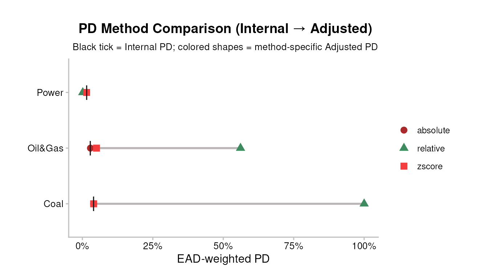
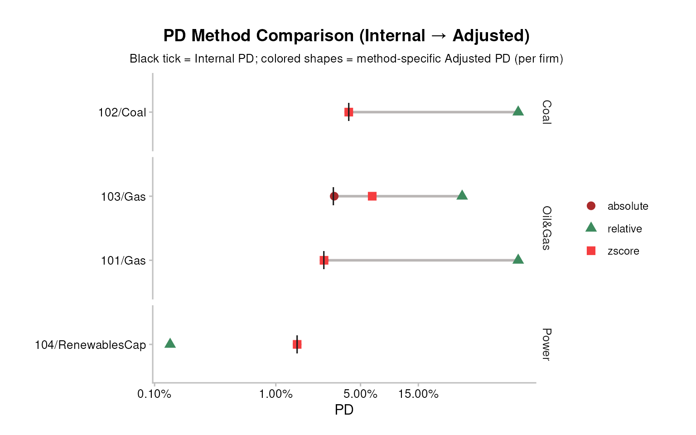
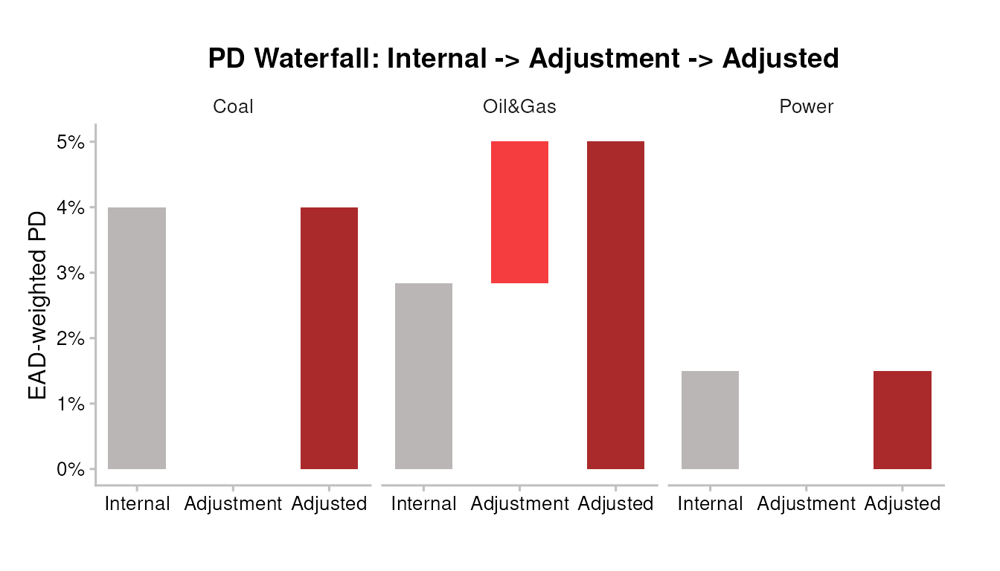
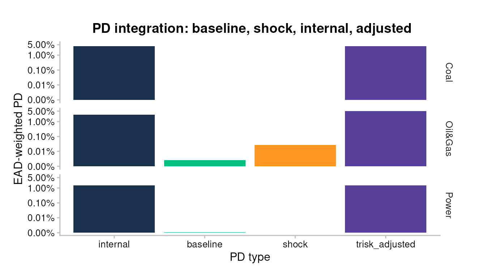
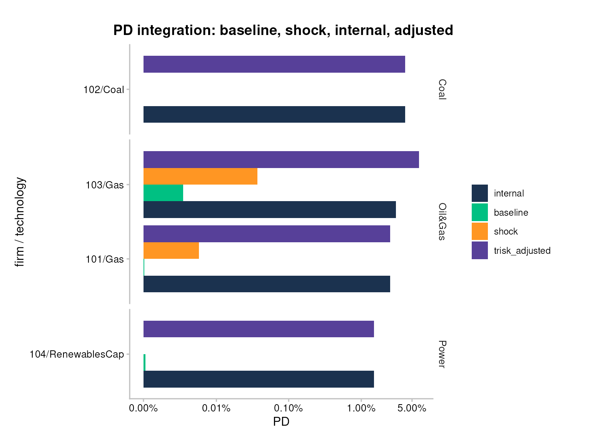
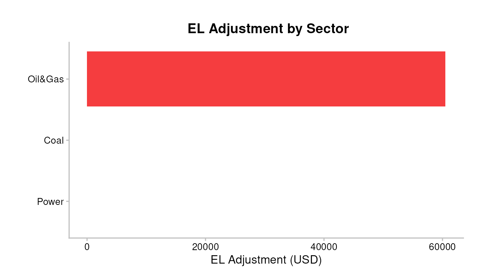
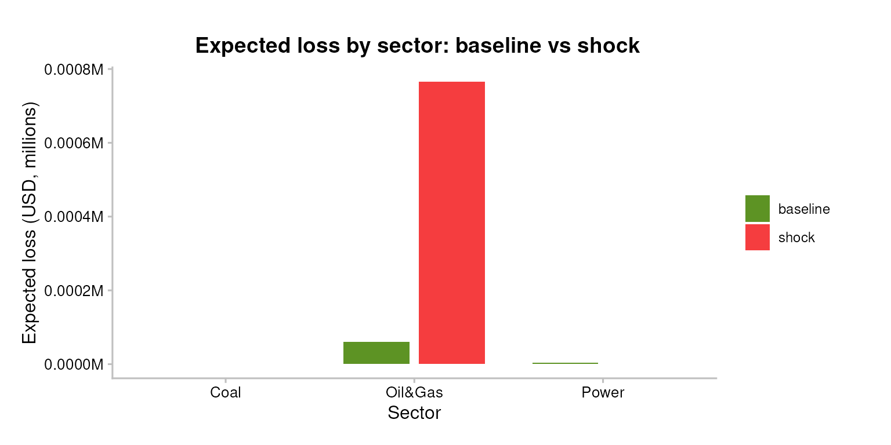
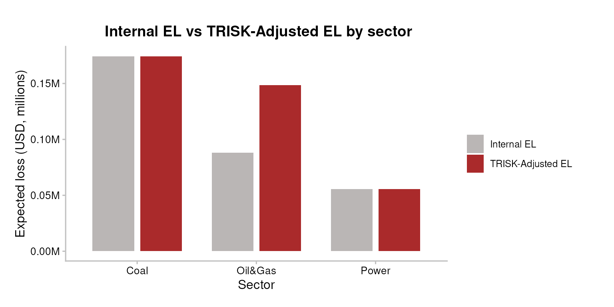

# Bank workflow 4: PD and EL integration

``` r

library(trisk.analysis)
library(magrittr)
```

## PD and EL Integration

### Overview

TRISK recomputes probability of default (PD) from a Merton structural
credit model under a climate-transition shock. That model PD is **not**
directly comparable to the internal PD your institution already carries:
levels differ by calibration, rating philosophy, and point-in-time vs
through-the-cycle treatment. Only the *baseline-to-shock change* carries
portable meaning.

[`integrate_pd()`](../reference/integrate_pd.md) and
[`integrate_el()`](../reference/integrate_el.md) translate that TRISK
shift onto your own internal scale, using one of three methods
(`zscore`, the default; `absolute`; `relative`). This vignette covers
the maths, a worked numeric example, the input schema, the seven
pipeline plots/tables, and the limitations a credit-risk analyst should
keep in mind.

Audience: an analyst who already knows PD / EL / IFRS-9 but is new to
TRISK.

### Inputs

> **Input data — where your data goes.** TRISK needs **five inputs**:
> four that describe the world — **assets**, **scenarios**, **NGFS
> carbon price** and **financial features** — plus your **portfolio**.
> The main portfolio file is **`portfolio_ids`** (matched by
> `company_id`); `portfolio_names` and `portfolio_countries` are
> options. This workflow uses the `portfolio_ids_internal_pd` variant
> (the same file plus an `internal_pd` column). **The CSVs loaded below
> are placeholders** (bundled samples) — replace them with your own
> files. See [Inputs and outputs](bank_1_inputs-and-outputs.md) for
> [`setup_trisk_inputs()`](../reference/setup_trisk_inputs.md) and the
> `trisk_inputs/` folder convention.

#### Portfolio file schema

Integration needs the bank’s own PD per exposure, so it runs on the
augmented portfolio file `portfolio_ids_internal_pd_testdata.csv` — the
classic `portfolio_ids_testdata.csv` plus a mandatory `internal_pd`
column.

| Column | Type | Meaning |
|----|----|----|
| `company_id` | int | Counterparty key; joins TRISK output to internal PD. |
| `company_name` | chr | Display label (may be `NA`). |
| `sector` | chr | TRISK sector (e.g. `Oil&Gas`, `Coal`, `Power`). |
| `technology` | chr | Production technology within the sector. |
| `country_iso2` | chr | ISO-2 country code of the asset. |
| `exposure_value_usd` | dbl | Exposure / outstanding, USD. Used as the EAD basis. |
| `term` | int | Loan term in years. |
| `loss_given_default` | dbl | LGD as a fraction in `[0, 1]`. |
| `internal_pd` | dbl | Bank’s own PD per exposure, in `[0, 1]`. **Mandatory.** |

`internal_pd` is mandatory because integration is meaningless without a
bank number to integrate the TRISK shift into — the setup below fails
loudly if it is missing or out of range. Internal EL is **derived**, not
stored: `internal_el = EAD * LGD * internal_pd` (see the EL section).

``` r

assets_testdata    <- read.csv(system.file("testdata", "assets_testdata.csv",    package = "trisk.model"))
# NGFS 2024 scenarios start in 2023; bundled assets reach 2022 and TRISK errors
# on assets outside the scenario window, so scope to 2023 onward.
assets_testdata    <- assets_testdata[assets_testdata$production_year >= 2023, ]
scenarios_testdata <- read.csv(system.file("testdata", "scenarios_testdata.csv", package = "trisk.model"))
fin_testdata       <- read.csv(system.file("testdata", "financial_features_testdata.csv", package = "trisk.model"))
carbon_testdata    <- read.csv(system.file("testdata", "ngfs_carbon_price_testdata.csv", package = "trisk.model"))
portfolio_ids_internal_pd <- read.csv(system.file("testdata", "portfolio_ids_internal_pd_testdata.csv",
                                                  package = "trisk.analysis"))

stopifnot(
  "Portfolio file must include an `internal_pd` column per exposure." =
    "internal_pd" %in% colnames(portfolio_ids_internal_pd),
  "`internal_pd` values must be numeric in [0, 1]." =
    is.numeric(portfolio_ids_internal_pd$internal_pd) &&
      all(portfolio_ids_internal_pd$internal_pd >= 0 &
          portfolio_ids_internal_pd$internal_pd <= 1, na.rm = TRUE)
)
```

#### The three integration methods

Let `p_int` be the internal PD, `p_base` the TRISK baseline PD, and
`p_shock` the TRISK shock PD for a given exposure. Each method returns
an *adjusted PD* `p_adj`, then
[`integrate_pd()`](../reference/integrate_pd.md) clips it to `[0, 1]`.

**Absolute** — add the raw PD shift onto the internal PD:

    p_adj = p_int + (p_shock - p_base)

- *When useful:* the simplest, most transparent option, and safe when
  baseline PDs can be zero (no division). Trade-off: large shifts can
  push `p_adj` outside a sensible range, where the final `[0, 1]` clip
  then bites.

**Relative** — scale the internal PD by the proportional shift:

    p_adj = p_int * (1 + (p_shock - p_base) / p_base)

- *When useful:* when the *proportional* move matters more than the
  absolute one — e.g. across exposures whose internal PD levels differ
  widely. Avoid it on zero-baseline rows: when `p_base = 0` it returns
  `p_int` unchanged and the shock signal is lost, so prefer `absolute`
  or `zscore` there.

**Z-score (default)** — recombine the three PDs in normal-quantile
(probit) space, using R’s
[`qnorm()`](https://rdrr.io/r/stats/Normal.html) (the standard-normal
quantile / inverse CDF) and
[`pnorm()`](https://rdrr.io/r/stats/Normal.html) (the CDF), with each PD
clipped to `[zscore_floor, zscore_cap]` before
[`qnorm()`](https://rdrr.io/r/stats/Normal.html):

    p_adj = pnorm( qnorm(p_int) + qnorm(p_shock) - qnorm(p_base) )

- *When useful:* the recommended default. It is zero-safe (via
  clipping), preserves the non-linear compression of PDs near the
  distribution tails, and behaves sensibly on sparse portfolios where
  Merton inputs drive some baseline PDs to underflow.

This is a **probit / Merton-style recombination of default thresholds**,
not the Basel IRB risk-weight formula. It adds the TRISK
shock-minus-baseline *distance-to-default* shift to the internal PD’s
implied default threshold, then maps back to a probability. It does
**not** invoke the Basel asset-correlation / Vasicek conditional-PD
capital formula — there is no correlation parameter and no supervisory
confidence level here.

The `zscore_floor` (default `1e-4`) and `zscore_cap` (default
`1 - 1e-4`) parameters bound the PDs before
[`qnorm()`](https://rdrr.io/r/stats/Normal.html), since
`qnorm(0) = -Inf` and `qnorm(1) = +Inf` would otherwise propagate
infinities. Widen the floor toward zero only if your internal PDs are
reliably calibrated that low; tighten it to de-sensitise the tails.

> **Watch the floor on underflow-prone books.** When a baseline (and
> shock) PD sits **below** `zscore_floor`, both clip to the floor and
> `qnorm(shock) - qnorm(baseline) = 0` — the shock signal is erased and
> the overlay reflects the clip bound, not the model. Merton baselines
> for investment-grade or short-horizon names routinely underflow well
> below `1e-4`. [`integrate_pd()`](../reference/integrate_pd.md) /
> [`integrate_el()`](../reference/integrate_el.md) now report
> `aggregate$zscore_clipped_share` (the fraction of rows clipped) and
> emit a warning when most of the book is clipped. If that share is
> high, prefer `method = "absolute"`, which adds the raw PD shift and is
> immune to underflow.

#### Worked example: one row through z-score

Take a single Oil&Gas exposure with `internal_pd = 0.025`, and suppose
TRISK returns `pd_baseline = 0.020` and `pd_shock = 0.060` for it. None
of the three values hit the clip bounds, so:

``` r

z_int  <- qnorm(0.025)   # internal
z_base <- qnorm(0.020)   # TRISK baseline
z_shk  <- qnorm(0.060)   # TRISK shock
p_adj  <- pnorm(z_int + z_shk - z_base)
round(c(z_internal = z_int, z_baseline = z_base, z_shock = z_shk,
        adjusted_pd = p_adj, adjustment_pp = (p_adj - 0.025) * 100), 4)
#>    z_internal    z_baseline       z_shock   adjusted_pd adjustment_pp 
#>       -1.9600       -2.0537       -1.5548        0.0720        4.7009
```

The probit shift `z_shk - z_base` is positive (the shock raises model
PD), so the recombined internal PD rises above 0.025 — a worsening,
which the plots below render red.

### Minimal example

#### Run TRISK on the portfolio

The `internal_pd` column rides along on the standard portfolio schema;
we keep it as a separate lookup table to feed into
[`integrate_pd()`](../reference/integrate_pd.md). We run the bank entry
point —
[`run_trisk_on_simple_portfolio()`](../reference/run_trisk_on_simple_portfolio.md)
— on the company-level loan book and use its per-technology detail as
the analysis frame:

``` r

portfolio_simple <- portfolio_ids_internal_pd[, c(
  "company_id", "company_name", "exposure_value_usd", "term", "loss_given_default"
)]

simple_results <- run_trisk_on_simple_portfolio(
  assets_data        = assets_testdata,
  scenarios_data     = scenarios_testdata,
  financial_data     = fin_testdata,
  carbon_data        = carbon_testdata,
  portfolio_data     = portfolio_simple,
  baseline_scenario  = "NGFS2024GCAM_CP",
  target_scenario    = "NGFS2024GCAM_NZ2050",
  scenario_geography = "Global"
)
#> -- Start Trisk-- Retyping Dataframes. 
#> -- Processing Assets and Scenarios. 
#> -- Transforming to Trisk model input. 
#> -- Calculating baseline, target, and shock trajectories. 
#> -- Applying zero-trajectory logic to production trajectories. 
#> -- Calculating net profits.
#> Joining with `by = join_by(asset_id, company_id, sector, technology)`
#> -- Calculating market risk. 
#> -- Calculating credit risk.
# Expose the NPV-share-allocated exposure as `exposure_value_usd` so the
# EAD-weighted plots and aggregates can use it (the simple runner stores the
# allocated exposure as `exposure_at_default`).
analysis_data <- simple_results$portfolio_results_tech_detail |>
  dplyr::mutate(exposure_value_usd = exposure_at_default)

# The internal_pd lookup used throughout the rest of the vignette. TRISK returns
# company_id as character, so coerce the lookup key to match and keep the join
# on like types (read.csv reads it as integer).
internal_pd_lookup <- portfolio_ids_internal_pd[, c("company_id", "internal_pd")]
internal_pd_lookup$company_id <- as.character(internal_pd_lookup$company_id)
```

| company_id | sector | technology | term | pd_baseline | pd_shock | net_present_value_baseline | net_present_value_shock |
|:---|:---|:---|---:|---:|---:|---:|---:|
| 101 | Oil&Gas | Gas | 3 | 5.00e-07 | 0.0000562 | 33477.77 | 11766.86 |
| 102 | Coal | Coal | 1 | 0.00e+00 | 0.0000000 | 8800418.66 | 3639454.38 |
| 103 | Oil&Gas | Gas | 5 | 3.24e-05 | 0.0003722 | 17134142.10 | 8052294.99 |
| 104 | Power | RenewablesCap | 4 | 1.20e-06 | 0.0000001 | 89669830.81 | 126997382\.67 |

##### Reproducibility: the run audit trail

The runner attaches a `trisk_run_meta` attribute to its output — the
scenario pair, `run_id`, every argument forwarded to the TRISK model,
and the versions of `trisk.analysis` and `trisk.model`. Capture it
alongside your results so a run can be reproduced and defended in model
validation:

``` r

run_meta <- attr(simple_results, "trisk_run_meta")
str(run_meta)
#> List of 6
#>  $ baseline_scenario: chr "NGFS2024GCAM_CP"
#>  $ target_scenario  : chr "NGFS2024GCAM_NZ2050"
#>  $ run_id           : chr "a899fb14-73a9-4e03-af7c-0944e219c531"
#>  $ trisk_args       :List of 1
#>   ..$ scenario_geography: chr "Global"
#>  $ package_versions : Named chr [1:2] "1.2.3" "2.6.1"
#>   ..- attr(*, "names")= chr [1:2] "trisk.analysis" "trisk.model"
#>  $ created_at       : POSIXct[1:1], format: "2026-06-12 09:11:51"
```

#### Integrate PD — three methods

``` r

result_abs <- integrate_pd(analysis_data,
                           internal_pd = internal_pd_lookup,
                           method      = "absolute")
result_rel <- integrate_pd(analysis_data,
                           internal_pd = internal_pd_lookup,
                           method      = "relative")
# zscore is the default; explicit here for clarity.
result_zs  <- integrate_pd(analysis_data,
                           internal_pd = internal_pd_lookup,
                           method      = "zscore")
#> Warning: integrate_pd(): 100% of rows have a PD clipped to the z-score
#> floor/cap before qnorm(); the overlay is governed by the clip bound, not the
#> model. Baseline PDs below the floor erase the shock signal. Consider method =
#> "absolute" for underflow-prone (e.g. IG / short-horizon) books, or review
#> zscore_floor.
```

| company_id | sector | internal_pd | pd_baseline | pd_shock | trisk_adjusted_pd | pd_adjustment |
|:---|:---|---:|---:|---:|---:|---:|
| 101 | Oil&Gas | 0.025 | 5.00e-07 | 0.0000562 | 0.0250000 | 0.0000000 |
| 102 | Coal | 0.040 | 0.00e+00 | 0.0000000 | 0.0400000 | 0.0000000 |
| 103 | Oil&Gas | 0.030 | 3.24e-05 | 0.0003722 | 0.0624542 | 0.0324542 |
| 104 | Power | 0.015 | 1.20e-06 | 0.0000001 | 0.0150000 | 0.0000000 |

You can also override internal PDs on the fly — pass a numeric vector of
length `nrow(analysis_data)` (or an alternate lookup) for a sanity-check
stress:

``` r

flat_internal <- rep(0.03, nrow(analysis_data))
result_custom <- integrate_pd(analysis_data,
                              internal_pd = flat_internal,
                              method      = "zscore")
#> Warning: integrate_pd(): 100% of rows have a PD clipped to the z-score
#> floor/cap before qnorm(); the overlay is governed by the clip bound, not the
#> model. Baseline PDs below the floor erase the shock signal. Consider method =
#> "absolute" for underflow-prone (e.g. IG / short-horizon) books, or review
#> zscore_floor.
```

#### Integrate EL

[`integrate_el()`](../reference/integrate_el.md) needs
`expected_loss_baseline` / `expected_loss_shock`, which the simple
runner already emits in its per-technology detail (`EAD * LGD * PD`).
For the bank’s internal EL we use the same identity on the company-level
loan book: `internal_el = EAD * LGD * internal_pd`.

``` r

internal_el_lookup <- portfolio_ids_internal_pd[, c(
  "company_id", "exposure_value_usd", "loss_given_default"
)]
internal_el_lookup$company_id <- as.character(internal_el_lookup$company_id)
internal_el_lookup <- merge(internal_el_lookup, internal_pd_lookup, by = "company_id")
# Positive magnitude, matching the package-wide EL convention.
internal_el_lookup$internal_el <-
  internal_el_lookup$exposure_value_usd *
  internal_el_lookup$loss_given_default *
  internal_el_lookup$internal_pd

result_el <- integrate_el(
  analysis_data,
  internal_el = internal_el_lookup[, c("company_id", "internal_el")]
)
#> Warning: integrate_el(): 100% of rows have a PD clipped to the z-score
#> floor/cap before qnorm(); the overlay is governed by the clip bound, not the
#> model. Baseline PDs below the floor erase the shock signal. Consider method =
#> "absolute" for underflow-prone (e.g. IG / short-horizon) books, or review
#> zscore_floor.
# default method is "zscore": effective-PD probit recombination, zero-safe.
```

### Interpretation

#### EL sign convention, LGD, EAD, horizon

- **EL sign convention.** All `expected_loss_*` columns and all three
  [`integrate_el()`](../reference/integrate_el.md) methods store EL as a
  **positive magnitude**. Direction lives in the *adjustment*, not the
  level: a **positive** EL adjustment means **more** expected loss =
  worse = rendered **red**; a **negative** adjustment means less loss =
  better = **green**. The PD adjustment follows the same rule (positive
  = PD rose = red).
- **EAD.** The `exposure_at_default` column is the Basel **exposure at
  default**: the simple runner sets it to each loan’s
  NPV-share-allocated exposure — the gross exposure *before* the LGD
  haircut (LGD is a fraction *of* EAD). The LGD-weighted exposure is a
  separate column,
  `lgd_weighted_exposure = exposure_at_default * loss_given_default` (=
  EAD × LGD). Every `expected_loss_*` column is
  `exposure_at_default * loss_given_default * pd` (= EAD × LGD × PD).
  The EL zscore method uses `lgd_weighted_exposure` as its denominator
  when present, otherwise reconstructs it as
  `exposure_value_usd * loss_given_default`.
- **LGD.** `loss_given_default` is the fraction lost on default, in
  `[0, 1]`, and is a fraction *of* EAD. Expected loss is the Basel
  product `EL = EAD × LGD × PD` (=
  `exposure_at_default * loss_given_default * pd`). The EL zscore method
  back-transforms EL to an effective PD via
  `|EL| / lgd_weighted_exposure` (= `|EL| / (EAD × LGD)`), recombines in
  probit space, then re-scales — so LGD enters through that denominator.
- **Horizon.** TRISK PDs here are **term-structured** to the loan `term`
  (multi-year), not a 12-month point-in-time PD. Treat the integrated
  PD/EL as a **lifetime / multi-year** quantity, closer in spirit to an
  IFRS-9 Stage 2/3 lifetime ECL input than to a 12-month regulatory PD.
  Do not feed it directly into a 12-month-PD slot without
  re-annualising.

#### The seven pipeline artefacts

The pipeline ships seven ready-made plots/tables. Each has a one-line
“when to use”.

**N1 — PD method comparison.** The three methods overlaid: a black tick
for the internal PD, a coloured shape per method for its adjusted PD.
Wide spread means the choice of method moves the number a lot. *When to
use: the methodology choice is on the table (committee review, regulator
pushback). Tight clustering means picking a method is a non-decision.*

``` r

pipeline_trisk_pd_method_comparison(analysis_data,
                                     internal_pd = internal_pd_lookup)
#> Warning: integrate_pd(): 100% of rows have a PD clipped to the z-score
#> floor/cap before qnorm(); the overlay is governed by the clip bound, not the
#> model. Baseline PDs below the floor erase the shock signal. Consider method =
#> "absolute" for underflow-prone (e.g. IG / short-horizon) books, or review
#> zscore_floor.
```



On sparse portfolios, `granularity = "firm"` and `scale = "pseudo_log"`
open up the per-firm picture when sector aggregation or Merton underflow
collapses everything against the axis:

``` r

pipeline_trisk_pd_method_comparison(
  analysis_data,
  internal_pd = internal_pd_lookup,
  granularity = "firm",
  scale       = "pseudo_log"
)
#> Warning: integrate_pd(): 100% of rows have a PD clipped to the z-score
#> floor/cap before qnorm(); the overlay is governed by the clip bound, not the
#> model. Baseline PDs below the floor erase the shock signal. Consider method =
#> "absolute" for underflow-prone (e.g. IG / short-horizon) books, or review
#> zscore_floor.
```



**N2 — PD waterfall.** Per-sector decomposition: Internal -\> signed
Adjustment -\> Adjusted. The middle bar flips fill on sign (red worsens,
green improves), so the “before, change, after” reads at a glance. *When
to use: non-quantitative audiences read waterfalls faster than grouped
bars; the message is “how much does integration move PD”.*

``` r

pipeline_trisk_pd_waterfall(result_zs)
```



**P1 — PD integration bars.** Four bars per group: Internal PD, TRISK
Baseline, TRISK Shock, TRISK-Adjusted PD. The gap between Internal and
Adjusted is the integration effect; Baseline and Shock show where the
model itself moved. *When to use: first plot to show a counterparty —
“what happens to my PDs if I integrate TRISK?” Supports
`granularity = "firm"` / `scale = "pseudo_log"`.*

``` r

pipeline_trisk_pd_integration_bars(result_zs)
```



``` r

pipeline_trisk_pd_integration_bars(
  result_zs,
  granularity = "firm",
  scale       = "pseudo_log"
)
```



**P2 — EL adjustment bars.** Horizontal bars of the signed EL delta
(Adjusted minus Internal) by sector. Red = integration says expect
**more** loss than your own model; green = less. Levels are not on this
plot — only the adjustment. *When to use: the question is sign and
magnitude of EL impact by sector — “where does TRISK think you’re
under-reserving?”*

``` r

pipeline_trisk_el_adjustment_bars(result_el)
```



**P3a — PD KPI table.** One-row portfolio summary: weighted internal PD,
weighted adjusted PD, the adjustment in pp, and direction. *When to use:
top of a report or first slide; portfolio-level headline only.*

``` r

pipeline_trisk_pd_kpi_table(result_zs$aggregate)
```

| Total Exposure (USD) | Weighted Internal PD | Weighted Adjusted PD | Weighted PD Adjustment (pp) | Adjustment % |
|---:|---:|---:|---:|---:|
| 21.06M | 2.592% | 3.167% | +0.575 pp | 22.166% |

**P3b — EL KPI table.** One-row EL summary. The headline bps metric is
the **adjusted EL level as a loss rate**: `Adjusted EL / exposure` in
bps (`el_adjusted_bps`) — the total expected-loss rate of the shocked
book. The **climate overlay (delta)**, `EL adjustment / exposure`
(`el_adjustment_bps`), is shown as a secondary column: it isolates the
marginal effect of the transition scenario. Both use *notional* exposure
(EAD) as the denominator: dividing by `lgd_weighted_exposure` (= EAD ×
LGD) would instead yield PD-in-bps, not a loss rate. *When to use: same
as P3a but for EL; lead with the adjusted EL level, then point to the
delta to attribute how much of it is climate.*

``` r

pipeline_trisk_el_kpi_table(result_el$aggregate)
```

| Total Exposure (USD) | Total Internal EL | Total Adjusted EL | EL Adjustment | Adjusted EL (bps) | EL/exposure delta (bps) |
|---:|---:|---:|---:|---:|---:|
| 21.06M | 318.1K | 378.6K | 60.5K | 179.8 bps | 28.7 bps |

**P4 — EL sector breakdown.** One row per sector: exposure, internal EL,
adjusted EL, signed delta, direction arrow, and the adjusted EL level as
a loss rate (`Adjusted EL / exposure`, bps). Sits between P2 (deltas
only) and P3b (one number). *When to use: the reference table for any EL
discussion; the bps column makes sectors with different exposure
magnitudes comparable.*

``` r

pipeline_trisk_el_sector_breakdown_table(result_el$portfolio)
```

[TABLE]

**Reading order for a bank-facing report:** P3a + P3b (headline), then
N2 + P2 (the change story), then P1 + P4 (full reference levels), and N1
only if the method choice is being questioned.

#### Custom views

The pipeline plots cover the standard story; a couple of custom chunks
round it out. Expected loss by sector, baseline vs shock:

``` r

el_by_sector <- analysis_data %>%
  dplyr::group_by(sector) %>%
  dplyr::summarise(
    baseline = sum(.data$expected_loss_baseline, na.rm = TRUE),
    shock    = sum(.data$expected_loss_shock,    na.rm = TRUE),
    .groups  = "drop"
  ) %>%
  tidyr::pivot_longer(
    cols = c("baseline", "shock"), names_to = "scenario", values_to = "el"
  )

ggplot2::ggplot(el_by_sector,
                ggplot2::aes(x = sector, y = .data$el, fill = .data$scenario)) +
  ggplot2::geom_col(position = ggplot2::position_dodge(width = 0.8),
                    width = 0.7) +
  ggplot2::scale_y_continuous(labels = scales::label_number(scale = 1e-6, suffix = "M")) +
  ggplot2::scale_fill_manual(values = c(baseline = "#5D9324", shock = "#F53D3F")) +
  TRISK_PLOT_THEME_FUNC() +
  ggplot2::labs(x = "Sector", y = "Expected loss (USD, millions)",
                fill = "Scenario",
                title = "Expected loss by sector: baseline vs shock")
```



Internal EL vs TRISK-Adjusted EL, per sector (both are positive
magnitudes):

``` r

el_compare_sector <- result_el$portfolio %>%
  dplyr::group_by(sector) %>%
  dplyr::summarise(
    `Internal EL`        = sum(.data$internal_el, na.rm = TRUE),
    `TRISK-Adjusted EL`  = sum(.data$trisk_adjusted_el, na.rm = TRUE),
    .groups              = "drop"
  ) %>%
  tidyr::pivot_longer(
    cols = c("Internal EL", "TRISK-Adjusted EL"),
    names_to = "el_type", values_to = "el"
  )

ggplot2::ggplot(el_compare_sector,
                ggplot2::aes(x = sector, y = .data$el, fill = .data$el_type)) +
  ggplot2::geom_col(position = ggplot2::position_dodge(width = 0.8),
                    width = 0.7) +
  ggplot2::scale_y_continuous(labels = scales::label_number(scale = 1e-6, suffix = "M")) +
  ggplot2::scale_fill_manual(values = c(`Internal EL` = "#BAB6B5",
                                        `TRISK-Adjusted EL` = "#AA2A2B")) +
  TRISK_PLOT_THEME_FUNC() +
  ggplot2::labs(x = "Sector", y = "Expected loss (USD, millions)",
                fill = "",
                title = "Internal EL vs TRISK-Adjusted EL by sector")
```



### Caveats / Limitations

- **PD level is not portable; only the shift is.** TRISK’s Merton PD
  level is calibration-specific. The integration deliberately transports
  the baseline-to-shock *change*, not TRISK’s absolute PD.
- **Baseline alignment (double-counting risk).** The overlay transports
  only TRISK’s baseline-to-shock *shift*, which assumes your
  `internal_pd` is neutral with respect to the transition baseline. If
  your internal PD already conditions on a macro / credit-cycle view
  that overlaps TRISK’s Current-Policies baseline, that baseline is
  partly counted twice. Confirm the scenario basis of your internal PD
  before integrating.
- **Zero-baseline rows lose signal under `relative`.** When
  `pd_baseline = 0` the relative method returns the internal PD
  unchanged. Use `absolute` or `zscore` if that matters for your book.
- **Clipping biases the extreme tails.** `zscore_floor` / `zscore_cap`
  bound PDs before [`qnorm()`](https://rdrr.io/r/stats/Normal.html).
  Values that should sit below the floor (or above the cap) are pulled
  in, so the recombination is approximate at the extremes.
- **Z-score is probit recombination, not Basel IRB.** It does not apply
  the Basel asset-correlation / Vasicek conditional-PD capital formula.
  There is no correlation parameter and no supervisory confidence level.
  Do not present its output as a regulatory capital number.
- **Horizon mismatch.** Integrated PD/EL is term-structured
  (multi-year), closer to lifetime ECL than to a 12-month regulatory PD.
  Re-annualise before using it in a 12-month slot —
  `pd_lifetime_to_annual(pd, term)` does this under a constant-hazard
  assumption (and
  [`pd_annual_to_lifetime()`](../reference/pd_annual_to_lifetime.md) is
  its inverse).
- **Static LGD (L1).** The transition shock moves PD and NPV, but
  `loss_given_default` is held constant — there is no downturn/stress
  LGD. EL changes here reflect PD/value effects only; if your framework
  uses scenario-conditional or downturn LGD, apply it separately.
- **Geography filtering drops out-of-region assets (G1).** With
  `scenario_geography` other than `"Global"`, the model keeps only
  assets in the selected region(s); out-of-region assets are excluded
  from the run silently. Reconcile your input asset count against the
  results if you scope by geography.
- **EL zscore normalizer basis must match.** The effective-PD round-trip
  is only correct when the EL columns and the EAD×LGD denominator are on
  the same basis. When EAD is NPV-share-allocated (as the simple runner
  does), supply the matching `lgd_weighted_exposure` column rather than
  relying on the `exposure_value_usd * loss_given_default` fallback.
- **`internal_pd` must be in `[0, 1]` and joinable by `company_id`.**
  Unmatched `company_id`s fall back to `pd_baseline` with a warning;
  check the warning before trusting the result.

### See also

- `getting-started` — first run of TRISK end to end.
- `inputs-and-outputs` — the input files and output schema in detail.
- `simple-portfolio-analysis` — building and running a portfolio.
- `sensitivity-analysis` — varying scenarios and parameters.
