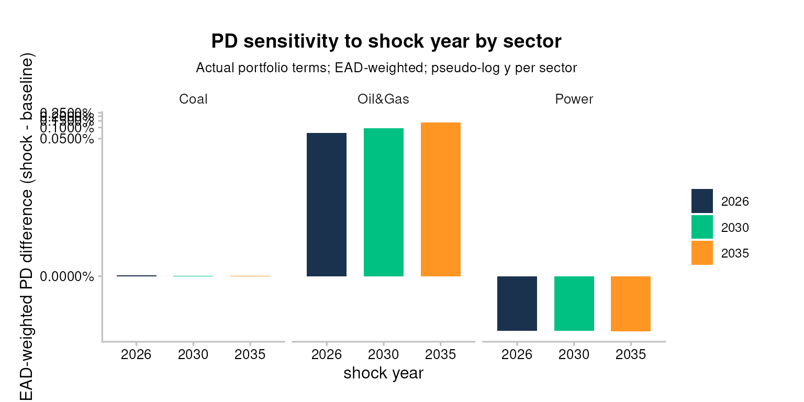
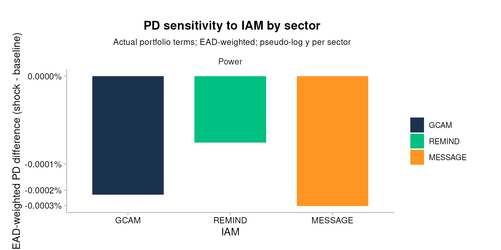
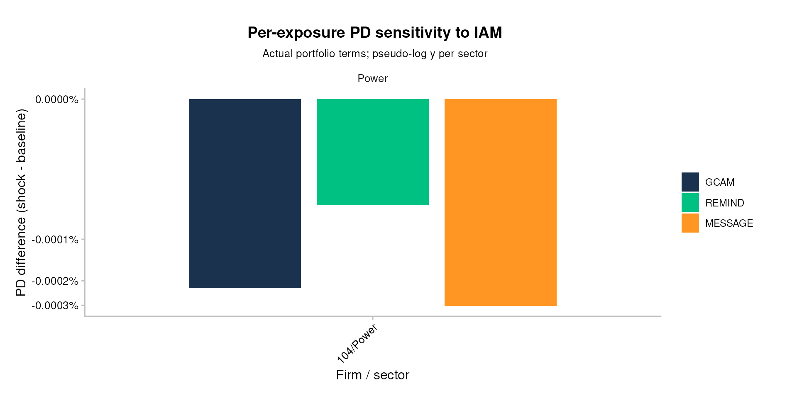
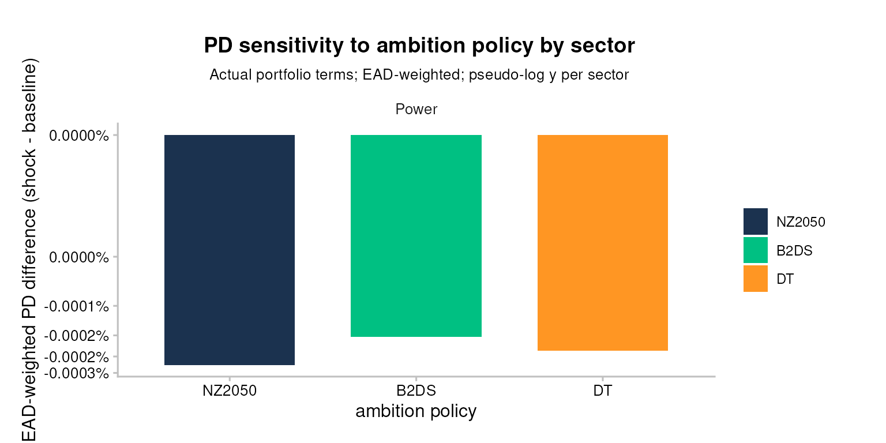
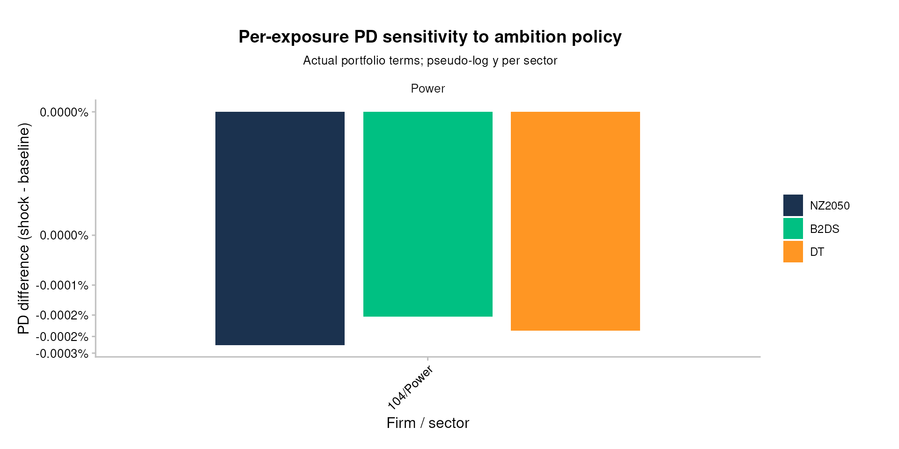

# Bank workflow 4: Sensitivity analysis (bank-impact view)

``` r

library(trisk.analysis)
library(magrittr)
```

## Setup

This vignette uses the bundled testdata to demonstrate sensitivity
analysis in three dimensions (shock year, IAM, ambition policy), each
read through a bank-impact lens: actual portfolio terms, EAD-weighted
sector aggregation, and an integrated expected-loss bps callout at the
end.

> **Input data — where your data goes.** TRISK needs **five inputs**:
> four that describe the world — **assets**, **scenarios**, **NGFS
> carbon price** and **financial features** — plus your **portfolio**.
> The main portfolio file is **`portfolio_ids`** (matched by
> `company_id`); `portfolio_names` and `portfolio_countries` are
> options. This workflow uses the `portfolio_ids_internal_pd` variant
> (the same file plus an `internal_pd` column). **The CSVs loaded below
> are placeholders** (bundled samples) — replace them with your own
> files. See [Credit risk analysis](bank_1_credit-risk-analysis.md) for
> [`setup_trisk_inputs()`](../reference/setup_trisk_inputs.md) and the
> `trisk_inputs/` folder convention.

**Where your portfolio enters the sensitivity analysis.** The sweep
itself varies *scenario parameters*, but it is anchored to **your
portfolio**: the `portfolio_ids_internal_pd` file is read below,
validated for `internal_pd`, and reduced to `portfolio_terms`
(`company_id`, `term`, `exposure_value_usd`). Those loan terms and
exposures are what turn each parameter run into a bank-specific,
EAD-weighted result — so swapping in your own `portfolio_ids` (with
`internal_pd`) is what makes every chart below reflect *your* book.

``` r

assets_testdata             <- read.csv(system.file("testdata", "assets_testdata.csv",             package = "trisk.model"))
scenarios_testdata          <- read.csv(system.file("testdata", "scenarios_testdata.csv",          package = "trisk.model"))
financial_features_testdata <- read.csv(system.file("testdata", "financial_features_testdata.csv", package = "trisk.model"))
ngfs_carbon_price_testdata  <- read.csv(system.file("testdata", "ngfs_carbon_price_testdata.csv",  package = "trisk.model"))
portfolio_ids_internal_pd   <- read.csv(system.file("testdata", "portfolio_ids_internal_pd_testdata.csv",
                                                    package = "trisk.analysis"))

# TRISK echoes company_id back as a character key; read.csv infers integers for
# the bundled portfolio file. Coerce once here so every downstream join on
# `company_id` matches on type.
portfolio_ids_internal_pd$company_id <- as.character(portfolio_ids_internal_pd$company_id)

stopifnot(
  "Portfolio file must include an `internal_pd` column per exposure." =
    "internal_pd" %in% colnames(portfolio_ids_internal_pd),
  "`internal_pd` values must be numeric in [0, 1]." =
    is.numeric(portfolio_ids_internal_pd$internal_pd) &&
      all(portfolio_ids_internal_pd$internal_pd >= 0 &
            portfolio_ids_internal_pd$internal_pd <= 1, na.rm = TRUE)
)

portfolio_terms <- portfolio_ids_internal_pd[, c("company_id", "term", "exposure_value_usd")]
```

## Why sensitivity

Climate stress-testing carries three layers of uncertainty a bank reader
cares about: **when** the shock arrives (`shock_year`), **whose model**
of the transition you trust (the IAM), and **how ambitious** the target
scenario is. This vignette sweeps each one and reads the result as a
change in the bank’s portfolio risk picture, not as an abstract model
output.

## Base run

``` r

run_params_base <- list(
  list(
    scenario_geography = "Global",
    baseline_scenario  = "NGFS2023GCAM_CP",
    target_scenario    = "NGFS2023GCAM_NZ2050",
    shock_year         = 2030
  )
)

sa_base <- run_trisk_sa(
  assets_data    = assets_testdata,
  scenarios_data = scenarios_testdata,
  financial_data = financial_features_testdata,
  carbon_data    = ngfs_carbon_price_testdata,
  run_params     = run_params_base
)
#> [1] "Starting the execution of 1 total runs"
#> -- Retyping Dataframes. 
#> -- Processing Assets and Scenarios. 
#> -- Transforming to Trisk model input. 
#> -- Calculating baseline, target, and shock trajectories. 
#> -- Applying zero-trajectory logic to production trajectories. 
#> -- Calculating net profits.
#> Joining with `by = join_by(asset_id, company_id, sector, technology)`
#> -- Calculating market risk. 
#> -- Calculating credit risk. 
#> [1] "Done 1 / 1 total runs"
#> [1] "All runs completed."

knitr::kable(head(sa_base$pd[, c("run_id", "company_id", "sector", "term",
                                 "pd_baseline", "pd_shock")]))
```

| run_id | company_id | sector | term | pd_baseline | pd_shock |
|:---|:---|:---|---:|---:|---:|
| d7640e91-9f5e-47fb-8276-67871c9646c4 | 101 | Oil&Gas | 1 | 0.0000000 | 0.0000000 |
| d7640e91-9f5e-47fb-8276-67871c9646c4 | 101 | Oil&Gas | 2 | 0.0000000 | 0.0000214 |
| d7640e91-9f5e-47fb-8276-67871c9646c4 | 101 | Oil&Gas | 3 | 0.0000011 | 0.0004647 |
| d7640e91-9f5e-47fb-8276-67871c9646c4 | 101 | Oil&Gas | 4 | 0.0000237 | 0.0022474 |
| d7640e91-9f5e-47fb-8276-67871c9646c4 | 101 | Oil&Gas | 5 | 0.0001502 | 0.0059057 |
| d7640e91-9f5e-47fb-8276-67871c9646c4 | 101 | Oil&Gas | 6 | 0.0005218 | 0.0113956 |

## Convention: actual portfolio terms, EAD-weighted

Every plot below evaluates PD at each firm’s contractual loan term (from
`portfolio_terms`) and aggregates sector-level numbers as EAD-weighted
means. This matches the convention used by the integration pipeline
(`pipeline_crispy_pd_integration_bars` and siblings) and means the PDs
and EL deltas read here are directly comparable to those in
[`pd-el-integration`](bank_5_pd-el-integration.md) — no per-section
translation needed.

> **Caveat.** If a portfolio row has a contractual term beyond TRISK’s
> Merton grid (sized to the analysis horizon since the ADO 1943
> term-grid fix in `trisk.model`), the term join silently drops it. The
> helper below emits a warning naming the dropped `(company_id, term)`
> pairs so the omission is visible.

## Plot helpers

These three functions are defined inline in the vignette (not exported
from the package). Each one takes the long-format PD output of
[`run_trisk_sa()`](../reference/run_trisk_sa.md), attaches the bank’s
contractual portfolio terms, and produces a comparison plot of PD
difference (`pd_shock - pd_baseline`) per variant.

``` r

attach_portfolio_term <- function(sa_pd, portfolio_terms) {
  joined <- sa_pd %>%
    dplyr::inner_join(portfolio_terms, by = c("company_id", "term"))
  present <- dplyr::distinct(joined[, c("company_id", "term")])
  n_dropped <- nrow(portfolio_terms) - nrow(present)
  if (n_dropped > 0) {
    dropped <- dplyr::anti_join(portfolio_terms, present, by = c("company_id", "term"))
    warning("Dropped ", n_dropped, " portfolio row(s) whose term is outside the Merton grid: ",
            paste(dropped$company_id, dropped$term, sep = "/term=", collapse = ", "),
            call. = FALSE)
  }
  joined
}

label_by_variant <- function(sa_result, label_fn) {
  sa_result$pd %>%
    dplyr::left_join(sa_result$params, by = "run_id") %>%
    dplyr::mutate(variant = label_fn(.))
}

draw_pd_by_sector <- function(labelled_pd, portfolio_terms, variant_name,
                              palette_values = NULL) {
  agg <- labelled_pd %>%
    attach_portfolio_term(portfolio_terms) %>%
    dplyr::mutate(pd_difference = .data$pd_shock - .data$pd_baseline) %>%
    dplyr::group_by(.data$sector, .data$variant) %>%
    dplyr::summarise(
      pd_difference = stats::weighted.mean(.data$pd_difference,
                                           w = .data$exposure_value_usd,
                                           na.rm = TRUE),
      .groups = "drop"
    )
  p <- ggplot2::ggplot(agg, ggplot2::aes(x = .data$variant,
                                         y = .data$pd_difference,
                                         fill = .data$variant)) +
    ggplot2::geom_col(width = 0.7) +
    ggplot2::facet_grid(. ~ sector, scales = "free_y") +
    ggplot2::scale_y_continuous(
      trans  = scales::pseudo_log_trans(sigma = 1e-7),
      labels = scales::percent_format(accuracy = 0.0001)
    ) +
    TRISK_PLOT_THEME_FUNC() +
    ggplot2::labs(x = variant_name, y = "EAD-weighted PD difference (shock - baseline)",
                  fill = variant_name,
                  title = paste("PD sensitivity to", variant_name, "by sector"),
                  subtitle = "Actual portfolio terms; EAD-weighted; pseudo-log y per sector")
  if (!is.null(palette_values)) p <- p + ggplot2::scale_fill_manual(values = palette_values)
  p
}

draw_pd_by_exposure <- function(labelled_pd, portfolio_terms, variant_name,
                                palette_values = NULL) {
  agg <- labelled_pd %>%
    attach_portfolio_term(portfolio_terms) %>%
    dplyr::mutate(firm = paste(.data$company_id, .data$sector, sep = "/"),
                  pd_difference = .data$pd_shock - .data$pd_baseline)
  p <- ggplot2::ggplot(agg, ggplot2::aes(x = .data$firm,
                                         y = .data$pd_difference,
                                         fill = .data$variant)) +
    ggplot2::geom_col(position = ggplot2::position_dodge(width = 0.8), width = 0.7) +
    ggplot2::facet_grid(. ~ sector, scales = "free", space = "free_x") +
    ggplot2::scale_y_continuous(
      trans  = scales::pseudo_log_trans(sigma = 1e-7),
      labels = scales::percent_format(accuracy = 0.0001)
    ) +
    TRISK_PLOT_THEME_FUNC() +
    ggplot2::theme(axis.text.x = ggplot2::element_text(angle = 45, hjust = 1)) +
    ggplot2::labs(x = "Firm / sector", y = "PD difference (shock - baseline)",
                  fill = variant_name,
                  title = paste("Per-exposure PD sensitivity to", variant_name),
                  subtitle = "Actual portfolio terms; pseudo-log y per sector")
  if (!is.null(palette_values)) p <- p + ggplot2::scale_fill_manual(values = palette_values)
  p
}
```

A small palette shared across the three dimension sections so the same
variant index gets the same colour everywhere:

``` r

TRAJ_PALETTE <- c("#1b324f", "#00c082", "#ff9623")  # matches plot_multi_trajectories()
```

## Shock year

What happens to portfolio PD when the policy shock hits earlier or
later? This section sweeps `shock_year` across 2026 / 2030 / 2035,
holding the scenario pair fixed at NGFS2023GCAM CP vs NZ2050.

``` r

run_params_shockyear <- list(
  list(scenario_geography = "Global",
       baseline_scenario  = "NGFS2023GCAM_CP",
       target_scenario    = "NGFS2023GCAM_NZ2050",
       shock_year         = 2026),
  list(scenario_geography = "Global",
       baseline_scenario  = "NGFS2023GCAM_CP",
       target_scenario    = "NGFS2023GCAM_NZ2050",
       shock_year         = 2030),
  list(scenario_geography = "Global",
       baseline_scenario  = "NGFS2023GCAM_CP",
       target_scenario    = "NGFS2023GCAM_NZ2050",
       shock_year         = 2035)
)

sa_shockyear <- run_trisk_sa(
  assets_data    = assets_testdata,
  scenarios_data = scenarios_testdata,
  financial_data = financial_features_testdata,
  carbon_data    = ngfs_carbon_price_testdata,
  run_params     = run_params_shockyear
)
#> [1] "Starting the execution of 3 total runs"
#> -- Retyping Dataframes. 
#> -- Processing Assets and Scenarios. 
#> -- Transforming to Trisk model input. 
#> -- Calculating baseline, target, and shock trajectories. 
#> -- Applying zero-trajectory logic to production trajectories. 
#> -- Calculating net profits.
#> Joining with `by = join_by(asset_id, company_id, sector, technology)`
#> -- Calculating market risk. 
#> -- Calculating credit risk. 
#> [1] "Done 1 / 3 total runs"
#> -- Retyping Dataframes. 
#> -- Processing Assets and Scenarios. 
#> -- Transforming to Trisk model input. 
#> -- Calculating baseline, target, and shock trajectories. 
#> -- Applying zero-trajectory logic to production trajectories. 
#> -- Calculating net profits.
#> Joining with `by = join_by(asset_id, company_id, sector, technology)`
#> -- Calculating market risk. 
#> -- Calculating credit risk. 
#> [1] "Done 2 / 3 total runs"
#> -- Retyping Dataframes. 
#> -- Processing Assets and Scenarios. 
#> -- Transforming to Trisk model input. 
#> -- Calculating baseline, target, and shock trajectories. 
#> -- Applying zero-trajectory logic to production trajectories. 
#> -- Calculating net profits.
#> Joining with `by = join_by(asset_id, company_id, sector, technology)`
#> -- Calculating market risk. 
#> -- Calculating credit risk. 
#> [1] "Done 3 / 3 total runs"
#> [1] "All runs completed."

pd_shockyear <- label_by_variant(sa_shockyear,
  function(d) factor(d$shock_year, levels = c(2026, 2030, 2035)))
```

``` r

draw_pd_by_sector(pd_shockyear, portfolio_terms, "shock year",
                  palette_values = stats::setNames(TRAJ_PALETTE,
                                                   c("2026", "2030", "2035")))
```



#### Advanced: per-firm view

``` r

draw_pd_by_exposure(pd_shockyear, portfolio_terms, "shock year",
                    palette_values = stats::setNames(TRAJ_PALETTE,
                                                     c("2026", "2030", "2035")))
```


## IAM (integrated assessment model)

Same transition story, different model: NGFS2023 publishes its CP and
NZ2050 scenarios under three IAMs — GCAM, REMIND, and MESSAGE. Bank
readers who pick one IAM should know how their numbers move under the
other two.

> **Scope of the bundled IAM/ambition data.** NGFS2023 only publishes
> the REMIND and MESSAGE models — and the B2DS / DT ambition variants
> used in the next section — for the **Power sector**, spanning
> **2023–2050**. The legacy multi-sector `NGFS2023GCAM_*` scenarios used
> in the sections above run 2022–2100 across Coal, Oil & Gas, and Power.
> Because TRISK derives its analysis window from the scenario’s own year
> range, we scope the portfolio to that window before running these two
> sections — keeping the cross-variant comparison apples-to-apples on
> the bank’s power exposure.

``` r

# This filter is YEAR scoping only: the scenario-derived analysis window starts
# at 2023 for these variants, and the model asserts every asset's production_year
# falls inside that window (it errors rather than trimming), so we drop the lone
# 2022 rows. It does NOT do sector scoping — assets_power still holds Coal and
# Oil & Gas rows. The Power-only restriction happens automatically downstream:
# the model inner-joins assets to the scenario technologies, which are Power-only
# for these variants, so the other sectors drop out without error.
assets_power <- assets_testdata[assets_testdata$production_year >= 2023, ]

# Scope the term table to the portfolio's Power exposure so the term-join
# warning flags only genuine term-grid drops, not the Coal / Oil & Gas firms
# that these Power-only scenarios legitimately exclude.
power_ids <- portfolio_ids_internal_pd$company_id[portfolio_ids_internal_pd$sector == "Power"]
portfolio_terms_power <- portfolio_terms[portfolio_terms$company_id %in% power_ids, ]

run_params_iam <- list(
  list(scenario_geography = "Global",
       baseline_scenario  = "NGFS2023_GCAM_CP",
       target_scenario    = "NGFS2023_GCAM_NZ2050",
       shock_year         = 2030),
  list(scenario_geography = "Global",
       baseline_scenario  = "NGFS2023_REMIND_CP",
       target_scenario    = "NGFS2023_REMIND_NZ2050",
       shock_year         = 2030),
  list(scenario_geography = "Global",
       baseline_scenario  = "NGFS2023_MESSAGE_CP",
       target_scenario    = "NGFS2023_MESSAGE_NZ2050",
       shock_year         = 2030)
)

sa_iam <- run_trisk_sa(
  assets_data    = assets_power,
  scenarios_data = scenarios_testdata,
  financial_data = financial_features_testdata,
  carbon_data    = ngfs_carbon_price_testdata,
  run_params     = run_params_iam
)
#> [1] "Starting the execution of 3 total runs"
#> -- Retyping Dataframes. 
#> -- Processing Assets and Scenarios. 
#> -- Transforming to Trisk model input. 
#> -- Calculating baseline, target, and shock trajectories. 
#> -- Applying zero-trajectory logic to production trajectories. 
#> -- Calculating net profits.
#> Joining with `by = join_by(asset_id, company_id, sector, technology)`
#> -- Calculating market risk. 
#> -- Calculating credit risk. 
#> [1] "Done 1 / 3 total runs"
#> -- Retyping Dataframes. 
#> -- Processing Assets and Scenarios. 
#> -- Transforming to Trisk model input. 
#> -- Calculating baseline, target, and shock trajectories. 
#> -- Applying zero-trajectory logic to production trajectories. 
#> -- Calculating net profits.
#> Joining with `by = join_by(asset_id, company_id, sector, technology)`
#> -- Calculating market risk. 
#> -- Calculating credit risk. 
#> [1] "Done 2 / 3 total runs"
#> -- Retyping Dataframes. 
#> -- Processing Assets and Scenarios. 
#> -- Transforming to Trisk model input. 
#> -- Calculating baseline, target, and shock trajectories. 
#> -- Applying zero-trajectory logic to production trajectories. 
#> -- Calculating net profits.
#> Joining with `by = join_by(asset_id, company_id, sector, technology)`
#> -- Calculating market risk. 
#> -- Calculating credit risk. 
#> [1] "Done 3 / 3 total runs"
#> [1] "All runs completed."

pd_iam <- label_by_variant(sa_iam, function(d) {
  iam <- sub("^NGFS2023_([A-Z]+)_.*", "\\1", d$baseline_scenario)
  factor(iam, levels = c("GCAM", "REMIND", "MESSAGE"))
})
```

``` r

draw_pd_by_sector(pd_iam, portfolio_terms_power, "IAM",
                  palette_values = stats::setNames(TRAJ_PALETTE,
                                                   c("GCAM", "REMIND", "MESSAGE")))
```



#### Advanced: per-firm view

``` r

draw_pd_by_exposure(pd_iam, portfolio_terms_power, "IAM",
                    palette_values = stats::setNames(TRAJ_PALETTE,
                                                     c("GCAM", "REMIND", "MESSAGE")))
```



## Ambition policy

Same IAM (GCAM), different target stringency: how does the PD signal
change across Net Zero 2050, Below 2°C, and Delayed Transition, each
measured against Current Policies as the baseline?

``` r

run_params_ambition <- list(
  list(scenario_geography = "Global",
       baseline_scenario  = "NGFS2023_GCAM_CP",
       target_scenario    = "NGFS2023_GCAM_NZ2050",
       shock_year         = 2030),
  list(scenario_geography = "Global",
       baseline_scenario  = "NGFS2023_GCAM_CP",
       target_scenario    = "NGFS2023_GCAM_B2DS",
       shock_year         = 2030),
  list(scenario_geography = "Global",
       baseline_scenario  = "NGFS2023_GCAM_CP",
       target_scenario    = "NGFS2023_GCAM_DT",
       shock_year         = 2030)
)

sa_ambition <- run_trisk_sa(
  assets_data    = assets_power,
  scenarios_data = scenarios_testdata,
  financial_data = financial_features_testdata,
  carbon_data    = ngfs_carbon_price_testdata,
  run_params     = run_params_ambition
)
#> [1] "Starting the execution of 3 total runs"
#> -- Retyping Dataframes. 
#> -- Processing Assets and Scenarios. 
#> -- Transforming to Trisk model input. 
#> -- Calculating baseline, target, and shock trajectories. 
#> -- Applying zero-trajectory logic to production trajectories. 
#> -- Calculating net profits.
#> Joining with `by = join_by(asset_id, company_id, sector, technology)`
#> -- Calculating market risk. 
#> -- Calculating credit risk. 
#> [1] "Done 1 / 3 total runs"
#> -- Retyping Dataframes. 
#> -- Processing Assets and Scenarios. 
#> -- Transforming to Trisk model input. 
#> -- Calculating baseline, target, and shock trajectories. 
#> -- Applying zero-trajectory logic to production trajectories. 
#> -- Calculating net profits.
#> Joining with `by = join_by(asset_id, company_id, sector, technology)`
#> -- Calculating market risk. 
#> -- Calculating credit risk. 
#> [1] "Done 2 / 3 total runs"
#> -- Retyping Dataframes. 
#> -- Processing Assets and Scenarios. 
#> -- Transforming to Trisk model input. 
#> -- Calculating baseline, target, and shock trajectories. 
#> -- Applying zero-trajectory logic to production trajectories. 
#> -- Calculating net profits.
#> Joining with `by = join_by(asset_id, company_id, sector, technology)`
#> -- Calculating market risk. 
#> -- Calculating credit risk. 
#> [1] "Done 3 / 3 total runs"
#> [1] "All runs completed."

pd_ambition <- label_by_variant(sa_ambition, function(d) {
  ambition <- sub("^NGFS2023_GCAM_(.*)$", "\\1", d$target_scenario)
  factor(ambition, levels = c("NZ2050", "B2DS", "DT"))
})
```

``` r

draw_pd_by_sector(pd_ambition, portfolio_terms_power, "ambition policy",
                  palette_values = stats::setNames(TRAJ_PALETTE,
                                                   c("NZ2050", "B2DS", "DT")))
```



#### Advanced: per-firm view

``` r

draw_pd_by_exposure(pd_ambition, portfolio_terms_power, "ambition policy",
                    palette_values = stats::setNames(TRAJ_PALETTE,
                                                     c("NZ2050", "B2DS", "DT")))
```



## What this means for the bank

The previous sections show how raw PD shifts under different design
choices. The bank-impact question is: how does that translate into
expected-loss basis points on the actual portfolio? We pick one variant
(`shock_year = 2030`, NGFS2023GCAM CP vs NZ2050, Global — the base run)
and walk it through the integration pipeline, ending with the EL bps KPI
used elsewhere in the package.

``` r

analysis_data <- run_trisk_on_portfolio(
  assets_data       = assets_testdata,
  scenarios_data    = scenarios_testdata,
  financial_data    = financial_features_testdata,
  carbon_data       = ngfs_carbon_price_testdata,
  portfolio_data    = portfolio_ids_internal_pd,
  baseline_scenario = "NGFS2023GCAM_CP",
  target_scenario   = "NGFS2023GCAM_NZ2050"
)
#> -- Start Trisk-- Retyping Dataframes. 
#> -- Processing Assets and Scenarios. 
#> -- Transforming to Trisk model input. 
#> -- Calculating baseline, target, and shock trajectories. 
#> -- Applying zero-trajectory logic to production trajectories. 
#> -- Calculating net profits.
#> Joining with `by = join_by(asset_id, company_id, sector, technology)`
#> -- Calculating market risk. 
#> -- Calculating credit risk.
analysis_data_el <- compute_analysis_metrics(analysis_data)

internal_pd_lookup <- portfolio_ids_internal_pd[, c("company_id", "internal_pd")]
internal_el_lookup <- merge(
  analysis_data_el[, c("company_id", "exposure_value_usd", "loss_given_default")],
  internal_pd_lookup,
  by = "company_id"
)
internal_el_lookup$internal_el <-
  internal_el_lookup$exposure_value_usd *
  internal_el_lookup$loss_given_default *
  internal_el_lookup$internal_pd

result_el <- integrate_el(analysis_data_el,
                          internal_el = internal_el_lookup[, c("company_id", "internal_el")])
```

``` r

pipeline_crispy_el_kpi_table(result_el$aggregate)
```

| Total Exposure (USD) | Total Internal EL | Total Adjusted EL | EL Adjustment | Adjusted EL (bps) |
|---:|---:|---:|---:|---:|
| 21.06M | 318.1K | 527.8K | 209.7K | 250.6 bps |

Read the EL bps delta as the bank-impact summary of this one variant.
The sensitivity sections above tell you how that number would move if
you chose a different shock year, IAM, or ambition tier. For deeper plot
references and the full methodology, see
[`pd-el-integration`](bank_5_pd-el-integration.md).

## See also

- [`getting-started`](1_getting-started.md) — the reading-path entry
  point.
- [`run-on-a-portfolio`](bank_3_run-on-a-portfolio.md) — how the
  underlying TRISK runs that feed this analysis are produced.
- [`pd-el-integration`](bank_5_pd-el-integration.md) — the full PD/EL
  integration methodology and the EL bps KPI surfaced in the closing
  section.
