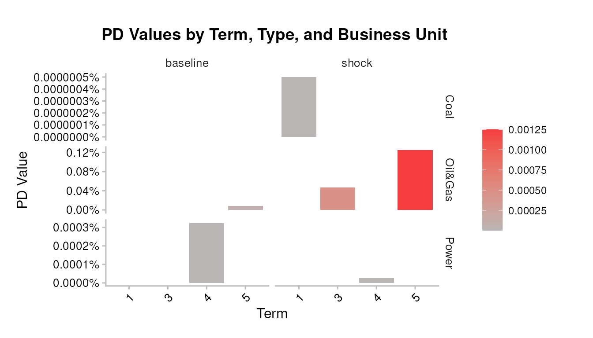
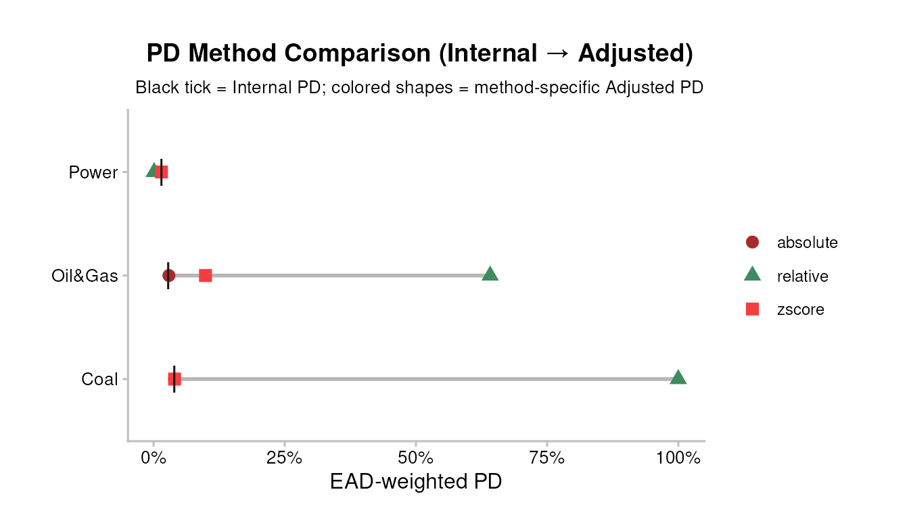
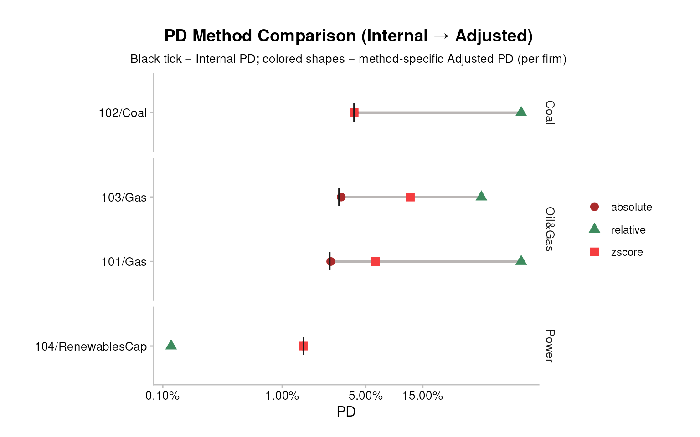
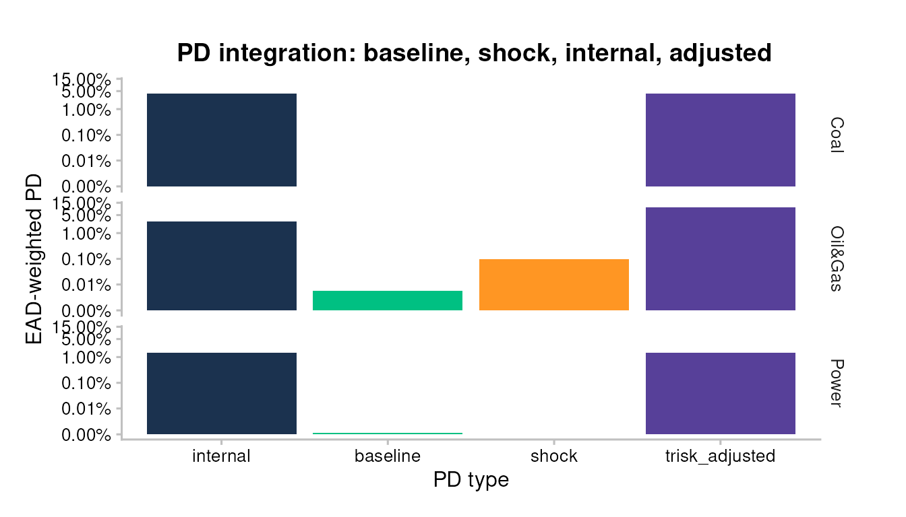
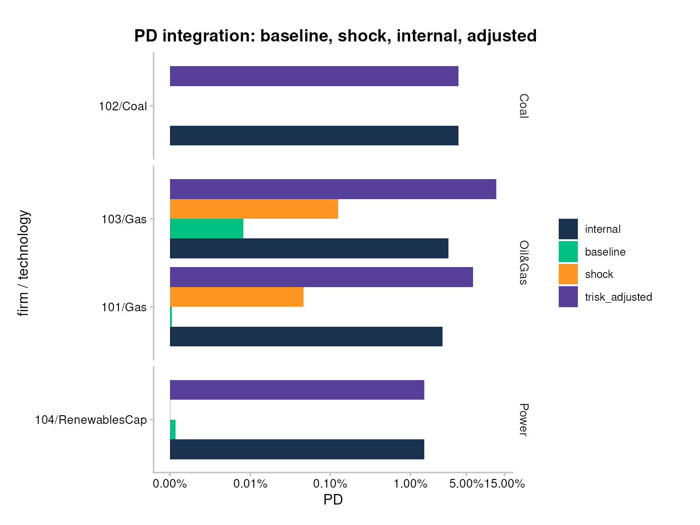
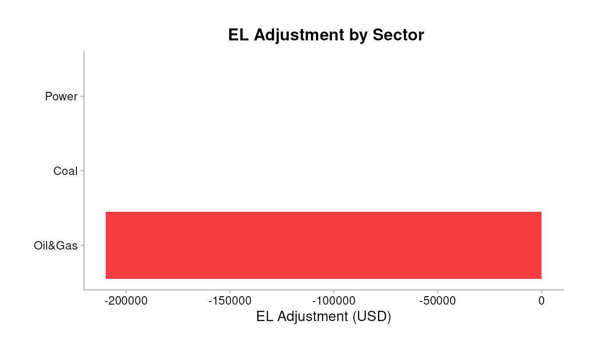
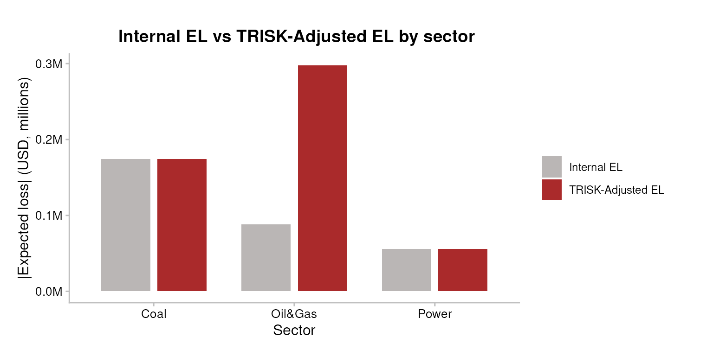
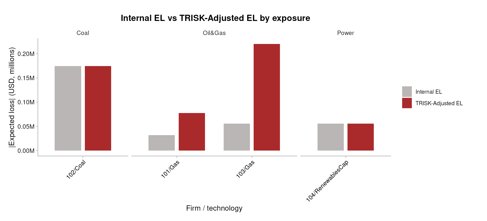

# pd-el-integration

``` r
library(trisk.analysis)
library(magrittr)
```

## PD and EL Integration

### 1. Setup

Load the bundled testdata shipped with `trisk.model` and
`trisk.analysis`. The portfolio file is
`portfolio_ids_internal_pd_testdata.csv`, which augments the classic
`portfolio_ids_testdata.csv` with an `internal_pd` column per exposure.
That column is **mandatory** — integration is meaningless without the
bank’s own PD to integrate TRISK’s shift into, so the setup fails loudly
if it’s missing.

``` r
assets_testdata    <- read.csv(system.file("testdata", "assets_testdata.csv",    package = "trisk.model"))
scenarios_testdata <- read.csv(system.file("testdata", "scenarios_testdata.csv", package = "trisk.model"))
fin_testdata       <- read.csv(system.file("testdata", "financial_features_testdata.csv", package = "trisk.model"))
carbon_testdata    <- read.csv(system.file("testdata", "ngfs_carbon_price_testdata.csv", package = "trisk.model"))
portfolio_ids_internal_pd <- read.csv(system.file("testdata", "portfolio_ids_internal_pd_testdata.csv",
                                                  package = "trisk.analysis"))

stopifnot(
  "Portfolio file must include an `internal_pd` column per exposure." =
    "internal_pd" %in% colnames(portfolio_ids_internal_pd),
  "`internal_pd` values must be numeric in [0, 1]." =
    is.numeric(portfolio_ids_internal_pd$internal_pd) &&
      all(portfolio_ids_internal_pd$internal_pd >= 0 &
          portfolio_ids_internal_pd$internal_pd <= 1, na.rm = TRUE)
)
```

### 2. Run TRISK on the portfolio

The `internal_pd` column is carried alongside — TRISK only needs the
standard portfolio schema, and we keep the internal PDs as a separate
lookup table to feed into
[`integrate_pd()`](../reference/integrate_pd.md) later.

``` r
analysis_data <- run_trisk_on_portfolio(
  assets_data       = assets_testdata,
  scenarios_data    = scenarios_testdata,
  financial_data    = fin_testdata,
  carbon_data       = carbon_testdata,
  portfolio_data    = portfolio_ids_internal_pd,
  baseline_scenario = "NGFS2023GCAM_CP",
  target_scenario   = "NGFS2023GCAM_NZ2050"
)
#> -- Start Trisk-- Retyping Dataframes. 
#> -- Processing Assets and Scenarios. 
#> -- Transforming to Trisk model input. 
#> -- Calculating baseline, target, and shock trajectories. 
#> -- Applying zero-trajectory logic to production trajectories. 
#> -- Calculating net profits.
#> Joining with `by = join_by(asset_id, company_id, sector, technology)`
#> -- Calculating market risk. 
#> -- Calculating credit risk.

# The internal_pd lookup used throughout the rest of the vignette:
internal_pd_lookup <- portfolio_ids_internal_pd[, c("company_id", "internal_pd")]
```

| company_id | sector  | technology    | term | pd_baseline |  pd_shock | net_present_value_baseline | net_present_value_shock |
|:-----------|:--------|:--------------|-----:|------------:|----------:|---------------------------:|------------------------:|
| 101        | Oil&Gas | Gas           |    3 |    1.10e-06 | 0.0004647 |                   51951.82 |                13549.28 |
| 102        | Coal    | Coal          |    1 |    0.00e+00 | 0.0000000 |                13648160.57 |              4317747.56 |
| 103        | Oil&Gas | Gas           |    5 |    8.09e-05 | 0.0012524 |                27724344.25 |             12420187.12 |
| 104        | Power   | RenewablesCap |    4 |    3.20e-06 | 0.0000003 |              141635910\.26 |           202554984\.40 |

### 3. Bank-risk context (before integration)

Before layering the integration methods on top, look at the raw
bank-risk picture that TRISK produces. The four standard portfolio plots
answer “what did the shock do?” at the equity (NPV, exposure) and credit
(PD term, EL) levels, using the same `analysis_data`.

``` r
pipeline_crispy_pd_term_plot(analysis_data)
#> Joining with `by = join_by(sector, term)`
```



Expected loss by sector (baseline vs shock), all sectors on a single
row:

``` r
ad_el_preview <- compute_analysis_metrics(analysis_data)
el_by_sector <- ad_el_preview %>%
  dplyr::group_by(sector) %>%
  dplyr::summarise(
    baseline = sum(.data$expected_loss_baseline, na.rm = TRUE),
    shock    = sum(.data$expected_loss_shock,    na.rm = TRUE),
    .groups  = "drop"
  ) %>%
  tidyr::pivot_longer(
    cols = c("baseline", "shock"), names_to = "scenario", values_to = "el"
  )

ggplot2::ggplot(el_by_sector,
                ggplot2::aes(x = sector, y = .data$el, fill = .data$scenario)) +
  ggplot2::geom_col(position = ggplot2::position_dodge(width = 0.8),
                    width = 0.7) +
  ggplot2::scale_y_continuous(labels = scales::label_number(scale = 1e-6, suffix = "M")) +
  ggplot2::scale_fill_manual(values = c(baseline = "#5D9324", shock = "#F53D3F")) +
  TRISK_PLOT_THEME_FUNC() +
  ggplot2::labs(x = "Sector", y = "Expected loss (USD, millions)",
                fill = "Scenario",
                title = "Expected loss by sector: baseline vs shock")
```


### 4. Why integration matters

TRISK recomputes PD from a Merton structural credit model. That PD level
is not directly comparable to the internal PD your institution already
uses; only the change from baseline to shock carries meaning. Three
integration methods translate the TRISK shift into your internal PD
scale.

### 5. Method 1 - Absolute

``` r
result_abs <- integrate_pd(analysis_data,
                           internal_pd = internal_pd_lookup,
                           method      = "absolute")
```

| company_id | sector  | internal_pd | pd_baseline |  pd_shock | trisk_adjusted_pd | pd_adjustment |
|:-----------|:--------|------------:|------------:|----------:|------------------:|--------------:|
| 101        | Oil&Gas |       0.025 |    1.10e-06 | 0.0004647 |         0.0254636 |     0.0004636 |
| 102        | Coal    |       0.040 |    0.00e+00 | 0.0000000 |         0.0400000 |     0.0000000 |
| 103        | Oil&Gas |       0.030 |    8.09e-05 | 0.0012524 |         0.0311716 |     0.0011716 |
| 104        | Power   |       0.015 |    3.20e-06 | 0.0000003 |         0.0149970 |    -0.0000030 |

### 6. Method 2 - Relative

> **Note:** when `pd_baseline = 0` the relative method returns the
> internal PD unchanged; the shock signal is lost on zero-baseline rows.
> Use `absolute` or `zscore` if this matters.

``` r
result_rel <- integrate_pd(analysis_data,
                           internal_pd = internal_pd_lookup,
                           method      = "relative")
```

### 7. Method 3 - Z-score (Basel IRB)

The z-score method combines PDs in the normal-quantile space, preserving
the non-linear relationship at distribution tails. Recommended for Basel
IRB-aligned institutions.

``` r
result_zs <- integrate_pd(analysis_data,
                          internal_pd = internal_pd_lookup,
                          method      = "zscore")
```

### 8. Overriding internal PDs on the fly

If you want to stress-test with a hypothetical flat internal PD (for
example, as a sanity check), build a vector or alternate lookup and pass
it instead:

``` r
flat_internal <- rep(0.03, nrow(analysis_data))
result_custom <- integrate_pd(analysis_data,
                              internal_pd = flat_internal,
                              method      = "zscore")
```

### 9. Method comparison

``` r
pipeline_crispy_pd_method_comparison(analysis_data,
                                     internal_pd = internal_pd_lookup)
```



#### Advanced: firm-level and pseudo-log scale

On sparse portfolios where many firms have baseline PDs near zero
(Merton underflow) and a few have visible signal, the default
sector-aggregate linear view can bunch everything against zero. Two
arguments open up the per-firm picture:

- `granularity = "firm"` — one row per firm instead of an EAD-weighted
  sector aggregate. Reveals within-sector method divergence.
- `scale = "pseudo_log"` — x-axis uses
  `scales::pseudo_log_trans(sigma = 1e-5)`. Zero-safe and spreads values
  across many orders of magnitude.

``` r
pipeline_crispy_pd_method_comparison(
  analysis_data,
  internal_pd = internal_pd_lookup,
  granularity = "firm",
  scale       = "pseudo_log"
)
```



### 10. Integration charts

``` r
pipeline_crispy_pd_integration_bars(result_zs)
```



The same `granularity` + `scale` arguments work on the bar plot:

``` r
pipeline_crispy_pd_integration_bars(
  result_zs,
  granularity = "firm",
  scale       = "pseudo_log"
)
```



### 11. EL integration

[`integrate_el()`](../reference/integrate_el.md) expects
`expected_loss_baseline` and `expected_loss_shock` columns, which
[`run_trisk_on_portfolio()`](../reference/run_trisk_on_portfolio.md)
does not produce on its own. Call
[`compute_analysis_metrics()`](../reference/compute_analysis_metrics.md)
first to derive them as EAD \* PD.

For the bank’s internal EL, we derive it the same way:
`EAD * LGD * internal_pd`.

``` r
analysis_data_el <- compute_analysis_metrics(analysis_data)
internal_el_lookup <- merge(
  analysis_data_el[, c("company_id", "exposure_value_usd", "loss_given_default")],
  internal_pd_lookup,
  by = "company_id"
)
internal_el_lookup$internal_el <-
  -internal_el_lookup$exposure_value_usd *
   internal_el_lookup$loss_given_default *
   internal_el_lookup$internal_pd

result_el <- integrate_el(analysis_data_el,
                          internal_el = internal_el_lookup[, c("company_id", "internal_el")])
# default method is "zscore" (Basel IRB-aligned, zero-safe via clipping)
```

``` r
pipeline_crispy_el_adjustment_bars(result_el)
```



#### Internal EL vs TRISK-Adjusted EL

Side-by-side comparison so the integration effect is visible per group.
EL is negative by package convention (loss as negative number);
[`abs()`](https://rdrr.io/r/base/MathFun.html) is applied for display so
the bars read as magnitudes of expected loss.

**Per sector** — all sectors on one row:

``` r
el_compare_sector <- result_el$portfolio %>%
  dplyr::group_by(sector) %>%
  dplyr::summarise(
    `Internal EL`        = sum(.data$internal_el, na.rm = TRUE),
    `TRISK-Adjusted EL`  = sum(.data$trisk_adjusted_el, na.rm = TRUE),
    .groups              = "drop"
  ) %>%
  tidyr::pivot_longer(
    cols = c("Internal EL", "TRISK-Adjusted EL"),
    names_to = "el_type", values_to = "el"
  ) %>%
  dplyr::mutate(el_abs = abs(.data$el))

ggplot2::ggplot(el_compare_sector,
                ggplot2::aes(x = sector, y = .data$el_abs, fill = .data$el_type)) +
  ggplot2::geom_col(position = ggplot2::position_dodge(width = 0.8),
                    width = 0.7) +
  ggplot2::scale_y_continuous(labels = scales::label_number(scale = 1e-6, suffix = "M")) +
  ggplot2::scale_fill_manual(values = c(`Internal EL` = "#BAB6B5",
                                        `TRISK-Adjusted EL` = "#AA2A2B")) +
  TRISK_PLOT_THEME_FUNC() +
  ggplot2::labs(x = "Sector", y = "|Expected loss| (USD, millions)",
                fill = "",
                title = "Internal EL vs TRISK-Adjusted EL by sector")
```



**Per exposure** — one group of two bars per firm/technology:

``` r
el_compare_firm <- result_el$portfolio %>%
  dplyr::mutate(firm = paste(.data$company_id, .data$technology, sep = "/")) %>%
  dplyr::select("firm", "sector",
                `Internal EL` = "internal_el",
                `TRISK-Adjusted EL` = "trisk_adjusted_el") %>%
  tidyr::pivot_longer(
    cols = c("Internal EL", "TRISK-Adjusted EL"),
    names_to = "el_type", values_to = "el"
  ) %>%
  dplyr::mutate(el_abs = abs(.data$el))

ggplot2::ggplot(el_compare_firm,
                ggplot2::aes(x = .data$firm, y = .data$el_abs, fill = .data$el_type)) +
  ggplot2::geom_col(position = ggplot2::position_dodge(width = 0.8),
                    width = 0.7) +
  ggplot2::scale_y_continuous(labels = scales::label_number(scale = 1e-6, suffix = "M")) +
  ggplot2::scale_fill_manual(values = c(`Internal EL` = "#BAB6B5",
                                        `TRISK-Adjusted EL` = "#AA2A2B")) +
  ggplot2::facet_grid(. ~ sector, scales = "free_x", space = "free_x") +
  TRISK_PLOT_THEME_FUNC() +
  ggplot2::theme(axis.text.x = ggplot2::element_text(angle = 45, hjust = 1)) +
  ggplot2::labs(x = "Firm / technology", y = "|Expected loss| (USD, millions)",
                fill = "",
                title = "Internal EL vs TRISK-Adjusted EL by exposure")
```



### 12. Portfolio-level KPIs

``` r
pipeline_crispy_pd_kpi_table(result_zs$aggregate)
```

| Total Exposure (USD) | Weighted Internal PD | Weighted Adjusted PD | Weighted PD Adjustment (pp) | Adjustment % |
|---------------------:|---------------------:|---------------------:|----------------------------:|-------------:|
|               21.06M |               2.592% |               4.461% |                   +1.868 pp |      72.077% |

``` r
pipeline_crispy_el_kpi_table(result_el$aggregate)
```

| Total Exposure (USD) | Total Internal EL | Total Adjusted EL | EL Adjustment | Adjusted EL (bps) |
|---------------------:|------------------:|------------------:|--------------:|------------------:|
|               21.06M |           -318.1K |           -527.8K |       -209.7K |         250.6 bps |

### 13. Sector breakdown

``` r
pipeline_crispy_el_sector_breakdown_table(result_el$portfolio)
```

[TABLE]
