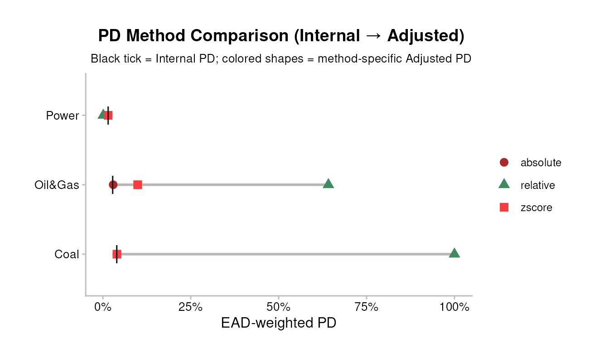
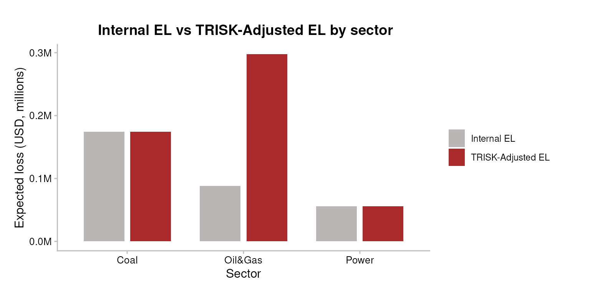

# 5. PD & EL integration

``` r

library(trisk.analysis)
library(magrittr)
```

## PD and EL Integration

### Overview

TRISK recomputes probability of default (PD) from a Merton structural
credit model under a climate-transition shock. That model PD is **not**
directly comparable to the internal PD your institution already carries:
levels differ by calibration, rating philosophy, and point-in-time vs
through-the-cycle treatment. Only the *baseline-to-shock change* carries
portable meaning.

[`integrate_pd()`](../reference/integrate_pd.md) and
[`integrate_el()`](../reference/integrate_el.md) translate that TRISK
shift onto your own internal scale, using one of three methods
(`zscore`, the default; `absolute`; `relative`). This vignette covers
the maths, a worked numeric example, the input schema, the seven
pipeline plots/tables, and the limitations a credit-risk analyst should
keep in mind.

Audience: an analyst who already knows PD / EL / IFRS-9 but is new to
TRISK.

### Inputs

#### Portfolio file schema

Integration needs the bank’s own PD per exposure, so it runs on the
augmented portfolio file `portfolio_ids_internal_pd_testdata.csv` — the
classic `portfolio_ids_testdata.csv` plus a mandatory `internal_pd`
column.

| Column | Type | Meaning |
|----|----|----|
| `company_id` | int | Counterparty key; joins TRISK output to internal PD. |
| `company_name` | chr | Display label (may be `NA`). |
| `sector` | chr | TRISK sector (e.g. `Oil&Gas`, `Coal`, `Power`). |
| `technology` | chr | Production technology within the sector. |
| `country_iso2` | chr | ISO-2 country code of the asset. |
| `exposure_value_usd` | dbl | Exposure / outstanding, USD. Used as the EAD basis. |
| `term` | int | Loan term in years. |
| `loss_given_default` | dbl | LGD as a fraction in `[0, 1]`. |
| `internal_pd` | dbl | Bank’s own PD per exposure, in `[0, 1]`. **Mandatory.** |

`internal_pd` is mandatory because integration is meaningless without a
bank number to integrate the TRISK shift into — the setup below fails
loudly if it is missing or out of range. Internal EL is **derived**, not
stored: `internal_el = EAD * LGD * internal_pd` (see the EL section).

``` r

assets_testdata    <- read.csv(system.file("testdata", "assets_testdata.csv",    package = "trisk.model"))
scenarios_testdata <- read.csv(system.file("testdata", "scenarios_testdata.csv", package = "trisk.model"))
fin_testdata       <- read.csv(system.file("testdata", "financial_features_testdata.csv", package = "trisk.model"))
carbon_testdata    <- read.csv(system.file("testdata", "ngfs_carbon_price_testdata.csv", package = "trisk.model"))
portfolio_ids_internal_pd <- read.csv(system.file("testdata", "portfolio_ids_internal_pd_testdata.csv",
                                                  package = "trisk.analysis"))

stopifnot(
  "Portfolio file must include an `internal_pd` column per exposure." =
    "internal_pd" %in% colnames(portfolio_ids_internal_pd),
  "`internal_pd` values must be numeric in [0, 1]." =
    is.numeric(portfolio_ids_internal_pd$internal_pd) &&
      all(portfolio_ids_internal_pd$internal_pd >= 0 &
          portfolio_ids_internal_pd$internal_pd <= 1, na.rm = TRUE)
)
```

#### The three integration methods

Let `p_int` be the internal PD, `p_base` the TRISK baseline PD, and
`p_shock` the TRISK shock PD for a given exposure. Each method returns
an *adjusted PD* `p_adj`, then
[`integrate_pd()`](../reference/integrate_pd.md) clips it to `[0, 1]`.

**Absolute** — add the raw PD shift onto the internal PD:

``` math
 p_{adj} = p_{int} + (p_{shock} - p_{base}) 
```

**Relative** — scale the internal PD by the proportional shift:

``` math
 p_{adj} = p_{int}\left(1 + \frac{p_{shock} - p_{base}}{p_{base}}\right),
   \qquad (p_{base} \neq 0) 
```

When `p_base = 0` the relative method returns `p_int` unchanged — the
shock signal is lost on zero-baseline rows. Prefer `absolute` or
`zscore` there.

**Z-score (default)** — recombine the three PDs in normal-quantile
(probit) space. With $`\Phi`$ the standard-normal CDF and $`\Phi^{-1}`$
its quantile function, and clipping each PD to
`[zscore_floor, zscore_cap]` before the quantile:

``` math
 p_{adj} = \Phi\!\Big(\Phi^{-1}(p_{int}) + \Phi^{-1}(p_{shock})
   - \Phi^{-1}(p_{base})\Big) 
```

This is a **probit / Merton-style recombination of default thresholds**,
not the Basel IRB risk-weight formula. It adds the TRISK
shock-minus-baseline *distance-to-default* shift to the internal PD’s
implied default threshold, then maps back to a probability. It is the
right default because it is zero-safe (via clipping), it preserves the
non-linear compression of PDs near the distribution tails, and it
behaves sensibly on sparse portfolios where Merton inputs drive some
baseline PDs to underflow. It does **not** invoke the Basel
asset-correlation / Vasicek conditional-PD capital formula — there is no
correlation parameter and no supervisory confidence level here.

The `zscore_floor` (default `1e-4`) and `zscore_cap` (default
`1 - 1e-4`) parameters bound the PDs before
[`qnorm()`](https://rdrr.io/r/stats/Normal.html), since
`qnorm(0) = -Inf` and `qnorm(1) = +Inf` would otherwise propagate
infinities. Widen the floor toward zero only if your internal PDs are
reliably calibrated that low; tighten it to de-sensitise the tails.

#### Worked example: one row through z-score

Take a single Oil&Gas exposure with `internal_pd = 0.025`, and suppose
TRISK returns `pd_baseline = 0.020` and `pd_shock = 0.060` for it. None
of the three values hit the clip bounds, so:

``` r

z_int  <- qnorm(0.025)   # internal
z_base <- qnorm(0.020)   # TRISK baseline
z_shk  <- qnorm(0.060)   # TRISK shock
p_adj  <- pnorm(z_int + z_shk - z_base)
round(c(z_internal = z_int, z_baseline = z_base, z_shock = z_shk,
        adjusted_pd = p_adj, adjustment_pp = (p_adj - 0.025) * 100), 4)
#>    z_internal    z_baseline       z_shock   adjusted_pd adjustment_pp 
#>       -1.9600       -2.0537       -1.5548        0.0720        4.7009
```

The probit shift `z_shk - z_base` is positive (the shock raises model
PD), so the recombined internal PD rises above 0.025 — a worsening,
which the plots below render red.

### Minimal example

#### Run TRISK on the portfolio

The `internal_pd` column rides along on the standard portfolio schema;
we keep it as a separate lookup table to feed into
[`integrate_pd()`](../reference/integrate_pd.md).

``` r

analysis_data <- run_trisk_on_portfolio(
  assets_data       = assets_testdata,
  scenarios_data    = scenarios_testdata,
  financial_data    = fin_testdata,
  carbon_data       = carbon_testdata,
  portfolio_data    = portfolio_ids_internal_pd,
  baseline_scenario = "NGFS2023GCAM_CP",
  target_scenario   = "NGFS2023GCAM_NZ2050",
  scenario_geography = "Global"
)
#> -- Start Trisk-- Retyping Dataframes. 
#> -- Processing Assets and Scenarios. 
#> -- Transforming to Trisk model input. 
#> -- Calculating baseline, target, and shock trajectories. 
#> -- Applying zero-trajectory logic to production trajectories. 
#> -- Calculating net profits.
#> Joining with `by = join_by(asset_id, company_id, sector, technology)`
#> -- Calculating market risk. 
#> -- Calculating credit risk.

# The internal_pd lookup used throughout the rest of the vignette. TRISK returns
# company_id as character, so coerce the lookup key to match and keep the join
# on like types (read.csv reads it as integer).
internal_pd_lookup <- portfolio_ids_internal_pd[, c("company_id", "internal_pd")]
internal_pd_lookup$company_id <- as.character(internal_pd_lookup$company_id)
```

| company_id | sector | technology | term | pd_baseline | pd_shock | net_present_value_baseline | net_present_value_shock |
|:---|:---|:---|---:|---:|---:|---:|---:|
| 101 | Oil&Gas | Gas | 3 | 1.10e-06 | 0.0004647 | 51951.82 | 13549.28 |
| 102 | Coal | Coal | 1 | 0.00e+00 | 0.0000000 | 13648160.57 | 4317747.56 |
| 103 | Oil&Gas | Gas | 5 | 8.09e-05 | 0.0012524 | 27724344.25 | 12420187.12 |
| 104 | Power | RenewablesCap | 4 | 3.20e-06 | 0.0000003 | 141635910\.26 | 202554984\.40 |

#### Integrate PD — three methods

``` r

result_abs <- integrate_pd(analysis_data,
                           internal_pd = internal_pd_lookup,
                           method      = "absolute")
result_rel <- integrate_pd(analysis_data,
                           internal_pd = internal_pd_lookup,
                           method      = "relative")
# zscore is the default; explicit here for clarity.
result_zs  <- integrate_pd(analysis_data,
                           internal_pd = internal_pd_lookup,
                           method      = "zscore")
```

| company_id | sector | internal_pd | pd_baseline | pd_shock | trisk_adjusted_pd | pd_adjustment |
|:---|:---|---:|---:|---:|---:|---:|
| 101 | Oil&Gas | 0.025 | 1.10e-06 | 0.0004647 | 0.0603323 | 0.0353323 |
| 102 | Coal | 0.040 | 0.00e+00 | 0.0000000 | 0.0400000 | 0.0000000 |
| 103 | Oil&Gas | 0.030 | 8.09e-05 | 0.0012524 | 0.1181008 | 0.0881008 |
| 104 | Power | 0.015 | 3.20e-06 | 0.0000003 | 0.0150000 | 0.0000000 |

You can also override internal PDs on the fly — pass a numeric vector of
length `nrow(analysis_data)` (or an alternate lookup) for a sanity-check
stress:

``` r

flat_internal <- rep(0.03, nrow(analysis_data))
result_custom <- integrate_pd(analysis_data,
                              internal_pd = flat_internal,
                              method      = "zscore")
```

#### Integrate EL

[`integrate_el()`](../reference/integrate_el.md) needs
`expected_loss_baseline` / `expected_loss_shock`, which
[`run_trisk_on_portfolio()`](../reference/run_trisk_on_portfolio.md)
does not emit on its own — call
[`compute_analysis_metrics()`](../reference/compute_analysis_metrics.md)
first to derive them as `EAD * PD`. For the bank’s internal EL we use
the same identity: `internal_el = EAD * LGD * internal_pd`.

``` r

analysis_data_el <- compute_analysis_metrics(analysis_data)
internal_el_lookup <- merge(
  analysis_data_el[, c("company_id", "exposure_value_usd", "loss_given_default")],
  internal_pd_lookup,
  by = "company_id"
)
# Positive magnitude, matching the package-wide EL convention.
internal_el_lookup$internal_el <-
  internal_el_lookup$exposure_value_usd *
  internal_el_lookup$loss_given_default *
  internal_el_lookup$internal_pd

result_el <- integrate_el(
  analysis_data_el,
  internal_el = internal_el_lookup[, c("company_id", "internal_el")]
)
# default method is "zscore": effective-PD probit recombination, zero-safe.
```

### Interpretation

#### EL sign convention, LGD, EAD, horizon

- **EL sign convention.** All `expected_loss_*` columns and all three
  [`integrate_el()`](../reference/integrate_el.md) methods store EL as a
  **positive magnitude**. Direction lives in the *adjustment*, not the
  level: a **positive** EL adjustment means **more** expected loss =
  worse = rendered **red**; a **negative** adjustment means less loss =
  better = **green**. The PD adjustment follows the same rule (positive
  = PD rose = red).
- **EAD.** The `exposure_at_default` column is **not** raw exposure.
  [`compute_analysis_metrics()`](../reference/compute_analysis_metrics.md)
  defines it as `exposure_value_usd * loss_given_default` — i.e. LGD is
  already folded in. Every `expected_loss_*` column is then
  `exposure_at_default * pd`. The EL zscore method uses this
  `exposure_at_default` column as its denominator when present,
  otherwise reconstructs it as
  `exposure_value_usd * loss_given_default`.
- **LGD.** `loss_given_default` is the fraction lost on default, in
  `[0, 1]`. Because it is already baked into `exposure_at_default`,
  expected loss is `EL = exposure_at_default * PD` (equivalently
  `exposure_value_usd * LGD * PD`). The EL zscore method back-transforms
  EL to an effective PD via `|EL| / exposure_at_default`, recombines in
  probit space, then re-scales — so LGD enters only through that
  denominator.
- **Horizon.** TRISK PDs here are **term-structured** to the loan `term`
  (multi-year), not a 12-month point-in-time PD. Treat the integrated
  PD/EL as a **lifetime / multi-year** quantity, closer in spirit to an
  IFRS-9 Stage 2/3 lifetime ECL input than to a 12-month regulatory PD.
  Do not feed it directly into a 12-month-PD slot without
  re-annualising.

#### The seven pipeline artefacts

The pipeline ships seven ready-made plots/tables. Each has a one-line
“when to use”.

**N1 — PD method comparison.** The three methods overlaid: a black tick
for the internal PD, a coloured shape per method for its adjusted PD.
Wide spread means the choice of method moves the number a lot. *When to
use: the methodology choice is on the table (committee review, regulator
pushback). Tight clustering means picking a method is a non-decision.*

``` r

pipeline_crispy_pd_method_comparison(analysis_data,
                                     internal_pd = internal_pd_lookup)
```



On sparse portfolios, `granularity = "firm"` and `scale = "pseudo_log"`
open up the per-firm picture when sector aggregation or Merton underflow
collapses everything against the axis:

``` r

pipeline_crispy_pd_method_comparison(
  analysis_data,
  internal_pd = internal_pd_lookup,
  granularity = "firm",
  scale       = "pseudo_log"
)
```


**N2 — PD waterfall.** Per-sector decomposition: Internal -\> signed
Adjustment -\> Adjusted. The middle bar flips fill on sign (red worsens,
green improves), so the “before, change, after” reads at a glance. *When
to use: non-quantitative audiences read waterfalls faster than grouped
bars; the message is “how much does integration move PD”.*

``` r

pipeline_crispy_pd_waterfall(result_zs)
```


**P1 — PD integration bars.** Four bars per group: Internal PD, TRISK
Baseline, TRISK Shock, TRISK-Adjusted PD. The gap between Internal and
Adjusted is the integration effect; Baseline and Shock show where the
model itself moved. *When to use: first plot to show a counterparty —
“what happens to my PDs if I integrate TRISK?” Supports
`granularity = "firm"` / `scale = "pseudo_log"`.*

``` r

pipeline_crispy_pd_integration_bars(result_zs)
```


``` r

pipeline_crispy_pd_integration_bars(
  result_zs,
  granularity = "firm",
  scale       = "pseudo_log"
)
```


**P2 — EL adjustment bars.** Horizontal bars of the signed EL delta
(Adjusted minus Internal) by sector. Red = integration says expect
**more** loss than your own model; green = less. Levels are not on this
plot — only the adjustment. *When to use: the question is sign and
magnitude of EL impact by sector — “where does TRISK think you’re
under-reserving?”*

``` r

pipeline_crispy_el_adjustment_bars(result_el)
```


**P3a — PD KPI table.** One-row portfolio summary: weighted internal PD,
weighted adjusted PD, the adjustment in pp, and direction. *When to use:
top of a report or first slide; portfolio-level headline only.*

``` r

pipeline_crispy_pd_kpi_table(result_zs$aggregate)
```

| Total Exposure (USD) | Weighted Internal PD | Weighted Adjusted PD | Weighted PD Adjustment (pp) | Adjustment % |
|---:|---:|---:|---:|---:|
| 21.06M | 2.592% | 4.461% | +1.868 pp | 72.077% |

**P3b — EL KPI table.** One-row EL summary including the **bps metric**
(`EL / EAD`). The bps figure is scale-free and travels best across
audiences. *When to use: same as P3a but for EL; the bps delta is the
single best headline number.*

``` r

pipeline_crispy_el_kpi_table(result_el$aggregate)
```

| Total Exposure (USD) | Total Internal EL | Total Adjusted EL | EL Adjustment | Adjusted EL (bps) |
|---:|---:|---:|---:|---:|
| 21.06M | 318.1K | 527.8K | 209.7K | 250.6 bps |

**P4 — EL sector breakdown.** One row per sector: exposure, internal EL,
adjusted EL, delta, direction arrow, and EL/EAD in bps. Sits between P2
(deltas only) and P3b (one number). *When to use: the reference table
for any EL discussion; the bps column makes sectors with different
exposure magnitudes comparable.*

``` r

pipeline_crispy_el_sector_breakdown_table(result_el$portfolio)
```

[TABLE]

**Reading order for a bank-facing report:** P3a + P3b (headline), then
N2 + P2 (the change story), then P1 + P4 (full reference levels), and N1
only if the method choice is being questioned.

#### Custom views

The pipeline plots cover the standard story; a couple of custom chunks
round it out. Expected loss by sector, baseline vs shock:

``` r

el_by_sector <- analysis_data_el %>%
  dplyr::group_by(sector) %>%
  dplyr::summarise(
    baseline = sum(.data$expected_loss_baseline, na.rm = TRUE),
    shock    = sum(.data$expected_loss_shock,    na.rm = TRUE),
    .groups  = "drop"
  ) %>%
  tidyr::pivot_longer(
    cols = c("baseline", "shock"), names_to = "scenario", values_to = "el"
  )

ggplot2::ggplot(el_by_sector,
                ggplot2::aes(x = sector, y = .data$el, fill = .data$scenario)) +
  ggplot2::geom_col(position = ggplot2::position_dodge(width = 0.8),
                    width = 0.7) +
  ggplot2::scale_y_continuous(labels = scales::label_number(scale = 1e-6, suffix = "M")) +
  ggplot2::scale_fill_manual(values = c(baseline = "#5D9324", shock = "#F53D3F")) +
  TRISK_PLOT_THEME_FUNC() +
  ggplot2::labs(x = "Sector", y = "Expected loss (USD, millions)",
                fill = "Scenario",
                title = "Expected loss by sector: baseline vs shock")
```


Internal EL vs TRISK-Adjusted EL, per sector (both are positive
magnitudes):

``` r

el_compare_sector <- result_el$portfolio %>%
  dplyr::group_by(sector) %>%
  dplyr::summarise(
    `Internal EL`        = sum(.data$internal_el, na.rm = TRUE),
    `TRISK-Adjusted EL`  = sum(.data$trisk_adjusted_el, na.rm = TRUE),
    .groups              = "drop"
  ) %>%
  tidyr::pivot_longer(
    cols = c("Internal EL", "TRISK-Adjusted EL"),
    names_to = "el_type", values_to = "el"
  )

ggplot2::ggplot(el_compare_sector,
                ggplot2::aes(x = sector, y = .data$el, fill = .data$el_type)) +
  ggplot2::geom_col(position = ggplot2::position_dodge(width = 0.8),
                    width = 0.7) +
  ggplot2::scale_y_continuous(labels = scales::label_number(scale = 1e-6, suffix = "M")) +
  ggplot2::scale_fill_manual(values = c(`Internal EL` = "#BAB6B5",
                                        `TRISK-Adjusted EL` = "#AA2A2B")) +
  TRISK_PLOT_THEME_FUNC() +
  ggplot2::labs(x = "Sector", y = "Expected loss (USD, millions)",
                fill = "",
                title = "Internal EL vs TRISK-Adjusted EL by sector")
```



### Caveats / Limitations

- **PD level is not portable; only the shift is.** TRISK’s Merton PD
  level is calibration-specific. The integration deliberately transports
  the baseline-to-shock *change*, not TRISK’s absolute PD.
- **Zero-baseline rows lose signal under `relative`.** When
  `pd_baseline = 0` the relative method returns the internal PD
  unchanged. Use `absolute` or `zscore` if that matters for your book.
- **Clipping biases the extreme tails.** `zscore_floor` / `zscore_cap`
  bound PDs before [`qnorm()`](https://rdrr.io/r/stats/Normal.html).
  Values that should sit below the floor (or above the cap) are pulled
  in, so the recombination is approximate at the extremes.
- **Z-score is probit recombination, not Basel IRB.** It does not apply
  the Basel asset-correlation / Vasicek conditional-PD capital formula.
  There is no correlation parameter and no supervisory confidence level.
  Do not present its output as a regulatory capital number.
- **Horizon mismatch.** Integrated PD/EL is term-structured
  (multi-year), closer to lifetime ECL than to a 12-month regulatory PD.
  Re-annualise before using it in a 12-month slot.
- **EL zscore EAD basis must match.** The effective-PD round-trip is
  only correct when the EL columns and the EAD denominator are on the
  same basis. If
  [`compute_analysis_metrics()`](../reference/compute_analysis_metrics.md)
  has scaled EAD by NPV share, supply the matching `exposure_at_default`
  column rather than relying on the
  `exposure_value_usd * loss_given_default` fallback.
- **`internal_pd` must be in `[0, 1]` and joinable by `company_id`.**
  Unmatched `company_id`s fall back to `pd_baseline` with a warning;
  check the warning before trusting the result.

### See also

- `getting-started` — first run of TRISK end to end.
- `inputs-and-outputs` — the input files and output schema in detail.
- `run-on-a-portfolio` — building and running a portfolio.
- `sensitivity-analysis` — varying scenarios and parameters.
