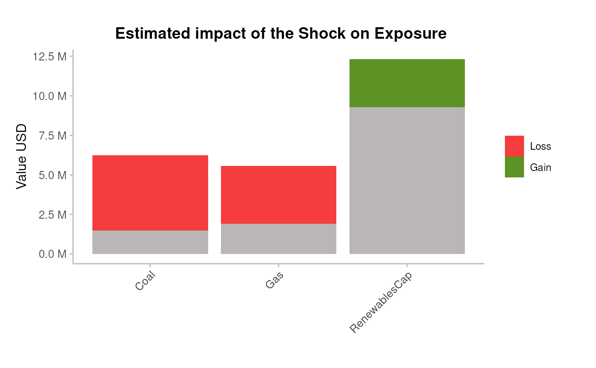

# portfolio-analysis

``` r
library(trisk.analysis)
library(magrittr)
```

## Restrict the analysis to a portfolio

### Generate outputs

#### Load the test data

Load the internal datasets

``` r
assets_testdata <- read.csv(system.file("testdata", "assets_testdata.csv", package = "trisk.model", mustWork = TRUE))
scenarios_testdata <- read.csv(system.file("testdata", "scenarios_testdata.csv", package = "trisk.model", mustWork = TRUE))
financial_features_testdata <- read.csv(system.file("testdata", "financial_features_testdata.csv", package = "trisk.model", mustWork = TRUE))
ngfs_carbon_price_testdata <- read.csv(system.file("testdata", "ngfs_carbon_price_testdata.csv", package = "trisk.model", mustWork = TRUE))
```

#### Prepare portfolio

There are 3 possible portfolio input structures :

``` r
portfolio_countries_testdata <- read.csv(system.file("testdata", "portfolio_countries_testdata.csv", package = "trisk.analysis"))
portfolio_ids_testdata <- read.csv(system.file("testdata", "portfolio_ids_testdata.csv", package = "trisk.analysis"))
portfolio_names_testdata <- read.csv(system.file("testdata", "portfolio_names_testdata.csv", package = "trisk.analysis"))
```

Leaving the company_id and company_name columns empty, Trisk results
will be aggregated per country and technology, and matched to the
portfolio based on those columns.

| company_id | company_name | sector  | technology    | country_iso2 | exposure_value_usd | term | loss_given_default |
|:-----------|:-------------|:--------|:--------------|:-------------|-------------------:|-----:|-------------------:|
| NA         | NA           | Oil&Gas | Gas           | DE           |            1839267 |    3 |                0.7 |
| NA         | NA           | Coal    | Coal          | DE           |            6227364 |    1 |                0.7 |
| NA         | NA           | Oil&Gas | Gas           | DE           |            3728364 |    5 |                0.5 |
| NA         | NA           | Power   | RenewablesCap | DE           |            9263702 |    4 |                0.4 |

Filling in the company_name column, will result in an attempt to fuzzy
string matching between company names.

| company_id | company_name | sector  | technology    | country_iso2 | exposure_value_usd | term | loss_given_default |
|:-----------|:-------------|:--------|:--------------|:-------------|-------------------:|-----:|-------------------:|
| NA         | Company 1    | Oil&Gas | Gas           | DE           |            1839267 |    3 |                0.7 |
| NA         | Comany 2     | Coal    | Coal          | DE           |            6227364 |    1 |                0.7 |
| NA         | Corony 3     | Oil&Gas | Gas           | DE           |            3728364 |    5 |                0.5 |
| NA         | Compan 4     | Power   | RenewablesCap | DE           |            9263702 |    4 |                0.4 |

Filling in the company_id column, will result in an exact match between
companies.

| company_id | company_name | sector  | technology    | country_iso2 | exposure_value_usd | term | loss_given_default |
|-----------:|:-------------|:--------|:--------------|:-------------|-------------------:|-----:|-------------------:|
|        101 | NA           | Oil&Gas | Gas           | DE           |            1839267 |    3 |                0.7 |
|        102 | NA           | Coal    | Coal          | DE           |            6227364 |    1 |                0.7 |
|        103 | NA           | Oil&Gas | Gas           | DE           |            3728364 |    5 |                0.5 |
|        104 | NA           | Power   | RenewablesCap | DE           |            9263702 |    4 |                0.4 |

Using the company ids is recommended to match the portfolio. In our
current asset data, a unique asset is defined by a unique combination of
company_id, sector, technology, and country. Those other columns are
used for the matching between the portfolio and the Trisk outputs.

``` r
portfolio_testdata <- portfolio_ids_testdata
```

#### Run trisk

Run the model with the provided data, after filtering assets on those
available in the portfolio.

Define the scenarios to use:

``` r
baseline_scenario <- "NGFS2023GCAM_CP"
target_scenario <- "NGFS2023GCAM_NZ2050"
scenario_geography <- "Global"
```

The function
[`run_trisk_on_portfolio()`](../reference/run_trisk_on_portfolio.md)
handles the filtering on portfolio and then runs Trisk:

``` r
analysis_data <- run_trisk_on_portfolio(
  assets_data = assets_testdata,
  scenarios_data = scenarios_testdata,
  financial_data = financial_features_testdata,
  carbon_data = ngfs_carbon_price_testdata,
  portfolio_data = portfolio_testdata,
  baseline_scenario = baseline_scenario,
  target_scenario = target_scenario,
  scenario_geography = scenario_geography
)
#> -- Start Trisk-- Retyping Dataframes. 
#> -- Processing Assets and Scenarios. 
#> -- Transforming to Trisk model input. 
#> -- Calculating baseline, target, and shock trajectories. 
#> -- Applying zero-trajectory logic to production trajectories. 
#> -- Calculating net profits.
#> Joining with `by = join_by(asset_id, company_id, sector, technology)`
#> -- Calculating market risk. 
#> -- Calculating credit risk.
```

Result dataframe :

| company_id | company_name | sector  | technology    | country_iso2 | exposure_value_usd | term | loss_given_default | run_id                               | asset_id | asset_name | net_present_value_baseline | net_present_value_shock | net_present_value_difference | net_present_value_change | pd_baseline |  pd_shock |
|:-----------|:-------------|:--------|:--------------|:-------------|-------------------:|-----:|-------------------:|:-------------------------------------|:---------|:-----------|---------------------------:|------------------------:|-----------------------------:|-------------------------:|------------:|----------:|
| 101        | NA           | Oil&Gas | Gas           | DE           |            1839267 |    3 |                0.7 | 7f2454fb-979c-4765-b873-efd7ae300366 | 101      | Company 1  |                   172718.3 |            1.354928e+04 |                      -159169 |               -0.9215527 |    1.10e-06 | 0.0350054 |
| 102        | NA           | Coal    | Coal          | DE           |            6227364 |    1 |                0.7 | 7f2454fb-979c-4765-b873-efd7ae300366 | 102      | Company 2  |                 42299475.0 |            4.317748e+06 |                    -37981727 |               -0.8979243 |    0.00e+00 | 0.0001410 |
| 103        | NA           | Oil&Gas | Gas           | DE           |            3728364 |    5 |                0.5 | 7f2454fb-979c-4765-b873-efd7ae300366 | 103      | Company 3  |                 95105145.4 |            2.486475e+07 |                    -70240391 |               -0.7385551 |    8.09e-05 | 0.0133286 |
| 104        | NA           | Power   | RenewablesCap | DE           |            9263702 |    4 |                0.4 | 7f2454fb-979c-4765-b873-efd7ae300366 | 104      | Company 4  |               1016926683.7 |            1.366640e+09 |                    349713309 |                0.3438924 |    3.20e-06 | 0.0000002 |

### Plot results

#### Equities risk

Plot the average percentage of NPV change per technology

``` r
pipeline_crispy_npv_change_plot(analysis_data)
#> Joining with `by = join_by(sector, technology)`
```


Plot the resulting portfolio’s exposure change

``` r
pipeline_crispy_exposure_change_plot(analysis_data)
#> Joining with `by = join_by(sector, technology)`
```

 \###
Bonds&Loans risk

Plot the average PDs at baseline and shock

``` r
pipeline_crispy_pd_term_plot(analysis_data)
#> Joining with `by = join_by(sector, term)`
```


Plot the resulting portfolio’s expected loss

``` r
pipeline_crispy_expected_loss_plot(analysis_data)
#> Joining with `by = join_by(sector)`
```


