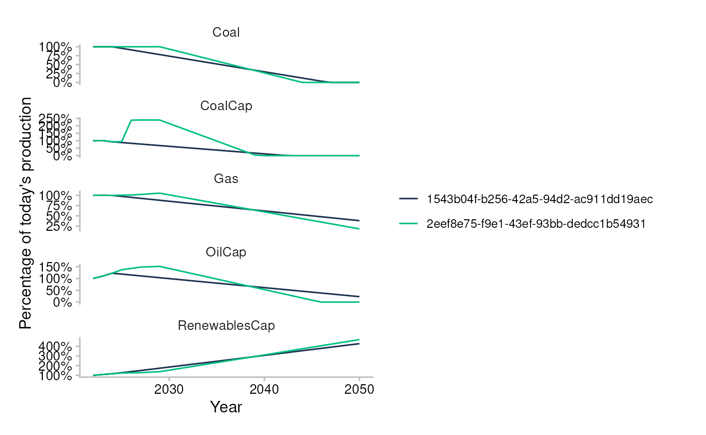

# sensitivity-analysis

``` r
library(trisk.analysis)
library(magrittr)
```

``` r
assets_testdata <- read.csv(system.file("testdata", "assets_testdata.csv", package = "trisk.model"))
scenarios_testdata <- read.csv(system.file("testdata", "scenarios_testdata.csv", package = "trisk.model"))
financial_features_testdata <- read.csv(system.file("testdata", "financial_features_testdata.csv", package = "trisk.model"))
ngfs_carbon_price_testdata <- read.csv(system.file("testdata", "ngfs_carbon_price_testdata.csv", package = "trisk.model"))
```

## Sensitivity Analysis

### Vary parameters over entire dataset

Sensitivity analysis allows us to explore how changes in parameters
affect the results. In this example, we show how to vary the shock year
in multiple TRISK runs when defining run parameters for sensitivity
analysis.

``` r
run_params <- list(
  list(
    scenario_geography = "Global",
    baseline_scenario = "NGFS2023GCAM_CP",
    target_scenario = "NGFS2023GCAM_NZ2050",
    shock_year = 2030 # SHOCK YEAR 1
  ),
  list(
    scenario_geography = "Global",
    baseline_scenario = "NGFS2023GCAM_CP",
    target_scenario = "NGFS2023GCAM_NZ2050",
    shock_year = 2025 # SHOCK YEAR 2
  )
)
```

The function [`run_trisk_sa()`](../reference/run_trisk_sa.md) is used to
run a sensitivity analysis with Trisk:

``` r
sensitivity_analysis_results <- run_trisk_sa(
  assets_data = assets_testdata,
  scenarios_data = scenarios_testdata,
  financial_data = financial_features_testdata,
  carbon_data = ngfs_carbon_price_testdata,
  run_params = run_params
)
#> [1] "Starting the execution of 2 total runs"
#> -- Retyping Dataframes. 
#> -- Processing Assets and Scenarios. 
#> -- Transforming to Trisk model input. 
#> -- Calculating baseline, target, and shock trajectories. 
#> -- Applying zero-trajectory logic to production trajectories. 
#> -- Calculating net profits.
#> Joining with `by = join_by(asset_id, company_id, sector, technology)`
#> -- Calculating market risk. 
#> -- Calculating credit risk. 
#> [1] "Done 1 / 2 total runs"
#> -- Retyping Dataframes. 
#> -- Processing Assets and Scenarios. 
#> -- Transforming to Trisk model input. 
#> -- Calculating baseline, target, and shock trajectories. 
#> -- Applying zero-trajectory logic to production trajectories. 
#> -- Calculating net profits.
#> Joining with `by = join_by(asset_id, company_id, sector, technology)`
#> -- Calculating market risk. 
#> -- Calculating credit risk. 
#> [1] "Done 2 / 2 total runs"
#> [1] "All runs completed."
```

Contrary to a simple run of trisk with the “run_trisk_model” function,
here it is possible to navigate through multiple Trisk runs in the same
dataframe, using the run_id column as an index.

Consolidated NPV results

| run_id                               | company_id | asset_id | company_name | asset_name | sector  | technology    | country_iso2 | net_present_value_baseline | net_present_value_shock | net_present_value_difference | net_present_value_change |
|:-------------------------------------|:-----------|:---------|:-------------|:-----------|:--------|:--------------|:-------------|---------------------------:|------------------------:|-----------------------------:|-------------------------:|
| d5bc16aa-594b-4139-bff9-527d86126963 | 101        | 101      | Company 1    | Company 1  | Oil&Gas | Gas           | DE           |                   172718.3 |            1.354928e+04 |                      -159169 |               -0.9215527 |
| d5bc16aa-594b-4139-bff9-527d86126963 | 102        | 102      | Company 2    | Company 2  | Coal    | Coal          | DE           |                 42299475.0 |            4.317748e+06 |                    -37981727 |               -0.8979243 |
| d5bc16aa-594b-4139-bff9-527d86126963 | 103        | 103      | Company 3    | Company 3  | Oil&Gas | Gas           | DE           |                 95105145.4 |            2.486475e+07 |                    -70240391 |               -0.7385551 |
| d5bc16aa-594b-4139-bff9-527d86126963 | 104        | 104      | Company 4    | Company 4  | Power   | RenewablesCap | DE           |               1016926683.7 |            1.366640e+09 |                    349713309 |                0.3438924 |
| d5bc16aa-594b-4139-bff9-527d86126963 | 105        | 105      | Company 5    | Company 5  | Power   | CoalCap       | DE           |               176175702\.5 |            1.187415e+07 |                   -164301556 |               -0.9326005 |
| d5bc16aa-594b-4139-bff9-527d86126963 | 105        | 105      | Company 5    | Company 5  | Power   | OilCap        | DE           |                 21412749.3 |            1.416673e+06 |                    -19996076 |               -0.9338397 |

Consolidated PD results

| run_id                               | company_id | company_name | sector  | term | pd_baseline |  pd_shock |
|:-------------------------------------|:-----------|:-------------|:--------|-----:|------------:|----------:|
| d5bc16aa-594b-4139-bff9-527d86126963 | 101        | Company 1    | Oil&Gas |    1 |   0.0000000 | 0.0005908 |
| d5bc16aa-594b-4139-bff9-527d86126963 | 101        | Company 1    | Oil&Gas |    2 |   0.0000000 | 0.0120293 |
| d5bc16aa-594b-4139-bff9-527d86126963 | 101        | Company 1    | Oil&Gas |    3 |   0.0000011 | 0.0350054 |
| d5bc16aa-594b-4139-bff9-527d86126963 | 101        | Company 1    | Oil&Gas |    4 |   0.0000237 | 0.0614358 |
| d5bc16aa-594b-4139-bff9-527d86126963 | 101        | Company 1    | Oil&Gas |    5 |   0.0001502 | 0.0874772 |
| d5bc16aa-594b-4139-bff9-527d86126963 | 102        | Company 2    | Coal    |    1 |   0.0000000 | 0.0001410 |

Consolidated company trajectories

| run_id                               | asset_id | asset_name | company_id | company_name | country_iso2 | sector  | technology | year | production_plan_company_technology | production_baseline_scenario | production_target_scenario | production_shock_scenario |        pd | net_profit_margin | debt_equity_ratio | volatility | scenario_price_baseline | price_shock_scenario | net_profits_baseline_scenario | net_profits_shock_scenario | discounted_net_profits_baseline_scenario | discounted_net_profits_shock_scenario |
|:-------------------------------------|:---------|:-----------|:-----------|:-------------|:-------------|:--------|:-----------|-----:|-----------------------------------:|-----------------------------:|---------------------------:|--------------------------:|----------:|------------------:|------------------:|-----------:|------------------------:|---------------------:|------------------------------:|---------------------------:|-----------------------------------------:|--------------------------------------:|
| d5bc16aa-594b-4139-bff9-527d86126963 | 101      | Company 1  | 101        | Company 1    | DE           | Oil&Gas | Gas        | 2022 |                               5000 |                         5000 |                   5000.000 |                      5000 | 0.0056224 |         0.0763542 |         0.1297317 |   0.259323 |                5.867116 |             5.867116 |                      2239.895 |                   2239.895 |                                 2239.895 |                              2239.895 |
| d5bc16aa-594b-4139-bff9-527d86126963 | 101      | Company 1  | 101        | Company 1    | DE           | Oil&Gas | Gas        | 2023 |                               5423 |                         5423 |                   5001.354 |                      5423 | 0.0056224 |         0.0763542 |         0.1297317 |   0.259323 |                5.898569 |             5.898569 |                      2442.414 |                   2442.414 |                                 2282.630 |                              2282.630 |
| d5bc16aa-594b-4139-bff9-527d86126963 | 101      | Company 1  | 101        | Company 1    | DE           | Oil&Gas | Gas        | 2024 |                               6200 |                         6200 |                   5002.708 |                      6200 | 0.0056224 |         0.0763542 |         0.1297317 |   0.259323 |                5.930022 |             5.930022 |                      2807.250 |                   2807.250 |                                 2451.961 |                              2451.961 |
| d5bc16aa-594b-4139-bff9-527d86126963 | 101      | Company 1  | 101        | Company 1    | DE           | Oil&Gas | Gas        | 2025 |                               7400 |                         7400 |                   5004.062 |                      7400 | 0.0056224 |         0.0763542 |         0.1297317 |   0.259323 |                5.961475 |             5.961475 |                      3368.360 |                   3368.360 |                                 2749.585 |                              2749.585 |
| d5bc16aa-594b-4139-bff9-527d86126963 | 101      | Company 1  | 101        | Company 1    | DE           | Oil&Gas | Gas        | 2026 |                               7800 |                         7800 |                   4862.620 |                      7800 | 0.0056224 |         0.0763542 |         0.1297317 |   0.259323 |                5.945170 |             5.945170 |                      3540.723 |                   3540.723 |                                 2701.201 |                              2701.201 |
| d5bc16aa-594b-4139-bff9-527d86126963 | 101      | Company 1  | 101        | Company 1    | DE           | Oil&Gas | Gas        | 2027 |                               8600 |                         8600 |                   4721.178 |                      8600 | 0.0056224 |         0.0763542 |         0.1297317 |   0.259323 |                5.928866 |             5.928866 |                      3893.168 |                   3893.168 |                                 2775.775 |                              2775.775 |

Consolidated params dataframe

| baseline_scenario | target_scenario     | scenario_geography | carbon_price_model | risk_free_rate | discount_rate | growth_rate | div_netprofit_prop_coef | shock_year | market_passthrough | run_id                               |
|:------------------|:--------------------|:-------------------|:-------------------|---------------:|--------------:|------------:|------------------------:|-----------:|-------------------:|:-------------------------------------|
| NGFS2023GCAM_CP   | NGFS2023GCAM_NZ2050 | Global             | no_carbon_tax      |           0.02 |          0.07 |        0.03 |                       1 |       2030 |                  0 | d5bc16aa-594b-4139-bff9-527d86126963 |
| NGFS2023GCAM_CP   | NGFS2023GCAM_NZ2050 | Global             | no_carbon_tax      |           0.02 |          0.07 |        0.03 |                       1 |       2025 |                  0 | 614b04b6-93e2-49e4-bb37-5a9dbefb0c69 |

#### Plot results

Plot the sum of production trajectories, scaled in percentage of the
first year value. The run_id identifies each run and can be found in the
parameters dataframe.

``` r
plot_multi_trajectories(sensitivity_analysis_results$trajectories)
#> Ignoring unknown labels:
#> • linetype : "Scenario"
```



### Vary parameters over a single or a group of countries

You can also perform sensitivity analysis on a filtered subset of
assets. This example filters the dataset by country, and then runs the
analysis.

``` r
# Run sensitivity analysis across multiple TRISK runs
sensitivity_analysis_results <- run_trisk_sa(
  assets_data = assets_testdata,
  scenarios_data = scenarios_testdata,
  financial_data = financial_features_testdata,
  carbon_data = ngfs_carbon_price_testdata,
  run_params = run_params,
  country_iso2 = c("DE") # FILTER ASSETS ON COUNTRIES
)
#> [1] "Starting the execution of 2 total runs"
#> -- Retyping Dataframes. 
#> -- Processing Assets and Scenarios. 
#> -- Transforming to Trisk model input. 
#> -- Calculating baseline, target, and shock trajectories. 
#> -- Applying zero-trajectory logic to production trajectories. 
#> -- Calculating net profits.
#> Joining with `by = join_by(asset_id, company_id, sector, technology)`
#> -- Calculating market risk. 
#> -- Calculating credit risk. 
#> [1] "Done 1 / 2 total runs"
#> -- Retyping Dataframes. 
#> -- Processing Assets and Scenarios. 
#> -- Transforming to Trisk model input. 
#> -- Calculating baseline, target, and shock trajectories. 
#> -- Applying zero-trajectory logic to production trajectories. 
#> -- Calculating net profits.
#> Joining with `by = join_by(asset_id, company_id, sector, technology)`
#> -- Calculating market risk. 
#> -- Calculating credit risk. 
#> [1] "Done 2 / 2 total runs"
#> [1] "All runs completed."
```
