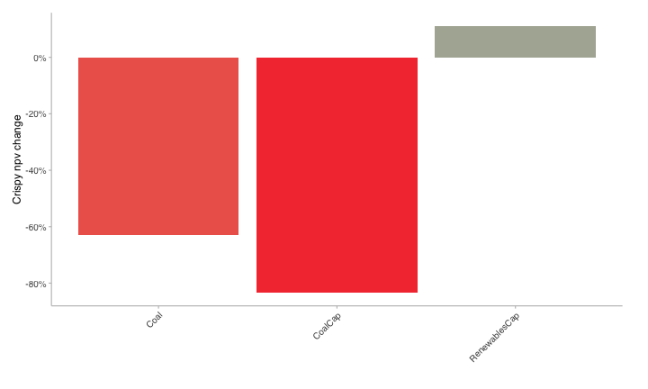
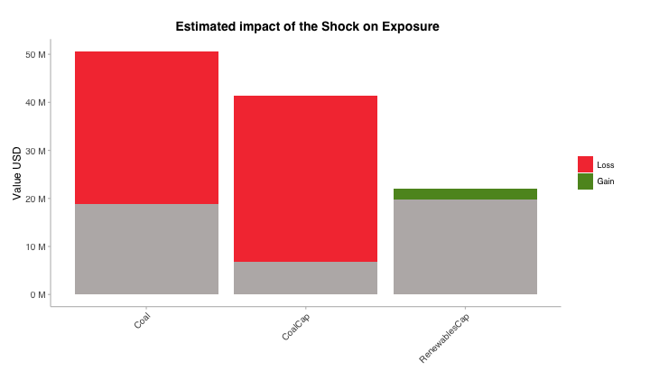
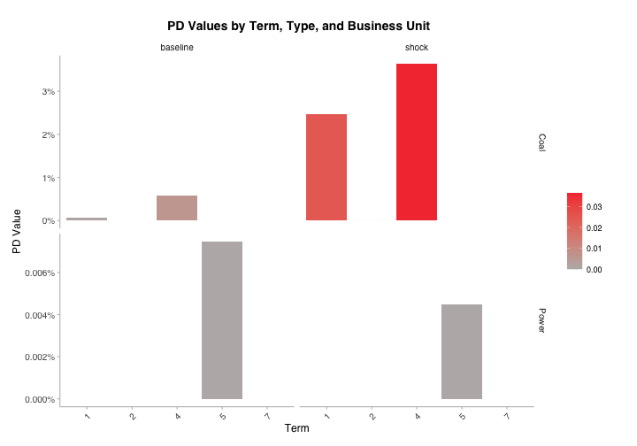
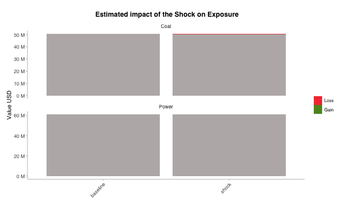

``` r
suppressPackageStartupMessages({
  suppressWarnings(library(trisk.analysis))
  suppressWarnings(library(magrittr))
})
```

# Restrict the analysis to a portfolio

## Generate outputs
### Load the test data

Load the packaged Khanbank asset and financial inputs together with the local Asia scenario and carbon reference files.


``` r
project_dir_candidates <- c(getwd(), normalizePath(file.path(getwd(), ".."), mustWork = FALSE))
project_dir <- project_dir_candidates[file.exists(file.path(project_dir_candidates, "DESCRIPTION"))][1]

repo_or_pkg_file <- function(filename) {
  repo_path <- file.path(project_dir, "inst", "testdata", filename)
  if (file.exists(repo_path)) {
    return(repo_path)
  }

  pkg_path <- system.file("testdata", filename, package = "trisk.analysis", mustWork = FALSE)
  if (nzchar(pkg_path) && file.exists(pkg_path)) {
    return(pkg_path)
  }

  stop("Could not locate input file: ", filename)
}

assets_testdata <- read.csv(repo_or_pkg_file("assets_data_khanbank_ifc.csv"))
assets_testdata$company_name <- as.character(assets_testdata$company_name)
assets_testdata$asset_name <- as.character(assets_testdata$asset_name)

scenarios_testdata <- read.csv(repo_or_pkg_file("scenarios_mongolia_client.csv"))
financial_features_testdata <- read.csv(repo_or_pkg_file("financial_features_khanbank_ifc.csv"))[
  c("company_id", "pd", "net_profit_margin", "debt_equity_ratio", "volatility")
]
ngfs_carbon_price_testdata <- read.csv(repo_or_pkg_file("ngfs_carbon_price_mongolia_client.csv"))

output_dir <- file.path(project_dir, "client_outputs", "khanbank-portfolio-analysis")
dir.create(output_dir, recursive = TRUE, showWarnings = FALSE)
```


### Prepare portfolio

The Khanbank debug bundle includes two exact-match portfolio input structures:


``` r
portfolio_detailed_testdata <- read.csv(repo_or_pkg_file("portfolio_khanbank_ifc.csv"))
portfolio_detailed_testdata$company_name <- as.character(portfolio_detailed_testdata$company_name)

portfolio_simple_testdata <- read.csv(repo_or_pkg_file("simple_portfolio_khanbank_ifc.csv"))
portfolio_simple_testdata$company_name <- as.character(portfolio_simple_testdata$company_name)
```

The detailed portfolio keeps the exact `company_id`, `sector`, `technology`, and `country_iso2` fields alongside exposure information.

<div style="border: 1px solid #ddd; padding: 0px; overflow-y: scroll; height:400px; overflow-x: scroll; width:200%; "><table class="table table-striped table-hover table-condensed" style="margin-left: auto; margin-right: auto;">
 <thead>
  <tr>
   <th style="text-align:right;position: sticky; top:0; background-color: #FFFFFF;"> company_id </th>
   <th style="text-align:left;position: sticky; top:0; background-color: #FFFFFF;"> company_name </th>
   <th style="text-align:left;position: sticky; top:0; background-color: #FFFFFF;"> sector </th>
   <th style="text-align:left;position: sticky; top:0; background-color: #FFFFFF;"> technology </th>
   <th style="text-align:left;position: sticky; top:0; background-color: #FFFFFF;"> country_iso2 </th>
   <th style="text-align:right;position: sticky; top:0; background-color: #FFFFFF;"> exposure_value_usd </th>
   <th style="text-align:right;position: sticky; top:0; background-color: #FFFFFF;"> term </th>
   <th style="text-align:right;position: sticky; top:0; background-color: #FFFFFF;"> loss_given_default </th>
  </tr>
 </thead>
<tbody>
  <tr>
   <td style="text-align:right;"> 101 </td>
   <td style="text-align:left;"> 101 </td>
   <td style="text-align:left;"> Power </td>
   <td style="text-align:left;"> CoalCap </td>
   <td style="text-align:left;"> MN </td>
   <td style="text-align:right;"> 40768586.0 </td>
   <td style="text-align:right;"> 7 </td>
   <td style="text-align:right;"> 0.4 </td>
  </tr>
  <tr>
   <td style="text-align:right;"> 102 </td>
   <td style="text-align:left;"> 102 </td>
   <td style="text-align:left;"> Power </td>
   <td style="text-align:left;"> RenewablesCap </td>
   <td style="text-align:left;"> MN </td>
   <td style="text-align:right;"> 15705614.0 </td>
   <td style="text-align:right;"> 5 </td>
   <td style="text-align:right;"> 0.4 </td>
  </tr>
  <tr>
   <td style="text-align:right;"> 103 </td>
   <td style="text-align:left;"> 103 </td>
   <td style="text-align:left;"> Coal </td>
   <td style="text-align:left;"> Coal </td>
   <td style="text-align:left;"> MN </td>
   <td style="text-align:right;"> 9840693.0 </td>
   <td style="text-align:right;"> 2 </td>
   <td style="text-align:right;"> 0.4 </td>
  </tr>
  <tr>
   <td style="text-align:right;"> 104 </td>
   <td style="text-align:left;"> 104 </td>
   <td style="text-align:left;"> Power </td>
   <td style="text-align:left;"> RenewablesCap </td>
   <td style="text-align:left;"> MN </td>
   <td style="text-align:right;"> 4136880.0 </td>
   <td style="text-align:right;"> 2 </td>
   <td style="text-align:right;"> 0.4 </td>
  </tr>
  <tr>
   <td style="text-align:right;"> 105 </td>
   <td style="text-align:left;"> 105 </td>
   <td style="text-align:left;"> Coal </td>
   <td style="text-align:left;"> Coal </td>
   <td style="text-align:left;"> MN </td>
   <td style="text-align:right;"> 1164536.9 </td>
   <td style="text-align:right;"> 1 </td>
   <td style="text-align:right;"> 0.4 </td>
  </tr>
  <tr>
   <td style="text-align:right;"> 106 </td>
   <td style="text-align:left;"> 106 </td>
   <td style="text-align:left;"> Power </td>
   <td style="text-align:left;"> CoalCap </td>
   <td style="text-align:left;"> MN </td>
   <td style="text-align:right;"> 562325.3 </td>
   <td style="text-align:right;"> 1 </td>
   <td style="text-align:right;"> 0.4 </td>
  </tr>
  <tr>
   <td style="text-align:right;"> 107 </td>
   <td style="text-align:left;"> 107 </td>
   <td style="text-align:left;"> Coal </td>
   <td style="text-align:left;"> Coal </td>
   <td style="text-align:left;"> MN </td>
   <td style="text-align:right;"> 316308.0 </td>
   <td style="text-align:right;"> 1 </td>
   <td style="text-align:right;"> 0.4 </td>
  </tr>
  <tr>
   <td style="text-align:right;"> 108 </td>
   <td style="text-align:left;"> 108 </td>
   <td style="text-align:left;"> Coal </td>
   <td style="text-align:left;"> Coal </td>
   <td style="text-align:left;"> MN </td>
   <td style="text-align:right;"> 294553.0 </td>
   <td style="text-align:right;"> 4 </td>
   <td style="text-align:right;"> 0.4 </td>
  </tr>
  <tr>
   <td style="text-align:right;"> 109 </td>
   <td style="text-align:left;"> 109 </td>
   <td style="text-align:left;"> Coal </td>
   <td style="text-align:left;"> Coal </td>
   <td style="text-align:left;"> MN </td>
   <td style="text-align:right;"> 33616735.9 </td>
   <td style="text-align:right;"> 1 </td>
   <td style="text-align:right;"> 0.4 </td>
  </tr>
  <tr>
   <td style="text-align:right;"> 110 </td>
   <td style="text-align:left;"> 110 </td>
   <td style="text-align:left;"> Coal </td>
   <td style="text-align:left;"> Coal </td>
   <td style="text-align:left;"> MN </td>
   <td style="text-align:right;"> 3770391.0 </td>
   <td style="text-align:right;"> 1 </td>
   <td style="text-align:right;"> 0.4 </td>
  </tr>
  <tr>
   <td style="text-align:right;"> 111 </td>
   <td style="text-align:left;"> 111 </td>
   <td style="text-align:left;"> Coal </td>
   <td style="text-align:left;"> Coal </td>
   <td style="text-align:left;"> MN </td>
   <td style="text-align:right;"> 1405813.0 </td>
   <td style="text-align:right;"> 1 </td>
   <td style="text-align:right;"> 0.4 </td>
  </tr>
  <tr>
   <td style="text-align:right;"> 112 </td>
   <td style="text-align:left;"> 112 </td>
   <td style="text-align:left;"> Coal </td>
   <td style="text-align:left;"> Coal </td>
   <td style="text-align:left;"> MN </td>
   <td style="text-align:right;"> 225532.0 </td>
   <td style="text-align:right;"> 1 </td>
   <td style="text-align:right;"> 0.4 </td>
  </tr>
</tbody>
</table></div>


The simplified portfolio keeps exact `company_id` matching but omits the sector and technology breakdown.

<div style="border: 1px solid #ddd; padding: 0px; overflow-y: scroll; height:400px; overflow-x: scroll; width:200%; "><table class="table table-striped table-hover table-condensed" style="margin-left: auto; margin-right: auto;">
 <thead>
  <tr>
   <th style="text-align:right;position: sticky; top:0; background-color: #FFFFFF;"> company_id </th>
   <th style="text-align:left;position: sticky; top:0; background-color: #FFFFFF;"> company_name </th>
   <th style="text-align:right;position: sticky; top:0; background-color: #FFFFFF;"> exposure_value_usd </th>
   <th style="text-align:right;position: sticky; top:0; background-color: #FFFFFF;"> term </th>
   <th style="text-align:right;position: sticky; top:0; background-color: #FFFFFF;"> loss_given_default </th>
  </tr>
 </thead>
<tbody>
  <tr>
   <td style="text-align:right;"> 101 </td>
   <td style="text-align:left;"> 101 </td>
   <td style="text-align:right;"> 40768586.0 </td>
   <td style="text-align:right;"> 7 </td>
   <td style="text-align:right;"> 0.4 </td>
  </tr>
  <tr>
   <td style="text-align:right;"> 102 </td>
   <td style="text-align:left;"> 102 </td>
   <td style="text-align:right;"> 15705614.0 </td>
   <td style="text-align:right;"> 5 </td>
   <td style="text-align:right;"> 0.4 </td>
  </tr>
  <tr>
   <td style="text-align:right;"> 103 </td>
   <td style="text-align:left;"> 103 </td>
   <td style="text-align:right;"> 9840693.0 </td>
   <td style="text-align:right;"> 2 </td>
   <td style="text-align:right;"> 0.4 </td>
  </tr>
  <tr>
   <td style="text-align:right;"> 104 </td>
   <td style="text-align:left;"> 104 </td>
   <td style="text-align:right;"> 4136880.0 </td>
   <td style="text-align:right;"> 2 </td>
   <td style="text-align:right;"> 0.4 </td>
  </tr>
  <tr>
   <td style="text-align:right;"> 105 </td>
   <td style="text-align:left;"> 105 </td>
   <td style="text-align:right;"> 1164536.9 </td>
   <td style="text-align:right;"> 1 </td>
   <td style="text-align:right;"> 0.4 </td>
  </tr>
  <tr>
   <td style="text-align:right;"> 106 </td>
   <td style="text-align:left;"> 106 </td>
   <td style="text-align:right;"> 562325.3 </td>
   <td style="text-align:right;"> 1 </td>
   <td style="text-align:right;"> 0.4 </td>
  </tr>
  <tr>
   <td style="text-align:right;"> 107 </td>
   <td style="text-align:left;"> 107 </td>
   <td style="text-align:right;"> 316308.0 </td>
   <td style="text-align:right;"> 1 </td>
   <td style="text-align:right;"> 0.4 </td>
  </tr>
  <tr>
   <td style="text-align:right;"> 108 </td>
   <td style="text-align:left;"> 108 </td>
   <td style="text-align:right;"> 294553.0 </td>
   <td style="text-align:right;"> 4 </td>
   <td style="text-align:right;"> 0.4 </td>
  </tr>
  <tr>
   <td style="text-align:right;"> 109 </td>
   <td style="text-align:left;"> 109 </td>
   <td style="text-align:right;"> 33616735.9 </td>
   <td style="text-align:right;"> 1 </td>
   <td style="text-align:right;"> 0.4 </td>
  </tr>
  <tr>
   <td style="text-align:right;"> 110 </td>
   <td style="text-align:left;"> 110 </td>
   <td style="text-align:right;"> 3770391.0 </td>
   <td style="text-align:right;"> 1 </td>
   <td style="text-align:right;"> 0.4 </td>
  </tr>
  <tr>
   <td style="text-align:right;"> 111 </td>
   <td style="text-align:left;"> 111 </td>
   <td style="text-align:right;"> 1405813.0 </td>
   <td style="text-align:right;"> 1 </td>
   <td style="text-align:right;"> 0.4 </td>
  </tr>
  <tr>
   <td style="text-align:right;"> 112 </td>
   <td style="text-align:left;"> 112 </td>
   <td style="text-align:right;"> 225532.0 </td>
   <td style="text-align:right;"> 1 </td>
   <td style="text-align:right;"> 0.4 </td>
  </tr>
</tbody>
</table></div>


Using the detailed file is recommended here because the Khanbank asset set is already broken out by company, sector, technology, and country.


``` r
portfolio_testdata <- portfolio_detailed_testdata
```

The vignette uses the Khanbank portfolio bundle directly so the output reflects the same debug inputs as the assets and financial data.

### Run trisk 

Run the model with the provided data, after filtering assets on those available in the portfolio.

Define a central Khanbank Mongolia case to use:

``` r
baseline_scenario <- "NGFS2024GCAM_CP"
target_scenario <- "NGFS2024GCAM_DT"
scenario_geography <- "Asia"
risk_free_rate <- 0.04
discount_rate <- 0.10
growth_rate <- 0.03
shock_year <- 2030
carbon_price_model <- "no_carbon_tax"
```

The function `run_trisk_on_portfolio()` handles the filtering on portfolio and then runs Trisk:

``` r
analysis_data <- run_trisk_on_portfolio(
  assets_data = assets_testdata,
  scenarios_data = scenarios_testdata,
  financial_data = financial_features_testdata,
  carbon_data = ngfs_carbon_price_testdata,
  portfolio_data = portfolio_testdata,
  baseline_scenario = baseline_scenario,
  target_scenario = target_scenario,
  scenario_geography = scenario_geography,
  risk_free_rate = risk_free_rate,
  discount_rate = discount_rate,
  growth_rate = growth_rate,
  shock_year = shock_year,
  carbon_price_model = carbon_price_model
)
#> -- Start Trisk-- Retyping Dataframes. 
#> -- Processing Assets and Scenarios. 
#> -- Transforming to Trisk model input. 
#> -- Calculating baseline, target, and shock trajectories. 
#> -- Calculating net profits.
#> Joining with `by = join_by(asset_id, company_id, sector, technology)`
#> -- Calculating market risk. 
#> -- Calculating credit risk.

utils::write.csv(
  analysis_data,
  file.path(output_dir, "portfolio_analysis_data.csv"),
  row.names = FALSE
)
```

Result dataframe : 

<div style="border: 1px solid #ddd; padding: 0px; overflow-y: scroll; height:400px; overflow-x: scroll; width:200%; "><table class="table table-striped table-hover table-condensed" style="margin-left: auto; margin-right: auto;">
 <thead>
  <tr>
   <th style="text-align:left;position: sticky; top:0; background-color: #FFFFFF;"> company_id </th>
   <th style="text-align:left;position: sticky; top:0; background-color: #FFFFFF;"> company_name </th>
   <th style="text-align:left;position: sticky; top:0; background-color: #FFFFFF;"> sector </th>
   <th style="text-align:left;position: sticky; top:0; background-color: #FFFFFF;"> technology </th>
   <th style="text-align:left;position: sticky; top:0; background-color: #FFFFFF;"> country_iso2 </th>
   <th style="text-align:right;position: sticky; top:0; background-color: #FFFFFF;"> exposure_value_usd </th>
   <th style="text-align:right;position: sticky; top:0; background-color: #FFFFFF;"> term </th>
   <th style="text-align:right;position: sticky; top:0; background-color: #FFFFFF;"> loss_given_default </th>
   <th style="text-align:left;position: sticky; top:0; background-color: #FFFFFF;"> run_id </th>
   <th style="text-align:left;position: sticky; top:0; background-color: #FFFFFF;"> asset_id </th>
   <th style="text-align:left;position: sticky; top:0; background-color: #FFFFFF;"> asset_name </th>
   <th style="text-align:right;position: sticky; top:0; background-color: #FFFFFF;"> net_present_value_baseline </th>
   <th style="text-align:right;position: sticky; top:0; background-color: #FFFFFF;"> net_present_value_shock </th>
   <th style="text-align:right;position: sticky; top:0; background-color: #FFFFFF;"> net_present_value_difference </th>
   <th style="text-align:right;position: sticky; top:0; background-color: #FFFFFF;"> net_present_value_change </th>
   <th style="text-align:right;position: sticky; top:0; background-color: #FFFFFF;"> pd_baseline </th>
   <th style="text-align:right;position: sticky; top:0; background-color: #FFFFFF;"> pd_shock </th>
  </tr>
 </thead>
<tbody>
  <tr>
   <td style="text-align:left;"> 101 </td>
   <td style="text-align:left;"> 101 </td>
   <td style="text-align:left;"> Power </td>
   <td style="text-align:left;"> CoalCap </td>
   <td style="text-align:left;"> MN </td>
   <td style="text-align:right;"> 40768586.0 </td>
   <td style="text-align:right;"> 7 </td>
   <td style="text-align:right;"> 0.4 </td>
   <td style="text-align:left;"> NA </td>
   <td style="text-align:left;"> NA </td>
   <td style="text-align:left;"> NA </td>
   <td style="text-align:right;"> NA </td>
   <td style="text-align:right;"> NA </td>
   <td style="text-align:right;"> NA </td>
   <td style="text-align:right;"> NA </td>
   <td style="text-align:right;"> NA </td>
   <td style="text-align:right;"> NA </td>
  </tr>
  <tr>
   <td style="text-align:left;"> 102 </td>
   <td style="text-align:left;"> 102 </td>
   <td style="text-align:left;"> Power </td>
   <td style="text-align:left;"> RenewablesCap </td>
   <td style="text-align:left;"> MN </td>
   <td style="text-align:right;"> 15705614.0 </td>
   <td style="text-align:right;"> 5 </td>
   <td style="text-align:right;"> 0.4 </td>
   <td style="text-align:left;"> 513f6a3c-f7e0-4613-886e-610751a60d5e </td>
   <td style="text-align:left;"> 102 </td>
   <td style="text-align:left;"> 102 </td>
   <td style="text-align:right;"> 65005516.6 </td>
   <td style="text-align:right;"> 72199891.6 </td>
   <td style="text-align:right;"> 7194375.0 </td>
   <td style="text-align:right;"> 0.1106733 </td>
   <td style="text-align:right;"> 0.0000747 </td>
   <td style="text-align:right;"> 0.0000450 </td>
  </tr>
  <tr>
   <td style="text-align:left;"> 103 </td>
   <td style="text-align:left;"> 103 </td>
   <td style="text-align:left;"> Coal </td>
   <td style="text-align:left;"> Coal </td>
   <td style="text-align:left;"> MN </td>
   <td style="text-align:right;"> 9840693.0 </td>
   <td style="text-align:right;"> 2 </td>
   <td style="text-align:right;"> 0.4 </td>
   <td style="text-align:left;"> 513f6a3c-f7e0-4613-886e-610751a60d5e </td>
   <td style="text-align:left;"> 103 </td>
   <td style="text-align:left;"> 103 </td>
   <td style="text-align:right;"> 2227663619.9 </td>
   <td style="text-align:right;"> 850136431.9 </td>
   <td style="text-align:right;"> -1377527188.0 </td>
   <td style="text-align:right;"> -0.6183731 </td>
   <td style="text-align:right;"> 0.0000000 </td>
   <td style="text-align:right;"> 0.0000118 </td>
  </tr>
  <tr>
   <td style="text-align:left;"> 104 </td>
   <td style="text-align:left;"> 104 </td>
   <td style="text-align:left;"> Power </td>
   <td style="text-align:left;"> RenewablesCap </td>
   <td style="text-align:left;"> MN </td>
   <td style="text-align:right;"> 4136880.0 </td>
   <td style="text-align:right;"> 2 </td>
   <td style="text-align:right;"> 0.4 </td>
   <td style="text-align:left;"> 513f6a3c-f7e0-4613-886e-610751a60d5e </td>
   <td style="text-align:left;"> 104 </td>
   <td style="text-align:left;"> 104 </td>
   <td style="text-align:right;"> 207872670.7 </td>
   <td style="text-align:right;"> 230878625.1 </td>
   <td style="text-align:right;"> 23005954.4 </td>
   <td style="text-align:right;"> 0.1106733 </td>
   <td style="text-align:right;"> 0.0000000 </td>
   <td style="text-align:right;"> 0.0000000 </td>
  </tr>
  <tr>
   <td style="text-align:left;"> 105 </td>
   <td style="text-align:left;"> 105 </td>
   <td style="text-align:left;"> Coal </td>
   <td style="text-align:left;"> Coal </td>
   <td style="text-align:left;"> MN </td>
   <td style="text-align:right;"> 1164536.9 </td>
   <td style="text-align:right;"> 1 </td>
   <td style="text-align:right;"> 0.4 </td>
   <td style="text-align:left;"> 513f6a3c-f7e0-4613-886e-610751a60d5e </td>
   <td style="text-align:left;"> 105 </td>
   <td style="text-align:left;"> 105 </td>
   <td style="text-align:right;"> 328731790.2 </td>
   <td style="text-align:right;"> 125452904.4 </td>
   <td style="text-align:right;"> -203278885.8 </td>
   <td style="text-align:right;"> -0.6183731 </td>
   <td style="text-align:right;"> 0.0001916 </td>
   <td style="text-align:right;"> 0.0156991 </td>
  </tr>
  <tr>
   <td style="text-align:left;"> 106 </td>
   <td style="text-align:left;"> 106 </td>
   <td style="text-align:left;"> Power </td>
   <td style="text-align:left;"> CoalCap </td>
   <td style="text-align:left;"> MN </td>
   <td style="text-align:right;"> 562325.3 </td>
   <td style="text-align:right;"> 1 </td>
   <td style="text-align:right;"> 0.4 </td>
   <td style="text-align:left;"> 513f6a3c-f7e0-4613-886e-610751a60d5e </td>
   <td style="text-align:left;"> 106 </td>
   <td style="text-align:left;"> 106 </td>
   <td style="text-align:right;"> 6250070.5 </td>
   <td style="text-align:right;"> 1042018.2 </td>
   <td style="text-align:right;"> -5208052.2 </td>
   <td style="text-align:right;"> -0.8332790 </td>
   <td style="text-align:right;"> 0.0000000 </td>
   <td style="text-align:right;"> 0.0000000 </td>
  </tr>
  <tr>
   <td style="text-align:left;"> 107 </td>
   <td style="text-align:left;"> 107 </td>
   <td style="text-align:left;"> Coal </td>
   <td style="text-align:left;"> Coal </td>
   <td style="text-align:left;"> MN </td>
   <td style="text-align:right;"> 316308.0 </td>
   <td style="text-align:right;"> 1 </td>
   <td style="text-align:right;"> 0.4 </td>
   <td style="text-align:left;"> 513f6a3c-f7e0-4613-886e-610751a60d5e </td>
   <td style="text-align:left;"> 107 </td>
   <td style="text-align:left;"> 107 </td>
   <td style="text-align:right;"> 227583547.1 </td>
   <td style="text-align:right;"> 86852010.7 </td>
   <td style="text-align:right;"> -140731536.3 </td>
   <td style="text-align:right;"> -0.6183731 </td>
   <td style="text-align:right;"> 0.0000000 </td>
   <td style="text-align:right;"> 0.0000000 </td>
  </tr>
  <tr>
   <td style="text-align:left;"> 108 </td>
   <td style="text-align:left;"> 108 </td>
   <td style="text-align:left;"> Coal </td>
   <td style="text-align:left;"> Coal </td>
   <td style="text-align:left;"> MN </td>
   <td style="text-align:right;"> 294553.0 </td>
   <td style="text-align:right;"> 4 </td>
   <td style="text-align:right;"> 0.4 </td>
   <td style="text-align:left;"> 513f6a3c-f7e0-4613-886e-610751a60d5e </td>
   <td style="text-align:left;"> 108 </td>
   <td style="text-align:left;"> 108 </td>
   <td style="text-align:right;"> 885047.1 </td>
   <td style="text-align:right;"> 337757.8 </td>
   <td style="text-align:right;"> -547289.3 </td>
   <td style="text-align:right;"> -0.6183731 </td>
   <td style="text-align:right;"> 0.0057908 </td>
   <td style="text-align:right;"> 0.0364720 </td>
  </tr>
  <tr>
   <td style="text-align:left;"> 109 </td>
   <td style="text-align:left;"> 109 </td>
   <td style="text-align:left;"> Coal </td>
   <td style="text-align:left;"> Coal </td>
   <td style="text-align:left;"> MN </td>
   <td style="text-align:right;"> 33616735.9 </td>
   <td style="text-align:right;"> 1 </td>
   <td style="text-align:right;"> 0.4 </td>
   <td style="text-align:left;"> 513f6a3c-f7e0-4613-886e-610751a60d5e </td>
   <td style="text-align:left;"> 109 </td>
   <td style="text-align:left;"> 109 </td>
   <td style="text-align:right;"> 663171213.7 </td>
   <td style="text-align:right;"> 218422871.8 </td>
   <td style="text-align:right;"> -444748342.0 </td>
   <td style="text-align:right;"> -0.6706388 </td>
   <td style="text-align:right;"> 0.0000000 </td>
   <td style="text-align:right;"> 0.0000000 </td>
  </tr>
  <tr>
   <td style="text-align:left;"> 110 </td>
   <td style="text-align:left;"> 110 </td>
   <td style="text-align:left;"> Coal </td>
   <td style="text-align:left;"> Coal </td>
   <td style="text-align:left;"> MN </td>
   <td style="text-align:right;"> 3770391.0 </td>
   <td style="text-align:right;"> 1 </td>
   <td style="text-align:right;"> 0.4 </td>
   <td style="text-align:left;"> 513f6a3c-f7e0-4613-886e-610751a60d5e </td>
   <td style="text-align:left;"> 110 </td>
   <td style="text-align:left;"> 110 </td>
   <td style="text-align:right;"> 4425235.6 </td>
   <td style="text-align:right;"> 1688789.1 </td>
   <td style="text-align:right;"> -2736446.5 </td>
   <td style="text-align:right;"> -0.6183731 </td>
   <td style="text-align:right;"> 0.0012811 </td>
   <td style="text-align:right;"> 0.0337682 </td>
  </tr>
  <tr>
   <td style="text-align:left;"> 111 </td>
   <td style="text-align:left;"> 111 </td>
   <td style="text-align:left;"> Coal </td>
   <td style="text-align:left;"> Coal </td>
   <td style="text-align:left;"> MN </td>
   <td style="text-align:right;"> 1405813.0 </td>
   <td style="text-align:right;"> 1 </td>
   <td style="text-align:right;"> 0.4 </td>
   <td style="text-align:left;"> 513f6a3c-f7e0-4613-886e-610751a60d5e </td>
   <td style="text-align:left;"> 111 </td>
   <td style="text-align:left;"> 111 </td>
   <td style="text-align:right;"> 49069921.7 </td>
   <td style="text-align:right;"> 17424212.4 </td>
   <td style="text-align:right;"> -31645709.3 </td>
   <td style="text-align:right;"> -0.6449105 </td>
   <td style="text-align:right;"> 0.0012811 </td>
   <td style="text-align:right;"> 0.0381890 </td>
  </tr>
  <tr>
   <td style="text-align:left;"> 112 </td>
   <td style="text-align:left;"> 112 </td>
   <td style="text-align:left;"> Coal </td>
   <td style="text-align:left;"> Coal </td>
   <td style="text-align:left;"> MN </td>
   <td style="text-align:right;"> 225532.0 </td>
   <td style="text-align:right;"> 1 </td>
   <td style="text-align:right;"> 0.4 </td>
   <td style="text-align:left;"> 513f6a3c-f7e0-4613-886e-610751a60d5e </td>
   <td style="text-align:left;"> 112 </td>
   <td style="text-align:left;"> 112 </td>
   <td style="text-align:right;"> 4425235.6 </td>
   <td style="text-align:right;"> 1688789.1 </td>
   <td style="text-align:right;"> -2736446.5 </td>
   <td style="text-align:right;"> -0.6183731 </td>
   <td style="text-align:right;"> 0.0012811 </td>
   <td style="text-align:right;"> 0.0337682 </td>
  </tr>
</tbody>
</table></div>


## Plot results

### Equities risk

Plot the average percentage of NPV change per technology


``` r
npv_change_plot <- pipeline_crispy_npv_change_plot(analysis_data)
#> Joining with `by = join_by(sector, technology)`
npv_change_plot
```



``` r
ggplot2::ggsave(
  filename = file.path(output_dir, "npv_change_plot.png"),
  plot = npv_change_plot,
  width = 10,
  height = 6,
  dpi = 300
)
```

Plot the resulting portfolio's exposure change 


``` r
exposure_change_plot <- pipeline_crispy_exposure_change_plot(analysis_data)
#> Joining with `by = join_by(sector, technology)`
exposure_change_plot
```



``` r
ggplot2::ggsave(
  filename = file.path(output_dir, "exposure_change_plot.png"),
  plot = exposure_change_plot,
  width = 10,
  height = 6,
  dpi = 300
)
```
### Bonds&Loans risk

Plot the average PDs at baseline and shock


``` r
pd_term_plot <- pipeline_crispy_pd_term_plot(analysis_data)
#> Joining with `by = join_by(sector, term)`
pd_term_plot
#> Warning: Removed 2 rows containing missing values or values outside the scale range
#> (`geom_bar()`).
```



``` r
ggplot2::ggsave(
  filename = file.path(output_dir, "pd_term_plot.png"),
  plot = pd_term_plot,
  width = 10,
  height = 7,
  dpi = 300
)
#> Warning: Removed 2 rows containing missing values or values outside the scale range
#> (`geom_bar()`).
```

Plot the resulting portfolio's expected loss


``` r
expected_loss_plot <- pipeline_crispy_expected_loss_plot(analysis_data)
#> Joining with `by = join_by(sector)`
expected_loss_plot
```



``` r
ggplot2::ggsave(
  filename = file.path(output_dir, "expected_loss_plot.png"),
  plot = expected_loss_plot,
  width = 10,
  height = 6,
  dpi = 300
)
```

Saved files:


``` r
list.files(output_dir)
#> [1] "expected_loss_plot.png"      "exposure_change_plot.png"   
#> [3] "npv_change_plot.png"         "pd_term_plot.png"           
#> [5] "portfolio_analysis_data.csv"
```
