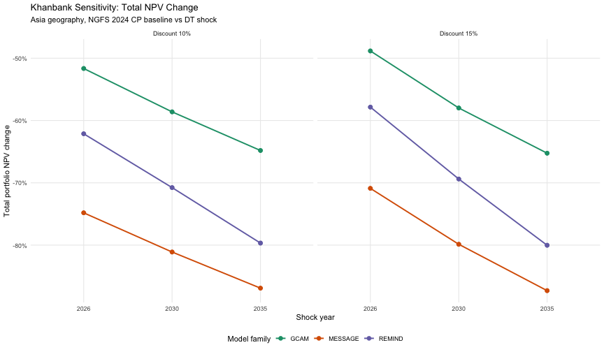
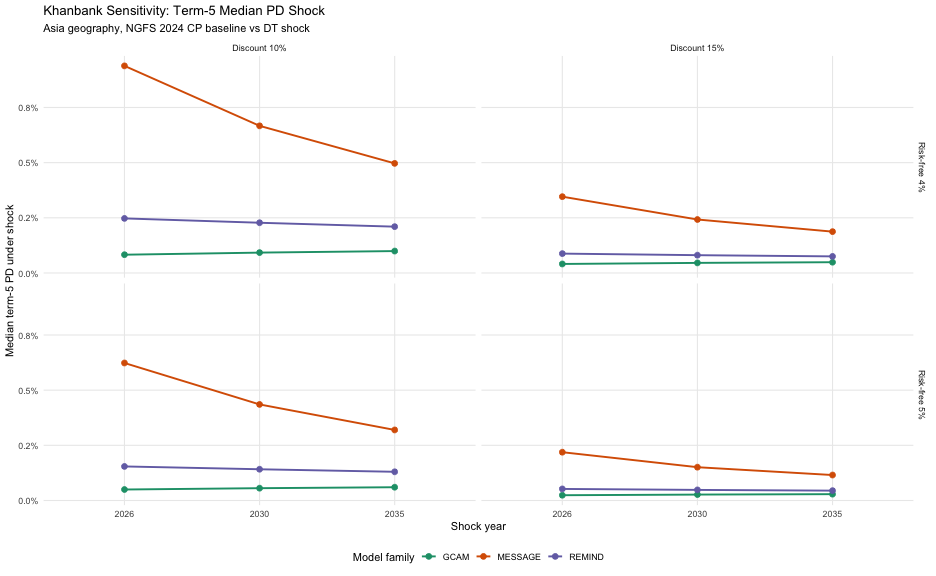
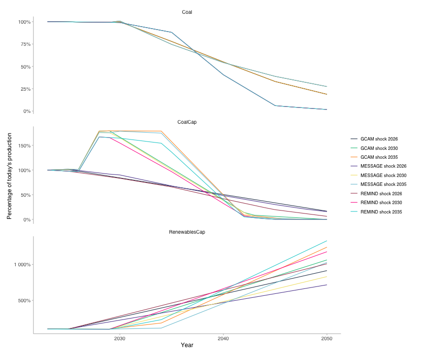

``` r
suppressPackageStartupMessages({
  suppressWarnings(library(trisk.analysis))
  suppressWarnings(library(magrittr))
  suppressWarnings(library(dplyr))
  suppressWarnings(library(tidyr))
  suppressWarnings(library(ggplot2))
  suppressWarnings(library(scales))
})
```


``` r
project_dir_candidates <- c(getwd(), normalizePath(file.path(getwd(), ".."), mustWork = FALSE))
project_dir <- project_dir_candidates[file.exists(file.path(project_dir_candidates, "DESCRIPTION"))][1]

repo_or_pkg_file <- function(filename) {
  repo_path <- file.path(project_dir, "inst", "testdata", filename)
  if (file.exists(repo_path)) {
    return(repo_path)
  }

  pkg_path <- system.file("testdata", filename, package = "trisk.analysis", mustWork = FALSE)
  if (nzchar(pkg_path) && file.exists(pkg_path)) {
    return(pkg_path)
  }

  stop("Could not locate input file: ", filename)
}

assets_testdata <- read.csv(repo_or_pkg_file("assets_data_khanbank_ifc.csv"))
assets_testdata$company_name <- as.character(assets_testdata$company_name)
assets_testdata$asset_name <- as.character(assets_testdata$asset_name)

scenarios_testdata <- read.csv(repo_or_pkg_file("scenarios_mongolia_client.csv"))
financial_features_testdata <- read.csv(repo_or_pkg_file("financial_features_khanbank_ifc.csv"))[
  c("company_id", "pd", "net_profit_margin", "debt_equity_ratio", "volatility")
]
ngfs_carbon_price_testdata <- read.csv(repo_or_pkg_file("ngfs_carbon_price_mongolia_client.csv"))

output_dir <- file.path(project_dir, "client_outputs", "khanbank-sensitivity-analysis")
dir.create(output_dir, recursive = TRUE, showWarnings = FALSE)
```

# Sensitivity Analysis

This vignette runs a Khanbank-focused sensitivity grid on the collapsed Mongolia client asset dataset.

## Run matrix

The requested setup is:

- Asia geography only
- NGFS 2024 `GCAM`, `MESSAGE`, and `REMIND`
- baseline `CP` and target `DT`
- shock years `2026`, `2030`, and `2035`
- discount rates `10%` and `15%`
- growth rate `3%`
- risk-free rates `4%` and `5%`

Because `shock_year` is scalar per TRISK run, the three shock years are represented as separate entries in the sensitivity grid rather than passed as one vector to a single run.


``` r
run_grid <- tidyr::expand_grid(
  model_family = c("GCAM", "MESSAGE", "REMIND"),
  shock_year = c(2026, 2030, 2035),
  discount_rate = c(0.10, 0.15),
  risk_free_rate = c(0.04, 0.05)
) %>%
  mutate(
    scenario_geography = "Asia",
    baseline_scenario = paste0("NGFS2024", .data$model_family, "_CP"),
    target_scenario = paste0("NGFS2024", .data$model_family, "_DT"),
    growth_rate = 0.03,
    carbon_price_model = "no_carbon_tax",
    div_netprofit_prop_coef = 1,
    market_passthrough = 0
  ) %>%
  relocate(
    model_family,
    baseline_scenario,
    target_scenario,
    scenario_geography
  )

run_params <- run_grid %>%
  select(
    -model_family
  ) %>%
  split(seq_len(nrow(.))) %>%
  lapply(as.list)

knitr::kable(run_grid) %>%
  kableExtra::kable_styling(bootstrap_options = c("striped", "hover", "condensed")) %>%
  kableExtra::scroll_box(width = "200%", height = "400px")
```

<div style="border: 1px solid #ddd; padding: 0px; overflow-y: scroll; height:400px; overflow-x: scroll; width:200%; "><table class="table table-striped table-hover table-condensed" style="margin-left: auto; margin-right: auto;">
 <thead>
  <tr>
   <th style="text-align:left;position: sticky; top:0; background-color: #FFFFFF;"> model_family </th>
   <th style="text-align:left;position: sticky; top:0; background-color: #FFFFFF;"> baseline_scenario </th>
   <th style="text-align:left;position: sticky; top:0; background-color: #FFFFFF;"> target_scenario </th>
   <th style="text-align:left;position: sticky; top:0; background-color: #FFFFFF;"> scenario_geography </th>
   <th style="text-align:right;position: sticky; top:0; background-color: #FFFFFF;"> shock_year </th>
   <th style="text-align:right;position: sticky; top:0; background-color: #FFFFFF;"> discount_rate </th>
   <th style="text-align:right;position: sticky; top:0; background-color: #FFFFFF;"> risk_free_rate </th>
   <th style="text-align:right;position: sticky; top:0; background-color: #FFFFFF;"> growth_rate </th>
   <th style="text-align:left;position: sticky; top:0; background-color: #FFFFFF;"> carbon_price_model </th>
   <th style="text-align:right;position: sticky; top:0; background-color: #FFFFFF;"> div_netprofit_prop_coef </th>
   <th style="text-align:right;position: sticky; top:0; background-color: #FFFFFF;"> market_passthrough </th>
  </tr>
 </thead>
<tbody>
  <tr>
   <td style="text-align:left;"> GCAM </td>
   <td style="text-align:left;"> NGFS2024GCAM_CP </td>
   <td style="text-align:left;"> NGFS2024GCAM_DT </td>
   <td style="text-align:left;"> Asia </td>
   <td style="text-align:right;"> 2026 </td>
   <td style="text-align:right;"> 0.10 </td>
   <td style="text-align:right;"> 0.04 </td>
   <td style="text-align:right;"> 0.03 </td>
   <td style="text-align:left;"> no_carbon_tax </td>
   <td style="text-align:right;"> 1 </td>
   <td style="text-align:right;"> 0 </td>
  </tr>
  <tr>
   <td style="text-align:left;"> GCAM </td>
   <td style="text-align:left;"> NGFS2024GCAM_CP </td>
   <td style="text-align:left;"> NGFS2024GCAM_DT </td>
   <td style="text-align:left;"> Asia </td>
   <td style="text-align:right;"> 2026 </td>
   <td style="text-align:right;"> 0.10 </td>
   <td style="text-align:right;"> 0.05 </td>
   <td style="text-align:right;"> 0.03 </td>
   <td style="text-align:left;"> no_carbon_tax </td>
   <td style="text-align:right;"> 1 </td>
   <td style="text-align:right;"> 0 </td>
  </tr>
  <tr>
   <td style="text-align:left;"> GCAM </td>
   <td style="text-align:left;"> NGFS2024GCAM_CP </td>
   <td style="text-align:left;"> NGFS2024GCAM_DT </td>
   <td style="text-align:left;"> Asia </td>
   <td style="text-align:right;"> 2026 </td>
   <td style="text-align:right;"> 0.15 </td>
   <td style="text-align:right;"> 0.04 </td>
   <td style="text-align:right;"> 0.03 </td>
   <td style="text-align:left;"> no_carbon_tax </td>
   <td style="text-align:right;"> 1 </td>
   <td style="text-align:right;"> 0 </td>
  </tr>
  <tr>
   <td style="text-align:left;"> GCAM </td>
   <td style="text-align:left;"> NGFS2024GCAM_CP </td>
   <td style="text-align:left;"> NGFS2024GCAM_DT </td>
   <td style="text-align:left;"> Asia </td>
   <td style="text-align:right;"> 2026 </td>
   <td style="text-align:right;"> 0.15 </td>
   <td style="text-align:right;"> 0.05 </td>
   <td style="text-align:right;"> 0.03 </td>
   <td style="text-align:left;"> no_carbon_tax </td>
   <td style="text-align:right;"> 1 </td>
   <td style="text-align:right;"> 0 </td>
  </tr>
  <tr>
   <td style="text-align:left;"> GCAM </td>
   <td style="text-align:left;"> NGFS2024GCAM_CP </td>
   <td style="text-align:left;"> NGFS2024GCAM_DT </td>
   <td style="text-align:left;"> Asia </td>
   <td style="text-align:right;"> 2030 </td>
   <td style="text-align:right;"> 0.10 </td>
   <td style="text-align:right;"> 0.04 </td>
   <td style="text-align:right;"> 0.03 </td>
   <td style="text-align:left;"> no_carbon_tax </td>
   <td style="text-align:right;"> 1 </td>
   <td style="text-align:right;"> 0 </td>
  </tr>
  <tr>
   <td style="text-align:left;"> GCAM </td>
   <td style="text-align:left;"> NGFS2024GCAM_CP </td>
   <td style="text-align:left;"> NGFS2024GCAM_DT </td>
   <td style="text-align:left;"> Asia </td>
   <td style="text-align:right;"> 2030 </td>
   <td style="text-align:right;"> 0.10 </td>
   <td style="text-align:right;"> 0.05 </td>
   <td style="text-align:right;"> 0.03 </td>
   <td style="text-align:left;"> no_carbon_tax </td>
   <td style="text-align:right;"> 1 </td>
   <td style="text-align:right;"> 0 </td>
  </tr>
  <tr>
   <td style="text-align:left;"> GCAM </td>
   <td style="text-align:left;"> NGFS2024GCAM_CP </td>
   <td style="text-align:left;"> NGFS2024GCAM_DT </td>
   <td style="text-align:left;"> Asia </td>
   <td style="text-align:right;"> 2030 </td>
   <td style="text-align:right;"> 0.15 </td>
   <td style="text-align:right;"> 0.04 </td>
   <td style="text-align:right;"> 0.03 </td>
   <td style="text-align:left;"> no_carbon_tax </td>
   <td style="text-align:right;"> 1 </td>
   <td style="text-align:right;"> 0 </td>
  </tr>
  <tr>
   <td style="text-align:left;"> GCAM </td>
   <td style="text-align:left;"> NGFS2024GCAM_CP </td>
   <td style="text-align:left;"> NGFS2024GCAM_DT </td>
   <td style="text-align:left;"> Asia </td>
   <td style="text-align:right;"> 2030 </td>
   <td style="text-align:right;"> 0.15 </td>
   <td style="text-align:right;"> 0.05 </td>
   <td style="text-align:right;"> 0.03 </td>
   <td style="text-align:left;"> no_carbon_tax </td>
   <td style="text-align:right;"> 1 </td>
   <td style="text-align:right;"> 0 </td>
  </tr>
  <tr>
   <td style="text-align:left;"> GCAM </td>
   <td style="text-align:left;"> NGFS2024GCAM_CP </td>
   <td style="text-align:left;"> NGFS2024GCAM_DT </td>
   <td style="text-align:left;"> Asia </td>
   <td style="text-align:right;"> 2035 </td>
   <td style="text-align:right;"> 0.10 </td>
   <td style="text-align:right;"> 0.04 </td>
   <td style="text-align:right;"> 0.03 </td>
   <td style="text-align:left;"> no_carbon_tax </td>
   <td style="text-align:right;"> 1 </td>
   <td style="text-align:right;"> 0 </td>
  </tr>
  <tr>
   <td style="text-align:left;"> GCAM </td>
   <td style="text-align:left;"> NGFS2024GCAM_CP </td>
   <td style="text-align:left;"> NGFS2024GCAM_DT </td>
   <td style="text-align:left;"> Asia </td>
   <td style="text-align:right;"> 2035 </td>
   <td style="text-align:right;"> 0.10 </td>
   <td style="text-align:right;"> 0.05 </td>
   <td style="text-align:right;"> 0.03 </td>
   <td style="text-align:left;"> no_carbon_tax </td>
   <td style="text-align:right;"> 1 </td>
   <td style="text-align:right;"> 0 </td>
  </tr>
  <tr>
   <td style="text-align:left;"> GCAM </td>
   <td style="text-align:left;"> NGFS2024GCAM_CP </td>
   <td style="text-align:left;"> NGFS2024GCAM_DT </td>
   <td style="text-align:left;"> Asia </td>
   <td style="text-align:right;"> 2035 </td>
   <td style="text-align:right;"> 0.15 </td>
   <td style="text-align:right;"> 0.04 </td>
   <td style="text-align:right;"> 0.03 </td>
   <td style="text-align:left;"> no_carbon_tax </td>
   <td style="text-align:right;"> 1 </td>
   <td style="text-align:right;"> 0 </td>
  </tr>
  <tr>
   <td style="text-align:left;"> GCAM </td>
   <td style="text-align:left;"> NGFS2024GCAM_CP </td>
   <td style="text-align:left;"> NGFS2024GCAM_DT </td>
   <td style="text-align:left;"> Asia </td>
   <td style="text-align:right;"> 2035 </td>
   <td style="text-align:right;"> 0.15 </td>
   <td style="text-align:right;"> 0.05 </td>
   <td style="text-align:right;"> 0.03 </td>
   <td style="text-align:left;"> no_carbon_tax </td>
   <td style="text-align:right;"> 1 </td>
   <td style="text-align:right;"> 0 </td>
  </tr>
  <tr>
   <td style="text-align:left;"> MESSAGE </td>
   <td style="text-align:left;"> NGFS2024MESSAGE_CP </td>
   <td style="text-align:left;"> NGFS2024MESSAGE_DT </td>
   <td style="text-align:left;"> Asia </td>
   <td style="text-align:right;"> 2026 </td>
   <td style="text-align:right;"> 0.10 </td>
   <td style="text-align:right;"> 0.04 </td>
   <td style="text-align:right;"> 0.03 </td>
   <td style="text-align:left;"> no_carbon_tax </td>
   <td style="text-align:right;"> 1 </td>
   <td style="text-align:right;"> 0 </td>
  </tr>
  <tr>
   <td style="text-align:left;"> MESSAGE </td>
   <td style="text-align:left;"> NGFS2024MESSAGE_CP </td>
   <td style="text-align:left;"> NGFS2024MESSAGE_DT </td>
   <td style="text-align:left;"> Asia </td>
   <td style="text-align:right;"> 2026 </td>
   <td style="text-align:right;"> 0.10 </td>
   <td style="text-align:right;"> 0.05 </td>
   <td style="text-align:right;"> 0.03 </td>
   <td style="text-align:left;"> no_carbon_tax </td>
   <td style="text-align:right;"> 1 </td>
   <td style="text-align:right;"> 0 </td>
  </tr>
  <tr>
   <td style="text-align:left;"> MESSAGE </td>
   <td style="text-align:left;"> NGFS2024MESSAGE_CP </td>
   <td style="text-align:left;"> NGFS2024MESSAGE_DT </td>
   <td style="text-align:left;"> Asia </td>
   <td style="text-align:right;"> 2026 </td>
   <td style="text-align:right;"> 0.15 </td>
   <td style="text-align:right;"> 0.04 </td>
   <td style="text-align:right;"> 0.03 </td>
   <td style="text-align:left;"> no_carbon_tax </td>
   <td style="text-align:right;"> 1 </td>
   <td style="text-align:right;"> 0 </td>
  </tr>
  <tr>
   <td style="text-align:left;"> MESSAGE </td>
   <td style="text-align:left;"> NGFS2024MESSAGE_CP </td>
   <td style="text-align:left;"> NGFS2024MESSAGE_DT </td>
   <td style="text-align:left;"> Asia </td>
   <td style="text-align:right;"> 2026 </td>
   <td style="text-align:right;"> 0.15 </td>
   <td style="text-align:right;"> 0.05 </td>
   <td style="text-align:right;"> 0.03 </td>
   <td style="text-align:left;"> no_carbon_tax </td>
   <td style="text-align:right;"> 1 </td>
   <td style="text-align:right;"> 0 </td>
  </tr>
  <tr>
   <td style="text-align:left;"> MESSAGE </td>
   <td style="text-align:left;"> NGFS2024MESSAGE_CP </td>
   <td style="text-align:left;"> NGFS2024MESSAGE_DT </td>
   <td style="text-align:left;"> Asia </td>
   <td style="text-align:right;"> 2030 </td>
   <td style="text-align:right;"> 0.10 </td>
   <td style="text-align:right;"> 0.04 </td>
   <td style="text-align:right;"> 0.03 </td>
   <td style="text-align:left;"> no_carbon_tax </td>
   <td style="text-align:right;"> 1 </td>
   <td style="text-align:right;"> 0 </td>
  </tr>
  <tr>
   <td style="text-align:left;"> MESSAGE </td>
   <td style="text-align:left;"> NGFS2024MESSAGE_CP </td>
   <td style="text-align:left;"> NGFS2024MESSAGE_DT </td>
   <td style="text-align:left;"> Asia </td>
   <td style="text-align:right;"> 2030 </td>
   <td style="text-align:right;"> 0.10 </td>
   <td style="text-align:right;"> 0.05 </td>
   <td style="text-align:right;"> 0.03 </td>
   <td style="text-align:left;"> no_carbon_tax </td>
   <td style="text-align:right;"> 1 </td>
   <td style="text-align:right;"> 0 </td>
  </tr>
  <tr>
   <td style="text-align:left;"> MESSAGE </td>
   <td style="text-align:left;"> NGFS2024MESSAGE_CP </td>
   <td style="text-align:left;"> NGFS2024MESSAGE_DT </td>
   <td style="text-align:left;"> Asia </td>
   <td style="text-align:right;"> 2030 </td>
   <td style="text-align:right;"> 0.15 </td>
   <td style="text-align:right;"> 0.04 </td>
   <td style="text-align:right;"> 0.03 </td>
   <td style="text-align:left;"> no_carbon_tax </td>
   <td style="text-align:right;"> 1 </td>
   <td style="text-align:right;"> 0 </td>
  </tr>
  <tr>
   <td style="text-align:left;"> MESSAGE </td>
   <td style="text-align:left;"> NGFS2024MESSAGE_CP </td>
   <td style="text-align:left;"> NGFS2024MESSAGE_DT </td>
   <td style="text-align:left;"> Asia </td>
   <td style="text-align:right;"> 2030 </td>
   <td style="text-align:right;"> 0.15 </td>
   <td style="text-align:right;"> 0.05 </td>
   <td style="text-align:right;"> 0.03 </td>
   <td style="text-align:left;"> no_carbon_tax </td>
   <td style="text-align:right;"> 1 </td>
   <td style="text-align:right;"> 0 </td>
  </tr>
  <tr>
   <td style="text-align:left;"> MESSAGE </td>
   <td style="text-align:left;"> NGFS2024MESSAGE_CP </td>
   <td style="text-align:left;"> NGFS2024MESSAGE_DT </td>
   <td style="text-align:left;"> Asia </td>
   <td style="text-align:right;"> 2035 </td>
   <td style="text-align:right;"> 0.10 </td>
   <td style="text-align:right;"> 0.04 </td>
   <td style="text-align:right;"> 0.03 </td>
   <td style="text-align:left;"> no_carbon_tax </td>
   <td style="text-align:right;"> 1 </td>
   <td style="text-align:right;"> 0 </td>
  </tr>
  <tr>
   <td style="text-align:left;"> MESSAGE </td>
   <td style="text-align:left;"> NGFS2024MESSAGE_CP </td>
   <td style="text-align:left;"> NGFS2024MESSAGE_DT </td>
   <td style="text-align:left;"> Asia </td>
   <td style="text-align:right;"> 2035 </td>
   <td style="text-align:right;"> 0.10 </td>
   <td style="text-align:right;"> 0.05 </td>
   <td style="text-align:right;"> 0.03 </td>
   <td style="text-align:left;"> no_carbon_tax </td>
   <td style="text-align:right;"> 1 </td>
   <td style="text-align:right;"> 0 </td>
  </tr>
  <tr>
   <td style="text-align:left;"> MESSAGE </td>
   <td style="text-align:left;"> NGFS2024MESSAGE_CP </td>
   <td style="text-align:left;"> NGFS2024MESSAGE_DT </td>
   <td style="text-align:left;"> Asia </td>
   <td style="text-align:right;"> 2035 </td>
   <td style="text-align:right;"> 0.15 </td>
   <td style="text-align:right;"> 0.04 </td>
   <td style="text-align:right;"> 0.03 </td>
   <td style="text-align:left;"> no_carbon_tax </td>
   <td style="text-align:right;"> 1 </td>
   <td style="text-align:right;"> 0 </td>
  </tr>
  <tr>
   <td style="text-align:left;"> MESSAGE </td>
   <td style="text-align:left;"> NGFS2024MESSAGE_CP </td>
   <td style="text-align:left;"> NGFS2024MESSAGE_DT </td>
   <td style="text-align:left;"> Asia </td>
   <td style="text-align:right;"> 2035 </td>
   <td style="text-align:right;"> 0.15 </td>
   <td style="text-align:right;"> 0.05 </td>
   <td style="text-align:right;"> 0.03 </td>
   <td style="text-align:left;"> no_carbon_tax </td>
   <td style="text-align:right;"> 1 </td>
   <td style="text-align:right;"> 0 </td>
  </tr>
  <tr>
   <td style="text-align:left;"> REMIND </td>
   <td style="text-align:left;"> NGFS2024REMIND_CP </td>
   <td style="text-align:left;"> NGFS2024REMIND_DT </td>
   <td style="text-align:left;"> Asia </td>
   <td style="text-align:right;"> 2026 </td>
   <td style="text-align:right;"> 0.10 </td>
   <td style="text-align:right;"> 0.04 </td>
   <td style="text-align:right;"> 0.03 </td>
   <td style="text-align:left;"> no_carbon_tax </td>
   <td style="text-align:right;"> 1 </td>
   <td style="text-align:right;"> 0 </td>
  </tr>
  <tr>
   <td style="text-align:left;"> REMIND </td>
   <td style="text-align:left;"> NGFS2024REMIND_CP </td>
   <td style="text-align:left;"> NGFS2024REMIND_DT </td>
   <td style="text-align:left;"> Asia </td>
   <td style="text-align:right;"> 2026 </td>
   <td style="text-align:right;"> 0.10 </td>
   <td style="text-align:right;"> 0.05 </td>
   <td style="text-align:right;"> 0.03 </td>
   <td style="text-align:left;"> no_carbon_tax </td>
   <td style="text-align:right;"> 1 </td>
   <td style="text-align:right;"> 0 </td>
  </tr>
  <tr>
   <td style="text-align:left;"> REMIND </td>
   <td style="text-align:left;"> NGFS2024REMIND_CP </td>
   <td style="text-align:left;"> NGFS2024REMIND_DT </td>
   <td style="text-align:left;"> Asia </td>
   <td style="text-align:right;"> 2026 </td>
   <td style="text-align:right;"> 0.15 </td>
   <td style="text-align:right;"> 0.04 </td>
   <td style="text-align:right;"> 0.03 </td>
   <td style="text-align:left;"> no_carbon_tax </td>
   <td style="text-align:right;"> 1 </td>
   <td style="text-align:right;"> 0 </td>
  </tr>
  <tr>
   <td style="text-align:left;"> REMIND </td>
   <td style="text-align:left;"> NGFS2024REMIND_CP </td>
   <td style="text-align:left;"> NGFS2024REMIND_DT </td>
   <td style="text-align:left;"> Asia </td>
   <td style="text-align:right;"> 2026 </td>
   <td style="text-align:right;"> 0.15 </td>
   <td style="text-align:right;"> 0.05 </td>
   <td style="text-align:right;"> 0.03 </td>
   <td style="text-align:left;"> no_carbon_tax </td>
   <td style="text-align:right;"> 1 </td>
   <td style="text-align:right;"> 0 </td>
  </tr>
  <tr>
   <td style="text-align:left;"> REMIND </td>
   <td style="text-align:left;"> NGFS2024REMIND_CP </td>
   <td style="text-align:left;"> NGFS2024REMIND_DT </td>
   <td style="text-align:left;"> Asia </td>
   <td style="text-align:right;"> 2030 </td>
   <td style="text-align:right;"> 0.10 </td>
   <td style="text-align:right;"> 0.04 </td>
   <td style="text-align:right;"> 0.03 </td>
   <td style="text-align:left;"> no_carbon_tax </td>
   <td style="text-align:right;"> 1 </td>
   <td style="text-align:right;"> 0 </td>
  </tr>
  <tr>
   <td style="text-align:left;"> REMIND </td>
   <td style="text-align:left;"> NGFS2024REMIND_CP </td>
   <td style="text-align:left;"> NGFS2024REMIND_DT </td>
   <td style="text-align:left;"> Asia </td>
   <td style="text-align:right;"> 2030 </td>
   <td style="text-align:right;"> 0.10 </td>
   <td style="text-align:right;"> 0.05 </td>
   <td style="text-align:right;"> 0.03 </td>
   <td style="text-align:left;"> no_carbon_tax </td>
   <td style="text-align:right;"> 1 </td>
   <td style="text-align:right;"> 0 </td>
  </tr>
  <tr>
   <td style="text-align:left;"> REMIND </td>
   <td style="text-align:left;"> NGFS2024REMIND_CP </td>
   <td style="text-align:left;"> NGFS2024REMIND_DT </td>
   <td style="text-align:left;"> Asia </td>
   <td style="text-align:right;"> 2030 </td>
   <td style="text-align:right;"> 0.15 </td>
   <td style="text-align:right;"> 0.04 </td>
   <td style="text-align:right;"> 0.03 </td>
   <td style="text-align:left;"> no_carbon_tax </td>
   <td style="text-align:right;"> 1 </td>
   <td style="text-align:right;"> 0 </td>
  </tr>
  <tr>
   <td style="text-align:left;"> REMIND </td>
   <td style="text-align:left;"> NGFS2024REMIND_CP </td>
   <td style="text-align:left;"> NGFS2024REMIND_DT </td>
   <td style="text-align:left;"> Asia </td>
   <td style="text-align:right;"> 2030 </td>
   <td style="text-align:right;"> 0.15 </td>
   <td style="text-align:right;"> 0.05 </td>
   <td style="text-align:right;"> 0.03 </td>
   <td style="text-align:left;"> no_carbon_tax </td>
   <td style="text-align:right;"> 1 </td>
   <td style="text-align:right;"> 0 </td>
  </tr>
  <tr>
   <td style="text-align:left;"> REMIND </td>
   <td style="text-align:left;"> NGFS2024REMIND_CP </td>
   <td style="text-align:left;"> NGFS2024REMIND_DT </td>
   <td style="text-align:left;"> Asia </td>
   <td style="text-align:right;"> 2035 </td>
   <td style="text-align:right;"> 0.10 </td>
   <td style="text-align:right;"> 0.04 </td>
   <td style="text-align:right;"> 0.03 </td>
   <td style="text-align:left;"> no_carbon_tax </td>
   <td style="text-align:right;"> 1 </td>
   <td style="text-align:right;"> 0 </td>
  </tr>
  <tr>
   <td style="text-align:left;"> REMIND </td>
   <td style="text-align:left;"> NGFS2024REMIND_CP </td>
   <td style="text-align:left;"> NGFS2024REMIND_DT </td>
   <td style="text-align:left;"> Asia </td>
   <td style="text-align:right;"> 2035 </td>
   <td style="text-align:right;"> 0.10 </td>
   <td style="text-align:right;"> 0.05 </td>
   <td style="text-align:right;"> 0.03 </td>
   <td style="text-align:left;"> no_carbon_tax </td>
   <td style="text-align:right;"> 1 </td>
   <td style="text-align:right;"> 0 </td>
  </tr>
  <tr>
   <td style="text-align:left;"> REMIND </td>
   <td style="text-align:left;"> NGFS2024REMIND_CP </td>
   <td style="text-align:left;"> NGFS2024REMIND_DT </td>
   <td style="text-align:left;"> Asia </td>
   <td style="text-align:right;"> 2035 </td>
   <td style="text-align:right;"> 0.15 </td>
   <td style="text-align:right;"> 0.04 </td>
   <td style="text-align:right;"> 0.03 </td>
   <td style="text-align:left;"> no_carbon_tax </td>
   <td style="text-align:right;"> 1 </td>
   <td style="text-align:right;"> 0 </td>
  </tr>
  <tr>
   <td style="text-align:left;"> REMIND </td>
   <td style="text-align:left;"> NGFS2024REMIND_CP </td>
   <td style="text-align:left;"> NGFS2024REMIND_DT </td>
   <td style="text-align:left;"> Asia </td>
   <td style="text-align:right;"> 2035 </td>
   <td style="text-align:right;"> 0.15 </td>
   <td style="text-align:right;"> 0.05 </td>
   <td style="text-align:right;"> 0.03 </td>
   <td style="text-align:left;"> no_carbon_tax </td>
   <td style="text-align:right;"> 1 </td>
   <td style="text-align:right;"> 0 </td>
  </tr>
</tbody>
</table></div>


## Run sensitivity analysis


``` r
sensitivity_analysis_results <- run_trisk_sa(
  assets_data = assets_testdata,
  scenarios_data = scenarios_testdata,
  financial_data = financial_features_testdata,
  carbon_data = ngfs_carbon_price_testdata,
  run_params = run_params
)
#> [1] "Starting the execution of 36 total runs"
#> -- Retyping Dataframes. 
#> -- Processing Assets and Scenarios. 
#> -- Transforming to Trisk model input. 
#> -- Calculating baseline, target, and shock trajectories. 
#> -- Calculating net profits.
#> Joining with `by = join_by(asset_id, company_id, sector, technology)`
#> -- Calculating market risk. 
#> -- Calculating credit risk. 
#> [1] "Done 1 / 36 total runs"
#> -- Retyping Dataframes. 
#> -- Processing Assets and Scenarios. 
#> -- Transforming to Trisk model input. 
#> -- Calculating baseline, target, and shock trajectories. 
#> -- Calculating net profits.
#> Joining with `by = join_by(asset_id, company_id, sector, technology)`
#> -- Calculating market risk. 
#> -- Calculating credit risk. 
#> [1] "Done 2 / 36 total runs"
#> -- Retyping Dataframes. 
#> -- Processing Assets and Scenarios. 
#> -- Transforming to Trisk model input. 
#> -- Calculating baseline, target, and shock trajectories. 
#> -- Calculating net profits.
#> Joining with `by = join_by(asset_id, company_id, sector, technology)`
#> -- Calculating market risk. 
#> -- Calculating credit risk. 
#> [1] "Done 3 / 36 total runs"
#> -- Retyping Dataframes. 
#> -- Processing Assets and Scenarios. 
#> -- Transforming to Trisk model input. 
#> -- Calculating baseline, target, and shock trajectories. 
#> -- Calculating net profits.
#> Joining with `by = join_by(asset_id, company_id, sector, technology)`
#> -- Calculating market risk. 
#> -- Calculating credit risk. 
#> [1] "Done 4 / 36 total runs"
#> -- Retyping Dataframes. 
#> -- Processing Assets and Scenarios. 
#> -- Transforming to Trisk model input. 
#> -- Calculating baseline, target, and shock trajectories. 
#> -- Calculating net profits.
#> Joining with `by = join_by(asset_id, company_id, sector, technology)`
#> -- Calculating market risk. 
#> -- Calculating credit risk. 
#> [1] "Done 5 / 36 total runs"
#> -- Retyping Dataframes. 
#> -- Processing Assets and Scenarios. 
#> -- Transforming to Trisk model input. 
#> -- Calculating baseline, target, and shock trajectories. 
#> -- Calculating net profits.
#> Joining with `by = join_by(asset_id, company_id, sector, technology)`
#> -- Calculating market risk. 
#> -- Calculating credit risk. 
#> [1] "Done 6 / 36 total runs"
#> -- Retyping Dataframes. 
#> -- Processing Assets and Scenarios. 
#> -- Transforming to Trisk model input. 
#> -- Calculating baseline, target, and shock trajectories. 
#> -- Calculating net profits.
#> Joining with `by = join_by(asset_id, company_id, sector, technology)`
#> -- Calculating market risk. 
#> -- Calculating credit risk. 
#> [1] "Done 7 / 36 total runs"
#> -- Retyping Dataframes. 
#> -- Processing Assets and Scenarios. 
#> -- Transforming to Trisk model input. 
#> -- Calculating baseline, target, and shock trajectories. 
#> -- Calculating net profits.
#> Joining with `by = join_by(asset_id, company_id, sector, technology)`
#> -- Calculating market risk. 
#> -- Calculating credit risk. 
#> [1] "Done 8 / 36 total runs"
#> -- Retyping Dataframes. 
#> -- Processing Assets and Scenarios. 
#> -- Transforming to Trisk model input. 
#> -- Calculating baseline, target, and shock trajectories. 
#> -- Calculating net profits.
#> Joining with `by = join_by(asset_id, company_id, sector, technology)`
#> -- Calculating market risk. 
#> -- Calculating credit risk. 
#> [1] "Done 9 / 36 total runs"
#> -- Retyping Dataframes. 
#> -- Processing Assets and Scenarios. 
#> -- Transforming to Trisk model input. 
#> -- Calculating baseline, target, and shock trajectories. 
#> -- Calculating net profits.
#> Joining with `by = join_by(asset_id, company_id, sector, technology)`
#> -- Calculating market risk. 
#> -- Calculating credit risk. 
#> [1] "Done 10 / 36 total runs"
#> -- Retyping Dataframes. 
#> -- Processing Assets and Scenarios. 
#> -- Transforming to Trisk model input. 
#> -- Calculating baseline, target, and shock trajectories. 
#> -- Calculating net profits.
#> Joining with `by = join_by(asset_id, company_id, sector, technology)`
#> -- Calculating market risk. 
#> -- Calculating credit risk. 
#> [1] "Done 11 / 36 total runs"
#> -- Retyping Dataframes. 
#> -- Processing Assets and Scenarios. 
#> -- Transforming to Trisk model input. 
#> -- Calculating baseline, target, and shock trajectories. 
#> -- Calculating net profits.
#> Joining with `by = join_by(asset_id, company_id, sector, technology)`
#> -- Calculating market risk. 
#> -- Calculating credit risk. 
#> [1] "Done 12 / 36 total runs"
#> -- Retyping Dataframes. 
#> -- Processing Assets and Scenarios. 
#> -- Transforming to Trisk model input. 
#> -- Calculating baseline, target, and shock trajectories. 
#> -- Calculating net profits.
#> Joining with `by = join_by(asset_id, company_id, sector, technology)`
#> -- Calculating market risk. 
#> -- Calculating credit risk. 
#> [1] "Done 13 / 36 total runs"
#> -- Retyping Dataframes. 
#> -- Processing Assets and Scenarios. 
#> -- Transforming to Trisk model input. 
#> -- Calculating baseline, target, and shock trajectories. 
#> -- Calculating net profits.
#> Joining with `by = join_by(asset_id, company_id, sector, technology)`
#> -- Calculating market risk. 
#> -- Calculating credit risk. 
#> [1] "Done 14 / 36 total runs"
#> -- Retyping Dataframes. 
#> -- Processing Assets and Scenarios. 
#> -- Transforming to Trisk model input. 
#> -- Calculating baseline, target, and shock trajectories. 
#> -- Calculating net profits.
#> Joining with `by = join_by(asset_id, company_id, sector, technology)`
#> -- Calculating market risk. 
#> -- Calculating credit risk. 
#> [1] "Done 15 / 36 total runs"
#> -- Retyping Dataframes. 
#> -- Processing Assets and Scenarios. 
#> -- Transforming to Trisk model input. 
#> -- Calculating baseline, target, and shock trajectories. 
#> -- Calculating net profits.
#> Joining with `by = join_by(asset_id, company_id, sector, technology)`
#> -- Calculating market risk. 
#> -- Calculating credit risk. 
#> [1] "Done 16 / 36 total runs"
#> -- Retyping Dataframes. 
#> -- Processing Assets and Scenarios. 
#> -- Transforming to Trisk model input. 
#> -- Calculating baseline, target, and shock trajectories. 
#> -- Calculating net profits.
#> Joining with `by = join_by(asset_id, company_id, sector, technology)`
#> -- Calculating market risk. 
#> -- Calculating credit risk. 
#> [1] "Done 17 / 36 total runs"
#> -- Retyping Dataframes. 
#> -- Processing Assets and Scenarios. 
#> -- Transforming to Trisk model input. 
#> -- Calculating baseline, target, and shock trajectories. 
#> -- Calculating net profits.
#> Joining with `by = join_by(asset_id, company_id, sector, technology)`
#> -- Calculating market risk. 
#> -- Calculating credit risk. 
#> [1] "Done 18 / 36 total runs"
#> -- Retyping Dataframes. 
#> -- Processing Assets and Scenarios. 
#> -- Transforming to Trisk model input. 
#> -- Calculating baseline, target, and shock trajectories. 
#> -- Calculating net profits.
#> Joining with `by = join_by(asset_id, company_id, sector, technology)`
#> -- Calculating market risk. 
#> -- Calculating credit risk. 
#> [1] "Done 19 / 36 total runs"
#> -- Retyping Dataframes. 
#> -- Processing Assets and Scenarios. 
#> -- Transforming to Trisk model input. 
#> -- Calculating baseline, target, and shock trajectories. 
#> -- Calculating net profits.
#> Joining with `by = join_by(asset_id, company_id, sector, technology)`
#> -- Calculating market risk. 
#> -- Calculating credit risk. 
#> [1] "Done 20 / 36 total runs"
#> -- Retyping Dataframes. 
#> -- Processing Assets and Scenarios. 
#> -- Transforming to Trisk model input. 
#> -- Calculating baseline, target, and shock trajectories. 
#> -- Calculating net profits.
#> Joining with `by = join_by(asset_id, company_id, sector, technology)`
#> -- Calculating market risk. 
#> -- Calculating credit risk. 
#> [1] "Done 21 / 36 total runs"
#> -- Retyping Dataframes. 
#> -- Processing Assets and Scenarios. 
#> -- Transforming to Trisk model input. 
#> -- Calculating baseline, target, and shock trajectories. 
#> -- Calculating net profits.
#> Joining with `by = join_by(asset_id, company_id, sector, technology)`
#> -- Calculating market risk. 
#> -- Calculating credit risk. 
#> [1] "Done 22 / 36 total runs"
#> -- Retyping Dataframes. 
#> -- Processing Assets and Scenarios. 
#> -- Transforming to Trisk model input. 
#> -- Calculating baseline, target, and shock trajectories. 
#> -- Calculating net profits.
#> Joining with `by = join_by(asset_id, company_id, sector, technology)`
#> -- Calculating market risk. 
#> -- Calculating credit risk. 
#> [1] "Done 23 / 36 total runs"
#> -- Retyping Dataframes. 
#> -- Processing Assets and Scenarios. 
#> -- Transforming to Trisk model input. 
#> -- Calculating baseline, target, and shock trajectories. 
#> -- Calculating net profits.
#> Joining with `by = join_by(asset_id, company_id, sector, technology)`
#> -- Calculating market risk. 
#> -- Calculating credit risk. 
#> [1] "Done 24 / 36 total runs"
#> -- Retyping Dataframes. 
#> -- Processing Assets and Scenarios. 
#> -- Transforming to Trisk model input. 
#> -- Calculating baseline, target, and shock trajectories. 
#> -- Calculating net profits.
#> Joining with `by = join_by(asset_id, company_id, sector, technology)`
#> -- Calculating market risk. 
#> -- Calculating credit risk. 
#> [1] "Done 25 / 36 total runs"
#> -- Retyping Dataframes. 
#> -- Processing Assets and Scenarios. 
#> -- Transforming to Trisk model input. 
#> -- Calculating baseline, target, and shock trajectories. 
#> -- Calculating net profits.
#> Joining with `by = join_by(asset_id, company_id, sector, technology)`
#> -- Calculating market risk. 
#> -- Calculating credit risk. 
#> [1] "Done 26 / 36 total runs"
#> -- Retyping Dataframes. 
#> -- Processing Assets and Scenarios. 
#> -- Transforming to Trisk model input. 
#> -- Calculating baseline, target, and shock trajectories. 
#> -- Calculating net profits.
#> Joining with `by = join_by(asset_id, company_id, sector, technology)`
#> -- Calculating market risk. 
#> -- Calculating credit risk. 
#> [1] "Done 27 / 36 total runs"
#> -- Retyping Dataframes. 
#> -- Processing Assets and Scenarios. 
#> -- Transforming to Trisk model input. 
#> -- Calculating baseline, target, and shock trajectories. 
#> -- Calculating net profits.
#> Joining with `by = join_by(asset_id, company_id, sector, technology)`
#> -- Calculating market risk. 
#> -- Calculating credit risk. 
#> [1] "Done 28 / 36 total runs"
#> -- Retyping Dataframes. 
#> -- Processing Assets and Scenarios. 
#> -- Transforming to Trisk model input. 
#> -- Calculating baseline, target, and shock trajectories. 
#> -- Calculating net profits.
#> Joining with `by = join_by(asset_id, company_id, sector, technology)`
#> -- Calculating market risk. 
#> -- Calculating credit risk. 
#> [1] "Done 29 / 36 total runs"
#> -- Retyping Dataframes. 
#> -- Processing Assets and Scenarios. 
#> -- Transforming to Trisk model input. 
#> -- Calculating baseline, target, and shock trajectories. 
#> -- Calculating net profits.
#> Joining with `by = join_by(asset_id, company_id, sector, technology)`
#> -- Calculating market risk. 
#> -- Calculating credit risk. 
#> [1] "Done 30 / 36 total runs"
#> -- Retyping Dataframes. 
#> -- Processing Assets and Scenarios. 
#> -- Transforming to Trisk model input. 
#> -- Calculating baseline, target, and shock trajectories. 
#> -- Calculating net profits.
#> Joining with `by = join_by(asset_id, company_id, sector, technology)`
#> -- Calculating market risk. 
#> -- Calculating credit risk. 
#> [1] "Done 31 / 36 total runs"
#> -- Retyping Dataframes. 
#> -- Processing Assets and Scenarios. 
#> -- Transforming to Trisk model input. 
#> -- Calculating baseline, target, and shock trajectories. 
#> -- Calculating net profits.
#> Joining with `by = join_by(asset_id, company_id, sector, technology)`
#> -- Calculating market risk. 
#> -- Calculating credit risk. 
#> [1] "Done 32 / 36 total runs"
#> -- Retyping Dataframes. 
#> -- Processing Assets and Scenarios. 
#> -- Transforming to Trisk model input. 
#> -- Calculating baseline, target, and shock trajectories. 
#> -- Calculating net profits.
#> Joining with `by = join_by(asset_id, company_id, sector, technology)`
#> -- Calculating market risk. 
#> -- Calculating credit risk. 
#> [1] "Done 33 / 36 total runs"
#> -- Retyping Dataframes. 
#> -- Processing Assets and Scenarios. 
#> -- Transforming to Trisk model input. 
#> -- Calculating baseline, target, and shock trajectories. 
#> -- Calculating net profits.
#> Joining with `by = join_by(asset_id, company_id, sector, technology)`
#> -- Calculating market risk. 
#> -- Calculating credit risk. 
#> [1] "Done 34 / 36 total runs"
#> -- Retyping Dataframes. 
#> -- Processing Assets and Scenarios. 
#> -- Transforming to Trisk model input. 
#> -- Calculating baseline, target, and shock trajectories. 
#> -- Calculating net profits.
#> Joining with `by = join_by(asset_id, company_id, sector, technology)`
#> -- Calculating market risk. 
#> -- Calculating credit risk. 
#> [1] "Done 35 / 36 total runs"
#> -- Retyping Dataframes. 
#> -- Processing Assets and Scenarios. 
#> -- Transforming to Trisk model input. 
#> -- Calculating baseline, target, and shock trajectories. 
#> -- Calculating net profits.
#> Joining with `by = join_by(asset_id, company_id, sector, technology)`
#> -- Calculating market risk. 
#> -- Calculating credit risk. 
#> [1] "Done 36 / 36 total runs"
#> [1] "All runs completed."
```

## Summarise results by run


``` r
npv_summary <- sensitivity_analysis_results$npv %>%
  group_by(.data$run_id) %>%
  summarise(
    total_npv_baseline = sum(.data$net_present_value_baseline, na.rm = TRUE),
    total_npv_shock = sum(.data$net_present_value_shock, na.rm = TRUE),
    total_npv_difference = sum(.data$net_present_value_difference, na.rm = TRUE),
    total_npv_change = .data$total_npv_difference / .data$total_npv_baseline,
    .groups = "drop"
  )

pd_summary <- sensitivity_analysis_results$pd %>%
  filter(.data$term == 5) %>%
  group_by(.data$run_id) %>%
  summarise(
    median_pd_baseline_term5 = median(.data$pd_baseline, na.rm = TRUE),
    median_pd_shock_term5 = median(.data$pd_shock, na.rm = TRUE),
    median_pd_difference_term5 = median(.data$pd_shock - .data$pd_baseline, na.rm = TRUE),
    .groups = "drop"
  )

run_summary <- sensitivity_analysis_results$params %>%
  left_join(npv_summary, by = "run_id") %>%
  left_join(pd_summary, by = "run_id") %>%
  mutate(
    model_family = sub("^NGFS2024([A-Z]+)_CP$", "\\1", .data$baseline_scenario),
    discount_rate_label = paste0("Discount ", percent(.data$discount_rate, accuracy = 1)),
    risk_free_rate_label = paste0("Risk-free ", percent(.data$risk_free_rate, accuracy = 1)),
    run_label = paste(.data$model_family, "shock", .data$shock_year)
  ) %>%
  arrange(.data$model_family, .data$discount_rate, .data$risk_free_rate, .data$shock_year)

utils::write.csv(
  run_summary,
  file.path(output_dir, "run_summary.csv"),
  row.names = FALSE
)
utils::write.csv(
  sensitivity_analysis_results$params,
  file.path(output_dir, "run_params_used.csv"),
  row.names = FALSE
)

knitr::kable(run_summary) %>%
  kableExtra::kable_styling(bootstrap_options = c("striped", "hover", "condensed")) %>%
  kableExtra::scroll_box(width = "200%", height = "400px")
```

<div style="border: 1px solid #ddd; padding: 0px; overflow-y: scroll; height:400px; overflow-x: scroll; width:200%; "><table class="table table-striped table-hover table-condensed" style="margin-left: auto; margin-right: auto;">
 <thead>
  <tr>
   <th style="text-align:left;position: sticky; top:0; background-color: #FFFFFF;"> baseline_scenario </th>
   <th style="text-align:left;position: sticky; top:0; background-color: #FFFFFF;"> target_scenario </th>
   <th style="text-align:left;position: sticky; top:0; background-color: #FFFFFF;"> scenario_geography </th>
   <th style="text-align:left;position: sticky; top:0; background-color: #FFFFFF;"> carbon_price_model </th>
   <th style="text-align:right;position: sticky; top:0; background-color: #FFFFFF;"> risk_free_rate </th>
   <th style="text-align:right;position: sticky; top:0; background-color: #FFFFFF;"> discount_rate </th>
   <th style="text-align:right;position: sticky; top:0; background-color: #FFFFFF;"> growth_rate </th>
   <th style="text-align:right;position: sticky; top:0; background-color: #FFFFFF;"> div_netprofit_prop_coef </th>
   <th style="text-align:right;position: sticky; top:0; background-color: #FFFFFF;"> shock_year </th>
   <th style="text-align:right;position: sticky; top:0; background-color: #FFFFFF;"> market_passthrough </th>
   <th style="text-align:left;position: sticky; top:0; background-color: #FFFFFF;"> run_id </th>
   <th style="text-align:right;position: sticky; top:0; background-color: #FFFFFF;"> total_npv_baseline </th>
   <th style="text-align:right;position: sticky; top:0; background-color: #FFFFFF;"> total_npv_shock </th>
   <th style="text-align:right;position: sticky; top:0; background-color: #FFFFFF;"> total_npv_difference </th>
   <th style="text-align:right;position: sticky; top:0; background-color: #FFFFFF;"> total_npv_change </th>
   <th style="text-align:right;position: sticky; top:0; background-color: #FFFFFF;"> median_pd_baseline_term5 </th>
   <th style="text-align:right;position: sticky; top:0; background-color: #FFFFFF;"> median_pd_shock_term5 </th>
   <th style="text-align:right;position: sticky; top:0; background-color: #FFFFFF;"> median_pd_difference_term5 </th>
   <th style="text-align:left;position: sticky; top:0; background-color: #FFFFFF;"> model_family </th>
   <th style="text-align:left;position: sticky; top:0; background-color: #FFFFFF;"> discount_rate_label </th>
   <th style="text-align:left;position: sticky; top:0; background-color: #FFFFFF;"> risk_free_rate_label </th>
   <th style="text-align:left;position: sticky; top:0; background-color: #FFFFFF;"> run_label </th>
  </tr>
 </thead>
<tbody>
  <tr>
   <td style="text-align:left;"> NGFS2024GCAM_CP </td>
   <td style="text-align:left;"> NGFS2024GCAM_DT </td>
   <td style="text-align:left;"> Asia </td>
   <td style="text-align:left;"> no_carbon_tax </td>
   <td style="text-align:right;"> 0.04 </td>
   <td style="text-align:right;"> 0.10 </td>
   <td style="text-align:right;"> 0.03 </td>
   <td style="text-align:right;"> 1 </td>
   <td style="text-align:right;"> 2026 </td>
   <td style="text-align:right;"> 0 </td>
   <td style="text-align:left;"> 4863a1cc-b288-4827-ae1b-6fdb27eed0a8 </td>
   <td style="text-align:right;"> 4377956487 </td>
   <td style="text-align:right;"> 2116862675 </td>
   <td style="text-align:right;"> -2261093812 </td>
   <td style="text-align:right;"> -0.5164724 </td>
   <td style="text-align:right;"> 3.88e-05 </td>
   <td style="text-align:right;"> 0.0008283 </td>
   <td style="text-align:right;"> 0.0008258 </td>
   <td style="text-align:left;"> GCAM </td>
   <td style="text-align:left;"> Discount 10% </td>
   <td style="text-align:left;"> Risk-free 4% </td>
   <td style="text-align:left;"> GCAM shock 2026 </td>
  </tr>
  <tr>
   <td style="text-align:left;"> NGFS2024GCAM_CP </td>
   <td style="text-align:left;"> NGFS2024GCAM_DT </td>
   <td style="text-align:left;"> Asia </td>
   <td style="text-align:left;"> no_carbon_tax </td>
   <td style="text-align:right;"> 0.04 </td>
   <td style="text-align:right;"> 0.10 </td>
   <td style="text-align:right;"> 0.03 </td>
   <td style="text-align:right;"> 1 </td>
   <td style="text-align:right;"> 2030 </td>
   <td style="text-align:right;"> 0 </td>
   <td style="text-align:left;"> 60f02944-b65d-4ccd-81ac-b587ddf46fa0 </td>
   <td style="text-align:right;"> 3919959501 </td>
   <td style="text-align:right;"> 1622396906 </td>
   <td style="text-align:right;"> -2297562595 </td>
   <td style="text-align:right;"> -0.5861190 </td>
   <td style="text-align:right;"> 3.88e-05 </td>
   <td style="text-align:right;"> 0.0009238 </td>
   <td style="text-align:right;"> 0.0009213 </td>
   <td style="text-align:left;"> GCAM </td>
   <td style="text-align:left;"> Discount 10% </td>
   <td style="text-align:left;"> Risk-free 4% </td>
   <td style="text-align:left;"> GCAM shock 2030 </td>
  </tr>
  <tr>
   <td style="text-align:left;"> NGFS2024GCAM_CP </td>
   <td style="text-align:left;"> NGFS2024GCAM_DT </td>
   <td style="text-align:left;"> Asia </td>
   <td style="text-align:left;"> no_carbon_tax </td>
   <td style="text-align:right;"> 0.04 </td>
   <td style="text-align:right;"> 0.10 </td>
   <td style="text-align:right;"> 0.03 </td>
   <td style="text-align:right;"> 1 </td>
   <td style="text-align:right;"> 2035 </td>
   <td style="text-align:right;"> 0 </td>
   <td style="text-align:left;"> 5431add2-c715-4163-b294-6ab39d006343 </td>
   <td style="text-align:right;"> 3530294091 </td>
   <td style="text-align:right;"> 1242291449 </td>
   <td style="text-align:right;"> -2288002642 </td>
   <td style="text-align:right;"> -0.6481054 </td>
   <td style="text-align:right;"> 3.88e-05 </td>
   <td style="text-align:right;"> 0.0009934 </td>
   <td style="text-align:right;"> 0.0009909 </td>
   <td style="text-align:left;"> GCAM </td>
   <td style="text-align:left;"> Discount 10% </td>
   <td style="text-align:left;"> Risk-free 4% </td>
   <td style="text-align:left;"> GCAM shock 2035 </td>
  </tr>
  <tr>
   <td style="text-align:left;"> NGFS2024GCAM_CP </td>
   <td style="text-align:left;"> NGFS2024GCAM_DT </td>
   <td style="text-align:left;"> Asia </td>
   <td style="text-align:left;"> no_carbon_tax </td>
   <td style="text-align:right;"> 0.05 </td>
   <td style="text-align:right;"> 0.10 </td>
   <td style="text-align:right;"> 0.03 </td>
   <td style="text-align:right;"> 1 </td>
   <td style="text-align:right;"> 2026 </td>
   <td style="text-align:right;"> 0 </td>
   <td style="text-align:left;"> b124164c-e0ba-43fb-aedb-bd84bd9ee8a7 </td>
   <td style="text-align:right;"> 4377956487 </td>
   <td style="text-align:right;"> 2116862675 </td>
   <td style="text-align:right;"> -2261093812 </td>
   <td style="text-align:right;"> -0.5164724 </td>
   <td style="text-align:right;"> 2.93e-05 </td>
   <td style="text-align:right;"> 0.0004978 </td>
   <td style="text-align:right;"> 0.0004965 </td>
   <td style="text-align:left;"> GCAM </td>
   <td style="text-align:left;"> Discount 10% </td>
   <td style="text-align:left;"> Risk-free 5% </td>
   <td style="text-align:left;"> GCAM shock 2026 </td>
  </tr>
  <tr>
   <td style="text-align:left;"> NGFS2024GCAM_CP </td>
   <td style="text-align:left;"> NGFS2024GCAM_DT </td>
   <td style="text-align:left;"> Asia </td>
   <td style="text-align:left;"> no_carbon_tax </td>
   <td style="text-align:right;"> 0.05 </td>
   <td style="text-align:right;"> 0.10 </td>
   <td style="text-align:right;"> 0.03 </td>
   <td style="text-align:right;"> 1 </td>
   <td style="text-align:right;"> 2030 </td>
   <td style="text-align:right;"> 0 </td>
   <td style="text-align:left;"> 555d4038-856b-42fe-ba0d-187fb6c6dfbe </td>
   <td style="text-align:right;"> 3919959501 </td>
   <td style="text-align:right;"> 1622396906 </td>
   <td style="text-align:right;"> -2297562595 </td>
   <td style="text-align:right;"> -0.5861190 </td>
   <td style="text-align:right;"> 2.93e-05 </td>
   <td style="text-align:right;"> 0.0005576 </td>
   <td style="text-align:right;"> 0.0005564 </td>
   <td style="text-align:left;"> GCAM </td>
   <td style="text-align:left;"> Discount 10% </td>
   <td style="text-align:left;"> Risk-free 5% </td>
   <td style="text-align:left;"> GCAM shock 2030 </td>
  </tr>
  <tr>
   <td style="text-align:left;"> NGFS2024GCAM_CP </td>
   <td style="text-align:left;"> NGFS2024GCAM_DT </td>
   <td style="text-align:left;"> Asia </td>
   <td style="text-align:left;"> no_carbon_tax </td>
   <td style="text-align:right;"> 0.05 </td>
   <td style="text-align:right;"> 0.10 </td>
   <td style="text-align:right;"> 0.03 </td>
   <td style="text-align:right;"> 1 </td>
   <td style="text-align:right;"> 2035 </td>
   <td style="text-align:right;"> 0 </td>
   <td style="text-align:left;"> f94b7288-632e-4c72-bd7b-0bc7a8b25d36 </td>
   <td style="text-align:right;"> 3530294091 </td>
   <td style="text-align:right;"> 1242291449 </td>
   <td style="text-align:right;"> -2288002642 </td>
   <td style="text-align:right;"> -0.6481054 </td>
   <td style="text-align:right;"> 2.93e-05 </td>
   <td style="text-align:right;"> 0.0006013 </td>
   <td style="text-align:right;"> 0.0006001 </td>
   <td style="text-align:left;"> GCAM </td>
   <td style="text-align:left;"> Discount 10% </td>
   <td style="text-align:left;"> Risk-free 5% </td>
   <td style="text-align:left;"> GCAM shock 2035 </td>
  </tr>
  <tr>
   <td style="text-align:left;"> NGFS2024GCAM_CP </td>
   <td style="text-align:left;"> NGFS2024GCAM_DT </td>
   <td style="text-align:left;"> Asia </td>
   <td style="text-align:left;"> no_carbon_tax </td>
   <td style="text-align:right;"> 0.04 </td>
   <td style="text-align:right;"> 0.15 </td>
   <td style="text-align:right;"> 0.03 </td>
   <td style="text-align:right;"> 1 </td>
   <td style="text-align:right;"> 2026 </td>
   <td style="text-align:right;"> 0 </td>
   <td style="text-align:left;"> 5701c7d0-c0b5-4018-b264-f27dc478856e </td>
   <td style="text-align:right;"> 2636764400 </td>
   <td style="text-align:right;"> 1349158784 </td>
   <td style="text-align:right;"> -1287605615 </td>
   <td style="text-align:right;"> -0.4883279 </td>
   <td style="text-align:right;"> 3.88e-05 </td>
   <td style="text-align:right;"> 0.0004091 </td>
   <td style="text-align:right;"> 0.0004066 </td>
   <td style="text-align:left;"> GCAM </td>
   <td style="text-align:left;"> Discount 15% </td>
   <td style="text-align:left;"> Risk-free 4% </td>
   <td style="text-align:left;"> GCAM shock 2026 </td>
  </tr>
  <tr>
   <td style="text-align:left;"> NGFS2024GCAM_CP </td>
   <td style="text-align:left;"> NGFS2024GCAM_DT </td>
   <td style="text-align:left;"> Asia </td>
   <td style="text-align:left;"> no_carbon_tax </td>
   <td style="text-align:right;"> 0.04 </td>
   <td style="text-align:right;"> 0.15 </td>
   <td style="text-align:right;"> 0.03 </td>
   <td style="text-align:right;"> 1 </td>
   <td style="text-align:right;"> 2030 </td>
   <td style="text-align:right;"> 0 </td>
   <td style="text-align:left;"> a017d6ae-868e-42d9-acdc-9d5977a4d059 </td>
   <td style="text-align:right;"> 2259532683 </td>
   <td style="text-align:right;"> 949318341 </td>
   <td style="text-align:right;"> -1310214342 </td>
   <td style="text-align:right;"> -0.5798608 </td>
   <td style="text-align:right;"> 3.88e-05 </td>
   <td style="text-align:right;"> 0.0004581 </td>
   <td style="text-align:right;"> 0.0004556 </td>
   <td style="text-align:left;"> GCAM </td>
   <td style="text-align:left;"> Discount 15% </td>
   <td style="text-align:left;"> Risk-free 4% </td>
   <td style="text-align:left;"> GCAM shock 2030 </td>
  </tr>
  <tr>
   <td style="text-align:left;"> NGFS2024GCAM_CP </td>
   <td style="text-align:left;"> NGFS2024GCAM_DT </td>
   <td style="text-align:left;"> Asia </td>
   <td style="text-align:left;"> no_carbon_tax </td>
   <td style="text-align:right;"> 0.04 </td>
   <td style="text-align:right;"> 0.15 </td>
   <td style="text-align:right;"> 0.03 </td>
   <td style="text-align:right;"> 1 </td>
   <td style="text-align:right;"> 2035 </td>
   <td style="text-align:right;"> 0 </td>
   <td style="text-align:left;"> 83e6c954-f64c-4a12-b570-dedc966c6e02 </td>
   <td style="text-align:right;"> 1995862020 </td>
   <td style="text-align:right;"> 693652680 </td>
   <td style="text-align:right;"> -1302209341 </td>
   <td style="text-align:right;"> -0.6524546 </td>
   <td style="text-align:right;"> 3.88e-05 </td>
   <td style="text-align:right;"> 0.0004882 </td>
   <td style="text-align:right;"> 0.0004857 </td>
   <td style="text-align:left;"> GCAM </td>
   <td style="text-align:left;"> Discount 15% </td>
   <td style="text-align:left;"> Risk-free 4% </td>
   <td style="text-align:left;"> GCAM shock 2035 </td>
  </tr>
  <tr>
   <td style="text-align:left;"> NGFS2024GCAM_CP </td>
   <td style="text-align:left;"> NGFS2024GCAM_DT </td>
   <td style="text-align:left;"> Asia </td>
   <td style="text-align:left;"> no_carbon_tax </td>
   <td style="text-align:right;"> 0.05 </td>
   <td style="text-align:right;"> 0.15 </td>
   <td style="text-align:right;"> 0.03 </td>
   <td style="text-align:right;"> 1 </td>
   <td style="text-align:right;"> 2026 </td>
   <td style="text-align:right;"> 0 </td>
   <td style="text-align:left;"> 9e81c7b5-fdde-4ef2-8fe8-398d1a39e603 </td>
   <td style="text-align:right;"> 2636764400 </td>
   <td style="text-align:right;"> 1349158784 </td>
   <td style="text-align:right;"> -1287605615 </td>
   <td style="text-align:right;"> -0.4883279 </td>
   <td style="text-align:right;"> 2.93e-05 </td>
   <td style="text-align:right;"> 0.0002389 </td>
   <td style="text-align:right;"> 0.0002377 </td>
   <td style="text-align:left;"> GCAM </td>
   <td style="text-align:left;"> Discount 15% </td>
   <td style="text-align:left;"> Risk-free 5% </td>
   <td style="text-align:left;"> GCAM shock 2026 </td>
  </tr>
  <tr>
   <td style="text-align:left;"> NGFS2024GCAM_CP </td>
   <td style="text-align:left;"> NGFS2024GCAM_DT </td>
   <td style="text-align:left;"> Asia </td>
   <td style="text-align:left;"> no_carbon_tax </td>
   <td style="text-align:right;"> 0.05 </td>
   <td style="text-align:right;"> 0.15 </td>
   <td style="text-align:right;"> 0.03 </td>
   <td style="text-align:right;"> 1 </td>
   <td style="text-align:right;"> 2030 </td>
   <td style="text-align:right;"> 0 </td>
   <td style="text-align:left;"> 4f4e4c97-6120-42de-a845-08cc5c1b09d5 </td>
   <td style="text-align:right;"> 2259532683 </td>
   <td style="text-align:right;"> 949318341 </td>
   <td style="text-align:right;"> -1310214342 </td>
   <td style="text-align:right;"> -0.5798608 </td>
   <td style="text-align:right;"> 2.93e-05 </td>
   <td style="text-align:right;"> 0.0002687 </td>
   <td style="text-align:right;"> 0.0002674 </td>
   <td style="text-align:left;"> GCAM </td>
   <td style="text-align:left;"> Discount 15% </td>
   <td style="text-align:left;"> Risk-free 5% </td>
   <td style="text-align:left;"> GCAM shock 2030 </td>
  </tr>
  <tr>
   <td style="text-align:left;"> NGFS2024GCAM_CP </td>
   <td style="text-align:left;"> NGFS2024GCAM_DT </td>
   <td style="text-align:left;"> Asia </td>
   <td style="text-align:left;"> no_carbon_tax </td>
   <td style="text-align:right;"> 0.05 </td>
   <td style="text-align:right;"> 0.15 </td>
   <td style="text-align:right;"> 0.03 </td>
   <td style="text-align:right;"> 1 </td>
   <td style="text-align:right;"> 2035 </td>
   <td style="text-align:right;"> 0 </td>
   <td style="text-align:left;"> 5856fc1c-2b94-44ce-8654-aa7f6f001167 </td>
   <td style="text-align:right;"> 1995862020 </td>
   <td style="text-align:right;"> 693652680 </td>
   <td style="text-align:right;"> -1302209341 </td>
   <td style="text-align:right;"> -0.6524546 </td>
   <td style="text-align:right;"> 2.93e-05 </td>
   <td style="text-align:right;"> 0.0002870 </td>
   <td style="text-align:right;"> 0.0002858 </td>
   <td style="text-align:left;"> GCAM </td>
   <td style="text-align:left;"> Discount 15% </td>
   <td style="text-align:left;"> Risk-free 5% </td>
   <td style="text-align:left;"> GCAM shock 2035 </td>
  </tr>
  <tr>
   <td style="text-align:left;"> NGFS2024MESSAGE_CP </td>
   <td style="text-align:left;"> NGFS2024MESSAGE_DT </td>
   <td style="text-align:left;"> Asia </td>
   <td style="text-align:left;"> no_carbon_tax </td>
   <td style="text-align:right;"> 0.04 </td>
   <td style="text-align:right;"> 0.10 </td>
   <td style="text-align:right;"> 0.03 </td>
   <td style="text-align:right;"> 1 </td>
   <td style="text-align:right;"> 2026 </td>
   <td style="text-align:right;"> 0 </td>
   <td style="text-align:left;"> 79376ac6-2f80-49eb-8444-21545bc3697d </td>
   <td style="text-align:right;"> 3530602908 </td>
   <td style="text-align:right;"> 889152696 </td>
   <td style="text-align:right;"> -2641450212 </td>
   <td style="text-align:right;"> -0.7481584 </td>
   <td style="text-align:right;"> 3.88e-05 </td>
   <td style="text-align:right;"> 0.0093858 </td>
   <td style="text-align:right;"> 0.0093833 </td>
   <td style="text-align:left;"> MESSAGE </td>
   <td style="text-align:left;"> Discount 10% </td>
   <td style="text-align:left;"> Risk-free 4% </td>
   <td style="text-align:left;"> MESSAGE shock 2026 </td>
  </tr>
  <tr>
   <td style="text-align:left;"> NGFS2024MESSAGE_CP </td>
   <td style="text-align:left;"> NGFS2024MESSAGE_DT </td>
   <td style="text-align:left;"> Asia </td>
   <td style="text-align:left;"> no_carbon_tax </td>
   <td style="text-align:right;"> 0.04 </td>
   <td style="text-align:right;"> 0.10 </td>
   <td style="text-align:right;"> 0.03 </td>
   <td style="text-align:right;"> 1 </td>
   <td style="text-align:right;"> 2030 </td>
   <td style="text-align:right;"> 0 </td>
   <td style="text-align:left;"> 29fc467d-5312-493a-bcff-de4c46569873 </td>
   <td style="text-align:right;"> 3135220439 </td>
   <td style="text-align:right;"> 592371257 </td>
   <td style="text-align:right;"> -2542849182 </td>
   <td style="text-align:right;"> -0.8110591 </td>
   <td style="text-align:right;"> 3.88e-05 </td>
   <td style="text-align:right;"> 0.0066681 </td>
   <td style="text-align:right;"> 0.0066656 </td>
   <td style="text-align:left;"> MESSAGE </td>
   <td style="text-align:left;"> Discount 10% </td>
   <td style="text-align:left;"> Risk-free 4% </td>
   <td style="text-align:left;"> MESSAGE shock 2030 </td>
  </tr>
  <tr>
   <td style="text-align:left;"> NGFS2024MESSAGE_CP </td>
   <td style="text-align:left;"> NGFS2024MESSAGE_DT </td>
   <td style="text-align:left;"> Asia </td>
   <td style="text-align:left;"> no_carbon_tax </td>
   <td style="text-align:right;"> 0.04 </td>
   <td style="text-align:right;"> 0.10 </td>
   <td style="text-align:right;"> 0.03 </td>
   <td style="text-align:right;"> 1 </td>
   <td style="text-align:right;"> 2035 </td>
   <td style="text-align:right;"> 0 </td>
   <td style="text-align:left;"> 7805f051-e716-4bf9-b862-a4ae07f59bf6 </td>
   <td style="text-align:right;"> 2782002773 </td>
   <td style="text-align:right;"> 364266493 </td>
   <td style="text-align:right;"> -2417736280 </td>
   <td style="text-align:right;"> -0.8690632 </td>
   <td style="text-align:right;"> 3.88e-05 </td>
   <td style="text-align:right;"> 0.0049669 </td>
   <td style="text-align:right;"> 0.0049644 </td>
   <td style="text-align:left;"> MESSAGE </td>
   <td style="text-align:left;"> Discount 10% </td>
   <td style="text-align:left;"> Risk-free 4% </td>
   <td style="text-align:left;"> MESSAGE shock 2035 </td>
  </tr>
  <tr>
   <td style="text-align:left;"> NGFS2024MESSAGE_CP </td>
   <td style="text-align:left;"> NGFS2024MESSAGE_DT </td>
   <td style="text-align:left;"> Asia </td>
   <td style="text-align:left;"> no_carbon_tax </td>
   <td style="text-align:right;"> 0.05 </td>
   <td style="text-align:right;"> 0.10 </td>
   <td style="text-align:right;"> 0.03 </td>
   <td style="text-align:right;"> 1 </td>
   <td style="text-align:right;"> 2026 </td>
   <td style="text-align:right;"> 0 </td>
   <td style="text-align:left;"> d819116f-795b-44c0-804e-90909ec96cf2 </td>
   <td style="text-align:right;"> 3530602908 </td>
   <td style="text-align:right;"> 889152696 </td>
   <td style="text-align:right;"> -2641450212 </td>
   <td style="text-align:right;"> -0.7481584 </td>
   <td style="text-align:right;"> 2.93e-05 </td>
   <td style="text-align:right;"> 0.0062316 </td>
   <td style="text-align:right;"> 0.0062304 </td>
   <td style="text-align:left;"> MESSAGE </td>
   <td style="text-align:left;"> Discount 10% </td>
   <td style="text-align:left;"> Risk-free 5% </td>
   <td style="text-align:left;"> MESSAGE shock 2026 </td>
  </tr>
  <tr>
   <td style="text-align:left;"> NGFS2024MESSAGE_CP </td>
   <td style="text-align:left;"> NGFS2024MESSAGE_DT </td>
   <td style="text-align:left;"> Asia </td>
   <td style="text-align:left;"> no_carbon_tax </td>
   <td style="text-align:right;"> 0.05 </td>
   <td style="text-align:right;"> 0.10 </td>
   <td style="text-align:right;"> 0.03 </td>
   <td style="text-align:right;"> 1 </td>
   <td style="text-align:right;"> 2030 </td>
   <td style="text-align:right;"> 0 </td>
   <td style="text-align:left;"> 9c2d1865-3d32-4805-9c6e-be2827296201 </td>
   <td style="text-align:right;"> 3135220439 </td>
   <td style="text-align:right;"> 592371257 </td>
   <td style="text-align:right;"> -2542849182 </td>
   <td style="text-align:right;"> -0.8110591 </td>
   <td style="text-align:right;"> 2.93e-05 </td>
   <td style="text-align:right;"> 0.0043532 </td>
   <td style="text-align:right;"> 0.0043520 </td>
   <td style="text-align:left;"> MESSAGE </td>
   <td style="text-align:left;"> Discount 10% </td>
   <td style="text-align:left;"> Risk-free 5% </td>
   <td style="text-align:left;"> MESSAGE shock 2030 </td>
  </tr>
  <tr>
   <td style="text-align:left;"> NGFS2024MESSAGE_CP </td>
   <td style="text-align:left;"> NGFS2024MESSAGE_DT </td>
   <td style="text-align:left;"> Asia </td>
   <td style="text-align:left;"> no_carbon_tax </td>
   <td style="text-align:right;"> 0.05 </td>
   <td style="text-align:right;"> 0.10 </td>
   <td style="text-align:right;"> 0.03 </td>
   <td style="text-align:right;"> 1 </td>
   <td style="text-align:right;"> 2035 </td>
   <td style="text-align:right;"> 0 </td>
   <td style="text-align:left;"> 40087693-f6c5-4d06-84c8-de864fbe5a27 </td>
   <td style="text-align:right;"> 2782002773 </td>
   <td style="text-align:right;"> 364266493 </td>
   <td style="text-align:right;"> -2417736280 </td>
   <td style="text-align:right;"> -0.8690632 </td>
   <td style="text-align:right;"> 2.93e-05 </td>
   <td style="text-align:right;"> 0.0031975 </td>
   <td style="text-align:right;"> 0.0031963 </td>
   <td style="text-align:left;"> MESSAGE </td>
   <td style="text-align:left;"> Discount 10% </td>
   <td style="text-align:left;"> Risk-free 5% </td>
   <td style="text-align:left;"> MESSAGE shock 2035 </td>
  </tr>
  <tr>
   <td style="text-align:left;"> NGFS2024MESSAGE_CP </td>
   <td style="text-align:left;"> NGFS2024MESSAGE_DT </td>
   <td style="text-align:left;"> Asia </td>
   <td style="text-align:left;"> no_carbon_tax </td>
   <td style="text-align:right;"> 0.04 </td>
   <td style="text-align:right;"> 0.15 </td>
   <td style="text-align:right;"> 0.03 </td>
   <td style="text-align:right;"> 1 </td>
   <td style="text-align:right;"> 2026 </td>
   <td style="text-align:right;"> 0 </td>
   <td style="text-align:left;"> a1e39a8f-088b-4be8-90c5-7afd52c7f3f4 </td>
   <td style="text-align:right;"> 2131665182 </td>
   <td style="text-align:right;"> 620548179 </td>
   <td style="text-align:right;"> -1511117003 </td>
   <td style="text-align:right;"> -0.7088904 </td>
   <td style="text-align:right;"> 3.88e-05 </td>
   <td style="text-align:right;"> 0.0034585 </td>
   <td style="text-align:right;"> 0.0034560 </td>
   <td style="text-align:left;"> MESSAGE </td>
   <td style="text-align:left;"> Discount 15% </td>
   <td style="text-align:left;"> Risk-free 4% </td>
   <td style="text-align:left;"> MESSAGE shock 2026 </td>
  </tr>
  <tr>
   <td style="text-align:left;"> NGFS2024MESSAGE_CP </td>
   <td style="text-align:left;"> NGFS2024MESSAGE_DT </td>
   <td style="text-align:left;"> Asia </td>
   <td style="text-align:left;"> no_carbon_tax </td>
   <td style="text-align:right;"> 0.04 </td>
   <td style="text-align:right;"> 0.15 </td>
   <td style="text-align:right;"> 0.03 </td>
   <td style="text-align:right;"> 1 </td>
   <td style="text-align:right;"> 2030 </td>
   <td style="text-align:right;"> 0 </td>
   <td style="text-align:left;"> 91f67d7c-e3d9-46c1-a46b-488e06ed58cb </td>
   <td style="text-align:right;"> 1806150399 </td>
   <td style="text-align:right;"> 363689824 </td>
   <td style="text-align:right;"> -1442460575 </td>
   <td style="text-align:right;"> -0.7986381 </td>
   <td style="text-align:right;"> 3.88e-05 </td>
   <td style="text-align:right;"> 0.0024239 </td>
   <td style="text-align:right;"> 0.0024214 </td>
   <td style="text-align:left;"> MESSAGE </td>
   <td style="text-align:left;"> Discount 15% </td>
   <td style="text-align:left;"> Risk-free 4% </td>
   <td style="text-align:left;"> MESSAGE shock 2030 </td>
  </tr>
  <tr>
   <td style="text-align:left;"> NGFS2024MESSAGE_CP </td>
   <td style="text-align:left;"> NGFS2024MESSAGE_DT </td>
   <td style="text-align:left;"> Asia </td>
   <td style="text-align:left;"> no_carbon_tax </td>
   <td style="text-align:right;"> 0.04 </td>
   <td style="text-align:right;"> 0.15 </td>
   <td style="text-align:right;"> 0.03 </td>
   <td style="text-align:right;"> 1 </td>
   <td style="text-align:right;"> 2035 </td>
   <td style="text-align:right;"> 0 </td>
   <td style="text-align:left;"> 92435f1c-319f-485f-b33b-4da94a89fc7d </td>
   <td style="text-align:right;"> 1567402348 </td>
   <td style="text-align:right;"> 198929035 </td>
   <td style="text-align:right;"> -1368473314 </td>
   <td style="text-align:right;"> -0.8730836 </td>
   <td style="text-align:right;"> 3.88e-05 </td>
   <td style="text-align:right;"> 0.0018736 </td>
   <td style="text-align:right;"> 0.0018711 </td>
   <td style="text-align:left;"> MESSAGE </td>
   <td style="text-align:left;"> Discount 15% </td>
   <td style="text-align:left;"> Risk-free 4% </td>
   <td style="text-align:left;"> MESSAGE shock 2035 </td>
  </tr>
  <tr>
   <td style="text-align:left;"> NGFS2024MESSAGE_CP </td>
   <td style="text-align:left;"> NGFS2024MESSAGE_DT </td>
   <td style="text-align:left;"> Asia </td>
   <td style="text-align:left;"> no_carbon_tax </td>
   <td style="text-align:right;"> 0.05 </td>
   <td style="text-align:right;"> 0.15 </td>
   <td style="text-align:right;"> 0.03 </td>
   <td style="text-align:right;"> 1 </td>
   <td style="text-align:right;"> 2026 </td>
   <td style="text-align:right;"> 0 </td>
   <td style="text-align:left;"> 0d0995d9-0596-4f28-8aaa-ee87e30de864 </td>
   <td style="text-align:right;"> 2131665182 </td>
   <td style="text-align:right;"> 620548179 </td>
   <td style="text-align:right;"> -1511117003 </td>
   <td style="text-align:right;"> -0.7088904 </td>
   <td style="text-align:right;"> 2.93e-05 </td>
   <td style="text-align:right;"> 0.0021885 </td>
   <td style="text-align:right;"> 0.0021873 </td>
   <td style="text-align:left;"> MESSAGE </td>
   <td style="text-align:left;"> Discount 15% </td>
   <td style="text-align:left;"> Risk-free 5% </td>
   <td style="text-align:left;"> MESSAGE shock 2026 </td>
  </tr>
  <tr>
   <td style="text-align:left;"> NGFS2024MESSAGE_CP </td>
   <td style="text-align:left;"> NGFS2024MESSAGE_DT </td>
   <td style="text-align:left;"> Asia </td>
   <td style="text-align:left;"> no_carbon_tax </td>
   <td style="text-align:right;"> 0.05 </td>
   <td style="text-align:right;"> 0.15 </td>
   <td style="text-align:right;"> 0.03 </td>
   <td style="text-align:right;"> 1 </td>
   <td style="text-align:right;"> 2030 </td>
   <td style="text-align:right;"> 0 </td>
   <td style="text-align:left;"> feb5468e-b69c-489a-bdbd-71e991d132b7 </td>
   <td style="text-align:right;"> 1806150399 </td>
   <td style="text-align:right;"> 363689824 </td>
   <td style="text-align:right;"> -1442460575 </td>
   <td style="text-align:right;"> -0.7986381 </td>
   <td style="text-align:right;"> 2.93e-05 </td>
   <td style="text-align:right;"> 0.0015096 </td>
   <td style="text-align:right;"> 0.0015084 </td>
   <td style="text-align:left;"> MESSAGE </td>
   <td style="text-align:left;"> Discount 15% </td>
   <td style="text-align:left;"> Risk-free 5% </td>
   <td style="text-align:left;"> MESSAGE shock 2030 </td>
  </tr>
  <tr>
   <td style="text-align:left;"> NGFS2024MESSAGE_CP </td>
   <td style="text-align:left;"> NGFS2024MESSAGE_DT </td>
   <td style="text-align:left;"> Asia </td>
   <td style="text-align:left;"> no_carbon_tax </td>
   <td style="text-align:right;"> 0.05 </td>
   <td style="text-align:right;"> 0.15 </td>
   <td style="text-align:right;"> 0.03 </td>
   <td style="text-align:right;"> 1 </td>
   <td style="text-align:right;"> 2035 </td>
   <td style="text-align:right;"> 0 </td>
   <td style="text-align:left;"> 327958d8-650f-4ea3-86e5-3e8afc064da6 </td>
   <td style="text-align:right;"> 1567402348 </td>
   <td style="text-align:right;"> 198929035 </td>
   <td style="text-align:right;"> -1368473314 </td>
   <td style="text-align:right;"> -0.8730836 </td>
   <td style="text-align:right;"> 2.93e-05 </td>
   <td style="text-align:right;"> 0.0011540 </td>
   <td style="text-align:right;"> 0.0011528 </td>
   <td style="text-align:left;"> MESSAGE </td>
   <td style="text-align:left;"> Discount 15% </td>
   <td style="text-align:left;"> Risk-free 5% </td>
   <td style="text-align:left;"> MESSAGE shock 2035 </td>
  </tr>
  <tr>
   <td style="text-align:left;"> NGFS2024REMIND_CP </td>
   <td style="text-align:left;"> NGFS2024REMIND_DT </td>
   <td style="text-align:left;"> Asia </td>
   <td style="text-align:left;"> no_carbon_tax </td>
   <td style="text-align:right;"> 0.04 </td>
   <td style="text-align:right;"> 0.10 </td>
   <td style="text-align:right;"> 0.03 </td>
   <td style="text-align:right;"> 1 </td>
   <td style="text-align:right;"> 2026 </td>
   <td style="text-align:right;"> 0 </td>
   <td style="text-align:left;"> 66e5f522-1337-4987-b8d4-8b8ae1e7bff6 </td>
   <td style="text-align:right;"> 3889404516 </td>
   <td style="text-align:right;"> 1473050097 </td>
   <td style="text-align:right;"> -2416354419 </td>
   <td style="text-align:right;"> -0.6212659 </td>
   <td style="text-align:right;"> 3.88e-05 </td>
   <td style="text-align:right;"> 0.0024736 </td>
   <td style="text-align:right;"> 0.0024711 </td>
   <td style="text-align:left;"> REMIND </td>
   <td style="text-align:left;"> Discount 10% </td>
   <td style="text-align:left;"> Risk-free 4% </td>
   <td style="text-align:left;"> REMIND shock 2026 </td>
  </tr>
  <tr>
   <td style="text-align:left;"> NGFS2024REMIND_CP </td>
   <td style="text-align:left;"> NGFS2024REMIND_DT </td>
   <td style="text-align:left;"> Asia </td>
   <td style="text-align:left;"> no_carbon_tax </td>
   <td style="text-align:right;"> 0.04 </td>
   <td style="text-align:right;"> 0.10 </td>
   <td style="text-align:right;"> 0.03 </td>
   <td style="text-align:right;"> 1 </td>
   <td style="text-align:right;"> 2030 </td>
   <td style="text-align:right;"> 0 </td>
   <td style="text-align:left;"> 57cc5045-defd-4b59-b2c1-9041fb31a7aa </td>
   <td style="text-align:right;"> 3367747550 </td>
   <td style="text-align:right;"> 984519348 </td>
   <td style="text-align:right;"> -2383228202 </td>
   <td style="text-align:right;"> -0.7076624 </td>
   <td style="text-align:right;"> 3.88e-05 </td>
   <td style="text-align:right;"> 0.0022770 </td>
   <td style="text-align:right;"> 0.0022745 </td>
   <td style="text-align:left;"> REMIND </td>
   <td style="text-align:left;"> Discount 10% </td>
   <td style="text-align:left;"> Risk-free 4% </td>
   <td style="text-align:left;"> REMIND shock 2030 </td>
  </tr>
  <tr>
   <td style="text-align:left;"> NGFS2024REMIND_CP </td>
   <td style="text-align:left;"> NGFS2024REMIND_DT </td>
   <td style="text-align:left;"> Asia </td>
   <td style="text-align:left;"> no_carbon_tax </td>
   <td style="text-align:right;"> 0.04 </td>
   <td style="text-align:right;"> 0.10 </td>
   <td style="text-align:right;"> 0.03 </td>
   <td style="text-align:right;"> 1 </td>
   <td style="text-align:right;"> 2035 </td>
   <td style="text-align:right;"> 0 </td>
   <td style="text-align:left;"> df8994d7-1b63-4fcd-be8f-486feaaf0332 </td>
   <td style="text-align:right;"> 2944792357 </td>
   <td style="text-align:right;"> 598607914 </td>
   <td style="text-align:right;"> -2346184443 </td>
   <td style="text-align:right;"> -0.7967232 </td>
   <td style="text-align:right;"> 3.88e-05 </td>
   <td style="text-align:right;"> 0.0020995 </td>
   <td style="text-align:right;"> 0.0020970 </td>
   <td style="text-align:left;"> REMIND </td>
   <td style="text-align:left;"> Discount 10% </td>
   <td style="text-align:left;"> Risk-free 4% </td>
   <td style="text-align:left;"> REMIND shock 2035 </td>
  </tr>
  <tr>
   <td style="text-align:left;"> NGFS2024REMIND_CP </td>
   <td style="text-align:left;"> NGFS2024REMIND_DT </td>
   <td style="text-align:left;"> Asia </td>
   <td style="text-align:left;"> no_carbon_tax </td>
   <td style="text-align:right;"> 0.05 </td>
   <td style="text-align:right;"> 0.10 </td>
   <td style="text-align:right;"> 0.03 </td>
   <td style="text-align:right;"> 1 </td>
   <td style="text-align:right;"> 2026 </td>
   <td style="text-align:right;"> 0 </td>
   <td style="text-align:left;"> 33cadb52-f0f3-447f-92b1-b9645d8bf89a </td>
   <td style="text-align:right;"> 3889404516 </td>
   <td style="text-align:right;"> 1473050097 </td>
   <td style="text-align:right;"> -2416354419 </td>
   <td style="text-align:right;"> -0.6212659 </td>
   <td style="text-align:right;"> 2.93e-05 </td>
   <td style="text-align:right;"> 0.0015438 </td>
   <td style="text-align:right;"> 0.0015426 </td>
   <td style="text-align:left;"> REMIND </td>
   <td style="text-align:left;"> Discount 10% </td>
   <td style="text-align:left;"> Risk-free 5% </td>
   <td style="text-align:left;"> REMIND shock 2026 </td>
  </tr>
  <tr>
   <td style="text-align:left;"> NGFS2024REMIND_CP </td>
   <td style="text-align:left;"> NGFS2024REMIND_DT </td>
   <td style="text-align:left;"> Asia </td>
   <td style="text-align:left;"> no_carbon_tax </td>
   <td style="text-align:right;"> 0.05 </td>
   <td style="text-align:right;"> 0.10 </td>
   <td style="text-align:right;"> 0.03 </td>
   <td style="text-align:right;"> 1 </td>
   <td style="text-align:right;"> 2030 </td>
   <td style="text-align:right;"> 0 </td>
   <td style="text-align:left;"> 080f96c4-6586-429a-8a0d-b5f297d457d7 </td>
   <td style="text-align:right;"> 3367747550 </td>
   <td style="text-align:right;"> 984519348 </td>
   <td style="text-align:right;"> -2383228202 </td>
   <td style="text-align:right;"> -0.7076624 </td>
   <td style="text-align:right;"> 2.93e-05 </td>
   <td style="text-align:right;"> 0.0014160 </td>
   <td style="text-align:right;"> 0.0014147 </td>
   <td style="text-align:left;"> REMIND </td>
   <td style="text-align:left;"> Discount 10% </td>
   <td style="text-align:left;"> Risk-free 5% </td>
   <td style="text-align:left;"> REMIND shock 2030 </td>
  </tr>
  <tr>
   <td style="text-align:left;"> NGFS2024REMIND_CP </td>
   <td style="text-align:left;"> NGFS2024REMIND_DT </td>
   <td style="text-align:left;"> Asia </td>
   <td style="text-align:left;"> no_carbon_tax </td>
   <td style="text-align:right;"> 0.05 </td>
   <td style="text-align:right;"> 0.10 </td>
   <td style="text-align:right;"> 0.03 </td>
   <td style="text-align:right;"> 1 </td>
   <td style="text-align:right;"> 2035 </td>
   <td style="text-align:right;"> 0 </td>
   <td style="text-align:left;"> 2d987641-aac0-43b9-bf20-627c392af33b </td>
   <td style="text-align:right;"> 2944792357 </td>
   <td style="text-align:right;"> 598607914 </td>
   <td style="text-align:right;"> -2346184443 </td>
   <td style="text-align:right;"> -0.7967232 </td>
   <td style="text-align:right;"> 2.93e-05 </td>
   <td style="text-align:right;"> 0.0013010 </td>
   <td style="text-align:right;"> 0.0012998 </td>
   <td style="text-align:left;"> REMIND </td>
   <td style="text-align:left;"> Discount 10% </td>
   <td style="text-align:left;"> Risk-free 5% </td>
   <td style="text-align:left;"> REMIND shock 2035 </td>
  </tr>
  <tr>
   <td style="text-align:left;"> NGFS2024REMIND_CP </td>
   <td style="text-align:left;"> NGFS2024REMIND_DT </td>
   <td style="text-align:left;"> Asia </td>
   <td style="text-align:left;"> no_carbon_tax </td>
   <td style="text-align:right;"> 0.04 </td>
   <td style="text-align:right;"> 0.15 </td>
   <td style="text-align:right;"> 0.03 </td>
   <td style="text-align:right;"> 1 </td>
   <td style="text-align:right;"> 2026 </td>
   <td style="text-align:right;"> 0 </td>
   <td style="text-align:left;"> 6bcb2e30-98e9-4f89-b12b-33076f07c748 </td>
   <td style="text-align:right;"> 2377618976 </td>
   <td style="text-align:right;"> 1002190844 </td>
   <td style="text-align:right;"> -1375428131 </td>
   <td style="text-align:right;"> -0.5784897 </td>
   <td style="text-align:right;"> 3.88e-05 </td>
   <td style="text-align:right;"> 0.0008781 </td>
   <td style="text-align:right;"> 0.0008756 </td>
   <td style="text-align:left;"> REMIND </td>
   <td style="text-align:left;"> Discount 15% </td>
   <td style="text-align:left;"> Risk-free 4% </td>
   <td style="text-align:left;"> REMIND shock 2026 </td>
  </tr>
  <tr>
   <td style="text-align:left;"> NGFS2024REMIND_CP </td>
   <td style="text-align:left;"> NGFS2024REMIND_DT </td>
   <td style="text-align:left;"> Asia </td>
   <td style="text-align:left;"> no_carbon_tax </td>
   <td style="text-align:right;"> 0.04 </td>
   <td style="text-align:right;"> 0.15 </td>
   <td style="text-align:right;"> 0.03 </td>
   <td style="text-align:right;"> 1 </td>
   <td style="text-align:right;"> 2030 </td>
   <td style="text-align:right;"> 0 </td>
   <td style="text-align:left;"> 347d4da0-ed33-45b2-90f6-a3b9ce0a0d78 </td>
   <td style="text-align:right;"> 1947836233 </td>
   <td style="text-align:right;"> 596251122 </td>
   <td style="text-align:right;"> -1351585111 </td>
   <td style="text-align:right;"> -0.6938905 </td>
   <td style="text-align:right;"> 3.88e-05 </td>
   <td style="text-align:right;"> 0.0008075 </td>
   <td style="text-align:right;"> 0.0008050 </td>
   <td style="text-align:left;"> REMIND </td>
   <td style="text-align:left;"> Discount 15% </td>
   <td style="text-align:left;"> Risk-free 4% </td>
   <td style="text-align:left;"> REMIND shock 2030 </td>
  </tr>
  <tr>
   <td style="text-align:left;"> NGFS2024REMIND_CP </td>
   <td style="text-align:left;"> NGFS2024REMIND_DT </td>
   <td style="text-align:left;"> Asia </td>
   <td style="text-align:left;"> no_carbon_tax </td>
   <td style="text-align:right;"> 0.04 </td>
   <td style="text-align:right;"> 0.15 </td>
   <td style="text-align:right;"> 0.03 </td>
   <td style="text-align:right;"> 1 </td>
   <td style="text-align:right;"> 2035 </td>
   <td style="text-align:right;"> 0 </td>
   <td style="text-align:left;"> 5aeab63f-0dd9-4867-9cdb-5fa2d8d043bf </td>
   <td style="text-align:right;"> 1661242189 </td>
   <td style="text-align:right;"> 331848003 </td>
   <td style="text-align:right;"> -1329394186 </td>
   <td style="text-align:right;"> -0.8002410 </td>
   <td style="text-align:right;"> 3.88e-05 </td>
   <td style="text-align:right;"> 0.0007526 </td>
   <td style="text-align:right;"> 0.0007501 </td>
   <td style="text-align:left;"> REMIND </td>
   <td style="text-align:left;"> Discount 15% </td>
   <td style="text-align:left;"> Risk-free 4% </td>
   <td style="text-align:left;"> REMIND shock 2035 </td>
  </tr>
  <tr>
   <td style="text-align:left;"> NGFS2024REMIND_CP </td>
   <td style="text-align:left;"> NGFS2024REMIND_DT </td>
   <td style="text-align:left;"> Asia </td>
   <td style="text-align:left;"> no_carbon_tax </td>
   <td style="text-align:right;"> 0.05 </td>
   <td style="text-align:right;"> 0.15 </td>
   <td style="text-align:right;"> 0.03 </td>
   <td style="text-align:right;"> 1 </td>
   <td style="text-align:right;"> 2026 </td>
   <td style="text-align:right;"> 0 </td>
   <td style="text-align:left;"> 184b913b-a846-4a72-bd82-d3b2dc16488e </td>
   <td style="text-align:right;"> 2377618976 </td>
   <td style="text-align:right;"> 1002190844 </td>
   <td style="text-align:right;"> -1375428131 </td>
   <td style="text-align:right;"> -0.5784897 </td>
   <td style="text-align:right;"> 2.93e-05 </td>
   <td style="text-align:right;"> 0.0005242 </td>
   <td style="text-align:right;"> 0.0005230 </td>
   <td style="text-align:left;"> REMIND </td>
   <td style="text-align:left;"> Discount 15% </td>
   <td style="text-align:left;"> Risk-free 5% </td>
   <td style="text-align:left;"> REMIND shock 2026 </td>
  </tr>
  <tr>
   <td style="text-align:left;"> NGFS2024REMIND_CP </td>
   <td style="text-align:left;"> NGFS2024REMIND_DT </td>
   <td style="text-align:left;"> Asia </td>
   <td style="text-align:left;"> no_carbon_tax </td>
   <td style="text-align:right;"> 0.05 </td>
   <td style="text-align:right;"> 0.15 </td>
   <td style="text-align:right;"> 0.03 </td>
   <td style="text-align:right;"> 1 </td>
   <td style="text-align:right;"> 2030 </td>
   <td style="text-align:right;"> 0 </td>
   <td style="text-align:left;"> 320cc2bd-9994-4ecb-8816-745272c7f421 </td>
   <td style="text-align:right;"> 1947836233 </td>
   <td style="text-align:right;"> 596251122 </td>
   <td style="text-align:right;"> -1351585111 </td>
   <td style="text-align:right;"> -0.6938905 </td>
   <td style="text-align:right;"> 2.93e-05 </td>
   <td style="text-align:right;"> 0.0004805 </td>
   <td style="text-align:right;"> 0.0004793 </td>
   <td style="text-align:left;"> REMIND </td>
   <td style="text-align:left;"> Discount 15% </td>
   <td style="text-align:left;"> Risk-free 5% </td>
   <td style="text-align:left;"> REMIND shock 2030 </td>
  </tr>
  <tr>
   <td style="text-align:left;"> NGFS2024REMIND_CP </td>
   <td style="text-align:left;"> NGFS2024REMIND_DT </td>
   <td style="text-align:left;"> Asia </td>
   <td style="text-align:left;"> no_carbon_tax </td>
   <td style="text-align:right;"> 0.05 </td>
   <td style="text-align:right;"> 0.15 </td>
   <td style="text-align:right;"> 0.03 </td>
   <td style="text-align:right;"> 1 </td>
   <td style="text-align:right;"> 2035 </td>
   <td style="text-align:right;"> 0 </td>
   <td style="text-align:left;"> cba63c17-5a8b-4094-b323-50d24ba91c91 </td>
   <td style="text-align:right;"> 1661242189 </td>
   <td style="text-align:right;"> 331848003 </td>
   <td style="text-align:right;"> -1329394186 </td>
   <td style="text-align:right;"> -0.8002410 </td>
   <td style="text-align:right;"> 2.93e-05 </td>
   <td style="text-align:right;"> 0.0004465 </td>
   <td style="text-align:right;"> 0.0004453 </td>
   <td style="text-align:left;"> REMIND </td>
   <td style="text-align:left;"> Discount 15% </td>
   <td style="text-align:left;"> Risk-free 5% </td>
   <td style="text-align:left;"> REMIND shock 2035 </td>
  </tr>
</tbody>
</table></div>


## Visualisations

### Total NPV change by model family and shock year


``` r
npv_sensitivity_plot <- ggplot(
  run_summary,
  aes(
    x = factor(.data$shock_year),
    y = .data$total_npv_change,
    color = .data$model_family,
    group = .data$model_family
  )
) +
  geom_line(linewidth = 0.9) +
  geom_point(size = 2.4) +
  facet_wrap(~discount_rate_label) +
  scale_y_continuous(labels = scales::percent_format(accuracy = 1)) +
  scale_color_brewer(palette = "Dark2") +
  theme_minimal() +
  theme(
    legend.position = "bottom",
    panel.grid.minor = element_blank()
  ) +
  labs(
    title = "Khanbank Sensitivity: Total NPV Change",
    subtitle = "Asia geography, NGFS 2024 CP baseline vs DT shock",
    x = "Shock year",
    y = "Total portfolio NPV change",
    color = "Model family"
  )

npv_sensitivity_plot
```



``` r

ggplot2::ggsave(
  filename = file.path(output_dir, "npv_sensitivity_plot.png"),
  plot = npv_sensitivity_plot,
  width = 12,
  height = 7,
  dpi = 300
)
```

### Term-5 median PD shock by model family and shock year


``` r
pd_sensitivity_plot <- ggplot(
  run_summary,
  aes(
    x = factor(.data$shock_year),
    y = .data$median_pd_shock_term5,
    color = .data$model_family,
    group = .data$model_family
  )
) +
  geom_line(linewidth = 0.9) +
  geom_point(size = 2.4) +
  facet_grid(
    rows = vars(risk_free_rate_label),
    cols = vars(discount_rate_label)
  ) +
  scale_y_continuous(labels = scales::percent_format(accuracy = 0.1)) +
  scale_color_brewer(palette = "Dark2") +
  theme_minimal() +
  theme(
    legend.position = "bottom",
    panel.grid.minor = element_blank()
  ) +
  labs(
    title = "Khanbank Sensitivity: Term-5 Median PD Shock",
    subtitle = "Asia geography, NGFS 2024 CP baseline vs DT shock",
    x = "Shock year",
    y = "Median term-5 PD under shock",
    color = "Model family"
  )

pd_sensitivity_plot
```



``` r

ggplot2::ggsave(
  filename = file.path(output_dir, "pd_sensitivity_plot.png"),
  plot = pd_sensitivity_plot,
  width = 13,
  height = 8,
  dpi = 300
)
```

### Central-assumption production trajectory comparison

This plot focuses on the lower-end financing assumption (`discount_rate = 10%`, `risk_free_rate = 4%`) to keep the trajectory comparison readable.


``` r
central_runs <- run_summary %>%
  filter(.data$discount_rate == 0.10, .data$risk_free_rate == 0.04) %>%
  select(.data$run_id, .data$model_family, .data$shock_year, .data$run_label)
#> Warning: Use of .data in tidyselect expressions was deprecated in tidyselect 1.2.0.
#> ℹ Please use `"run_id"` instead of `.data$run_id`
#> This warning is displayed once every 8 hours.
#> Call `lifecycle::last_lifecycle_warnings()` to see where this warning was
#> generated.
#> Warning: Use of .data in tidyselect expressions was deprecated in tidyselect 1.2.0.
#> ℹ Please use `"model_family"` instead of `.data$model_family`
#> This warning is displayed once every 8 hours.
#> Call `lifecycle::last_lifecycle_warnings()` to see where this warning was
#> generated.
#> Warning: Use of .data in tidyselect expressions was deprecated in tidyselect 1.2.0.
#> ℹ Please use `"shock_year"` instead of `.data$shock_year`
#> This warning is displayed once every 8 hours.
#> Call `lifecycle::last_lifecycle_warnings()` to see where this warning was
#> generated.
#> Warning: Use of .data in tidyselect expressions was deprecated in tidyselect 1.2.0.
#> ℹ Please use `"run_label"` instead of `.data$run_label`
#> This warning is displayed once every 8 hours.
#> Call `lifecycle::last_lifecycle_warnings()` to see where this warning was
#> generated.

central_trajectories <- sensitivity_analysis_results$trajectories %>%
  inner_join(central_runs, by = "run_id")

central_trajectory_plot <- plot_multi_trajectories(
  trajectories_data = central_trajectories,
  facet_var = "technology",
  linecolor = "run_label"
)

central_trajectory_plot
```



``` r

ggplot2::ggsave(
  filename = file.path(output_dir, "central_trajectory_plot.png"),
  plot = central_trajectory_plot,
  width = 12,
  height = 10,
  dpi = 300
)
```

## Saved files


``` r
list.files(output_dir)
#> [1] "central_trajectory_plot.png" "npv_sensitivity_plot.png"   
#> [3] "pd_sensitivity_plot.png"     "run_params_used.csv"        
#> [5] "run_summary.csv"
```
