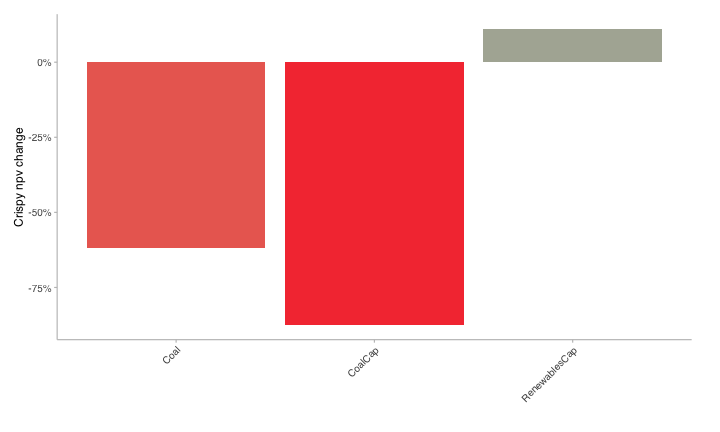
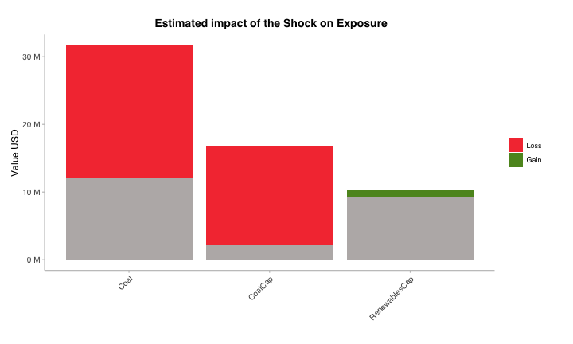
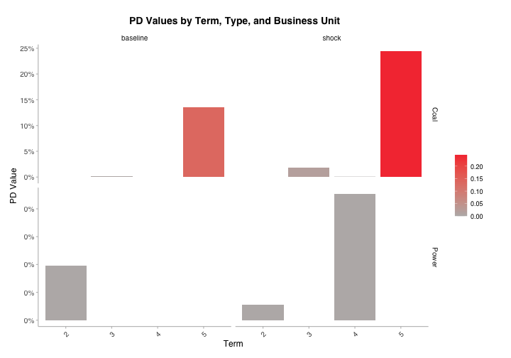
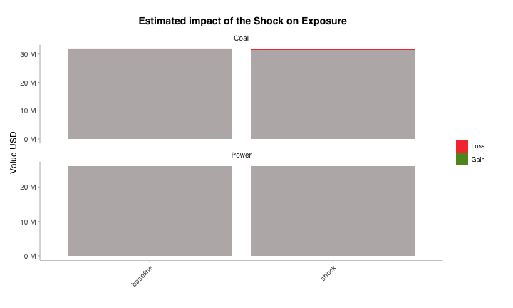

``` r
suppressPackageStartupMessages({
  suppressWarnings(library(trisk.analysis))
  suppressWarnings(library(magrittr))
})
```

# Restrict the analysis to a portfolio

## Generate outputs
### Load the test data

Load the packaged Mongolia client demo datasets.


``` r
assets_testdata <- read.csv(system.file("testdata", "assets_data_mongolia_client.csv", package = "trisk.analysis", mustWork = TRUE))
scenarios_testdata <- read.csv(system.file("testdata", "scenarios_mongolia_client.csv", package = "trisk.analysis", mustWork = TRUE))
financial_features_testdata <- read.csv(system.file("testdata", "financial_features_mongolia_client.csv", package = "trisk.analysis", mustWork = TRUE))
ngfs_carbon_price_testdata <- read.csv(system.file("testdata", "ngfs_carbon_price_mongolia_client.csv", package = "trisk.analysis", mustWork = TRUE))
project_dir_candidates <- c(getwd(), normalizePath(file.path(getwd(), ".."), mustWork = FALSE))
project_dir <- project_dir_candidates[file.exists(file.path(project_dir_candidates, "DESCRIPTION"))][1]
output_dir <- file.path(project_dir, "client_outputs", "mongolia-portfolio-analysis")
dir.create(output_dir, recursive = TRUE, showWarnings = FALSE)
```


### Prepare portfolio

There are 3 possible portfolio input structures :


``` r
portfolio_countries_testdata <- read.csv(system.file("testdata", "portfolio_countries_mongolia_client.csv", package = "trisk.analysis", mustWork = TRUE))
portfolio_ids_testdata <- read.csv(system.file("testdata", "portfolio_ids_mongolia_client.csv", package = "trisk.analysis", mustWork = TRUE))
portfolio_names_testdata <- read.csv(system.file("testdata", "portfolio_names_mongolia_client.csv", package = "trisk.analysis", mustWork = TRUE))
```

Leaving the company_id and company_name columns empty, Trisk results will be aggregated per country and technology, and matched to the portfolio based on those columns.

<div style="border: 1px solid #ddd; padding: 0px; overflow-y: scroll; height:400px; overflow-x: scroll; width:200%; "><table class="table table-striped table-hover table-condensed" style="margin-left: auto; margin-right: auto;">
 <thead>
  <tr>
   <th style="text-align:left;position: sticky; top:0; background-color: #FFFFFF;"> company_id </th>
   <th style="text-align:left;position: sticky; top:0; background-color: #FFFFFF;"> company_name </th>
   <th style="text-align:left;position: sticky; top:0; background-color: #FFFFFF;"> sector </th>
   <th style="text-align:left;position: sticky; top:0; background-color: #FFFFFF;"> technology </th>
   <th style="text-align:left;position: sticky; top:0; background-color: #FFFFFF;"> country_iso2 </th>
   <th style="text-align:right;position: sticky; top:0; background-color: #FFFFFF;"> term </th>
   <th style="text-align:right;position: sticky; top:0; background-color: #FFFFFF;"> exposure_value_usd </th>
   <th style="text-align:right;position: sticky; top:0; background-color: #FFFFFF;"> loss_given_default </th>
  </tr>
 </thead>
<tbody>
  <tr>
   <td style="text-align:left;"> NA </td>
   <td style="text-align:left;"> NA </td>
   <td style="text-align:left;"> Coal </td>
   <td style="text-align:left;"> Coal </td>
   <td style="text-align:left;"> MN </td>
   <td style="text-align:right;"> 2 </td>
   <td style="text-align:right;"> 5600000 </td>
   <td style="text-align:right;"> 0.60 </td>
  </tr>
  <tr>
   <td style="text-align:left;"> NA </td>
   <td style="text-align:left;"> NA </td>
   <td style="text-align:left;"> Coal </td>
   <td style="text-align:left;"> Coal </td>
   <td style="text-align:left;"> MN </td>
   <td style="text-align:right;"> 3 </td>
   <td style="text-align:right;"> 4500000 </td>
   <td style="text-align:right;"> 0.60 </td>
  </tr>
  <tr>
   <td style="text-align:left;"> NA </td>
   <td style="text-align:left;"> NA </td>
   <td style="text-align:left;"> Coal </td>
   <td style="text-align:left;"> Coal </td>
   <td style="text-align:left;"> MN </td>
   <td style="text-align:right;"> 4 </td>
   <td style="text-align:right;"> 11800000 </td>
   <td style="text-align:right;"> 0.65 </td>
  </tr>
  <tr>
   <td style="text-align:left;"> NA </td>
   <td style="text-align:left;"> NA </td>
   <td style="text-align:left;"> Coal </td>
   <td style="text-align:left;"> Coal </td>
   <td style="text-align:left;"> MN </td>
   <td style="text-align:right;"> 5 </td>
   <td style="text-align:right;"> 9800000 </td>
   <td style="text-align:right;"> 0.65 </td>
  </tr>
  <tr>
   <td style="text-align:left;"> NA </td>
   <td style="text-align:left;"> NA </td>
   <td style="text-align:left;"> Power </td>
   <td style="text-align:left;"> CoalCap </td>
   <td style="text-align:left;"> MN </td>
   <td style="text-align:right;"> 4 </td>
   <td style="text-align:right;"> 7300000 </td>
   <td style="text-align:right;"> 0.60 </td>
  </tr>
  <tr>
   <td style="text-align:left;"> NA </td>
   <td style="text-align:left;"> NA </td>
   <td style="text-align:left;"> Power </td>
   <td style="text-align:left;"> CoalCap </td>
   <td style="text-align:left;"> MN </td>
   <td style="text-align:right;"> 5 </td>
   <td style="text-align:right;"> 9500000 </td>
   <td style="text-align:right;"> 0.60 </td>
  </tr>
  <tr>
   <td style="text-align:left;"> NA </td>
   <td style="text-align:left;"> NA </td>
   <td style="text-align:left;"> Power </td>
   <td style="text-align:left;"> RenewablesCap </td>
   <td style="text-align:left;"> MN </td>
   <td style="text-align:right;"> 2 </td>
   <td style="text-align:right;"> 4100000 </td>
   <td style="text-align:right;"> 0.40 </td>
  </tr>
  <tr>
   <td style="text-align:left;"> NA </td>
   <td style="text-align:left;"> NA </td>
   <td style="text-align:left;"> Power </td>
   <td style="text-align:left;"> RenewablesCap </td>
   <td style="text-align:left;"> MN </td>
   <td style="text-align:right;"> 3 </td>
   <td style="text-align:right;"> 5200000 </td>
   <td style="text-align:right;"> 0.40 </td>
  </tr>
</tbody>
</table></div>


Filling in the company_name column, will result in an attempt to fuzzy string matching between company names.

<div style="border: 1px solid #ddd; padding: 0px; overflow-y: scroll; height:400px; overflow-x: scroll; width:200%; "><table class="table table-striped table-hover table-condensed" style="margin-left: auto; margin-right: auto;">
 <thead>
  <tr>
   <th style="text-align:left;position: sticky; top:0; background-color: #FFFFFF;"> company_id </th>
   <th style="text-align:left;position: sticky; top:0; background-color: #FFFFFF;"> company_name </th>
   <th style="text-align:left;position: sticky; top:0; background-color: #FFFFFF;"> sector </th>
   <th style="text-align:left;position: sticky; top:0; background-color: #FFFFFF;"> technology </th>
   <th style="text-align:left;position: sticky; top:0; background-color: #FFFFFF;"> country_iso2 </th>
   <th style="text-align:right;position: sticky; top:0; background-color: #FFFFFF;"> exposure_value_usd </th>
   <th style="text-align:right;position: sticky; top:0; background-color: #FFFFFF;"> term </th>
   <th style="text-align:right;position: sticky; top:0; background-color: #FFFFFF;"> loss_given_default </th>
  </tr>
 </thead>
<tbody>
  <tr>
   <td style="text-align:left;"> NA </td>
   <td style="text-align:left;"> Compny 1 </td>
   <td style="text-align:left;"> Power </td>
   <td style="text-align:left;"> CoalCap </td>
   <td style="text-align:left;"> MN </td>
   <td style="text-align:right;"> 9500000 </td>
   <td style="text-align:right;"> 5 </td>
   <td style="text-align:right;"> 0.60 </td>
  </tr>
  <tr>
   <td style="text-align:left;"> NA </td>
   <td style="text-align:left;"> Comany 2 </td>
   <td style="text-align:left;"> Power </td>
   <td style="text-align:left;"> RenewablesCap </td>
   <td style="text-align:left;"> MN </td>
   <td style="text-align:right;"> 4100000 </td>
   <td style="text-align:right;"> 2 </td>
   <td style="text-align:right;"> 0.40 </td>
  </tr>
  <tr>
   <td style="text-align:left;"> NA </td>
   <td style="text-align:left;"> Compny 3 </td>
   <td style="text-align:left;"> Coal </td>
   <td style="text-align:left;"> Coal </td>
   <td style="text-align:left;"> MN </td>
   <td style="text-align:right;"> 11800000 </td>
   <td style="text-align:right;"> 4 </td>
   <td style="text-align:right;"> 0.65 </td>
  </tr>
  <tr>
   <td style="text-align:left;"> NA </td>
   <td style="text-align:left;"> Compony 4 </td>
   <td style="text-align:left;"> Power </td>
   <td style="text-align:left;"> RenewablesCap </td>
   <td style="text-align:left;"> MN </td>
   <td style="text-align:right;"> 5200000 </td>
   <td style="text-align:right;"> 3 </td>
   <td style="text-align:right;"> 0.40 </td>
  </tr>
  <tr>
   <td style="text-align:left;"> NA </td>
   <td style="text-align:left;"> Compny 5 </td>
   <td style="text-align:left;"> Coal </td>
   <td style="text-align:left;"> Coal </td>
   <td style="text-align:left;"> MN </td>
   <td style="text-align:right;"> 9800000 </td>
   <td style="text-align:right;"> 5 </td>
   <td style="text-align:right;"> 0.65 </td>
  </tr>
  <tr>
   <td style="text-align:left;"> NA </td>
   <td style="text-align:left;"> Company Six </td>
   <td style="text-align:left;"> Power </td>
   <td style="text-align:left;"> CoalCap </td>
   <td style="text-align:left;"> MN </td>
   <td style="text-align:right;"> 7300000 </td>
   <td style="text-align:right;"> 4 </td>
   <td style="text-align:right;"> 0.60 </td>
  </tr>
  <tr>
   <td style="text-align:left;"> NA </td>
   <td style="text-align:left;"> Company Sevn </td>
   <td style="text-align:left;"> Coal </td>
   <td style="text-align:left;"> Coal </td>
   <td style="text-align:left;"> MN </td>
   <td style="text-align:right;"> 5600000 </td>
   <td style="text-align:right;"> 2 </td>
   <td style="text-align:right;"> 0.60 </td>
  </tr>
  <tr>
   <td style="text-align:left;"> NA </td>
   <td style="text-align:left;"> Compny 8 </td>
   <td style="text-align:left;"> Coal </td>
   <td style="text-align:left;"> Coal </td>
   <td style="text-align:left;"> MN </td>
   <td style="text-align:right;"> 4500000 </td>
   <td style="text-align:right;"> 3 </td>
   <td style="text-align:right;"> 0.60 </td>
  </tr>
</tbody>
</table></div>


Filling in the company_id column, will result in an exact match between companies.

<div style="border: 1px solid #ddd; padding: 0px; overflow-y: scroll; height:400px; overflow-x: scroll; width:200%; "><table class="table table-striped table-hover table-condensed" style="margin-left: auto; margin-right: auto;">
 <thead>
  <tr>
   <th style="text-align:right;position: sticky; top:0; background-color: #FFFFFF;"> company_id </th>
   <th style="text-align:left;position: sticky; top:0; background-color: #FFFFFF;"> company_name </th>
   <th style="text-align:left;position: sticky; top:0; background-color: #FFFFFF;"> sector </th>
   <th style="text-align:left;position: sticky; top:0; background-color: #FFFFFF;"> technology </th>
   <th style="text-align:left;position: sticky; top:0; background-color: #FFFFFF;"> country_iso2 </th>
   <th style="text-align:right;position: sticky; top:0; background-color: #FFFFFF;"> exposure_value_usd </th>
   <th style="text-align:right;position: sticky; top:0; background-color: #FFFFFF;"> term </th>
   <th style="text-align:right;position: sticky; top:0; background-color: #FFFFFF;"> loss_given_default </th>
  </tr>
 </thead>
<tbody>
  <tr>
   <td style="text-align:right;"> 101 </td>
   <td style="text-align:left;"> NA </td>
   <td style="text-align:left;"> Power </td>
   <td style="text-align:left;"> CoalCap </td>
   <td style="text-align:left;"> MN </td>
   <td style="text-align:right;"> 9500000 </td>
   <td style="text-align:right;"> 5 </td>
   <td style="text-align:right;"> 0.60 </td>
  </tr>
  <tr>
   <td style="text-align:right;"> 102 </td>
   <td style="text-align:left;"> NA </td>
   <td style="text-align:left;"> Power </td>
   <td style="text-align:left;"> RenewablesCap </td>
   <td style="text-align:left;"> MN </td>
   <td style="text-align:right;"> 4100000 </td>
   <td style="text-align:right;"> 2 </td>
   <td style="text-align:right;"> 0.40 </td>
  </tr>
  <tr>
   <td style="text-align:right;"> 103 </td>
   <td style="text-align:left;"> NA </td>
   <td style="text-align:left;"> Coal </td>
   <td style="text-align:left;"> Coal </td>
   <td style="text-align:left;"> MN </td>
   <td style="text-align:right;"> 11800000 </td>
   <td style="text-align:right;"> 4 </td>
   <td style="text-align:right;"> 0.65 </td>
  </tr>
  <tr>
   <td style="text-align:right;"> 104 </td>
   <td style="text-align:left;"> NA </td>
   <td style="text-align:left;"> Power </td>
   <td style="text-align:left;"> RenewablesCap </td>
   <td style="text-align:left;"> MN </td>
   <td style="text-align:right;"> 5200000 </td>
   <td style="text-align:right;"> 3 </td>
   <td style="text-align:right;"> 0.40 </td>
  </tr>
  <tr>
   <td style="text-align:right;"> 105 </td>
   <td style="text-align:left;"> NA </td>
   <td style="text-align:left;"> Coal </td>
   <td style="text-align:left;"> Coal </td>
   <td style="text-align:left;"> MN </td>
   <td style="text-align:right;"> 9800000 </td>
   <td style="text-align:right;"> 5 </td>
   <td style="text-align:right;"> 0.65 </td>
  </tr>
  <tr>
   <td style="text-align:right;"> 106 </td>
   <td style="text-align:left;"> NA </td>
   <td style="text-align:left;"> Power </td>
   <td style="text-align:left;"> CoalCap </td>
   <td style="text-align:left;"> MN </td>
   <td style="text-align:right;"> 7300000 </td>
   <td style="text-align:right;"> 4 </td>
   <td style="text-align:right;"> 0.60 </td>
  </tr>
  <tr>
   <td style="text-align:right;"> 107 </td>
   <td style="text-align:left;"> NA </td>
   <td style="text-align:left;"> Coal </td>
   <td style="text-align:left;"> Coal </td>
   <td style="text-align:left;"> MN </td>
   <td style="text-align:right;"> 5600000 </td>
   <td style="text-align:right;"> 2 </td>
   <td style="text-align:right;"> 0.60 </td>
  </tr>
  <tr>
   <td style="text-align:right;"> 108 </td>
   <td style="text-align:left;"> NA </td>
   <td style="text-align:left;"> Coal </td>
   <td style="text-align:left;"> Coal </td>
   <td style="text-align:left;"> MN </td>
   <td style="text-align:right;"> 4500000 </td>
   <td style="text-align:right;"> 3 </td>
   <td style="text-align:right;"> 0.60 </td>
  </tr>
</tbody>
</table></div>


Using the company ids is recommended to match the portfolio. In our current asset data, a unique asset is defined by a unique combination of company_id, sector, technology, and country. Those other columns are used for the matching between the portfolio and the Trisk outputs.


``` r
portfolio_testdata <- portfolio_ids_testdata
```

A synthetic portfolio is used here so the vignette stays runnable and produces client-facing visuals from the collapsed Mongolia asset dataset.

### Run trisk 

Run the model with the provided data, after filtering assets on those available in the portfolio.

Define a central Mongolia case to use:

``` r
baseline_scenario <- "NGFS2024GCAM_CP"
target_scenario <- "NGFS2024GCAM_DT"
scenario_geography <- "Asia"
risk_free_rate <- 0.04
discount_rate <- 0.10
growth_rate <- 0.03
shock_year <- 2030
carbon_price_model <- "no_carbon_tax"
```

The function `run_trisk_on_portfolio()` handles the filtering on portfolio and then runs Trisk:

``` r
analysis_data <- run_trisk_on_portfolio(
  assets_data = assets_testdata,
  scenarios_data = scenarios_testdata,
  financial_data = financial_features_testdata,
  carbon_data = ngfs_carbon_price_testdata,
  portfolio_data = portfolio_testdata,
  baseline_scenario = baseline_scenario,
  target_scenario = target_scenario,
  scenario_geography = scenario_geography,
  risk_free_rate = risk_free_rate,
  discount_rate = discount_rate,
  growth_rate = growth_rate,
  shock_year = shock_year,
  carbon_price_model = carbon_price_model
)
#> -- Start Trisk-- Retyping Dataframes. 
#> -- Processing Assets and Scenarios. 
#> -- Transforming to Trisk model input. 
#> -- Calculating baseline, target, and shock trajectories. 
#> -- Calculating net profits.
#> Joining with `by = join_by(asset_id, company_id, sector, technology)`
#> -- Calculating market risk. 
#> -- Calculating credit risk.

utils::write.csv(
  analysis_data,
  file.path(output_dir, "portfolio_analysis_data.csv"),
  row.names = FALSE
)
```

Result dataframe : 

<div style="border: 1px solid #ddd; padding: 0px; overflow-y: scroll; height:400px; overflow-x: scroll; width:200%; "><table class="table table-striped table-hover table-condensed" style="margin-left: auto; margin-right: auto;">
 <thead>
  <tr>
   <th style="text-align:left;position: sticky; top:0; background-color: #FFFFFF;"> company_id </th>
   <th style="text-align:left;position: sticky; top:0; background-color: #FFFFFF;"> company_name </th>
   <th style="text-align:left;position: sticky; top:0; background-color: #FFFFFF;"> sector </th>
   <th style="text-align:left;position: sticky; top:0; background-color: #FFFFFF;"> technology </th>
   <th style="text-align:left;position: sticky; top:0; background-color: #FFFFFF;"> country_iso2 </th>
   <th style="text-align:right;position: sticky; top:0; background-color: #FFFFFF;"> exposure_value_usd </th>
   <th style="text-align:right;position: sticky; top:0; background-color: #FFFFFF;"> term </th>
   <th style="text-align:right;position: sticky; top:0; background-color: #FFFFFF;"> loss_given_default </th>
   <th style="text-align:left;position: sticky; top:0; background-color: #FFFFFF;"> run_id </th>
   <th style="text-align:left;position: sticky; top:0; background-color: #FFFFFF;"> asset_id </th>
   <th style="text-align:left;position: sticky; top:0; background-color: #FFFFFF;"> asset_name </th>
   <th style="text-align:right;position: sticky; top:0; background-color: #FFFFFF;"> net_present_value_baseline </th>
   <th style="text-align:right;position: sticky; top:0; background-color: #FFFFFF;"> net_present_value_shock </th>
   <th style="text-align:right;position: sticky; top:0; background-color: #FFFFFF;"> net_present_value_difference </th>
   <th style="text-align:right;position: sticky; top:0; background-color: #FFFFFF;"> net_present_value_change </th>
   <th style="text-align:right;position: sticky; top:0; background-color: #FFFFFF;"> pd_baseline </th>
   <th style="text-align:right;position: sticky; top:0; background-color: #FFFFFF;"> pd_shock </th>
  </tr>
 </thead>
<tbody>
  <tr>
   <td style="text-align:left;"> 101 </td>
   <td style="text-align:left;"> NA </td>
   <td style="text-align:left;"> Power </td>
   <td style="text-align:left;"> CoalCap </td>
   <td style="text-align:left;"> MN </td>
   <td style="text-align:right;"> 9500000 </td>
   <td style="text-align:right;"> 5 </td>
   <td style="text-align:right;"> 0.60 </td>
   <td style="text-align:left;"> 2e60a980-3918-4d8a-9873-5d9b10315da6 </td>
   <td style="text-align:left;"> 101 </td>
   <td style="text-align:left;"> Company 1 </td>
   <td style="text-align:right;"> 135981288 </td>
   <td style="text-align:right;"> 16406000 </td>
   <td style="text-align:right;"> -119575288 </td>
   <td style="text-align:right;"> -0.8793510 </td>
   <td style="text-align:right;"> 0.0000000 </td>
   <td style="text-align:right;"> 0.0000000 </td>
  </tr>
  <tr>
   <td style="text-align:left;"> 102 </td>
   <td style="text-align:left;"> NA </td>
   <td style="text-align:left;"> Power </td>
   <td style="text-align:left;"> RenewablesCap </td>
   <td style="text-align:left;"> MN </td>
   <td style="text-align:right;"> 4100000 </td>
   <td style="text-align:right;"> 2 </td>
   <td style="text-align:right;"> 0.40 </td>
   <td style="text-align:left;"> 2e60a980-3918-4d8a-9873-5d9b10315da6 </td>
   <td style="text-align:left;"> 102 </td>
   <td style="text-align:left;"> Company 2 </td>
   <td style="text-align:right;"> 64143567 </td>
   <td style="text-align:right;"> 71242547 </td>
   <td style="text-align:right;"> 7098980 </td>
   <td style="text-align:right;"> 0.1106733 </td>
   <td style="text-align:right;"> 0.0000000 </td>
   <td style="text-align:right;"> 0.0000000 </td>
  </tr>
  <tr>
   <td style="text-align:left;"> 103 </td>
   <td style="text-align:left;"> NA </td>
   <td style="text-align:left;"> Coal </td>
   <td style="text-align:left;"> Coal </td>
   <td style="text-align:left;"> MN </td>
   <td style="text-align:right;"> 11800000 </td>
   <td style="text-align:right;"> 4 </td>
   <td style="text-align:right;"> 0.65 </td>
   <td style="text-align:left;"> 2e60a980-3918-4d8a-9873-5d9b10315da6 </td>
   <td style="text-align:left;"> 103 </td>
   <td style="text-align:left;"> Company 3 </td>
   <td style="text-align:right;"> 2227663620 </td>
   <td style="text-align:right;"> 850136432 </td>
   <td style="text-align:right;"> -1377527188 </td>
   <td style="text-align:right;"> -0.6183731 </td>
   <td style="text-align:right;"> 0.0000004 </td>
   <td style="text-align:right;"> 0.0005237 </td>
  </tr>
  <tr>
   <td style="text-align:left;"> 104 </td>
   <td style="text-align:left;"> NA </td>
   <td style="text-align:left;"> Power </td>
   <td style="text-align:left;"> RenewablesCap </td>
   <td style="text-align:left;"> MN </td>
   <td style="text-align:right;"> 5200000 </td>
   <td style="text-align:right;"> 3 </td>
   <td style="text-align:right;"> 0.40 </td>
   <td style="text-align:left;"> 2e60a980-3918-4d8a-9873-5d9b10315da6 </td>
   <td style="text-align:left;"> 104 </td>
   <td style="text-align:left;"> Company 4 </td>
   <td style="text-align:right;"> 207872671 </td>
   <td style="text-align:right;"> 230878625 </td>
   <td style="text-align:right;"> 23005954 </td>
   <td style="text-align:right;"> 0.1106733 </td>
   <td style="text-align:right;"> 0.0000000 </td>
   <td style="text-align:right;"> 0.0000000 </td>
  </tr>
  <tr>
   <td style="text-align:left;"> 105 </td>
   <td style="text-align:left;"> NA </td>
   <td style="text-align:left;"> Coal </td>
   <td style="text-align:left;"> Coal </td>
   <td style="text-align:left;"> MN </td>
   <td style="text-align:right;"> 9800000 </td>
   <td style="text-align:right;"> 5 </td>
   <td style="text-align:right;"> 0.65 </td>
   <td style="text-align:left;"> 2e60a980-3918-4d8a-9873-5d9b10315da6 </td>
   <td style="text-align:left;"> 105 </td>
   <td style="text-align:left;"> Company 5 </td>
   <td style="text-align:right;"> 164365895 </td>
   <td style="text-align:right;"> 62726452 </td>
   <td style="text-align:right;"> -101639443 </td>
   <td style="text-align:right;"> -0.6183731 </td>
   <td style="text-align:right;"> 0.1354469 </td>
   <td style="text-align:right;"> 0.2450068 </td>
  </tr>
  <tr>
   <td style="text-align:left;"> 106 </td>
   <td style="text-align:left;"> NA </td>
   <td style="text-align:left;"> Power </td>
   <td style="text-align:left;"> CoalCap </td>
   <td style="text-align:left;"> MN </td>
   <td style="text-align:right;"> 7300000 </td>
   <td style="text-align:right;"> 4 </td>
   <td style="text-align:right;"> 0.60 </td>
   <td style="text-align:left;"> 2e60a980-3918-4d8a-9873-5d9b10315da6 </td>
   <td style="text-align:left;"> 106 </td>
   <td style="text-align:left;"> Company 6 </td>
   <td style="text-align:right;"> 15625176 </td>
   <td style="text-align:right;"> 2605046 </td>
   <td style="text-align:right;"> -13020131 </td>
   <td style="text-align:right;"> -0.8332790 </td>
   <td style="text-align:right;"> 0.0000000 </td>
   <td style="text-align:right;"> 0.0000000 </td>
  </tr>
  <tr>
   <td style="text-align:left;"> 107 </td>
   <td style="text-align:left;"> NA </td>
   <td style="text-align:left;"> Coal </td>
   <td style="text-align:left;"> Coal </td>
   <td style="text-align:left;"> MN </td>
   <td style="text-align:right;"> 5600000 </td>
   <td style="text-align:right;"> 2 </td>
   <td style="text-align:right;"> 0.60 </td>
   <td style="text-align:left;"> 2e60a980-3918-4d8a-9873-5d9b10315da6 </td>
   <td style="text-align:left;"> 107 </td>
   <td style="text-align:left;"> Company 7 </td>
   <td style="text-align:right;"> 227583547 </td>
   <td style="text-align:right;"> 86852011 </td>
   <td style="text-align:right;"> -140731536 </td>
   <td style="text-align:right;"> -0.6183731 </td>
   <td style="text-align:right;"> 0.0000000 </td>
   <td style="text-align:right;"> 0.0000016 </td>
  </tr>
  <tr>
   <td style="text-align:left;"> 108 </td>
   <td style="text-align:left;"> NA </td>
   <td style="text-align:left;"> Coal </td>
   <td style="text-align:left;"> Coal </td>
   <td style="text-align:left;"> MN </td>
   <td style="text-align:right;"> 4500000 </td>
   <td style="text-align:right;"> 3 </td>
   <td style="text-align:right;"> 0.60 </td>
   <td style="text-align:left;"> 2e60a980-3918-4d8a-9873-5d9b10315da6 </td>
   <td style="text-align:left;"> 108 </td>
   <td style="text-align:left;"> Company 8 </td>
   <td style="text-align:right;"> 19471037 </td>
   <td style="text-align:right;"> 7430672 </td>
   <td style="text-align:right;"> -12040365 </td>
   <td style="text-align:right;"> -0.6183731 </td>
   <td style="text-align:right;"> 0.0016175 </td>
   <td style="text-align:right;"> 0.0176998 </td>
  </tr>
</tbody>
</table></div>


## Plot results

### Equities risk

Plot the average percentage of NPV change per technology


``` r
npv_change_plot <- pipeline_crispy_npv_change_plot(analysis_data)
#> Joining with `by = join_by(sector, technology)`
npv_change_plot
```



``` r
ggplot2::ggsave(
  filename = file.path(output_dir, "npv_change_plot.png"),
  plot = npv_change_plot,
  width = 10,
  height = 6,
  dpi = 300
)
```

Plot the resulting portfolio's exposure change 


``` r
exposure_change_plot <- pipeline_crispy_exposure_change_plot(analysis_data)
#> Joining with `by = join_by(sector, technology)`
exposure_change_plot
```



``` r
ggplot2::ggsave(
  filename = file.path(output_dir, "exposure_change_plot.png"),
  plot = exposure_change_plot,
  width = 10,
  height = 6,
  dpi = 300
)
```
### Bonds&Loans risk

Plot the average PDs at baseline and shock


``` r
pd_term_plot <- pipeline_crispy_pd_term_plot(analysis_data)
#> Joining with `by = join_by(sector, term)`
pd_term_plot
```



``` r
ggplot2::ggsave(
  filename = file.path(output_dir, "pd_term_plot.png"),
  plot = pd_term_plot,
  width = 10,
  height = 7,
  dpi = 300
)
```

Plot the resulting portfolio's expected loss


``` r
expected_loss_plot <- pipeline_crispy_expected_loss_plot(analysis_data)
#> Joining with `by = join_by(sector)`
expected_loss_plot
```



``` r
ggplot2::ggsave(
  filename = file.path(output_dir, "expected_loss_plot.png"),
  plot = expected_loss_plot,
  width = 10,
  height = 6,
  dpi = 300
)
```

Saved files:


``` r
list.files(output_dir)
#> [1] "expected_loss_plot.png"      "exposure_change_plot.png"   
#> [3] "npv_change_plot.png"         "pd_term_plot.png"           
#> [5] "portfolio_analysis_data.csv"
```
