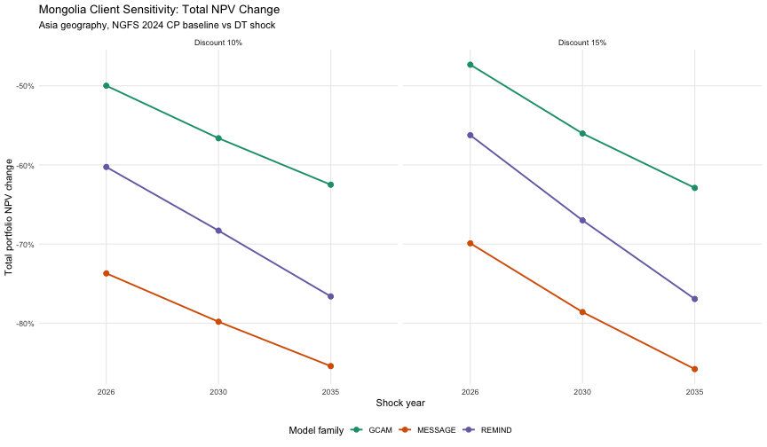
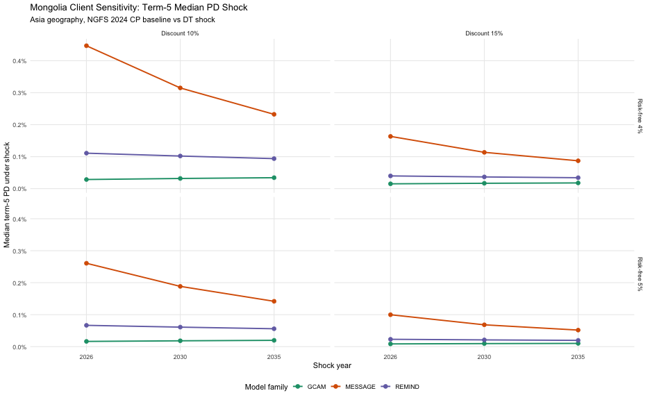
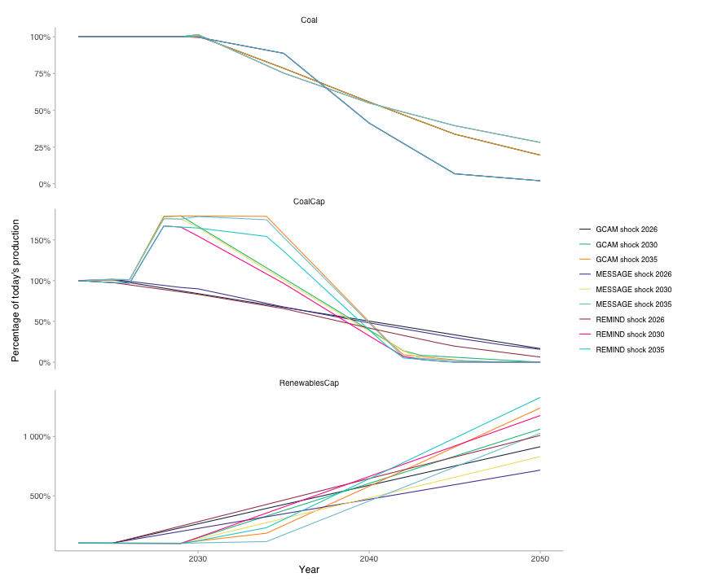

``` r
suppressPackageStartupMessages({
  suppressWarnings(library(trisk.analysis))
  suppressWarnings(library(magrittr))
  suppressWarnings(library(dplyr))
  suppressWarnings(library(tidyr))
  suppressWarnings(library(ggplot2))
  suppressWarnings(library(scales))
})
```


``` r
assets_testdata <- read.csv(system.file("testdata", "assets_data_mongolia_client.csv", package = "trisk.analysis", mustWork = TRUE))
scenarios_testdata <- read.csv(system.file("testdata", "scenarios_mongolia_client.csv", package = "trisk.analysis", mustWork = TRUE))
financial_features_testdata <- read.csv(system.file("testdata", "financial_features_mongolia_client.csv", package = "trisk.analysis", mustWork = TRUE))
ngfs_carbon_price_testdata <- read.csv(system.file("testdata", "ngfs_carbon_price_mongolia_client.csv", package = "trisk.analysis", mustWork = TRUE))

project_dir_candidates <- c(getwd(), normalizePath(file.path(getwd(), ".."), mustWork = FALSE))
project_dir <- project_dir_candidates[file.exists(file.path(project_dir_candidates, "DESCRIPTION"))][1]
output_dir <- file.path(project_dir, "client_outputs", "mongolia-sensitivity-analysis")
dir.create(output_dir, recursive = TRUE, showWarnings = FALSE)
```

# Sensitivity Analysis

This vignette runs a Mongolia-focused sensitivity grid on the collapsed client asset dataset.

## Run matrix

The requested setup is:

- Asia geography only
- NGFS 2024 `GCAM`, `MESSAGE`, and `REMIND`
- baseline `CP` and target `DT`
- shock years `2026`, `2030`, and `2035`
- discount rates `10%` and `15%`
- growth rate `3%`
- risk-free rates `4%` and `5%`

Because `shock_year` is scalar per TRISK run, the three shock years are represented as separate entries in the sensitivity grid rather than passed as one vector to a single run.


``` r
run_grid <- tidyr::expand_grid(
  model_family = c("GCAM", "MESSAGE", "REMIND"),
  shock_year = c(2026, 2030, 2035),
  discount_rate = c(0.10, 0.15),
  risk_free_rate = c(0.04, 0.05)
) %>%
  mutate(
    scenario_geography = "Asia",
    baseline_scenario = paste0("NGFS2024", .data$model_family, "_CP"),
    target_scenario = paste0("NGFS2024", .data$model_family, "_DT"),
    growth_rate = 0.03,
    carbon_price_model = "no_carbon_tax",
    div_netprofit_prop_coef = 1,
    market_passthrough = 0
  ) %>%
  relocate(
    model_family,
    baseline_scenario,
    target_scenario,
    scenario_geography
  )

run_params <- run_grid %>%
  select(
    -model_family
  ) %>%
  split(seq_len(nrow(.))) %>%
  lapply(as.list)

knitr::kable(run_grid) %>%
  kableExtra::kable_styling(bootstrap_options = c("striped", "hover", "condensed")) %>%
  kableExtra::scroll_box(width = "200%", height = "400px")
```

<div style="border: 1px solid #ddd; padding: 0px; overflow-y: scroll; height:400px; overflow-x: scroll; width:200%; "><table class="table table-striped table-hover table-condensed" style="margin-left: auto; margin-right: auto;">
 <thead>
  <tr>
   <th style="text-align:left;position: sticky; top:0; background-color: #FFFFFF;"> model_family </th>
   <th style="text-align:left;position: sticky; top:0; background-color: #FFFFFF;"> baseline_scenario </th>
   <th style="text-align:left;position: sticky; top:0; background-color: #FFFFFF;"> target_scenario </th>
   <th style="text-align:left;position: sticky; top:0; background-color: #FFFFFF;"> scenario_geography </th>
   <th style="text-align:right;position: sticky; top:0; background-color: #FFFFFF;"> shock_year </th>
   <th style="text-align:right;position: sticky; top:0; background-color: #FFFFFF;"> discount_rate </th>
   <th style="text-align:right;position: sticky; top:0; background-color: #FFFFFF;"> risk_free_rate </th>
   <th style="text-align:right;position: sticky; top:0; background-color: #FFFFFF;"> growth_rate </th>
   <th style="text-align:left;position: sticky; top:0; background-color: #FFFFFF;"> carbon_price_model </th>
   <th style="text-align:right;position: sticky; top:0; background-color: #FFFFFF;"> div_netprofit_prop_coef </th>
   <th style="text-align:right;position: sticky; top:0; background-color: #FFFFFF;"> market_passthrough </th>
  </tr>
 </thead>
<tbody>
  <tr>
   <td style="text-align:left;"> GCAM </td>
   <td style="text-align:left;"> NGFS2024GCAM_CP </td>
   <td style="text-align:left;"> NGFS2024GCAM_DT </td>
   <td style="text-align:left;"> Asia </td>
   <td style="text-align:right;"> 2026 </td>
   <td style="text-align:right;"> 0.10 </td>
   <td style="text-align:right;"> 0.04 </td>
   <td style="text-align:right;"> 0.03 </td>
   <td style="text-align:left;"> no_carbon_tax </td>
   <td style="text-align:right;"> 1 </td>
   <td style="text-align:right;"> 0 </td>
  </tr>
  <tr>
   <td style="text-align:left;"> GCAM </td>
   <td style="text-align:left;"> NGFS2024GCAM_CP </td>
   <td style="text-align:left;"> NGFS2024GCAM_DT </td>
   <td style="text-align:left;"> Asia </td>
   <td style="text-align:right;"> 2026 </td>
   <td style="text-align:right;"> 0.10 </td>
   <td style="text-align:right;"> 0.05 </td>
   <td style="text-align:right;"> 0.03 </td>
   <td style="text-align:left;"> no_carbon_tax </td>
   <td style="text-align:right;"> 1 </td>
   <td style="text-align:right;"> 0 </td>
  </tr>
  <tr>
   <td style="text-align:left;"> GCAM </td>
   <td style="text-align:left;"> NGFS2024GCAM_CP </td>
   <td style="text-align:left;"> NGFS2024GCAM_DT </td>
   <td style="text-align:left;"> Asia </td>
   <td style="text-align:right;"> 2026 </td>
   <td style="text-align:right;"> 0.15 </td>
   <td style="text-align:right;"> 0.04 </td>
   <td style="text-align:right;"> 0.03 </td>
   <td style="text-align:left;"> no_carbon_tax </td>
   <td style="text-align:right;"> 1 </td>
   <td style="text-align:right;"> 0 </td>
  </tr>
  <tr>
   <td style="text-align:left;"> GCAM </td>
   <td style="text-align:left;"> NGFS2024GCAM_CP </td>
   <td style="text-align:left;"> NGFS2024GCAM_DT </td>
   <td style="text-align:left;"> Asia </td>
   <td style="text-align:right;"> 2026 </td>
   <td style="text-align:right;"> 0.15 </td>
   <td style="text-align:right;"> 0.05 </td>
   <td style="text-align:right;"> 0.03 </td>
   <td style="text-align:left;"> no_carbon_tax </td>
   <td style="text-align:right;"> 1 </td>
   <td style="text-align:right;"> 0 </td>
  </tr>
  <tr>
   <td style="text-align:left;"> GCAM </td>
   <td style="text-align:left;"> NGFS2024GCAM_CP </td>
   <td style="text-align:left;"> NGFS2024GCAM_DT </td>
   <td style="text-align:left;"> Asia </td>
   <td style="text-align:right;"> 2030 </td>
   <td style="text-align:right;"> 0.10 </td>
   <td style="text-align:right;"> 0.04 </td>
   <td style="text-align:right;"> 0.03 </td>
   <td style="text-align:left;"> no_carbon_tax </td>
   <td style="text-align:right;"> 1 </td>
   <td style="text-align:right;"> 0 </td>
  </tr>
  <tr>
   <td style="text-align:left;"> GCAM </td>
   <td style="text-align:left;"> NGFS2024GCAM_CP </td>
   <td style="text-align:left;"> NGFS2024GCAM_DT </td>
   <td style="text-align:left;"> Asia </td>
   <td style="text-align:right;"> 2030 </td>
   <td style="text-align:right;"> 0.10 </td>
   <td style="text-align:right;"> 0.05 </td>
   <td style="text-align:right;"> 0.03 </td>
   <td style="text-align:left;"> no_carbon_tax </td>
   <td style="text-align:right;"> 1 </td>
   <td style="text-align:right;"> 0 </td>
  </tr>
  <tr>
   <td style="text-align:left;"> GCAM </td>
   <td style="text-align:left;"> NGFS2024GCAM_CP </td>
   <td style="text-align:left;"> NGFS2024GCAM_DT </td>
   <td style="text-align:left;"> Asia </td>
   <td style="text-align:right;"> 2030 </td>
   <td style="text-align:right;"> 0.15 </td>
   <td style="text-align:right;"> 0.04 </td>
   <td style="text-align:right;"> 0.03 </td>
   <td style="text-align:left;"> no_carbon_tax </td>
   <td style="text-align:right;"> 1 </td>
   <td style="text-align:right;"> 0 </td>
  </tr>
  <tr>
   <td style="text-align:left;"> GCAM </td>
   <td style="text-align:left;"> NGFS2024GCAM_CP </td>
   <td style="text-align:left;"> NGFS2024GCAM_DT </td>
   <td style="text-align:left;"> Asia </td>
   <td style="text-align:right;"> 2030 </td>
   <td style="text-align:right;"> 0.15 </td>
   <td style="text-align:right;"> 0.05 </td>
   <td style="text-align:right;"> 0.03 </td>
   <td style="text-align:left;"> no_carbon_tax </td>
   <td style="text-align:right;"> 1 </td>
   <td style="text-align:right;"> 0 </td>
  </tr>
  <tr>
   <td style="text-align:left;"> GCAM </td>
   <td style="text-align:left;"> NGFS2024GCAM_CP </td>
   <td style="text-align:left;"> NGFS2024GCAM_DT </td>
   <td style="text-align:left;"> Asia </td>
   <td style="text-align:right;"> 2035 </td>
   <td style="text-align:right;"> 0.10 </td>
   <td style="text-align:right;"> 0.04 </td>
   <td style="text-align:right;"> 0.03 </td>
   <td style="text-align:left;"> no_carbon_tax </td>
   <td style="text-align:right;"> 1 </td>
   <td style="text-align:right;"> 0 </td>
  </tr>
  <tr>
   <td style="text-align:left;"> GCAM </td>
   <td style="text-align:left;"> NGFS2024GCAM_CP </td>
   <td style="text-align:left;"> NGFS2024GCAM_DT </td>
   <td style="text-align:left;"> Asia </td>
   <td style="text-align:right;"> 2035 </td>
   <td style="text-align:right;"> 0.10 </td>
   <td style="text-align:right;"> 0.05 </td>
   <td style="text-align:right;"> 0.03 </td>
   <td style="text-align:left;"> no_carbon_tax </td>
   <td style="text-align:right;"> 1 </td>
   <td style="text-align:right;"> 0 </td>
  </tr>
  <tr>
   <td style="text-align:left;"> GCAM </td>
   <td style="text-align:left;"> NGFS2024GCAM_CP </td>
   <td style="text-align:left;"> NGFS2024GCAM_DT </td>
   <td style="text-align:left;"> Asia </td>
   <td style="text-align:right;"> 2035 </td>
   <td style="text-align:right;"> 0.15 </td>
   <td style="text-align:right;"> 0.04 </td>
   <td style="text-align:right;"> 0.03 </td>
   <td style="text-align:left;"> no_carbon_tax </td>
   <td style="text-align:right;"> 1 </td>
   <td style="text-align:right;"> 0 </td>
  </tr>
  <tr>
   <td style="text-align:left;"> GCAM </td>
   <td style="text-align:left;"> NGFS2024GCAM_CP </td>
   <td style="text-align:left;"> NGFS2024GCAM_DT </td>
   <td style="text-align:left;"> Asia </td>
   <td style="text-align:right;"> 2035 </td>
   <td style="text-align:right;"> 0.15 </td>
   <td style="text-align:right;"> 0.05 </td>
   <td style="text-align:right;"> 0.03 </td>
   <td style="text-align:left;"> no_carbon_tax </td>
   <td style="text-align:right;"> 1 </td>
   <td style="text-align:right;"> 0 </td>
  </tr>
  <tr>
   <td style="text-align:left;"> MESSAGE </td>
   <td style="text-align:left;"> NGFS2024MESSAGE_CP </td>
   <td style="text-align:left;"> NGFS2024MESSAGE_DT </td>
   <td style="text-align:left;"> Asia </td>
   <td style="text-align:right;"> 2026 </td>
   <td style="text-align:right;"> 0.10 </td>
   <td style="text-align:right;"> 0.04 </td>
   <td style="text-align:right;"> 0.03 </td>
   <td style="text-align:left;"> no_carbon_tax </td>
   <td style="text-align:right;"> 1 </td>
   <td style="text-align:right;"> 0 </td>
  </tr>
  <tr>
   <td style="text-align:left;"> MESSAGE </td>
   <td style="text-align:left;"> NGFS2024MESSAGE_CP </td>
   <td style="text-align:left;"> NGFS2024MESSAGE_DT </td>
   <td style="text-align:left;"> Asia </td>
   <td style="text-align:right;"> 2026 </td>
   <td style="text-align:right;"> 0.10 </td>
   <td style="text-align:right;"> 0.05 </td>
   <td style="text-align:right;"> 0.03 </td>
   <td style="text-align:left;"> no_carbon_tax </td>
   <td style="text-align:right;"> 1 </td>
   <td style="text-align:right;"> 0 </td>
  </tr>
  <tr>
   <td style="text-align:left;"> MESSAGE </td>
   <td style="text-align:left;"> NGFS2024MESSAGE_CP </td>
   <td style="text-align:left;"> NGFS2024MESSAGE_DT </td>
   <td style="text-align:left;"> Asia </td>
   <td style="text-align:right;"> 2026 </td>
   <td style="text-align:right;"> 0.15 </td>
   <td style="text-align:right;"> 0.04 </td>
   <td style="text-align:right;"> 0.03 </td>
   <td style="text-align:left;"> no_carbon_tax </td>
   <td style="text-align:right;"> 1 </td>
   <td style="text-align:right;"> 0 </td>
  </tr>
  <tr>
   <td style="text-align:left;"> MESSAGE </td>
   <td style="text-align:left;"> NGFS2024MESSAGE_CP </td>
   <td style="text-align:left;"> NGFS2024MESSAGE_DT </td>
   <td style="text-align:left;"> Asia </td>
   <td style="text-align:right;"> 2026 </td>
   <td style="text-align:right;"> 0.15 </td>
   <td style="text-align:right;"> 0.05 </td>
   <td style="text-align:right;"> 0.03 </td>
   <td style="text-align:left;"> no_carbon_tax </td>
   <td style="text-align:right;"> 1 </td>
   <td style="text-align:right;"> 0 </td>
  </tr>
  <tr>
   <td style="text-align:left;"> MESSAGE </td>
   <td style="text-align:left;"> NGFS2024MESSAGE_CP </td>
   <td style="text-align:left;"> NGFS2024MESSAGE_DT </td>
   <td style="text-align:left;"> Asia </td>
   <td style="text-align:right;"> 2030 </td>
   <td style="text-align:right;"> 0.10 </td>
   <td style="text-align:right;"> 0.04 </td>
   <td style="text-align:right;"> 0.03 </td>
   <td style="text-align:left;"> no_carbon_tax </td>
   <td style="text-align:right;"> 1 </td>
   <td style="text-align:right;"> 0 </td>
  </tr>
  <tr>
   <td style="text-align:left;"> MESSAGE </td>
   <td style="text-align:left;"> NGFS2024MESSAGE_CP </td>
   <td style="text-align:left;"> NGFS2024MESSAGE_DT </td>
   <td style="text-align:left;"> Asia </td>
   <td style="text-align:right;"> 2030 </td>
   <td style="text-align:right;"> 0.10 </td>
   <td style="text-align:right;"> 0.05 </td>
   <td style="text-align:right;"> 0.03 </td>
   <td style="text-align:left;"> no_carbon_tax </td>
   <td style="text-align:right;"> 1 </td>
   <td style="text-align:right;"> 0 </td>
  </tr>
  <tr>
   <td style="text-align:left;"> MESSAGE </td>
   <td style="text-align:left;"> NGFS2024MESSAGE_CP </td>
   <td style="text-align:left;"> NGFS2024MESSAGE_DT </td>
   <td style="text-align:left;"> Asia </td>
   <td style="text-align:right;"> 2030 </td>
   <td style="text-align:right;"> 0.15 </td>
   <td style="text-align:right;"> 0.04 </td>
   <td style="text-align:right;"> 0.03 </td>
   <td style="text-align:left;"> no_carbon_tax </td>
   <td style="text-align:right;"> 1 </td>
   <td style="text-align:right;"> 0 </td>
  </tr>
  <tr>
   <td style="text-align:left;"> MESSAGE </td>
   <td style="text-align:left;"> NGFS2024MESSAGE_CP </td>
   <td style="text-align:left;"> NGFS2024MESSAGE_DT </td>
   <td style="text-align:left;"> Asia </td>
   <td style="text-align:right;"> 2030 </td>
   <td style="text-align:right;"> 0.15 </td>
   <td style="text-align:right;"> 0.05 </td>
   <td style="text-align:right;"> 0.03 </td>
   <td style="text-align:left;"> no_carbon_tax </td>
   <td style="text-align:right;"> 1 </td>
   <td style="text-align:right;"> 0 </td>
  </tr>
  <tr>
   <td style="text-align:left;"> MESSAGE </td>
   <td style="text-align:left;"> NGFS2024MESSAGE_CP </td>
   <td style="text-align:left;"> NGFS2024MESSAGE_DT </td>
   <td style="text-align:left;"> Asia </td>
   <td style="text-align:right;"> 2035 </td>
   <td style="text-align:right;"> 0.10 </td>
   <td style="text-align:right;"> 0.04 </td>
   <td style="text-align:right;"> 0.03 </td>
   <td style="text-align:left;"> no_carbon_tax </td>
   <td style="text-align:right;"> 1 </td>
   <td style="text-align:right;"> 0 </td>
  </tr>
  <tr>
   <td style="text-align:left;"> MESSAGE </td>
   <td style="text-align:left;"> NGFS2024MESSAGE_CP </td>
   <td style="text-align:left;"> NGFS2024MESSAGE_DT </td>
   <td style="text-align:left;"> Asia </td>
   <td style="text-align:right;"> 2035 </td>
   <td style="text-align:right;"> 0.10 </td>
   <td style="text-align:right;"> 0.05 </td>
   <td style="text-align:right;"> 0.03 </td>
   <td style="text-align:left;"> no_carbon_tax </td>
   <td style="text-align:right;"> 1 </td>
   <td style="text-align:right;"> 0 </td>
  </tr>
  <tr>
   <td style="text-align:left;"> MESSAGE </td>
   <td style="text-align:left;"> NGFS2024MESSAGE_CP </td>
   <td style="text-align:left;"> NGFS2024MESSAGE_DT </td>
   <td style="text-align:left;"> Asia </td>
   <td style="text-align:right;"> 2035 </td>
   <td style="text-align:right;"> 0.15 </td>
   <td style="text-align:right;"> 0.04 </td>
   <td style="text-align:right;"> 0.03 </td>
   <td style="text-align:left;"> no_carbon_tax </td>
   <td style="text-align:right;"> 1 </td>
   <td style="text-align:right;"> 0 </td>
  </tr>
  <tr>
   <td style="text-align:left;"> MESSAGE </td>
   <td style="text-align:left;"> NGFS2024MESSAGE_CP </td>
   <td style="text-align:left;"> NGFS2024MESSAGE_DT </td>
   <td style="text-align:left;"> Asia </td>
   <td style="text-align:right;"> 2035 </td>
   <td style="text-align:right;"> 0.15 </td>
   <td style="text-align:right;"> 0.05 </td>
   <td style="text-align:right;"> 0.03 </td>
   <td style="text-align:left;"> no_carbon_tax </td>
   <td style="text-align:right;"> 1 </td>
   <td style="text-align:right;"> 0 </td>
  </tr>
  <tr>
   <td style="text-align:left;"> REMIND </td>
   <td style="text-align:left;"> NGFS2024REMIND_CP </td>
   <td style="text-align:left;"> NGFS2024REMIND_DT </td>
   <td style="text-align:left;"> Asia </td>
   <td style="text-align:right;"> 2026 </td>
   <td style="text-align:right;"> 0.10 </td>
   <td style="text-align:right;"> 0.04 </td>
   <td style="text-align:right;"> 0.03 </td>
   <td style="text-align:left;"> no_carbon_tax </td>
   <td style="text-align:right;"> 1 </td>
   <td style="text-align:right;"> 0 </td>
  </tr>
  <tr>
   <td style="text-align:left;"> REMIND </td>
   <td style="text-align:left;"> NGFS2024REMIND_CP </td>
   <td style="text-align:left;"> NGFS2024REMIND_DT </td>
   <td style="text-align:left;"> Asia </td>
   <td style="text-align:right;"> 2026 </td>
   <td style="text-align:right;"> 0.10 </td>
   <td style="text-align:right;"> 0.05 </td>
   <td style="text-align:right;"> 0.03 </td>
   <td style="text-align:left;"> no_carbon_tax </td>
   <td style="text-align:right;"> 1 </td>
   <td style="text-align:right;"> 0 </td>
  </tr>
  <tr>
   <td style="text-align:left;"> REMIND </td>
   <td style="text-align:left;"> NGFS2024REMIND_CP </td>
   <td style="text-align:left;"> NGFS2024REMIND_DT </td>
   <td style="text-align:left;"> Asia </td>
   <td style="text-align:right;"> 2026 </td>
   <td style="text-align:right;"> 0.15 </td>
   <td style="text-align:right;"> 0.04 </td>
   <td style="text-align:right;"> 0.03 </td>
   <td style="text-align:left;"> no_carbon_tax </td>
   <td style="text-align:right;"> 1 </td>
   <td style="text-align:right;"> 0 </td>
  </tr>
  <tr>
   <td style="text-align:left;"> REMIND </td>
   <td style="text-align:left;"> NGFS2024REMIND_CP </td>
   <td style="text-align:left;"> NGFS2024REMIND_DT </td>
   <td style="text-align:left;"> Asia </td>
   <td style="text-align:right;"> 2026 </td>
   <td style="text-align:right;"> 0.15 </td>
   <td style="text-align:right;"> 0.05 </td>
   <td style="text-align:right;"> 0.03 </td>
   <td style="text-align:left;"> no_carbon_tax </td>
   <td style="text-align:right;"> 1 </td>
   <td style="text-align:right;"> 0 </td>
  </tr>
  <tr>
   <td style="text-align:left;"> REMIND </td>
   <td style="text-align:left;"> NGFS2024REMIND_CP </td>
   <td style="text-align:left;"> NGFS2024REMIND_DT </td>
   <td style="text-align:left;"> Asia </td>
   <td style="text-align:right;"> 2030 </td>
   <td style="text-align:right;"> 0.10 </td>
   <td style="text-align:right;"> 0.04 </td>
   <td style="text-align:right;"> 0.03 </td>
   <td style="text-align:left;"> no_carbon_tax </td>
   <td style="text-align:right;"> 1 </td>
   <td style="text-align:right;"> 0 </td>
  </tr>
  <tr>
   <td style="text-align:left;"> REMIND </td>
   <td style="text-align:left;"> NGFS2024REMIND_CP </td>
   <td style="text-align:left;"> NGFS2024REMIND_DT </td>
   <td style="text-align:left;"> Asia </td>
   <td style="text-align:right;"> 2030 </td>
   <td style="text-align:right;"> 0.10 </td>
   <td style="text-align:right;"> 0.05 </td>
   <td style="text-align:right;"> 0.03 </td>
   <td style="text-align:left;"> no_carbon_tax </td>
   <td style="text-align:right;"> 1 </td>
   <td style="text-align:right;"> 0 </td>
  </tr>
  <tr>
   <td style="text-align:left;"> REMIND </td>
   <td style="text-align:left;"> NGFS2024REMIND_CP </td>
   <td style="text-align:left;"> NGFS2024REMIND_DT </td>
   <td style="text-align:left;"> Asia </td>
   <td style="text-align:right;"> 2030 </td>
   <td style="text-align:right;"> 0.15 </td>
   <td style="text-align:right;"> 0.04 </td>
   <td style="text-align:right;"> 0.03 </td>
   <td style="text-align:left;"> no_carbon_tax </td>
   <td style="text-align:right;"> 1 </td>
   <td style="text-align:right;"> 0 </td>
  </tr>
  <tr>
   <td style="text-align:left;"> REMIND </td>
   <td style="text-align:left;"> NGFS2024REMIND_CP </td>
   <td style="text-align:left;"> NGFS2024REMIND_DT </td>
   <td style="text-align:left;"> Asia </td>
   <td style="text-align:right;"> 2030 </td>
   <td style="text-align:right;"> 0.15 </td>
   <td style="text-align:right;"> 0.05 </td>
   <td style="text-align:right;"> 0.03 </td>
   <td style="text-align:left;"> no_carbon_tax </td>
   <td style="text-align:right;"> 1 </td>
   <td style="text-align:right;"> 0 </td>
  </tr>
  <tr>
   <td style="text-align:left;"> REMIND </td>
   <td style="text-align:left;"> NGFS2024REMIND_CP </td>
   <td style="text-align:left;"> NGFS2024REMIND_DT </td>
   <td style="text-align:left;"> Asia </td>
   <td style="text-align:right;"> 2035 </td>
   <td style="text-align:right;"> 0.10 </td>
   <td style="text-align:right;"> 0.04 </td>
   <td style="text-align:right;"> 0.03 </td>
   <td style="text-align:left;"> no_carbon_tax </td>
   <td style="text-align:right;"> 1 </td>
   <td style="text-align:right;"> 0 </td>
  </tr>
  <tr>
   <td style="text-align:left;"> REMIND </td>
   <td style="text-align:left;"> NGFS2024REMIND_CP </td>
   <td style="text-align:left;"> NGFS2024REMIND_DT </td>
   <td style="text-align:left;"> Asia </td>
   <td style="text-align:right;"> 2035 </td>
   <td style="text-align:right;"> 0.10 </td>
   <td style="text-align:right;"> 0.05 </td>
   <td style="text-align:right;"> 0.03 </td>
   <td style="text-align:left;"> no_carbon_tax </td>
   <td style="text-align:right;"> 1 </td>
   <td style="text-align:right;"> 0 </td>
  </tr>
  <tr>
   <td style="text-align:left;"> REMIND </td>
   <td style="text-align:left;"> NGFS2024REMIND_CP </td>
   <td style="text-align:left;"> NGFS2024REMIND_DT </td>
   <td style="text-align:left;"> Asia </td>
   <td style="text-align:right;"> 2035 </td>
   <td style="text-align:right;"> 0.15 </td>
   <td style="text-align:right;"> 0.04 </td>
   <td style="text-align:right;"> 0.03 </td>
   <td style="text-align:left;"> no_carbon_tax </td>
   <td style="text-align:right;"> 1 </td>
   <td style="text-align:right;"> 0 </td>
  </tr>
  <tr>
   <td style="text-align:left;"> REMIND </td>
   <td style="text-align:left;"> NGFS2024REMIND_CP </td>
   <td style="text-align:left;"> NGFS2024REMIND_DT </td>
   <td style="text-align:left;"> Asia </td>
   <td style="text-align:right;"> 2035 </td>
   <td style="text-align:right;"> 0.15 </td>
   <td style="text-align:right;"> 0.05 </td>
   <td style="text-align:right;"> 0.03 </td>
   <td style="text-align:left;"> no_carbon_tax </td>
   <td style="text-align:right;"> 1 </td>
   <td style="text-align:right;"> 0 </td>
  </tr>
</tbody>
</table></div>


## Run sensitivity analysis


``` r
sensitivity_analysis_results <- run_trisk_sa(
  assets_data = assets_testdata,
  scenarios_data = scenarios_testdata,
  financial_data = financial_features_testdata,
  carbon_data = ngfs_carbon_price_testdata,
  run_params = run_params
)
#> [1] "Starting the execution of 36 total runs"
#> -- Retyping Dataframes. 
#> -- Processing Assets and Scenarios. 
#> -- Transforming to Trisk model input. 
#> -- Calculating baseline, target, and shock trajectories. 
#> -- Calculating net profits.
#> Joining with `by = join_by(asset_id, company_id, sector, technology)`
#> -- Calculating market risk. 
#> -- Calculating credit risk. 
#> [1] "Done 1 / 36 total runs"
#> -- Retyping Dataframes. 
#> -- Processing Assets and Scenarios. 
#> -- Transforming to Trisk model input. 
#> -- Calculating baseline, target, and shock trajectories. 
#> -- Calculating net profits.
#> Joining with `by = join_by(asset_id, company_id, sector, technology)`
#> -- Calculating market risk. 
#> -- Calculating credit risk. 
#> [1] "Done 2 / 36 total runs"
#> -- Retyping Dataframes. 
#> -- Processing Assets and Scenarios. 
#> -- Transforming to Trisk model input. 
#> -- Calculating baseline, target, and shock trajectories. 
#> -- Calculating net profits.
#> Joining with `by = join_by(asset_id, company_id, sector, technology)`
#> -- Calculating market risk. 
#> -- Calculating credit risk. 
#> [1] "Done 3 / 36 total runs"
#> -- Retyping Dataframes. 
#> -- Processing Assets and Scenarios. 
#> -- Transforming to Trisk model input. 
#> -- Calculating baseline, target, and shock trajectories. 
#> -- Calculating net profits.
#> Joining with `by = join_by(asset_id, company_id, sector, technology)`
#> -- Calculating market risk. 
#> -- Calculating credit risk. 
#> [1] "Done 4 / 36 total runs"
#> -- Retyping Dataframes. 
#> -- Processing Assets and Scenarios. 
#> -- Transforming to Trisk model input. 
#> -- Calculating baseline, target, and shock trajectories. 
#> -- Calculating net profits.
#> Joining with `by = join_by(asset_id, company_id, sector, technology)`
#> -- Calculating market risk. 
#> -- Calculating credit risk. 
#> [1] "Done 5 / 36 total runs"
#> -- Retyping Dataframes. 
#> -- Processing Assets and Scenarios. 
#> -- Transforming to Trisk model input. 
#> -- Calculating baseline, target, and shock trajectories. 
#> -- Calculating net profits.
#> Joining with `by = join_by(asset_id, company_id, sector, technology)`
#> -- Calculating market risk. 
#> -- Calculating credit risk. 
#> [1] "Done 6 / 36 total runs"
#> -- Retyping Dataframes. 
#> -- Processing Assets and Scenarios. 
#> -- Transforming to Trisk model input. 
#> -- Calculating baseline, target, and shock trajectories. 
#> -- Calculating net profits.
#> Joining with `by = join_by(asset_id, company_id, sector, technology)`
#> -- Calculating market risk. 
#> -- Calculating credit risk. 
#> [1] "Done 7 / 36 total runs"
#> -- Retyping Dataframes. 
#> -- Processing Assets and Scenarios. 
#> -- Transforming to Trisk model input. 
#> -- Calculating baseline, target, and shock trajectories. 
#> -- Calculating net profits.
#> Joining with `by = join_by(asset_id, company_id, sector, technology)`
#> -- Calculating market risk. 
#> -- Calculating credit risk. 
#> [1] "Done 8 / 36 total runs"
#> -- Retyping Dataframes. 
#> -- Processing Assets and Scenarios. 
#> -- Transforming to Trisk model input. 
#> -- Calculating baseline, target, and shock trajectories. 
#> -- Calculating net profits.
#> Joining with `by = join_by(asset_id, company_id, sector, technology)`
#> -- Calculating market risk. 
#> -- Calculating credit risk. 
#> [1] "Done 9 / 36 total runs"
#> -- Retyping Dataframes. 
#> -- Processing Assets and Scenarios. 
#> -- Transforming to Trisk model input. 
#> -- Calculating baseline, target, and shock trajectories. 
#> -- Calculating net profits.
#> Joining with `by = join_by(asset_id, company_id, sector, technology)`
#> -- Calculating market risk. 
#> -- Calculating credit risk. 
#> [1] "Done 10 / 36 total runs"
#> -- Retyping Dataframes. 
#> -- Processing Assets and Scenarios. 
#> -- Transforming to Trisk model input. 
#> -- Calculating baseline, target, and shock trajectories. 
#> -- Calculating net profits.
#> Joining with `by = join_by(asset_id, company_id, sector, technology)`
#> -- Calculating market risk. 
#> -- Calculating credit risk. 
#> [1] "Done 11 / 36 total runs"
#> -- Retyping Dataframes. 
#> -- Processing Assets and Scenarios. 
#> -- Transforming to Trisk model input. 
#> -- Calculating baseline, target, and shock trajectories. 
#> -- Calculating net profits.
#> Joining with `by = join_by(asset_id, company_id, sector, technology)`
#> -- Calculating market risk. 
#> -- Calculating credit risk. 
#> [1] "Done 12 / 36 total runs"
#> -- Retyping Dataframes. 
#> -- Processing Assets and Scenarios. 
#> -- Transforming to Trisk model input. 
#> -- Calculating baseline, target, and shock trajectories. 
#> -- Calculating net profits.
#> Joining with `by = join_by(asset_id, company_id, sector, technology)`
#> -- Calculating market risk. 
#> -- Calculating credit risk. 
#> [1] "Done 13 / 36 total runs"
#> -- Retyping Dataframes. 
#> -- Processing Assets and Scenarios. 
#> -- Transforming to Trisk model input. 
#> -- Calculating baseline, target, and shock trajectories. 
#> -- Calculating net profits.
#> Joining with `by = join_by(asset_id, company_id, sector, technology)`
#> -- Calculating market risk. 
#> -- Calculating credit risk. 
#> [1] "Done 14 / 36 total runs"
#> -- Retyping Dataframes. 
#> -- Processing Assets and Scenarios. 
#> -- Transforming to Trisk model input. 
#> -- Calculating baseline, target, and shock trajectories. 
#> -- Calculating net profits.
#> Joining with `by = join_by(asset_id, company_id, sector, technology)`
#> -- Calculating market risk. 
#> -- Calculating credit risk. 
#> [1] "Done 15 / 36 total runs"
#> -- Retyping Dataframes. 
#> -- Processing Assets and Scenarios. 
#> -- Transforming to Trisk model input. 
#> -- Calculating baseline, target, and shock trajectories. 
#> -- Calculating net profits.
#> Joining with `by = join_by(asset_id, company_id, sector, technology)`
#> -- Calculating market risk. 
#> -- Calculating credit risk. 
#> [1] "Done 16 / 36 total runs"
#> -- Retyping Dataframes. 
#> -- Processing Assets and Scenarios. 
#> -- Transforming to Trisk model input. 
#> -- Calculating baseline, target, and shock trajectories. 
#> -- Calculating net profits.
#> Joining with `by = join_by(asset_id, company_id, sector, technology)`
#> -- Calculating market risk. 
#> -- Calculating credit risk. 
#> [1] "Done 17 / 36 total runs"
#> -- Retyping Dataframes. 
#> -- Processing Assets and Scenarios. 
#> -- Transforming to Trisk model input. 
#> -- Calculating baseline, target, and shock trajectories. 
#> -- Calculating net profits.
#> Joining with `by = join_by(asset_id, company_id, sector, technology)`
#> -- Calculating market risk. 
#> -- Calculating credit risk. 
#> [1] "Done 18 / 36 total runs"
#> -- Retyping Dataframes. 
#> -- Processing Assets and Scenarios. 
#> -- Transforming to Trisk model input. 
#> -- Calculating baseline, target, and shock trajectories. 
#> -- Calculating net profits.
#> Joining with `by = join_by(asset_id, company_id, sector, technology)`
#> -- Calculating market risk. 
#> -- Calculating credit risk. 
#> [1] "Done 19 / 36 total runs"
#> -- Retyping Dataframes. 
#> -- Processing Assets and Scenarios. 
#> -- Transforming to Trisk model input. 
#> -- Calculating baseline, target, and shock trajectories. 
#> -- Calculating net profits.
#> Joining with `by = join_by(asset_id, company_id, sector, technology)`
#> -- Calculating market risk. 
#> -- Calculating credit risk. 
#> [1] "Done 20 / 36 total runs"
#> -- Retyping Dataframes. 
#> -- Processing Assets and Scenarios. 
#> -- Transforming to Trisk model input. 
#> -- Calculating baseline, target, and shock trajectories. 
#> -- Calculating net profits.
#> Joining with `by = join_by(asset_id, company_id, sector, technology)`
#> -- Calculating market risk. 
#> -- Calculating credit risk. 
#> [1] "Done 21 / 36 total runs"
#> -- Retyping Dataframes. 
#> -- Processing Assets and Scenarios. 
#> -- Transforming to Trisk model input. 
#> -- Calculating baseline, target, and shock trajectories. 
#> -- Calculating net profits.
#> Joining with `by = join_by(asset_id, company_id, sector, technology)`
#> -- Calculating market risk. 
#> -- Calculating credit risk. 
#> [1] "Done 22 / 36 total runs"
#> -- Retyping Dataframes. 
#> -- Processing Assets and Scenarios. 
#> -- Transforming to Trisk model input. 
#> -- Calculating baseline, target, and shock trajectories. 
#> -- Calculating net profits.
#> Joining with `by = join_by(asset_id, company_id, sector, technology)`
#> -- Calculating market risk. 
#> -- Calculating credit risk. 
#> [1] "Done 23 / 36 total runs"
#> -- Retyping Dataframes. 
#> -- Processing Assets and Scenarios. 
#> -- Transforming to Trisk model input. 
#> -- Calculating baseline, target, and shock trajectories. 
#> -- Calculating net profits.
#> Joining with `by = join_by(asset_id, company_id, sector, technology)`
#> -- Calculating market risk. 
#> -- Calculating credit risk. 
#> [1] "Done 24 / 36 total runs"
#> -- Retyping Dataframes. 
#> -- Processing Assets and Scenarios. 
#> -- Transforming to Trisk model input. 
#> -- Calculating baseline, target, and shock trajectories. 
#> -- Calculating net profits.
#> Joining with `by = join_by(asset_id, company_id, sector, technology)`
#> -- Calculating market risk. 
#> -- Calculating credit risk. 
#> [1] "Done 25 / 36 total runs"
#> -- Retyping Dataframes. 
#> -- Processing Assets and Scenarios. 
#> -- Transforming to Trisk model input. 
#> -- Calculating baseline, target, and shock trajectories. 
#> -- Calculating net profits.
#> Joining with `by = join_by(asset_id, company_id, sector, technology)`
#> -- Calculating market risk. 
#> -- Calculating credit risk. 
#> [1] "Done 26 / 36 total runs"
#> -- Retyping Dataframes. 
#> -- Processing Assets and Scenarios. 
#> -- Transforming to Trisk model input. 
#> -- Calculating baseline, target, and shock trajectories. 
#> -- Calculating net profits.
#> Joining with `by = join_by(asset_id, company_id, sector, technology)`
#> -- Calculating market risk. 
#> -- Calculating credit risk. 
#> [1] "Done 27 / 36 total runs"
#> -- Retyping Dataframes. 
#> -- Processing Assets and Scenarios. 
#> -- Transforming to Trisk model input. 
#> -- Calculating baseline, target, and shock trajectories. 
#> -- Calculating net profits.
#> Joining with `by = join_by(asset_id, company_id, sector, technology)`
#> -- Calculating market risk. 
#> -- Calculating credit risk. 
#> [1] "Done 28 / 36 total runs"
#> -- Retyping Dataframes. 
#> -- Processing Assets and Scenarios. 
#> -- Transforming to Trisk model input. 
#> -- Calculating baseline, target, and shock trajectories. 
#> -- Calculating net profits.
#> Joining with `by = join_by(asset_id, company_id, sector, technology)`
#> -- Calculating market risk. 
#> -- Calculating credit risk. 
#> [1] "Done 29 / 36 total runs"
#> -- Retyping Dataframes. 
#> -- Processing Assets and Scenarios. 
#> -- Transforming to Trisk model input. 
#> -- Calculating baseline, target, and shock trajectories. 
#> -- Calculating net profits.
#> Joining with `by = join_by(asset_id, company_id, sector, technology)`
#> -- Calculating market risk. 
#> -- Calculating credit risk. 
#> [1] "Done 30 / 36 total runs"
#> -- Retyping Dataframes. 
#> -- Processing Assets and Scenarios. 
#> -- Transforming to Trisk model input. 
#> -- Calculating baseline, target, and shock trajectories. 
#> -- Calculating net profits.
#> Joining with `by = join_by(asset_id, company_id, sector, technology)`
#> -- Calculating market risk. 
#> -- Calculating credit risk. 
#> [1] "Done 31 / 36 total runs"
#> -- Retyping Dataframes. 
#> -- Processing Assets and Scenarios. 
#> -- Transforming to Trisk model input. 
#> -- Calculating baseline, target, and shock trajectories. 
#> -- Calculating net profits.
#> Joining with `by = join_by(asset_id, company_id, sector, technology)`
#> -- Calculating market risk. 
#> -- Calculating credit risk. 
#> [1] "Done 32 / 36 total runs"
#> -- Retyping Dataframes. 
#> -- Processing Assets and Scenarios. 
#> -- Transforming to Trisk model input. 
#> -- Calculating baseline, target, and shock trajectories. 
#> -- Calculating net profits.
#> Joining with `by = join_by(asset_id, company_id, sector, technology)`
#> -- Calculating market risk. 
#> -- Calculating credit risk. 
#> [1] "Done 33 / 36 total runs"
#> -- Retyping Dataframes. 
#> -- Processing Assets and Scenarios. 
#> -- Transforming to Trisk model input. 
#> -- Calculating baseline, target, and shock trajectories. 
#> -- Calculating net profits.
#> Joining with `by = join_by(asset_id, company_id, sector, technology)`
#> -- Calculating market risk. 
#> -- Calculating credit risk. 
#> [1] "Done 34 / 36 total runs"
#> -- Retyping Dataframes. 
#> -- Processing Assets and Scenarios. 
#> -- Transforming to Trisk model input. 
#> -- Calculating baseline, target, and shock trajectories. 
#> -- Calculating net profits.
#> Joining with `by = join_by(asset_id, company_id, sector, technology)`
#> -- Calculating market risk. 
#> -- Calculating credit risk. 
#> [1] "Done 35 / 36 total runs"
#> -- Retyping Dataframes. 
#> -- Processing Assets and Scenarios. 
#> -- Transforming to Trisk model input. 
#> -- Calculating baseline, target, and shock trajectories. 
#> -- Calculating net profits.
#> Joining with `by = join_by(asset_id, company_id, sector, technology)`
#> -- Calculating market risk. 
#> -- Calculating credit risk. 
#> [1] "Done 36 / 36 total runs"
#> [1] "All runs completed."
```

## Summarise results by run


``` r
npv_summary <- sensitivity_analysis_results$npv %>%
  group_by(.data$run_id) %>%
  summarise(
    total_npv_baseline = sum(.data$net_present_value_baseline, na.rm = TRUE),
    total_npv_shock = sum(.data$net_present_value_shock, na.rm = TRUE),
    total_npv_difference = sum(.data$net_present_value_difference, na.rm = TRUE),
    total_npv_change = .data$total_npv_difference / .data$total_npv_baseline,
    .groups = "drop"
  )

pd_summary <- sensitivity_analysis_results$pd %>%
  filter(.data$term == 5) %>%
  group_by(.data$run_id) %>%
  summarise(
    median_pd_baseline_term5 = median(.data$pd_baseline, na.rm = TRUE),
    median_pd_shock_term5 = median(.data$pd_shock, na.rm = TRUE),
    median_pd_difference_term5 = median(.data$pd_shock - .data$pd_baseline, na.rm = TRUE),
    .groups = "drop"
  )

run_summary <- sensitivity_analysis_results$params %>%
  left_join(npv_summary, by = "run_id") %>%
  left_join(pd_summary, by = "run_id") %>%
  mutate(
    model_family = sub("^NGFS2024([A-Z]+)_CP$", "\\1", .data$baseline_scenario),
    discount_rate_label = paste0("Discount ", percent(.data$discount_rate, accuracy = 1)),
    risk_free_rate_label = paste0("Risk-free ", percent(.data$risk_free_rate, accuracy = 1)),
    run_label = paste(.data$model_family, "shock", .data$shock_year)
  ) %>%
  arrange(.data$model_family, .data$discount_rate, .data$risk_free_rate, .data$shock_year)

utils::write.csv(
  run_summary,
  file.path(output_dir, "run_summary.csv"),
  row.names = FALSE
)
utils::write.csv(
  sensitivity_analysis_results$params,
  file.path(output_dir, "run_params_used.csv"),
  row.names = FALSE
)

knitr::kable(run_summary) %>%
  kableExtra::kable_styling(bootstrap_options = c("striped", "hover", "condensed")) %>%
  kableExtra::scroll_box(width = "200%", height = "400px")
```

<div style="border: 1px solid #ddd; padding: 0px; overflow-y: scroll; height:400px; overflow-x: scroll; width:200%; "><table class="table table-striped table-hover table-condensed" style="margin-left: auto; margin-right: auto;">
 <thead>
  <tr>
   <th style="text-align:left;position: sticky; top:0; background-color: #FFFFFF;"> baseline_scenario </th>
   <th style="text-align:left;position: sticky; top:0; background-color: #FFFFFF;"> target_scenario </th>
   <th style="text-align:left;position: sticky; top:0; background-color: #FFFFFF;"> scenario_geography </th>
   <th style="text-align:left;position: sticky; top:0; background-color: #FFFFFF;"> carbon_price_model </th>
   <th style="text-align:right;position: sticky; top:0; background-color: #FFFFFF;"> risk_free_rate </th>
   <th style="text-align:right;position: sticky; top:0; background-color: #FFFFFF;"> discount_rate </th>
   <th style="text-align:right;position: sticky; top:0; background-color: #FFFFFF;"> growth_rate </th>
   <th style="text-align:right;position: sticky; top:0; background-color: #FFFFFF;"> div_netprofit_prop_coef </th>
   <th style="text-align:right;position: sticky; top:0; background-color: #FFFFFF;"> shock_year </th>
   <th style="text-align:right;position: sticky; top:0; background-color: #FFFFFF;"> market_passthrough </th>
   <th style="text-align:left;position: sticky; top:0; background-color: #FFFFFF;"> run_id </th>
   <th style="text-align:right;position: sticky; top:0; background-color: #FFFFFF;"> total_npv_baseline </th>
   <th style="text-align:right;position: sticky; top:0; background-color: #FFFFFF;"> total_npv_shock </th>
   <th style="text-align:right;position: sticky; top:0; background-color: #FFFFFF;"> total_npv_difference </th>
   <th style="text-align:right;position: sticky; top:0; background-color: #FFFFFF;"> total_npv_change </th>
   <th style="text-align:right;position: sticky; top:0; background-color: #FFFFFF;"> median_pd_baseline_term5 </th>
   <th style="text-align:right;position: sticky; top:0; background-color: #FFFFFF;"> median_pd_shock_term5 </th>
   <th style="text-align:right;position: sticky; top:0; background-color: #FFFFFF;"> median_pd_difference_term5 </th>
   <th style="text-align:left;position: sticky; top:0; background-color: #FFFFFF;"> model_family </th>
   <th style="text-align:left;position: sticky; top:0; background-color: #FFFFFF;"> discount_rate_label </th>
   <th style="text-align:left;position: sticky; top:0; background-color: #FFFFFF;"> risk_free_rate_label </th>
   <th style="text-align:left;position: sticky; top:0; background-color: #FFFFFF;"> run_label </th>
  </tr>
 </thead>
<tbody>
  <tr>
   <td style="text-align:left;"> NGFS2024GCAM_CP </td>
   <td style="text-align:left;"> NGFS2024GCAM_DT </td>
   <td style="text-align:left;"> Asia </td>
   <td style="text-align:left;"> no_carbon_tax </td>
   <td style="text-align:right;"> 0.04 </td>
   <td style="text-align:right;"> 0.10 </td>
   <td style="text-align:right;"> 0.03 </td>
   <td style="text-align:right;"> 1 </td>
   <td style="text-align:right;"> 2026 </td>
   <td style="text-align:right;"> 0 </td>
   <td style="text-align:left;"> aca8d255-b717-4b52-8134-3c0d8a08bc51 </td>
   <td style="text-align:right;"> 3413877864 </td>
   <td style="text-align:right;"> 1707271800 </td>
   <td style="text-align:right;"> -1706606065 </td>
   <td style="text-align:right;"> -0.4999025 </td>
   <td style="text-align:right;"> 1.8e-06 </td>
   <td style="text-align:right;"> 0.0002856 </td>
   <td style="text-align:right;"> 0.0002699 </td>
   <td style="text-align:left;"> GCAM </td>
   <td style="text-align:left;"> Discount 10% </td>
   <td style="text-align:left;"> Risk-free 4% </td>
   <td style="text-align:left;"> GCAM shock 2026 </td>
  </tr>
  <tr>
   <td style="text-align:left;"> NGFS2024GCAM_CP </td>
   <td style="text-align:left;"> NGFS2024GCAM_DT </td>
   <td style="text-align:left;"> Asia </td>
   <td style="text-align:left;"> no_carbon_tax </td>
   <td style="text-align:right;"> 0.04 </td>
   <td style="text-align:right;"> 0.10 </td>
   <td style="text-align:right;"> 0.03 </td>
   <td style="text-align:right;"> 1 </td>
   <td style="text-align:right;"> 2030 </td>
   <td style="text-align:right;"> 0 </td>
   <td style="text-align:left;"> 8eb3efee-bd12-450b-af6e-2e4fae1d81b9 </td>
   <td style="text-align:right;"> 3062706801 </td>
   <td style="text-align:right;"> 1328277784 </td>
   <td style="text-align:right;"> -1734429016 </td>
   <td style="text-align:right;"> -0.5663059 </td>
   <td style="text-align:right;"> 1.8e-06 </td>
   <td style="text-align:right;"> 0.0003184 </td>
   <td style="text-align:right;"> 0.0003026 </td>
   <td style="text-align:left;"> GCAM </td>
   <td style="text-align:left;"> Discount 10% </td>
   <td style="text-align:left;"> Risk-free 4% </td>
   <td style="text-align:left;"> GCAM shock 2030 </td>
  </tr>
  <tr>
   <td style="text-align:left;"> NGFS2024GCAM_CP </td>
   <td style="text-align:left;"> NGFS2024GCAM_DT </td>
   <td style="text-align:left;"> Asia </td>
   <td style="text-align:left;"> no_carbon_tax </td>
   <td style="text-align:right;"> 0.04 </td>
   <td style="text-align:right;"> 0.10 </td>
   <td style="text-align:right;"> 0.03 </td>
   <td style="text-align:right;"> 1 </td>
   <td style="text-align:right;"> 2035 </td>
   <td style="text-align:right;"> 0 </td>
   <td style="text-align:left;"> de5800ab-df93-43fe-850c-69cf425ae60f </td>
   <td style="text-align:right;"> 2761602503 </td>
   <td style="text-align:right;"> 1035511508 </td>
   <td style="text-align:right;"> -1726090995 </td>
   <td style="text-align:right;"> -0.6250324 </td>
   <td style="text-align:right;"> 1.8e-06 </td>
   <td style="text-align:right;"> 0.0003427 </td>
   <td style="text-align:right;"> 0.0003268 </td>
   <td style="text-align:left;"> GCAM </td>
   <td style="text-align:left;"> Discount 10% </td>
   <td style="text-align:left;"> Risk-free 4% </td>
   <td style="text-align:left;"> GCAM shock 2035 </td>
  </tr>
  <tr>
   <td style="text-align:left;"> NGFS2024GCAM_CP </td>
   <td style="text-align:left;"> NGFS2024GCAM_DT </td>
   <td style="text-align:left;"> Asia </td>
   <td style="text-align:left;"> no_carbon_tax </td>
   <td style="text-align:right;"> 0.05 </td>
   <td style="text-align:right;"> 0.10 </td>
   <td style="text-align:right;"> 0.03 </td>
   <td style="text-align:right;"> 1 </td>
   <td style="text-align:right;"> 2026 </td>
   <td style="text-align:right;"> 0 </td>
   <td style="text-align:left;"> 8204edd4-74b5-4e37-94d0-e6d1ccebc2a4 </td>
   <td style="text-align:right;"> 3413877864 </td>
   <td style="text-align:right;"> 1707271800 </td>
   <td style="text-align:right;"> -1706606065 </td>
   <td style="text-align:right;"> -0.4999025 </td>
   <td style="text-align:right;"> 7.0e-07 </td>
   <td style="text-align:right;"> 0.0001634 </td>
   <td style="text-align:right;"> 0.0001517 </td>
   <td style="text-align:left;"> GCAM </td>
   <td style="text-align:left;"> Discount 10% </td>
   <td style="text-align:left;"> Risk-free 5% </td>
   <td style="text-align:left;"> GCAM shock 2026 </td>
  </tr>
  <tr>
   <td style="text-align:left;"> NGFS2024GCAM_CP </td>
   <td style="text-align:left;"> NGFS2024GCAM_DT </td>
   <td style="text-align:left;"> Asia </td>
   <td style="text-align:left;"> no_carbon_tax </td>
   <td style="text-align:right;"> 0.05 </td>
   <td style="text-align:right;"> 0.10 </td>
   <td style="text-align:right;"> 0.03 </td>
   <td style="text-align:right;"> 1 </td>
   <td style="text-align:right;"> 2030 </td>
   <td style="text-align:right;"> 0 </td>
   <td style="text-align:left;"> 0443503a-b8a7-473c-8c56-a1c2e357068d </td>
   <td style="text-align:right;"> 3062706801 </td>
   <td style="text-align:right;"> 1328277784 </td>
   <td style="text-align:right;"> -1734429016 </td>
   <td style="text-align:right;"> -0.5663059 </td>
   <td style="text-align:right;"> 7.0e-07 </td>
   <td style="text-align:right;"> 0.0001827 </td>
   <td style="text-align:right;"> 0.0001710 </td>
   <td style="text-align:left;"> GCAM </td>
   <td style="text-align:left;"> Discount 10% </td>
   <td style="text-align:left;"> Risk-free 5% </td>
   <td style="text-align:left;"> GCAM shock 2030 </td>
  </tr>
  <tr>
   <td style="text-align:left;"> NGFS2024GCAM_CP </td>
   <td style="text-align:left;"> NGFS2024GCAM_DT </td>
   <td style="text-align:left;"> Asia </td>
   <td style="text-align:left;"> no_carbon_tax </td>
   <td style="text-align:right;"> 0.05 </td>
   <td style="text-align:right;"> 0.10 </td>
   <td style="text-align:right;"> 0.03 </td>
   <td style="text-align:right;"> 1 </td>
   <td style="text-align:right;"> 2035 </td>
   <td style="text-align:right;"> 0 </td>
   <td style="text-align:left;"> ab899db7-b1fa-43ab-9362-ccbcdf2c5a48 </td>
   <td style="text-align:right;"> 2761602503 </td>
   <td style="text-align:right;"> 1035511508 </td>
   <td style="text-align:right;"> -1726090995 </td>
   <td style="text-align:right;"> -0.6250324 </td>
   <td style="text-align:right;"> 7.0e-07 </td>
   <td style="text-align:right;"> 0.0001970 </td>
   <td style="text-align:right;"> 0.0001852 </td>
   <td style="text-align:left;"> GCAM </td>
   <td style="text-align:left;"> Discount 10% </td>
   <td style="text-align:left;"> Risk-free 5% </td>
   <td style="text-align:left;"> GCAM shock 2035 </td>
  </tr>
  <tr>
   <td style="text-align:left;"> NGFS2024GCAM_CP </td>
   <td style="text-align:left;"> NGFS2024GCAM_DT </td>
   <td style="text-align:left;"> Asia </td>
   <td style="text-align:left;"> no_carbon_tax </td>
   <td style="text-align:right;"> 0.04 </td>
   <td style="text-align:right;"> 0.15 </td>
   <td style="text-align:right;"> 0.03 </td>
   <td style="text-align:right;"> 1 </td>
   <td style="text-align:right;"> 2026 </td>
   <td style="text-align:right;"> 0 </td>
   <td style="text-align:left;"> 1ae6a3aa-b545-44c4-a490-3ac9900f5ef4 </td>
   <td style="text-align:right;"> 2054360230 </td>
   <td style="text-align:right;"> 1081977310 </td>
   <td style="text-align:right;"> -972382920 </td>
   <td style="text-align:right;"> -0.4733264 </td>
   <td style="text-align:right;"> 1.8e-06 </td>
   <td style="text-align:right;"> 0.0001509 </td>
   <td style="text-align:right;"> 0.0001349 </td>
   <td style="text-align:left;"> GCAM </td>
   <td style="text-align:left;"> Discount 15% </td>
   <td style="text-align:left;"> Risk-free 4% </td>
   <td style="text-align:left;"> GCAM shock 2026 </td>
  </tr>
  <tr>
   <td style="text-align:left;"> NGFS2024GCAM_CP </td>
   <td style="text-align:left;"> NGFS2024GCAM_DT </td>
   <td style="text-align:left;"> Asia </td>
   <td style="text-align:left;"> no_carbon_tax </td>
   <td style="text-align:right;"> 0.04 </td>
   <td style="text-align:right;"> 0.15 </td>
   <td style="text-align:right;"> 0.03 </td>
   <td style="text-align:right;"> 1 </td>
   <td style="text-align:right;"> 2030 </td>
   <td style="text-align:right;"> 0 </td>
   <td style="text-align:left;"> afc13ad2-f844-4382-bf6d-e64a767259bc </td>
   <td style="text-align:right;"> 1765181269 </td>
   <td style="text-align:right;"> 776185498 </td>
   <td style="text-align:right;"> -988995771 </td>
   <td style="text-align:right;"> -0.5602800 </td>
   <td style="text-align:right;"> 1.8e-06 </td>
   <td style="text-align:right;"> 0.0001680 </td>
   <td style="text-align:right;"> 0.0001520 </td>
   <td style="text-align:left;"> GCAM </td>
   <td style="text-align:left;"> Discount 15% </td>
   <td style="text-align:left;"> Risk-free 4% </td>
   <td style="text-align:left;"> GCAM shock 2030 </td>
  </tr>
  <tr>
   <td style="text-align:left;"> NGFS2024GCAM_CP </td>
   <td style="text-align:left;"> NGFS2024GCAM_DT </td>
   <td style="text-align:left;"> Asia </td>
   <td style="text-align:left;"> no_carbon_tax </td>
   <td style="text-align:right;"> 0.04 </td>
   <td style="text-align:right;"> 0.15 </td>
   <td style="text-align:right;"> 0.03 </td>
   <td style="text-align:right;"> 1 </td>
   <td style="text-align:right;"> 2035 </td>
   <td style="text-align:right;"> 0 </td>
   <td style="text-align:left;"> 7c557164-0850-4319-9c33-2ad6985d93f3 </td>
   <td style="text-align:right;"> 1561449955 </td>
   <td style="text-align:right;"> 579205125 </td>
   <td style="text-align:right;"> -982244830 </td>
   <td style="text-align:right;"> -0.6290594 </td>
   <td style="text-align:right;"> 1.8e-06 </td>
   <td style="text-align:right;"> 0.0001788 </td>
   <td style="text-align:right;"> 0.0001627 </td>
   <td style="text-align:left;"> GCAM </td>
   <td style="text-align:left;"> Discount 15% </td>
   <td style="text-align:left;"> Risk-free 4% </td>
   <td style="text-align:left;"> GCAM shock 2035 </td>
  </tr>
  <tr>
   <td style="text-align:left;"> NGFS2024GCAM_CP </td>
   <td style="text-align:left;"> NGFS2024GCAM_DT </td>
   <td style="text-align:left;"> Asia </td>
   <td style="text-align:left;"> no_carbon_tax </td>
   <td style="text-align:right;"> 0.05 </td>
   <td style="text-align:right;"> 0.15 </td>
   <td style="text-align:right;"> 0.03 </td>
   <td style="text-align:right;"> 1 </td>
   <td style="text-align:right;"> 2026 </td>
   <td style="text-align:right;"> 0 </td>
   <td style="text-align:left;"> b2148702-df1d-4e00-b5a5-58563a2265ae </td>
   <td style="text-align:right;"> 2054360230 </td>
   <td style="text-align:right;"> 1081977310 </td>
   <td style="text-align:right;"> -972382920 </td>
   <td style="text-align:right;"> -0.4733264 </td>
   <td style="text-align:right;"> 7.0e-07 </td>
   <td style="text-align:right;"> 0.0000856 </td>
   <td style="text-align:right;"> 0.0000737 </td>
   <td style="text-align:left;"> GCAM </td>
   <td style="text-align:left;"> Discount 15% </td>
   <td style="text-align:left;"> Risk-free 5% </td>
   <td style="text-align:left;"> GCAM shock 2026 </td>
  </tr>
  <tr>
   <td style="text-align:left;"> NGFS2024GCAM_CP </td>
   <td style="text-align:left;"> NGFS2024GCAM_DT </td>
   <td style="text-align:left;"> Asia </td>
   <td style="text-align:left;"> no_carbon_tax </td>
   <td style="text-align:right;"> 0.05 </td>
   <td style="text-align:right;"> 0.15 </td>
   <td style="text-align:right;"> 0.03 </td>
   <td style="text-align:right;"> 1 </td>
   <td style="text-align:right;"> 2030 </td>
   <td style="text-align:right;"> 0 </td>
   <td style="text-align:left;"> ad066549-3e50-4858-ad37-28803d851e3d </td>
   <td style="text-align:right;"> 1765181269 </td>
   <td style="text-align:right;"> 776185498 </td>
   <td style="text-align:right;"> -988995771 </td>
   <td style="text-align:right;"> -0.5602800 </td>
   <td style="text-align:right;"> 7.0e-07 </td>
   <td style="text-align:right;"> 0.0000954 </td>
   <td style="text-align:right;"> 0.0000835 </td>
   <td style="text-align:left;"> GCAM </td>
   <td style="text-align:left;"> Discount 15% </td>
   <td style="text-align:left;"> Risk-free 5% </td>
   <td style="text-align:left;"> GCAM shock 2030 </td>
  </tr>
  <tr>
   <td style="text-align:left;"> NGFS2024GCAM_CP </td>
   <td style="text-align:left;"> NGFS2024GCAM_DT </td>
   <td style="text-align:left;"> Asia </td>
   <td style="text-align:left;"> no_carbon_tax </td>
   <td style="text-align:right;"> 0.05 </td>
   <td style="text-align:right;"> 0.15 </td>
   <td style="text-align:right;"> 0.03 </td>
   <td style="text-align:right;"> 1 </td>
   <td style="text-align:right;"> 2035 </td>
   <td style="text-align:right;"> 0 </td>
   <td style="text-align:left;"> 38ad2982-39a4-48f7-8ff9-44140f137214 </td>
   <td style="text-align:right;"> 1561449955 </td>
   <td style="text-align:right;"> 579205125 </td>
   <td style="text-align:right;"> -982244830 </td>
   <td style="text-align:right;"> -0.6290594 </td>
   <td style="text-align:right;"> 7.0e-07 </td>
   <td style="text-align:right;"> 0.0001016 </td>
   <td style="text-align:right;"> 0.0000896 </td>
   <td style="text-align:left;"> GCAM </td>
   <td style="text-align:left;"> Discount 15% </td>
   <td style="text-align:left;"> Risk-free 5% </td>
   <td style="text-align:left;"> GCAM shock 2035 </td>
  </tr>
  <tr>
   <td style="text-align:left;"> NGFS2024MESSAGE_CP </td>
   <td style="text-align:left;"> NGFS2024MESSAGE_DT </td>
   <td style="text-align:left;"> Asia </td>
   <td style="text-align:left;"> no_carbon_tax </td>
   <td style="text-align:right;"> 0.04 </td>
   <td style="text-align:right;"> 0.10 </td>
   <td style="text-align:right;"> 0.03 </td>
   <td style="text-align:right;"> 1 </td>
   <td style="text-align:right;"> 2026 </td>
   <td style="text-align:right;"> 0 </td>
   <td style="text-align:left;"> 8ab766a9-949c-4bbe-bf82-94c490330a00 </td>
   <td style="text-align:right;"> 2748129300 </td>
   <td style="text-align:right;"> 722494156 </td>
   <td style="text-align:right;"> -2025635143 </td>
   <td style="text-align:right;"> -0.7370960 </td>
   <td style="text-align:right;"> 1.8e-06 </td>
   <td style="text-align:right;"> 0.0044685 </td>
   <td style="text-align:right;"> 0.0044526 </td>
   <td style="text-align:left;"> MESSAGE </td>
   <td style="text-align:left;"> Discount 10% </td>
   <td style="text-align:left;"> Risk-free 4% </td>
   <td style="text-align:left;"> MESSAGE shock 2026 </td>
  </tr>
  <tr>
   <td style="text-align:left;"> NGFS2024MESSAGE_CP </td>
   <td style="text-align:left;"> NGFS2024MESSAGE_DT </td>
   <td style="text-align:left;"> Asia </td>
   <td style="text-align:left;"> no_carbon_tax </td>
   <td style="text-align:right;"> 0.04 </td>
   <td style="text-align:right;"> 0.10 </td>
   <td style="text-align:right;"> 0.03 </td>
   <td style="text-align:right;"> 1 </td>
   <td style="text-align:right;"> 2030 </td>
   <td style="text-align:right;"> 0 </td>
   <td style="text-align:left;"> a8aa9dbe-6fd7-41ae-a030-6435963ababb </td>
   <td style="text-align:right;"> 2444246256 </td>
   <td style="text-align:right;"> 493145191 </td>
   <td style="text-align:right;"> -1951101065 </td>
   <td style="text-align:right;"> -0.7982424 </td>
   <td style="text-align:right;"> 1.8e-06 </td>
   <td style="text-align:right;"> 0.0031494 </td>
   <td style="text-align:right;"> 0.0031335 </td>
   <td style="text-align:left;"> MESSAGE </td>
   <td style="text-align:left;"> Discount 10% </td>
   <td style="text-align:left;"> Risk-free 4% </td>
   <td style="text-align:left;"> MESSAGE shock 2030 </td>
  </tr>
  <tr>
   <td style="text-align:left;"> NGFS2024MESSAGE_CP </td>
   <td style="text-align:left;"> NGFS2024MESSAGE_DT </td>
   <td style="text-align:left;"> Asia </td>
   <td style="text-align:left;"> no_carbon_tax </td>
   <td style="text-align:right;"> 0.04 </td>
   <td style="text-align:right;"> 0.10 </td>
   <td style="text-align:right;"> 0.03 </td>
   <td style="text-align:right;"> 1 </td>
   <td style="text-align:right;"> 2035 </td>
   <td style="text-align:right;"> 0 </td>
   <td style="text-align:left;"> 067bbf75-702a-4507-a5ab-4c82e4b706ca </td>
   <td style="text-align:right;"> 2171458946 </td>
   <td style="text-align:right;"> 316325114 </td>
   <td style="text-align:right;"> -1855133832 </td>
   <td style="text-align:right;"> -0.8543260 </td>
   <td style="text-align:right;"> 1.8e-06 </td>
   <td style="text-align:right;"> 0.0023236 </td>
   <td style="text-align:right;"> 0.0023076 </td>
   <td style="text-align:left;"> MESSAGE </td>
   <td style="text-align:left;"> Discount 10% </td>
   <td style="text-align:left;"> Risk-free 4% </td>
   <td style="text-align:left;"> MESSAGE shock 2035 </td>
  </tr>
  <tr>
   <td style="text-align:left;"> NGFS2024MESSAGE_CP </td>
   <td style="text-align:left;"> NGFS2024MESSAGE_DT </td>
   <td style="text-align:left;"> Asia </td>
   <td style="text-align:left;"> no_carbon_tax </td>
   <td style="text-align:right;"> 0.05 </td>
   <td style="text-align:right;"> 0.10 </td>
   <td style="text-align:right;"> 0.03 </td>
   <td style="text-align:right;"> 1 </td>
   <td style="text-align:right;"> 2026 </td>
   <td style="text-align:right;"> 0 </td>
   <td style="text-align:left;"> 4cba3aaf-43ef-4abe-851b-be5841722e0f </td>
   <td style="text-align:right;"> 2748129300 </td>
   <td style="text-align:right;"> 722494156 </td>
   <td style="text-align:right;"> -2025635143 </td>
   <td style="text-align:right;"> -0.7370960 </td>
   <td style="text-align:right;"> 7.0e-07 </td>
   <td style="text-align:right;"> 0.0026073 </td>
   <td style="text-align:right;"> 0.0025956 </td>
   <td style="text-align:left;"> MESSAGE </td>
   <td style="text-align:left;"> Discount 10% </td>
   <td style="text-align:left;"> Risk-free 5% </td>
   <td style="text-align:left;"> MESSAGE shock 2026 </td>
  </tr>
  <tr>
   <td style="text-align:left;"> NGFS2024MESSAGE_CP </td>
   <td style="text-align:left;"> NGFS2024MESSAGE_DT </td>
   <td style="text-align:left;"> Asia </td>
   <td style="text-align:left;"> no_carbon_tax </td>
   <td style="text-align:right;"> 0.05 </td>
   <td style="text-align:right;"> 0.10 </td>
   <td style="text-align:right;"> 0.03 </td>
   <td style="text-align:right;"> 1 </td>
   <td style="text-align:right;"> 2030 </td>
   <td style="text-align:right;"> 0 </td>
   <td style="text-align:left;"> 48db80be-c8b4-44da-bf8c-93b7679bcd16 </td>
   <td style="text-align:right;"> 2444246256 </td>
   <td style="text-align:right;"> 493145191 </td>
   <td style="text-align:right;"> -1951101065 </td>
   <td style="text-align:right;"> -0.7982424 </td>
   <td style="text-align:right;"> 7.0e-07 </td>
   <td style="text-align:right;"> 0.0018848 </td>
   <td style="text-align:right;"> 0.0018731 </td>
   <td style="text-align:left;"> MESSAGE </td>
   <td style="text-align:left;"> Discount 10% </td>
   <td style="text-align:left;"> Risk-free 5% </td>
   <td style="text-align:left;"> MESSAGE shock 2030 </td>
  </tr>
  <tr>
   <td style="text-align:left;"> NGFS2024MESSAGE_CP </td>
   <td style="text-align:left;"> NGFS2024MESSAGE_DT </td>
   <td style="text-align:left;"> Asia </td>
   <td style="text-align:left;"> no_carbon_tax </td>
   <td style="text-align:right;"> 0.05 </td>
   <td style="text-align:right;"> 0.10 </td>
   <td style="text-align:right;"> 0.03 </td>
   <td style="text-align:right;"> 1 </td>
   <td style="text-align:right;"> 2035 </td>
   <td style="text-align:right;"> 0 </td>
   <td style="text-align:left;"> 69ffda6a-d367-454e-8302-1e0e6b611e1f </td>
   <td style="text-align:right;"> 2171458946 </td>
   <td style="text-align:right;"> 316325114 </td>
   <td style="text-align:right;"> -1855133832 </td>
   <td style="text-align:right;"> -0.8543260 </td>
   <td style="text-align:right;"> 7.0e-07 </td>
   <td style="text-align:right;"> 0.0014178 </td>
   <td style="text-align:right;"> 0.0014060 </td>
   <td style="text-align:left;"> MESSAGE </td>
   <td style="text-align:left;"> Discount 10% </td>
   <td style="text-align:left;"> Risk-free 5% </td>
   <td style="text-align:left;"> MESSAGE shock 2035 </td>
  </tr>
  <tr>
   <td style="text-align:left;"> NGFS2024MESSAGE_CP </td>
   <td style="text-align:left;"> NGFS2024MESSAGE_DT </td>
   <td style="text-align:left;"> Asia </td>
   <td style="text-align:left;"> no_carbon_tax </td>
   <td style="text-align:right;"> 0.04 </td>
   <td style="text-align:right;"> 0.15 </td>
   <td style="text-align:right;"> 0.03 </td>
   <td style="text-align:right;"> 1 </td>
   <td style="text-align:right;"> 2026 </td>
   <td style="text-align:right;"> 0 </td>
   <td style="text-align:left;"> 65dda1be-fccb-4cf5-9938-1817c4f3d214 </td>
   <td style="text-align:right;"> 1658216886 </td>
   <td style="text-align:right;"> 498997860 </td>
   <td style="text-align:right;"> -1159219026 </td>
   <td style="text-align:right;"> -0.6990756 </td>
   <td style="text-align:right;"> 1.8e-06 </td>
   <td style="text-align:right;"> 0.0016344 </td>
   <td style="text-align:right;"> 0.0016182 </td>
   <td style="text-align:left;"> MESSAGE </td>
   <td style="text-align:left;"> Discount 15% </td>
   <td style="text-align:left;"> Risk-free 4% </td>
   <td style="text-align:left;"> MESSAGE shock 2026 </td>
  </tr>
  <tr>
   <td style="text-align:left;"> NGFS2024MESSAGE_CP </td>
   <td style="text-align:left;"> NGFS2024MESSAGE_DT </td>
   <td style="text-align:left;"> Asia </td>
   <td style="text-align:left;"> no_carbon_tax </td>
   <td style="text-align:right;"> 0.04 </td>
   <td style="text-align:right;"> 0.15 </td>
   <td style="text-align:right;"> 0.03 </td>
   <td style="text-align:right;"> 1 </td>
   <td style="text-align:right;"> 2030 </td>
   <td style="text-align:right;"> 0 </td>
   <td style="text-align:left;"> 433795af-f2e1-4708-a276-a4e928b1d81d </td>
   <td style="text-align:right;"> 1408090890 </td>
   <td style="text-align:right;"> 301291971 </td>
   <td style="text-align:right;"> -1106798919 </td>
   <td style="text-align:right;"> -0.7860280 </td>
   <td style="text-align:right;"> 1.8e-06 </td>
   <td style="text-align:right;"> 0.0011357 </td>
   <td style="text-align:right;"> 0.0011195 </td>
   <td style="text-align:left;"> MESSAGE </td>
   <td style="text-align:left;"> Discount 15% </td>
   <td style="text-align:left;"> Risk-free 4% </td>
   <td style="text-align:left;"> MESSAGE shock 2030 </td>
  </tr>
  <tr>
   <td style="text-align:left;"> NGFS2024MESSAGE_CP </td>
   <td style="text-align:left;"> NGFS2024MESSAGE_DT </td>
   <td style="text-align:left;"> Asia </td>
   <td style="text-align:left;"> no_carbon_tax </td>
   <td style="text-align:right;"> 0.04 </td>
   <td style="text-align:right;"> 0.15 </td>
   <td style="text-align:right;"> 0.03 </td>
   <td style="text-align:right;"> 1 </td>
   <td style="text-align:right;"> 2035 </td>
   <td style="text-align:right;"> 0 </td>
   <td style="text-align:left;"> 1de8534f-ff48-45e7-af58-e213ca359782 </td>
   <td style="text-align:right;"> 1223703569 </td>
   <td style="text-align:right;"> 173665368 </td>
   <td style="text-align:right;"> -1050038201 </td>
   <td style="text-align:right;"> -0.8580822 </td>
   <td style="text-align:right;"> 1.8e-06 </td>
   <td style="text-align:right;"> 0.0008713 </td>
   <td style="text-align:right;"> 0.0008550 </td>
   <td style="text-align:left;"> MESSAGE </td>
   <td style="text-align:left;"> Discount 15% </td>
   <td style="text-align:left;"> Risk-free 4% </td>
   <td style="text-align:left;"> MESSAGE shock 2035 </td>
  </tr>
  <tr>
   <td style="text-align:left;"> NGFS2024MESSAGE_CP </td>
   <td style="text-align:left;"> NGFS2024MESSAGE_DT </td>
   <td style="text-align:left;"> Asia </td>
   <td style="text-align:left;"> no_carbon_tax </td>
   <td style="text-align:right;"> 0.05 </td>
   <td style="text-align:right;"> 0.15 </td>
   <td style="text-align:right;"> 0.03 </td>
   <td style="text-align:right;"> 1 </td>
   <td style="text-align:right;"> 2026 </td>
   <td style="text-align:right;"> 0 </td>
   <td style="text-align:left;"> 4e823137-f1f3-4d96-88b1-56221125fc16 </td>
   <td style="text-align:right;"> 1658216886 </td>
   <td style="text-align:right;"> 498997860 </td>
   <td style="text-align:right;"> -1159219026 </td>
   <td style="text-align:right;"> -0.6990756 </td>
   <td style="text-align:right;"> 7.0e-07 </td>
   <td style="text-align:right;"> 0.0009983 </td>
   <td style="text-align:right;"> 0.0009863 </td>
   <td style="text-align:left;"> MESSAGE </td>
   <td style="text-align:left;"> Discount 15% </td>
   <td style="text-align:left;"> Risk-free 5% </td>
   <td style="text-align:left;"> MESSAGE shock 2026 </td>
  </tr>
  <tr>
   <td style="text-align:left;"> NGFS2024MESSAGE_CP </td>
   <td style="text-align:left;"> NGFS2024MESSAGE_DT </td>
   <td style="text-align:left;"> Asia </td>
   <td style="text-align:left;"> no_carbon_tax </td>
   <td style="text-align:right;"> 0.05 </td>
   <td style="text-align:right;"> 0.15 </td>
   <td style="text-align:right;"> 0.03 </td>
   <td style="text-align:right;"> 1 </td>
   <td style="text-align:right;"> 2030 </td>
   <td style="text-align:right;"> 0 </td>
   <td style="text-align:left;"> 63f7628f-4b00-46ce-98ea-48f37b38ceb4 </td>
   <td style="text-align:right;"> 1408090890 </td>
   <td style="text-align:right;"> 301291971 </td>
   <td style="text-align:right;"> -1106798919 </td>
   <td style="text-align:right;"> -0.7860280 </td>
   <td style="text-align:right;"> 7.0e-07 </td>
   <td style="text-align:right;"> 0.0006825 </td>
   <td style="text-align:right;"> 0.0006705 </td>
   <td style="text-align:left;"> MESSAGE </td>
   <td style="text-align:left;"> Discount 15% </td>
   <td style="text-align:left;"> Risk-free 5% </td>
   <td style="text-align:left;"> MESSAGE shock 2030 </td>
  </tr>
  <tr>
   <td style="text-align:left;"> NGFS2024MESSAGE_CP </td>
   <td style="text-align:left;"> NGFS2024MESSAGE_DT </td>
   <td style="text-align:left;"> Asia </td>
   <td style="text-align:left;"> no_carbon_tax </td>
   <td style="text-align:right;"> 0.05 </td>
   <td style="text-align:right;"> 0.15 </td>
   <td style="text-align:right;"> 0.03 </td>
   <td style="text-align:right;"> 1 </td>
   <td style="text-align:right;"> 2035 </td>
   <td style="text-align:right;"> 0 </td>
   <td style="text-align:left;"> b422584c-52f2-4c84-acca-3a37c94b228e </td>
   <td style="text-align:right;"> 1223703569 </td>
   <td style="text-align:right;"> 173665368 </td>
   <td style="text-align:right;"> -1050038201 </td>
   <td style="text-align:right;"> -0.8580822 </td>
   <td style="text-align:right;"> 7.0e-07 </td>
   <td style="text-align:right;"> 0.0005178 </td>
   <td style="text-align:right;"> 0.0005057 </td>
   <td style="text-align:left;"> MESSAGE </td>
   <td style="text-align:left;"> Discount 15% </td>
   <td style="text-align:left;"> Risk-free 5% </td>
   <td style="text-align:left;"> MESSAGE shock 2035 </td>
  </tr>
  <tr>
   <td style="text-align:left;"> NGFS2024REMIND_CP </td>
   <td style="text-align:left;"> NGFS2024REMIND_DT </td>
   <td style="text-align:left;"> Asia </td>
   <td style="text-align:left;"> no_carbon_tax </td>
   <td style="text-align:right;"> 0.04 </td>
   <td style="text-align:right;"> 0.10 </td>
   <td style="text-align:right;"> 0.03 </td>
   <td style="text-align:right;"> 1 </td>
   <td style="text-align:right;"> 2026 </td>
   <td style="text-align:right;"> 0 </td>
   <td style="text-align:left;"> 65da7a80-4cb8-4cc8-bc04-3e47621f6318 </td>
   <td style="text-align:right;"> 3048552775 </td>
   <td style="text-align:right;"> 1211442223 </td>
   <td style="text-align:right;"> -1837110552 </td>
   <td style="text-align:right;"> -0.6026173 </td>
   <td style="text-align:right;"> 1.8e-06 </td>
   <td style="text-align:right;"> 0.0011097 </td>
   <td style="text-align:right;"> 0.0010942 </td>
   <td style="text-align:left;"> REMIND </td>
   <td style="text-align:left;"> Discount 10% </td>
   <td style="text-align:left;"> Risk-free 4% </td>
   <td style="text-align:left;"> REMIND shock 2026 </td>
  </tr>
  <tr>
   <td style="text-align:left;"> NGFS2024REMIND_CP </td>
   <td style="text-align:left;"> NGFS2024REMIND_DT </td>
   <td style="text-align:left;"> Asia </td>
   <td style="text-align:left;"> no_carbon_tax </td>
   <td style="text-align:right;"> 0.04 </td>
   <td style="text-align:right;"> 0.10 </td>
   <td style="text-align:right;"> 0.03 </td>
   <td style="text-align:right;"> 1 </td>
   <td style="text-align:right;"> 2030 </td>
   <td style="text-align:right;"> 0 </td>
   <td style="text-align:left;"> b4c59639-48ac-4411-9e38-981fb0d9a69a </td>
   <td style="text-align:right;"> 2650375264 </td>
   <td style="text-align:right;"> 839978915 </td>
   <td style="text-align:right;"> -1810396349 </td>
   <td style="text-align:right;"> -0.6830717 </td>
   <td style="text-align:right;"> 1.8e-06 </td>
   <td style="text-align:right;"> 0.0010202 </td>
   <td style="text-align:right;"> 0.0010047 </td>
   <td style="text-align:left;"> REMIND </td>
   <td style="text-align:left;"> Discount 10% </td>
   <td style="text-align:left;"> Risk-free 4% </td>
   <td style="text-align:left;"> REMIND shock 2030 </td>
  </tr>
  <tr>
   <td style="text-align:left;"> NGFS2024REMIND_CP </td>
   <td style="text-align:left;"> NGFS2024REMIND_DT </td>
   <td style="text-align:left;"> Asia </td>
   <td style="text-align:left;"> no_carbon_tax </td>
   <td style="text-align:right;"> 0.04 </td>
   <td style="text-align:right;"> 0.10 </td>
   <td style="text-align:right;"> 0.03 </td>
   <td style="text-align:right;"> 1 </td>
   <td style="text-align:right;"> 2035 </td>
   <td style="text-align:right;"> 0 </td>
   <td style="text-align:left;"> eeb5dff2-fbf5-43dd-878d-f6d7b0f01581 </td>
   <td style="text-align:right;"> 2324908161 </td>
   <td style="text-align:right;"> 543482370 </td>
   <td style="text-align:right;"> -1781425791 </td>
   <td style="text-align:right;"> -0.7662349 </td>
   <td style="text-align:right;"> 1.8e-06 </td>
   <td style="text-align:right;"> 0.0009389 </td>
   <td style="text-align:right;"> 0.0009233 </td>
   <td style="text-align:left;"> REMIND </td>
   <td style="text-align:left;"> Discount 10% </td>
   <td style="text-align:left;"> Risk-free 4% </td>
   <td style="text-align:left;"> REMIND shock 2035 </td>
  </tr>
  <tr>
   <td style="text-align:left;"> NGFS2024REMIND_CP </td>
   <td style="text-align:left;"> NGFS2024REMIND_DT </td>
   <td style="text-align:left;"> Asia </td>
   <td style="text-align:left;"> no_carbon_tax </td>
   <td style="text-align:right;"> 0.05 </td>
   <td style="text-align:right;"> 0.10 </td>
   <td style="text-align:right;"> 0.03 </td>
   <td style="text-align:right;"> 1 </td>
   <td style="text-align:right;"> 2026 </td>
   <td style="text-align:right;"> 0 </td>
   <td style="text-align:left;"> fa9da5d4-b069-43e9-9a44-6d74e573b285 </td>
   <td style="text-align:right;"> 3048552775 </td>
   <td style="text-align:right;"> 1211442223 </td>
   <td style="text-align:right;"> -1837110552 </td>
   <td style="text-align:right;"> -0.6026173 </td>
   <td style="text-align:right;"> 7.0e-07 </td>
   <td style="text-align:right;"> 0.0006661 </td>
   <td style="text-align:right;"> 0.0006546 </td>
   <td style="text-align:left;"> REMIND </td>
   <td style="text-align:left;"> Discount 10% </td>
   <td style="text-align:left;"> Risk-free 5% </td>
   <td style="text-align:left;"> REMIND shock 2026 </td>
  </tr>
  <tr>
   <td style="text-align:left;"> NGFS2024REMIND_CP </td>
   <td style="text-align:left;"> NGFS2024REMIND_DT </td>
   <td style="text-align:left;"> Asia </td>
   <td style="text-align:left;"> no_carbon_tax </td>
   <td style="text-align:right;"> 0.05 </td>
   <td style="text-align:right;"> 0.10 </td>
   <td style="text-align:right;"> 0.03 </td>
   <td style="text-align:right;"> 1 </td>
   <td style="text-align:right;"> 2030 </td>
   <td style="text-align:right;"> 0 </td>
   <td style="text-align:left;"> d9d6b873-cc72-41a3-9c51-de5b0819b81d </td>
   <td style="text-align:right;"> 2650375264 </td>
   <td style="text-align:right;"> 839978915 </td>
   <td style="text-align:right;"> -1810396349 </td>
   <td style="text-align:right;"> -0.6830717 </td>
   <td style="text-align:right;"> 7.0e-07 </td>
   <td style="text-align:right;"> 0.0006102 </td>
   <td style="text-align:right;"> 0.0005987 </td>
   <td style="text-align:left;"> REMIND </td>
   <td style="text-align:left;"> Discount 10% </td>
   <td style="text-align:left;"> Risk-free 5% </td>
   <td style="text-align:left;"> REMIND shock 2030 </td>
  </tr>
  <tr>
   <td style="text-align:left;"> NGFS2024REMIND_CP </td>
   <td style="text-align:left;"> NGFS2024REMIND_DT </td>
   <td style="text-align:left;"> Asia </td>
   <td style="text-align:left;"> no_carbon_tax </td>
   <td style="text-align:right;"> 0.05 </td>
   <td style="text-align:right;"> 0.10 </td>
   <td style="text-align:right;"> 0.03 </td>
   <td style="text-align:right;"> 1 </td>
   <td style="text-align:right;"> 2035 </td>
   <td style="text-align:right;"> 0 </td>
   <td style="text-align:left;"> 25f966e1-58d3-42e7-bb2c-08cd21d018fe </td>
   <td style="text-align:right;"> 2324908161 </td>
   <td style="text-align:right;"> 543482370 </td>
   <td style="text-align:right;"> -1781425791 </td>
   <td style="text-align:right;"> -0.7662349 </td>
   <td style="text-align:right;"> 7.0e-07 </td>
   <td style="text-align:right;"> 0.0005596 </td>
   <td style="text-align:right;"> 0.0005480 </td>
   <td style="text-align:left;"> REMIND </td>
   <td style="text-align:left;"> Discount 10% </td>
   <td style="text-align:left;"> Risk-free 5% </td>
   <td style="text-align:left;"> REMIND shock 2035 </td>
  </tr>
  <tr>
   <td style="text-align:left;"> NGFS2024REMIND_CP </td>
   <td style="text-align:left;"> NGFS2024REMIND_DT </td>
   <td style="text-align:left;"> Asia </td>
   <td style="text-align:left;"> no_carbon_tax </td>
   <td style="text-align:right;"> 0.04 </td>
   <td style="text-align:right;"> 0.15 </td>
   <td style="text-align:right;"> 0.03 </td>
   <td style="text-align:right;"> 1 </td>
   <td style="text-align:right;"> 2026 </td>
   <td style="text-align:right;"> 0 </td>
   <td style="text-align:left;"> dbd9a353-d3ff-4b8f-b1a1-8a857933cf5f </td>
   <td style="text-align:right;"> 1860395023 </td>
   <td style="text-align:right;"> 814079337 </td>
   <td style="text-align:right;"> -1046315685 </td>
   <td style="text-align:right;"> -0.5624159 </td>
   <td style="text-align:right;"> 1.8e-06 </td>
   <td style="text-align:right;"> 0.0003985 </td>
   <td style="text-align:right;"> 0.0003828 </td>
   <td style="text-align:left;"> REMIND </td>
   <td style="text-align:left;"> Discount 15% </td>
   <td style="text-align:left;"> Risk-free 4% </td>
   <td style="text-align:left;"> REMIND shock 2026 </td>
  </tr>
  <tr>
   <td style="text-align:left;"> NGFS2024REMIND_CP </td>
   <td style="text-align:left;"> NGFS2024REMIND_DT </td>
   <td style="text-align:left;"> Asia </td>
   <td style="text-align:left;"> no_carbon_tax </td>
   <td style="text-align:right;"> 0.04 </td>
   <td style="text-align:right;"> 0.15 </td>
   <td style="text-align:right;"> 0.03 </td>
   <td style="text-align:right;"> 1 </td>
   <td style="text-align:right;"> 2030 </td>
   <td style="text-align:right;"> 0 </td>
   <td style="text-align:left;"> 580f0bad-3579-4114-b2a8-b24d5bc62ae2 </td>
   <td style="text-align:right;"> 1532410653 </td>
   <td style="text-align:right;"> 505583303 </td>
   <td style="text-align:right;"> -1026827350 </td>
   <td style="text-align:right;"> -0.6700732 </td>
   <td style="text-align:right;"> 1.8e-06 </td>
   <td style="text-align:right;"> 0.0003666 </td>
   <td style="text-align:right;"> 0.0003509 </td>
   <td style="text-align:left;"> REMIND </td>
   <td style="text-align:left;"> Discount 15% </td>
   <td style="text-align:left;"> Risk-free 4% </td>
   <td style="text-align:left;"> REMIND shock 2030 </td>
  </tr>
  <tr>
   <td style="text-align:left;"> NGFS2024REMIND_CP </td>
   <td style="text-align:left;"> NGFS2024REMIND_DT </td>
   <td style="text-align:left;"> Asia </td>
   <td style="text-align:left;"> no_carbon_tax </td>
   <td style="text-align:right;"> 0.04 </td>
   <td style="text-align:right;"> 0.15 </td>
   <td style="text-align:right;"> 0.03 </td>
   <td style="text-align:right;"> 1 </td>
   <td style="text-align:right;"> 2035 </td>
   <td style="text-align:right;"> 0 </td>
   <td style="text-align:left;"> b2f43188-1b6b-4813-9493-470b127b2247 </td>
   <td style="text-align:right;"> 1311898192 </td>
   <td style="text-align:right;"> 302437468 </td>
   <td style="text-align:right;"> -1009460724 </td>
   <td style="text-align:right;"> -0.7694657 </td>
   <td style="text-align:right;"> 1.8e-06 </td>
   <td style="text-align:right;"> 0.0003416 </td>
   <td style="text-align:right;"> 0.0003258 </td>
   <td style="text-align:left;"> REMIND </td>
   <td style="text-align:left;"> Discount 15% </td>
   <td style="text-align:left;"> Risk-free 4% </td>
   <td style="text-align:left;"> REMIND shock 2035 </td>
  </tr>
  <tr>
   <td style="text-align:left;"> NGFS2024REMIND_CP </td>
   <td style="text-align:left;"> NGFS2024REMIND_DT </td>
   <td style="text-align:left;"> Asia </td>
   <td style="text-align:left;"> no_carbon_tax </td>
   <td style="text-align:right;"> 0.05 </td>
   <td style="text-align:right;"> 0.15 </td>
   <td style="text-align:right;"> 0.03 </td>
   <td style="text-align:right;"> 1 </td>
   <td style="text-align:right;"> 2026 </td>
   <td style="text-align:right;"> 0 </td>
   <td style="text-align:left;"> e5b3bf48-261f-4d95-9a8a-61388a9edd80 </td>
   <td style="text-align:right;"> 1860395023 </td>
   <td style="text-align:right;"> 814079337 </td>
   <td style="text-align:right;"> -1046315685 </td>
   <td style="text-align:right;"> -0.5624159 </td>
   <td style="text-align:right;"> 7.0e-07 </td>
   <td style="text-align:right;"> 0.0002301 </td>
   <td style="text-align:right;"> 0.0002185 </td>
   <td style="text-align:left;"> REMIND </td>
   <td style="text-align:left;"> Discount 15% </td>
   <td style="text-align:left;"> Risk-free 5% </td>
   <td style="text-align:left;"> REMIND shock 2026 </td>
  </tr>
  <tr>
   <td style="text-align:left;"> NGFS2024REMIND_CP </td>
   <td style="text-align:left;"> NGFS2024REMIND_DT </td>
   <td style="text-align:left;"> Asia </td>
   <td style="text-align:left;"> no_carbon_tax </td>
   <td style="text-align:right;"> 0.05 </td>
   <td style="text-align:right;"> 0.15 </td>
   <td style="text-align:right;"> 0.03 </td>
   <td style="text-align:right;"> 1 </td>
   <td style="text-align:right;"> 2030 </td>
   <td style="text-align:right;"> 0 </td>
   <td style="text-align:left;"> 9b6fdd49-d681-4d1a-b6d5-980c76752921 </td>
   <td style="text-align:right;"> 1532410653 </td>
   <td style="text-align:right;"> 505583303 </td>
   <td style="text-align:right;"> -1026827350 </td>
   <td style="text-align:right;"> -0.6700732 </td>
   <td style="text-align:right;"> 7.0e-07 </td>
   <td style="text-align:right;"> 0.0002111 </td>
   <td style="text-align:right;"> 0.0001995 </td>
   <td style="text-align:left;"> REMIND </td>
   <td style="text-align:left;"> Discount 15% </td>
   <td style="text-align:left;"> Risk-free 5% </td>
   <td style="text-align:left;"> REMIND shock 2030 </td>
  </tr>
  <tr>
   <td style="text-align:left;"> NGFS2024REMIND_CP </td>
   <td style="text-align:left;"> NGFS2024REMIND_DT </td>
   <td style="text-align:left;"> Asia </td>
   <td style="text-align:left;"> no_carbon_tax </td>
   <td style="text-align:right;"> 0.05 </td>
   <td style="text-align:right;"> 0.15 </td>
   <td style="text-align:right;"> 0.03 </td>
   <td style="text-align:right;"> 1 </td>
   <td style="text-align:right;"> 2035 </td>
   <td style="text-align:right;"> 0 </td>
   <td style="text-align:left;"> ad9842d9-b7f0-4962-857e-4853cd5e6107 </td>
   <td style="text-align:right;"> 1311898192 </td>
   <td style="text-align:right;"> 302437468 </td>
   <td style="text-align:right;"> -1009460724 </td>
   <td style="text-align:right;"> -0.7694657 </td>
   <td style="text-align:right;"> 7.0e-07 </td>
   <td style="text-align:right;"> 0.0001964 </td>
   <td style="text-align:right;"> 0.0001847 </td>
   <td style="text-align:left;"> REMIND </td>
   <td style="text-align:left;"> Discount 15% </td>
   <td style="text-align:left;"> Risk-free 5% </td>
   <td style="text-align:left;"> REMIND shock 2035 </td>
  </tr>
</tbody>
</table></div>


## Visualisations

### Total NPV change by model family and shock year


``` r
npv_sensitivity_plot <- ggplot(
  run_summary,
  aes(
    x = factor(.data$shock_year),
    y = .data$total_npv_change,
    color = .data$model_family,
    group = .data$model_family
  )
) +
  geom_line(linewidth = 0.9) +
  geom_point(size = 2.4) +
  facet_wrap(~discount_rate_label) +
  scale_y_continuous(labels = scales::percent_format(accuracy = 1)) +
  scale_color_brewer(palette = "Dark2") +
  theme_minimal() +
  theme(
    legend.position = "bottom",
    panel.grid.minor = element_blank()
  ) +
  labs(
    title = "Mongolia Client Sensitivity: Total NPV Change",
    subtitle = "Asia geography, NGFS 2024 CP baseline vs DT shock",
    x = "Shock year",
    y = "Total portfolio NPV change",
    color = "Model family"
  )

npv_sensitivity_plot
```



``` r

ggplot2::ggsave(
  filename = file.path(output_dir, "npv_sensitivity_plot.png"),
  plot = npv_sensitivity_plot,
  width = 12,
  height = 7,
  dpi = 300
)
```

### Term-5 median PD shock by model family and shock year


``` r
pd_sensitivity_plot <- ggplot(
  run_summary,
  aes(
    x = factor(.data$shock_year),
    y = .data$median_pd_shock_term5,
    color = .data$model_family,
    group = .data$model_family
  )
) +
  geom_line(linewidth = 0.9) +
  geom_point(size = 2.4) +
  facet_grid(
    rows = vars(risk_free_rate_label),
    cols = vars(discount_rate_label)
  ) +
  scale_y_continuous(labels = scales::percent_format(accuracy = 0.1)) +
  scale_color_brewer(palette = "Dark2") +
  theme_minimal() +
  theme(
    legend.position = "bottom",
    panel.grid.minor = element_blank()
  ) +
  labs(
    title = "Mongolia Client Sensitivity: Term-5 Median PD Shock",
    subtitle = "Asia geography, NGFS 2024 CP baseline vs DT shock",
    x = "Shock year",
    y = "Median term-5 PD under shock",
    color = "Model family"
  )

pd_sensitivity_plot
```



``` r

ggplot2::ggsave(
  filename = file.path(output_dir, "pd_sensitivity_plot.png"),
  plot = pd_sensitivity_plot,
  width = 13,
  height = 8,
  dpi = 300
)
```

### Central-assumption production trajectory comparison

This plot focuses on the lower-end financing assumption (`discount_rate = 10%`, `risk_free_rate = 4%`) to keep the trajectory comparison readable.


``` r
central_runs <- run_summary %>%
  filter(.data$discount_rate == 0.10, .data$risk_free_rate == 0.04) %>%
  select(.data$run_id, .data$model_family, .data$shock_year, .data$run_label)
#> Warning: Use of .data in tidyselect expressions was deprecated in tidyselect 1.2.0.
#> ℹ Please use `"run_id"` instead of `.data$run_id`
#> This warning is displayed once every 8 hours.
#> Call `lifecycle::last_lifecycle_warnings()` to see where this warning was
#> generated.
#> Warning: Use of .data in tidyselect expressions was deprecated in tidyselect 1.2.0.
#> ℹ Please use `"model_family"` instead of `.data$model_family`
#> This warning is displayed once every 8 hours.
#> Call `lifecycle::last_lifecycle_warnings()` to see where this warning was
#> generated.
#> Warning: Use of .data in tidyselect expressions was deprecated in tidyselect 1.2.0.
#> ℹ Please use `"shock_year"` instead of `.data$shock_year`
#> This warning is displayed once every 8 hours.
#> Call `lifecycle::last_lifecycle_warnings()` to see where this warning was
#> generated.
#> Warning: Use of .data in tidyselect expressions was deprecated in tidyselect 1.2.0.
#> ℹ Please use `"run_label"` instead of `.data$run_label`
#> This warning is displayed once every 8 hours.
#> Call `lifecycle::last_lifecycle_warnings()` to see where this warning was
#> generated.

central_trajectories <- sensitivity_analysis_results$trajectories %>%
  inner_join(central_runs, by = "run_id")

central_trajectory_plot <- plot_multi_trajectories(
  trajectories_data = central_trajectories,
  facet_var = "technology",
  linecolor = "run_label"
)

central_trajectory_plot
```



``` r

ggplot2::ggsave(
  filename = file.path(output_dir, "central_trajectory_plot.png"),
  plot = central_trajectory_plot,
  width = 12,
  height = 10,
  dpi = 300
)
```

## Saved files


``` r
list.files(output_dir)
#> [1] "central_trajectory_plot.png" "npv_sensitivity_plot.png"   
#> [3] "pd_sensitivity_plot.png"     "run_params_used.csv"        
#> [5] "run_summary.csv"
```
